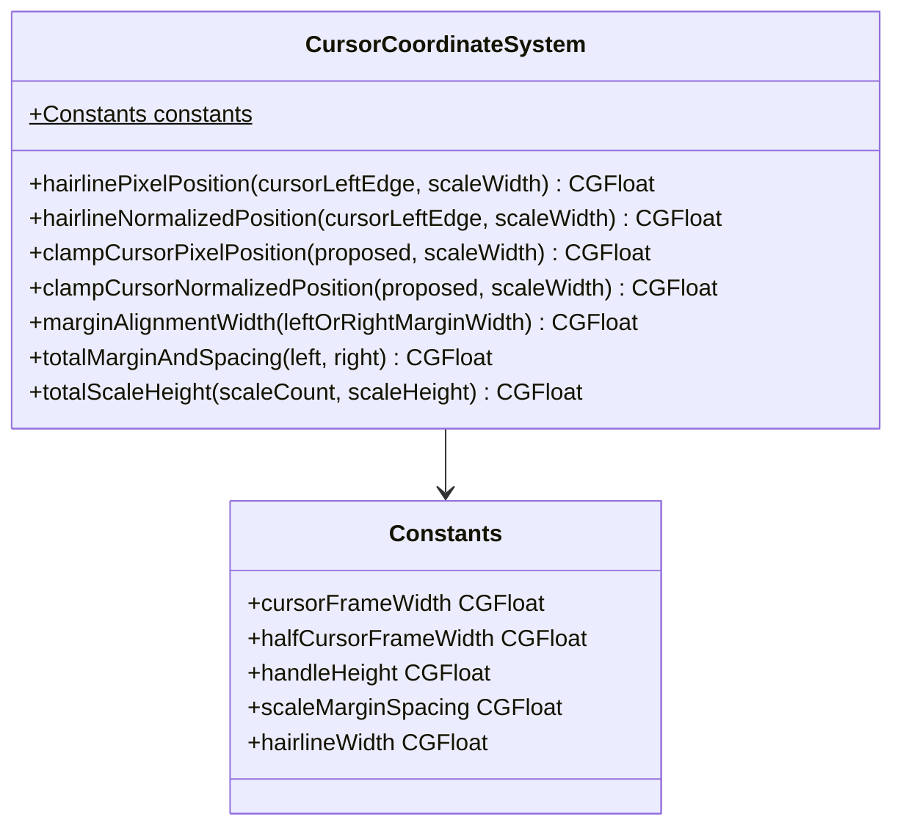
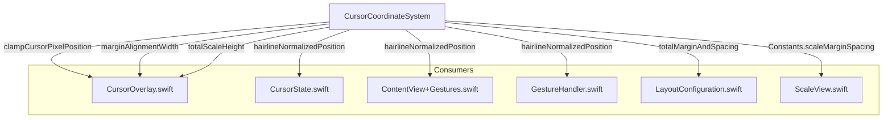

# Cursor Coordinate System Hardening

**Status:** Architecture Proposal  
**Author:** Architecture Mode  
**Date:** 2025-02-05  

## 1. Problem Statement

The cursor-to-scale alignment depends on implicit contracts spread across 7+ files. If any single value changes independently — a spacing constant, a width calculation, a margin offset — the cursor hairline silently misaligns from scale ticks with no compile-time or test-time warning.

This document inventories every coupling point, proposes a `CursorCoordinateSystem` struct to centralize the math, and defines a migration plan that preserves identical visual behavior.

---

## 2. Inventory of Fragile Coordinate Coupling Points

### CP-1: Magic Number `+4` Margin Alignment

**The coupling:** [`CursorOverlay`](TheElectricSlide/Cursor/CursorOverlay.swift:106) uses `Color.clear.frame(width: leftMarginWidth + 4)` spacers on both sides to align the cursor interactive area with the scale drawing area. This `+4` must exactly match the `spacing: 4` in [`ScaleView`](TheElectricSlide/Components/ScaleView.swift:164)'s `HStack(alignment: .center, spacing: 4)`.

The `+4` also appears mirrored on the right side at [`CursorOverlay.swift:309`](TheElectricSlide/Cursor/CursorOverlay.swift:309): `rightMarginWidth + 4`.

In [`LayoutConfiguration.swift:103`](TheElectricSlide/Models/LayoutConfiguration.swift:103), the `Dimensions.calculate()` method accounts for this with:
```
let totalMarginAndSpacing = leftMarginWidth + rightMarginWidth + 8
```

This `8` is `4 + 4` — the same spacing. If `ScaleView` changes its spacing to `6`, the `+4` in `CursorOverlay` and the `+8` in `Dimensions` both need updating.

**Files involved:**
| File | Line | Value |
|------|------|-------|
| [`CursorOverlay.swift`](TheElectricSlide/Cursor/CursorOverlay.swift:106) | 106 | `leftMarginWidth + 4` |
| [`CursorOverlay.swift`](TheElectricSlide/Cursor/CursorOverlay.swift:309) | 309 | `rightMarginWidth + 4` |
| [`ScaleView.swift`](TheElectricSlide/Components/ScaleView.swift:164) | 164 | `HStack(spacing: 4)` |
| [`LayoutConfiguration.swift`](TheElectricSlide/Models/LayoutConfiguration.swift:103) | 103 | `+ 8` (2 × 4) |

**Risk:** ~4-8px cursor misalignment if any one value changes independently.

---

### CP-2: `effectiveWidth` Must Equal Canvas `size.width`

**The coupling:** [`CursorOverlay.handleDrag()`](TheElectricSlide/Cursor/CursorOverlay.swift:322) normalizes cursor position using `effectiveWidth` (line 110):
```swift
let effectiveWidth = width  // Use passed scale width directly
```

This must exactly match the width that [`ScaleTickRenderer.drawTicksBatched()`](TheElectricSlide/Components/ScaleTickRenderer.swift:205) receives via `size.width`:
```swift
let xPos = tick.normalizedPosition * size.width
```

Currently they match because:
- `CursorOverlay.width` = `renderDimensions.width` (from [`DynamicSlideRuleContent.swift:132`](TheElectricSlide/Components/DynamicSlideRuleContent.swift:132))
- `ScaleView.width` = `renderDimensions.width` (from [`DynamicSlideRuleContent.swift:113`](TheElectricSlide/Components/DynamicSlideRuleContent.swift:113))
- `ScaleView` constrains its Canvas via `.frame(width: width, height: height)` at [`ScaleView.swift:285`](TheElectricSlide/Components/ScaleView.swift:285)

**But:** There is no enforcement that these remain equal. A future refactor could pass different widths to `CursorOverlay` vs `ScaleView`.

**Files involved:**
| File | Line | Role |
|------|------|------|
| [`CursorOverlay.swift`](TheElectricSlide/Cursor/CursorOverlay.swift:110) | 110 | `effectiveWidth` = `width` |
| [`ScaleTickRenderer.swift`](TheElectricSlide/Components/ScaleTickRenderer.swift:205) | 205 | `tick.normalizedPosition * size.width` |
| [`ScaleView.swift`](TheElectricSlide/Components/ScaleView.swift:285) | 285 | `.frame(width: width)` constrains Canvas |
| [`DynamicSlideRuleContent.swift`](TheElectricSlide/Components/DynamicSlideRuleContent.swift:113) | 113, 132 | Passes same `renderDimensions.width` to both |

**Risk:** Cursor reads wrong scale value at every position if widths diverge.

---

### CP-3: `CursorView.cursorWidth / 2.0` Half-Width Duplicated 6× Across 4 Files

**The coupling:** The formula `CursorView.cursorWidth / 2.0` converts cursor left-edge position to hairline center position. It appears in **6 places across 4 files**:

| File | Line | Context |
|------|------|---------|
| [`CursorOverlay.swift`](TheElectricSlide/Cursor/CursorOverlay.swift:351) | 351 | `handleDrag()` clamping |
| [`CursorOverlay.swift`](TheElectricSlide/Cursor/CursorOverlay.swift:392) | 392 | `handleDragEnd()` clamping |
| [`CursorOverlay.swift`](TheElectricSlide/Cursor/CursorOverlay.swift:424) | 424 | `handlePrecisionDragEnd()` clamping |
| [`CursorState.swift`](TheElectricSlide/Cursor/CursorState.swift:177) | 177 | `updateReadings()` hairline offset |
| [`ContentView+Gestures.swift`](TheElectricSlide/Extensions/ContentView+Gestures.swift:46) | 46 | `handleDragChanged()` tick haptics |
| [`GestureHandler.swift`](TheElectricSlide/Utilities/GestureHandler.swift:479) | 479 | `handleCursorDragChanged()` tick haptics |

Additionally, the *normalized* version `(CursorView.cursorWidth / 2.0) / scaleWidth` appears at:
| File | Line |
|------|------|
| [`CursorState.swift`](TheElectricSlide/Cursor/CursorState.swift:177) | 177 |
| [`ContentView+Gestures.swift`](TheElectricSlide/Extensions/ContentView+Gestures.swift:46) | 46 |
| [`ContentView+Gestures.swift`](TheElectricSlide/Extensions/ContentView+Gestures.swift:168) | 168 |
| [`GestureHandler.swift`](TheElectricSlide/Utilities/GestureHandler.swift:226) | 226 |
| [`GestureHandler.swift`](TheElectricSlide/Utilities/GestureHandler.swift:479) | 479 |

**Risk:** If `cursorWidth` changes, all 6+ sites must be updated. A missed site produces a misalignment that depends on zoom level and only manifests at scale edges.

---

### CP-4: `totalScaleHeight` / `consistentTotalScaleHeight` Duplicated

**The coupling:** Two independent implementations calculate the same value — total height of all scales on a side:

1. [`ContentView.totalScaleHeight(for:)`](TheElectricSlide/ContentView.swift:91) (lines 91-116):
   ```swift
   CGFloat(scaleCount) * calculatedDimensions.scaleHeight
   ```

2. [`DynamicSlideRuleContent.consistentTotalScaleHeight(for:)`](TheElectricSlide/Components/DynamicSlideRuleContent.swift:73) (lines 73-91):
   ```swift
   CGFloat(scaleCount) * renderDimensions.scaleHeight
   ```

Note: These use **different dimension sources** (`calculatedDimensions` vs `renderDimensions`). `DynamicSlideRuleContent` intentionally uses `renderDimensions` (which is debounced from `stableDimensions`) to avoid intermediate animation values. But `ContentView.totalScaleHeight` is passed as a closure to `DynamicSlideRuleContent` yet appears unused in practice — `DynamicSlideRuleContent` uses its own `consistentTotalScaleHeight()` instead.

**Files involved:**
| File | Line | Dimension Source |
|------|------|-----------------|
| [`ContentView.swift`](TheElectricSlide/ContentView.swift:91) | 91-116 | `calculatedDimensions.scaleHeight` |
| [`DynamicSlideRuleContent.swift`](TheElectricSlide/Components/DynamicSlideRuleContent.swift:73) | 73-91 | `renderDimensions.scaleHeight` |

**Risk:** If the scale count logic diverges (e.g., handling separator lines differently), cursor overlay height won't match actual scale area height, causing vertical misalignment of readings.

---

### CP-5: `CursorState.position(for:)` Normalization Contract Undocumented

**The coupling:** [`CursorState.position(for:)`](TheElectricSlide/Cursor/CursorState.swift:78) returns what the doc comment says is `0.0-1.0`:
```swift
/// - Returns: Normalized position (0.0-1.0)
func position(for side: RuleSide?) -> Double
```

But [`CursorState.setPosition()`](TheElectricSlide/Cursor/CursorState.swift:94) clamps to `0.0...1.0`:
```swift
let clamped = min(max(position, 0.0), 1.0)
```

Meanwhile, [`CursorOverlay.handleDragEnd()`](TheElectricSlide/Cursor/CursorOverlay.swift:397) explicitly allows slightly-out-of-range values for hairline-at-edge behavior:
```swift
// Normalized position can now be slightly negative or > 1.0 to allow hairline at edges
let clampedPosition = normalizedPosition  // NOT clamped!
```

Wait — looking more carefully: `handleDragEnd()` at line 397 assigns `normalizedPosition` (unclamped) to `clampedPosition`, then passes it to `setPosition()` which **does** clamp. So the comment is misleading: the unclamped value is *immediately* clamped by `setPosition`. The actual pixel-level clamping happens at the `halfCursorWidth` level (lines 392-393), which allows the left edge to go to `-halfCursorWidth` and normalizing produces values in `[-halfCursorWidth/effectiveWidth, 1 + halfCursorWidth/effectiveWidth]`.

After clamping in `setPosition`, the position is `[0.0, 1.0]` — but the **drag offset** (`activeDragOffset`) can allow the cursor to visually extend past edges during an active gesture.

**Files involved:**
| File | Line | Behavior |
|------|------|----------|
| [`CursorState.swift`](TheElectricSlide/Cursor/CursorState.swift:78) | 78 | Returns 0.0-1.0 |
| [`CursorState.swift`](TheElectricSlide/Cursor/CursorState.swift:94) | 95 | Clamps to 0.0-1.0 |
| [`CursorOverlay.swift`](TheElectricSlide/Cursor/CursorOverlay.swift:351) | 347-352 | Clamping uses `-halfCursorWidth` to `effectiveWidth - halfCursorWidth` |
| [`CursorOverlay.swift`](TheElectricSlide/Cursor/CursorOverlay.swift:397) | 395-397 | Misleading comment about unclamped values |

**Risk:** Future developers may accidentally clamp the half-width offset range thinking it's a bug, breaking hairline-at-edge behavior. The misleading comments compound this.

---

### CP-6: Zoom Scale Passed Without Shared Source of Truth

**The coupling:** `currentZoomScale` flows through a long prop-drilling chain:

```
SlideRuleViewModel.currentZoomScale          (source of truth)
  → ContentView.currentZoomScale binding     (ContentView.swift:150)
  → SlideRuleDetailView.currentZoomScale     (binding, line 61)
    → .scaleEffect(currentZoomScale)         (SlideRuleDetailView.swift:95)
    → DynamicSlideRuleContent.currentZoomScale (let, line 85)
      → CursorOverlay.currentZoomScale       (var, default 1.0)
        → GestureCalculator.correctTranslationWidth(zoomScale:)
```

`GestureCalculator.correctTranslationWidth()` divides by `zoomScale` to convert screen-space translation to model-space. This **only** works if the `zoomScale` passed to `CursorOverlay` exactly matches the one applied by `.scaleEffect()` in `SlideRuleDetailView`.

Currently this holds because both read from the same `SlideRuleViewModel.currentZoomScale` binding chain. But the `CursorOverlay.currentZoomScale` parameter has a default value of `1.0`, meaning if someone forgets to pass it, the zoom correction silently fails.

**Files involved:**
| File | Line | Role |
|------|------|------|
| [`SlideRuleViewModel.swift`](TheElectricSlide/Models/SlideRuleViewModel.swift:62) | 62 | Source: `currentZoomScale` |
| [`SlideRuleDetailView.swift`](TheElectricSlide/Components/SlideRuleDetailView.swift:95) | 95 | `.scaleEffect(currentZoomScale)` |
| [`CursorOverlay.swift`](TheElectricSlide/Cursor/CursorOverlay.swift:62) | 62 | Receives `currentZoomScale` (default `1.0`) |
| [`GestureCalculator.swift`](TheElectricSlide/Utilities/GestureCalculator.swift:60) | 60 | Uses `zoomScale` for correction |

**Risk:** If `currentZoomScale` is not passed or is stale, cursor drags will overshoot/undershoot by the zoom factor (e.g., 2× at zoom 2.0).

---

### CP-7: `CursorView.cursorWidth` Hardcoded Constant

**The coupling:** [`CursorView.cursorWidth`](TheElectricSlide/Cursor/CursorView.swift:351) is `static let cursorWidth: CGFloat = 144`, a hardcoded constant. Multiple systems depend on this:

- Clamping math in `CursorOverlay` (CP-3)
- Hairline positioning via `Self.cursorWidth / 2` at [`CursorView.swift:492`](TheElectricSlide/Cursor/CursorView.swift:492)
- Reading positioning via `halfWidth = size.width / 2` at [`CursorView.swift:546`](TheElectricSlide/Cursor/CursorView.swift:546)
- View frame sizing at multiple lines in CursorView

This is not itself a bug, but the value `144` has no documented derivation. Is it `72 * 2`? Is it chosen to fit a specific number of characters? Changing it requires updating zero code (since it's referenced via `CursorView.cursorWidth`) but understanding the *constraint* it satisfies is undocumented.

---

## 3. Proposed `CursorCoordinateSystem` Design

### 3.1 Namespace and Location

Create a new file: `TheElectricSlide/Cursor/CursorCoordinateSystem.swift`

```
TheElectricSlide/Cursor/
  ├── CursorCoordinateSystem.swift  ← NEW
  ├── CursorOverlay.swift
  ├── CursorState.swift
  ├── CursorView.swift
  └── ...
```

### 3.2 Struct Design



### 3.3 Constants Namespace

All magic numbers move into a nested `Constants` enum:

| Current Magic Number | Proposed Named Constant | Current Location |
|---------------------|------------------------|-----------------|
| `144` | `Constants.cursorFrameWidth` | `CursorView.cursorWidth` |
| `144 / 2.0` = `72` | `Constants.halfCursorFrameWidth` | 6 locations across 4 files |
| `16` | `Constants.handleHeight` | `CursorView.handleHeight` |
| `4` | `Constants.scaleMarginSpacing` | `ScaleView` spacing, `CursorOverlay` margin offsets |
| `8` | `Constants.totalMarginSpacing` | `LayoutConfiguration.swift` `+ 8` |
| `1 / screenScale` | `Constants.hairlineWidth` | `CursorView.hairlineWidth` |

**Note:** `CursorView.cursorWidth` and `CursorView.handleHeight` remain as computed properties that delegate to the new constants, preserving source compatibility during migration.

### 3.4 Coordinate Math Functions

These are pure, `static`, deterministic functions with no SwiftUI dependencies:

#### `hairlinePixelPosition(cursorLeftEdge:scaleWidth:) -> CGFloat`
Converts cursor left-edge pixel position to hairline center pixel position.
```
return cursorLeftEdge + Constants.halfCursorFrameWidth
```
Replaces: manual `+ CursorView.cursorWidth / 2.0` arithmetic in 6 call sites.

#### `hairlineNormalizedPosition(cursorNormalizedPosition:scaleWidth:) -> CGFloat`
Converts normalized cursor position to normalized hairline position.
```
return cursorNormalizedPosition + Constants.halfCursorFrameWidth / scaleWidth
```
Replaces: `(CursorView.cursorWidth / 2.0) / scaleWidth` in 5 call sites.

#### `clampCursorPixelPosition(proposed:scaleWidth:) -> CGFloat`
Clamps cursor left-edge pixel position so hairline can reach full `[0, scaleWidth]` range.
```
return min(max(proposed, -Constants.halfCursorFrameWidth), scaleWidth - Constants.halfCursorFrameWidth)
```
Replaces: triplicated clamping in `CursorOverlay` lines 351-352, 392-393, 424-425.

#### `clampCursorNormalizedPosition(proposed:scaleWidth:) -> CGFloat`
Same as above but for normalized positions.

#### `marginAlignmentWidth(marginWidth:) -> CGFloat`
Returns the spacer width for cursor overlay to align with scale area.
```
return marginWidth + Constants.scaleMarginSpacing
```
Replaces: `leftMarginWidth + 4` and `rightMarginWidth + 4` in `CursorOverlay`.

#### `totalMarginAndSpacing(leftMargin:rightMargin:) -> CGFloat`
Returns total width consumed by margins and spacers.
```
return leftMargin + rightMargin + Constants.totalMarginSpacing
```
Replaces: `+ 8` in `LayoutConfiguration.swift`.

#### `totalScaleHeight(scaleCount:scaleHeight:) -> CGFloat`
Returns total vertical height for all scales.
```
return CGFloat(scaleCount) * scaleHeight
```
Replaces: duplicated calculation in `ContentView` and `DynamicSlideRuleContent`.

### 3.5 What Stays in Views

| Calculation | Why It Stays |
|-------------|-------------|
| `CursorPositionModifier.offset` | SwiftUI-specific modifier |
| `CursorView.body` layout | View composition |
| `GestureCalculator.correctTranslationWidth()` | Already centralized, correct location |
| `PrecisionDragConstants` | Already centralized |
| `cursorState.activeDragOffset` | State management, not coordinate math |
| `GestureCalculator.calculateCursorPosition()` | Already centralized — but note it clamps to `0.0...1.0` which differs from `CursorOverlay`'s `halfCursorWidth` clamping; see CP-5 |

### 3.6 Relationship Diagram



---

## 4. Coordinate Contract Documentation

This section documents the coordinate system that the `CursorCoordinateSystem` struct must preserve.

### 4.1 Position Semantics

| Term | Meaning |
|------|---------|
| **Cursor position** | Normalized `0.0...1.0` position of the cursor's **left edge** relative to the scale drawing area |
| **Hairline position** | The center of the cursor frame; equals `cursorPosition + halfCursorFrameWidth / scaleWidth` |
| **Scale position** | Canvas x-coordinate where a tick mark is drawn; equals `tick.normalizedPosition * canvas.size.width` |
| **Effective width** | The pixel width of the scale drawing area (excludes margins and spacers) |

### 4.2 Position 0.0 and 1.0

- **Position 0.0** = cursor left edge is at the left edge of the scale area. Hairline is at `+72pt` from the left scale edge — **NOT** at the leftmost tick.
- **Position 1.0** = cursor left edge is at the right edge of the scale area. Hairline is at `scaleWidth + 72pt` — past the rightmost tick.

### 4.3 Hairline-at-Edge Behavior

To let the hairline reach `x=0` (leftmost tick) and `x=scaleWidth` (rightmost tick), the cursor's left-edge pixel position is clamped to:

```
[-halfCursorFrameWidth, scaleWidth - halfCursorFrameWidth]
```

This means the normalized position passed to `setPosition()` can theoretically be slightly negative or slightly > 1.0. However, `setPosition()` clamps to `[0.0, 1.0]`, so the live drag uses `activeDragOffset` to achieve the visual extension during gesture, and the committed position is always in `[0.0, 1.0]`.

### 4.4 Zoom Correction

When zoom is active (`.scaleEffect(zoomScale)` on the content), gesture translations from `.global` coordinate space are in screen points. To get model-space positions:

```
modelTranslation = screenTranslation / zoomScale
```

Precision mode uses `.local` coordinate space, which auto-corrects for view transforms, so zoom correction is **skipped** in that case.

### 4.5 Scale Area Alignment

The scale Canvas sits inside an `HStack(spacing: 4)` with margin spacers. The cursor overlay must match this layout:

```
|← leftMargin →|← 4 →|← scaleWidth (Canvas) →|← 4 →|← rightMargin →|
|← leftMargin + 4 →|← cursor interactive area →|← rightMargin + 4 →|
```

Both rows must produce the same left and right edges for the scale/cursor zones.

---

## 5. Testing Strategy

### 5.1 Unit Tests for `CursorCoordinateSystem`

These tests require **no SwiftUI** — pure value-in, value-out:

#### Constants Consistency Tests
```
- scaleMarginSpacing == 4
- totalMarginSpacing == scaleMarginSpacing * 2
- halfCursorFrameWidth == cursorFrameWidth / 2.0
```

#### Hairline Position Tests
```
- hairlinePixelPosition(cursorLeftEdge: 0, scaleWidth: 800) == halfCursorFrameWidth
- hairlinePixelPosition(cursorLeftEdge: 800, scaleWidth: 800) == 800 + halfCursorFrameWidth
- hairlineNormalizedPosition(cursorPosition: 0.0, scaleWidth: 800) == halfCursorFrameWidth / 800
- hairlineNormalizedPosition(cursorPosition: 1.0, scaleWidth: 800) == 1.0 + halfCursorFrameWidth / 800
```

#### Clamping Tests
```
- clampCursorPixelPosition(proposed: -1000, scaleWidth: 800)
    == -halfCursorFrameWidth                    (hairline at 0)
- clampCursorPixelPosition(proposed: 1000, scaleWidth: 800)
    == 800 - halfCursorFrameWidth               (hairline at 800)
- clampCursorPixelPosition(proposed: 400, scaleWidth: 800)
    == 400                                      (no clamping needed)
```

#### Margin Alignment Tests
```
- marginAlignmentWidth(marginWidth: 64) == 64 + scaleMarginSpacing
- totalMarginAndSpacing(leftMargin: 64, rightMargin: 64) == 64 + 64 + totalMarginSpacing
```

#### Total Scale Height Tests
```
- totalScaleHeight(scaleCount: 10, scaleHeight: 25) == 250
- totalScaleHeight(scaleCount: 0, scaleHeight: 25) == 0
```

#### Round-Trip Invariant Tests
These are the most critical — they assert the **coupling contract**:
```
- For any normalizedPosition in [0.0, 1.0] and scaleWidth > 0:
    hairlinePixelPosition(normalizedPosition * scaleWidth, scaleWidth) 
    == hairlineNormalizedPosition(normalizedPosition, scaleWidth) * scaleWidth
    
- marginAlignmentWidth(leftMargin) + scaleWidth + marginAlignmentWidth(rightMargin)
    == leftMargin + rightMargin + totalMarginSpacing + scaleWidth
```

### 5.2 Regression Assertions

Add `assert`/`precondition` guards during development:

1. **Width invariant:** In `DynamicSlideRuleContent`, assert that `CursorOverlay.width == ScaleView.width` (both should be `renderDimensions.width`).

2. **Height invariant:** Assert that `consistentTotalScaleHeight()` for a given side produces the same value regardless of which function computes it.

3. **Constants consistency:** Assert `CursorCoordinateSystem.Constants.scaleMarginSpacing * 2 == CursorCoordinateSystem.Constants.totalMarginSpacing`.

### 5.3 Visual Regression (Future)

Screenshot comparison tests using Xcode's `XCTAssertSnapshotEqual` or similar. Not in scope for this hardening, but the centralization enables it.

---

## 6. Migration Plan

### Step 1: Create `CursorCoordinateSystem.swift` with Constants Only

Create the file with **only** the `Constants` enum. No behavior changes. No call-site modifications.

**Verification:** Project compiles with zero changes to existing code.

### Step 2: Add `CursorView` Delegation

Make `CursorView.cursorWidth` and `CursorView.handleHeight` delegate to the new constants:

```swift
// In CursorView.swift:
static let cursorWidth: CGFloat = CursorCoordinateSystem.Constants.cursorFrameWidth
static let handleHeight: CGFloat = CursorCoordinateSystem.Constants.handleHeight
```

**Verification:** All existing references to `CursorView.cursorWidth` still work. No behavior change.

### Step 3: Add Coordinate Math Functions

Add `hairlinePixelPosition`, `hairlineNormalizedPosition`, `clampCursorPixelPosition`, `marginAlignmentWidth`, `totalMarginAndSpacing`, and `totalScaleHeight` to `CursorCoordinateSystem`.

**Verification:** Write the unit tests from Section 5.1. All pass.

### Step 4: Replace `+4` Magic Numbers in `CursorOverlay`

Replace:
```swift
Color.clear.frame(width: leftMarginWidth + 4)
```
With:
```swift
Color.clear.frame(width: CursorCoordinateSystem.marginAlignmentWidth(marginWidth: leftMarginWidth))
```

Same for the right side.

**Verification:** Visual behavior identical. Run app, verify cursor aligns with scales.

### Step 5: Replace `+8` in `LayoutConfiguration`

Replace:
```swift
let totalMarginAndSpacing = leftMarginWidth + rightMarginWidth + 8
```
With:
```swift
let totalMarginAndSpacing = CursorCoordinateSystem.totalMarginAndSpacing(
    leftMargin: leftMarginWidth, rightMargin: rightMarginWidth
)
```

**Verification:** `Dimensions.calculate()` produces identical values.

### Step 6: Extract `spacing: 4` in `ScaleView`

Make `ScaleView` use the shared constant:
```swift
HStack(alignment: .center, spacing: CursorCoordinateSystem.Constants.scaleMarginSpacing) {
```

**Verification:** Visual behavior identical.

### Step 7: Replace Half-Width Clamping in `CursorOverlay`

Replace the triplicated clamping code in `handleDrag()`, `handleDragEnd()`, `handlePrecisionDragEnd()` with:
```swift
let clampedPixelPosition = CursorCoordinateSystem.clampCursorPixelPosition(
    proposed: proposedNewPosition, scaleWidth: effectiveWidth
)
```

**Verification:** Cursor clamping behavior identical at scale edges. Test at zoom 1.0× and 2.0×.

### Step 8: Replace Hairline Position Calculations

Replace all 5 instances of `(CursorView.cursorWidth / 2.0) / scaleWidth` with:
```swift
CursorCoordinateSystem.hairlineNormalizedPosition(
    cursorPosition: normalizedPosition, scaleWidth: scaleWidth
)
```

In files:
- [`CursorState.swift:177`](TheElectricSlide/Cursor/CursorState.swift:177)
- [`ContentView+Gestures.swift:46`](TheElectricSlide/Extensions/ContentView+Gestures.swift:46)
- [`ContentView+Gestures.swift:168`](TheElectricSlide/Extensions/ContentView+Gestures.swift:168)
- [`GestureHandler.swift:226`](TheElectricSlide/Utilities/GestureHandler.swift:226)
- [`GestureHandler.swift:479`](TheElectricSlide/Utilities/GestureHandler.swift:479)

**Verification:** Cursor readings show same values. Tick haptics fire at same positions.

### Step 9: Consolidate `totalScaleHeight`

Replace both `ContentView.totalScaleHeight(for:)` and `DynamicSlideRuleContent.consistentTotalScaleHeight(for:)` to use:
```swift
CursorCoordinateSystem.totalScaleHeight(scaleCount: count, scaleHeight: dimensions.scaleHeight)
```

Extract the scale-count logic into a shared helper (since that part is also duplicated).

**Verification:** Cursor overlay height matches scale area height on front and back sides.

### Step 10: Document Coordinate Contract

Add the coordinate contract documentation from Section 4 as doc comments on `CursorCoordinateSystem`. Update the misleading comment at `CursorOverlay.swift:397` about unclamped normalized positions.

### Step 11: Remove `ContentView+Gestures.swift` Duplicate

[`ContentView+Gestures.swift`](TheElectricSlide/Extensions/ContentView+Gestures.swift) lines 36-57 (`handleDragChanged`) and lines 157-183 (`handleCursorDragChanged`) duplicate logic that also lives in [`GestureHandler.swift`](TheElectricSlide/Utilities/GestureHandler.swift). After migration, verify whether the `ContentView+Gestures` versions are still used or are dead code from the Phase 7 cleanup, and remove if dead.

**Verification:** Build and test. No functional change.

---

## 7. Risk Analysis

| Risk | Mitigation |
|------|-----------|
| Subtle pixel mismatch after migration | Run screenshot comparison at key positions: 0.0, 0.5, 1.0 at zoom 1.0× and 2.0× |
| Performance regression from function call overhead | All functions are `@inlinable` static methods on a struct with no heap allocation |
| Breaking gesture behavior during migration | Each step is independently verifiable; merge each step separately |
| `CursorCoordinateSystem` becomes a god object | Strict scope: only coordinate math and constants. No state, no SwiftUI, no side effects |

---

## 8. Out of Scope

- Changing the view hierarchy
- Changing visual behavior
- Refactoring `GestureCalculator` (already well-structured)
- Changing `PrecisionDragConstants` (already centralized)
- Adding new features to the cursor
- Reconciling `GestureCalculator.calculateCursorPosition()` clamping (0.0-1.0) with `CursorOverlay` clamping (halfCursorWidth range) — this is a known discrepancy but changing it would alter behavior
