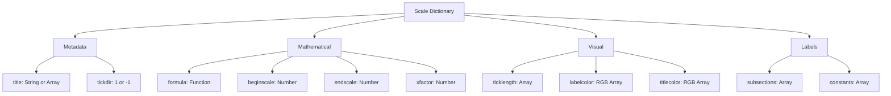
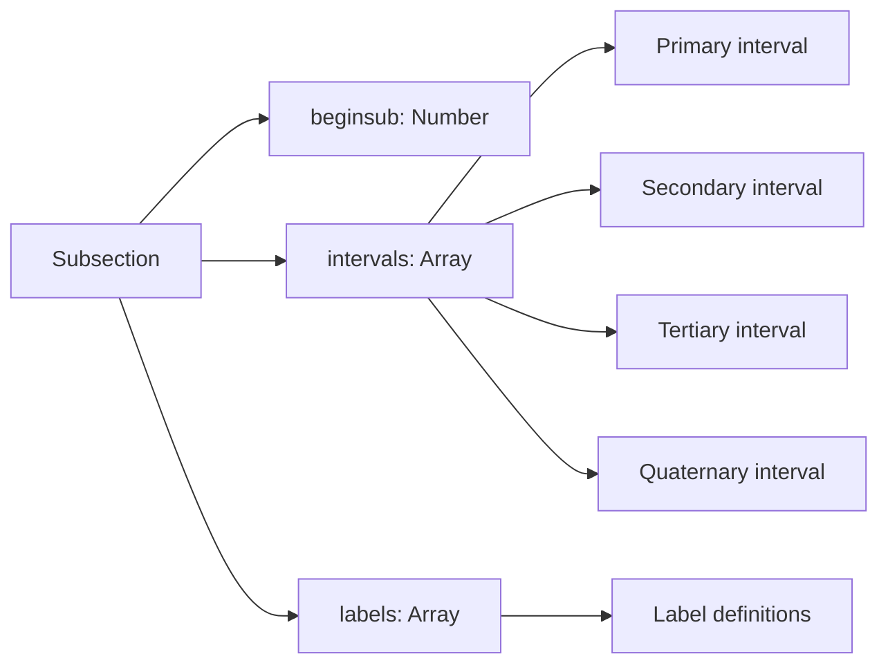
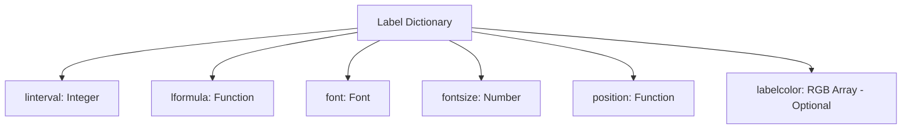
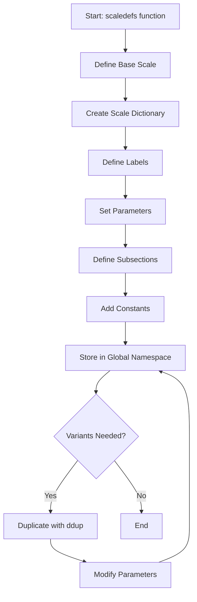
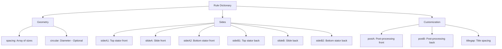
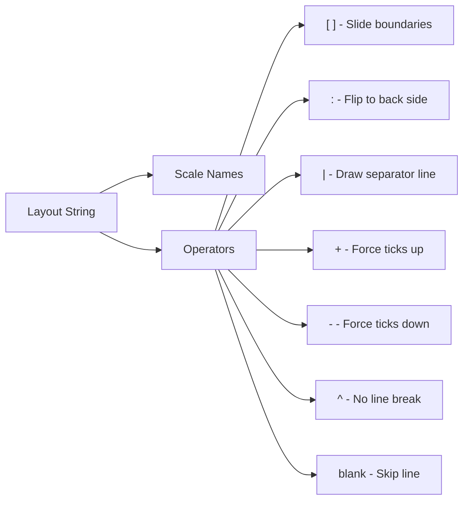
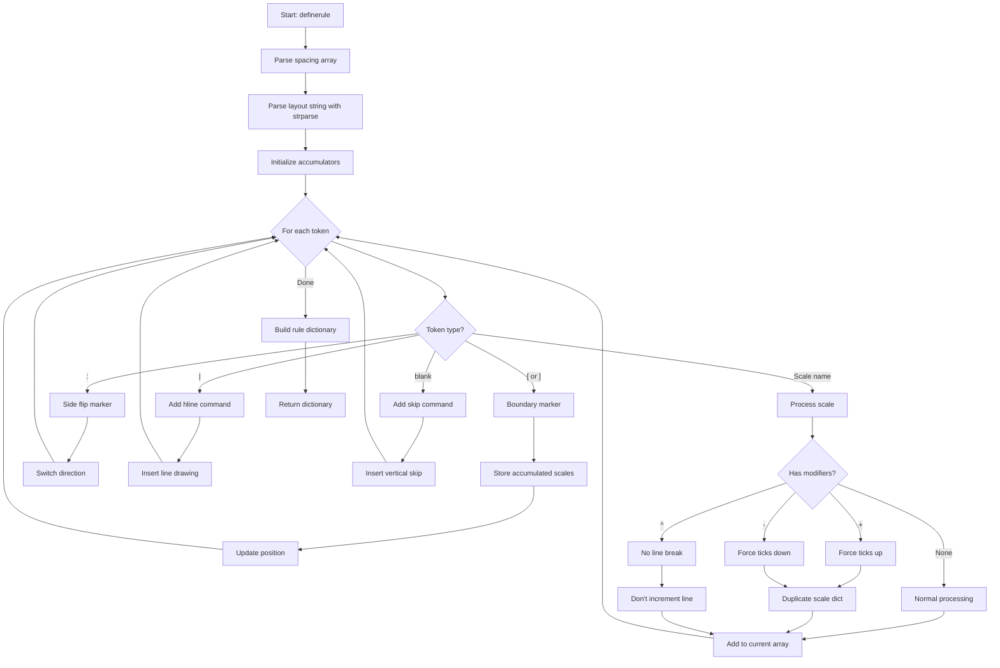
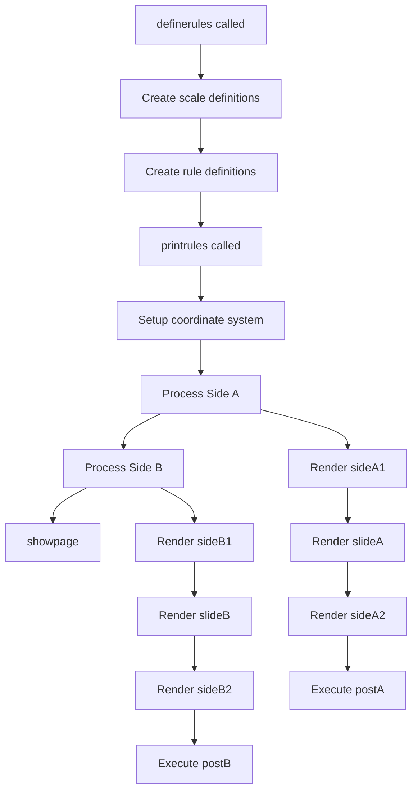
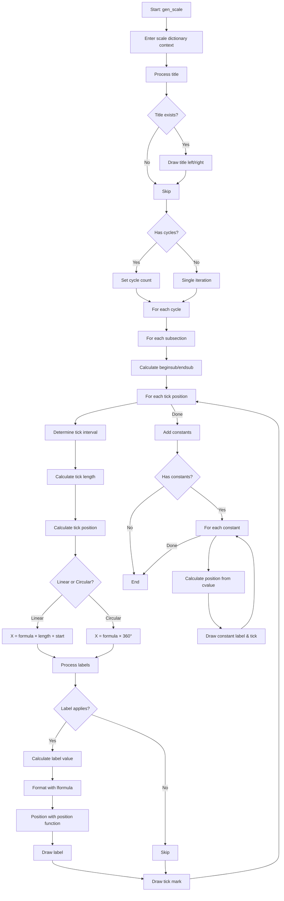
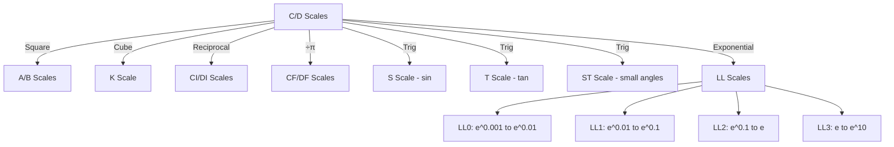

# PostScript Slide Rule Engine - Detailed Technical Specification

This document explains how the PostScript slide rule engine configures and generates printable slide rules. This specification is designed to facilitate reimplementation in modern functional languages.

## Table of Contents

1. [Core Data Structures](#core-data-structures)
2. [Scale Definition System](#scale-definition-system)
3. [Rule Definition System](#rule-definition-system)
4. [Rendering Pipeline](#rendering-pipeline)
5. [Mathematical Foundations](#mathematical-foundations)
6. [Implementation Guide](#implementation-guide)

---

## Core Data Structures

### 1. Scale Dictionary

A scale is represented as a PostScript dictionary containing all information needed to render it:



**Scale Dictionary Fields:**

| Field | Type | Purpose | Example |
|-------|------|---------|---------|
| `title` | String or `[left, right]` | Scale name(s) | `(C)` or `[(XL)(TL)]` |
| `tickdir` | Integer | Tick direction: 1=up, -1=down | `1` |
| `beginscale` | Number | Starting value | `1` |
| `endscale` | Number | Ending value | `10` |
| `xfactor` | Number | Precision multiplier | `100` |
| `formula` | Function | Position calculator | `{log}` |
| `ticklength` | Array | Tick sizes [P,S,T,Q] | `[.30cm .28cm .15cm .09cm]` |
| `subsections` | Array | Scale segments | See below |
| `constants` | Array | Special markers | See below |
| `labelcolor` | RGB Array | Label color | `[Red]` = `[1 0 0]` |

### 2. Subsection Dictionary

Subsections define how a scale's appearance changes across its range:



**Example from C Scale (lines 431-461):**

```postscript
4 dict dup begin
    /beginsub 1 def
    /intervals [ 1 .1 .05 .01 ] def
    /labels [ {plabel} {slabel} ] def
end
```

This means: From value 1 onwards:
- Primary marks every 1 unit
- Secondary marks every 0.1 units
- Tertiary marks every 0.05 units  
- Quaternary marks every 0.01 units
- Display both primary and secondary labels

### 3. Label Dictionary

Labels control how numbers are displayed on scales:



**Example from C Scale (lines 397-404):**

```postscript
/plabel 8 dict begin
    /linterval 0 def                    % Applies to primary marks
    /lformula {.5 add cvi} def          % Convert to integer
    /font NumFont1 def                  % Helvetica-based font
    /fontsize LargeF def                % 4.5 point
    /position /Ntop load def            % Above tick mark
    currentdict
end def
```

**Label Positioning Functions:**

| Function | Description | Use Case |
|----------|-------------|----------|
| `Ntop` | Above tick mark | Standard number labels |
| `Nright` | Right of tick mark | Side-reading scales |
| `Nleft` | Left of tick mark | Inverse scales |
| `Ncent` | Centered on tick | Special markers |
| `NtopT` | Above tick, tight spacing | Subscripts/superscripts |

### 4. Constant Dictionary

Constants mark special values (π, e, etc.):

```postscript
8 dict dup begin
    /cvalue {PI log} def                    % Position formula
    /font SymFont1 def                      % Symbol font
    /fontsize MedF def                      % 3.8 point
    /label (\160) def                       % π symbol (octal)
    /curticklen ticklength 0 get def        % Primary tick length
    /position /Ntop-HalfTick load def       % Position with style
    /labelcolor [Red] def                   % Optional color
end
```

---

## Scale Definition System

### Scale Creation Process



### Example: Creating C and D Scales

**Step 1: Define C Scale (lines 395-466)**

```postscript
/Cscale 32 dict begin
    % Labels
    /plabel 8 dict begin
        /linterval 0 def
        /lformula {.5 add cvi} def
        /font NumFont1 def
        /fontsize LargeF def
        /position /Ntop load def
        currentdict
    end def
    
    % Basic parameters
    /title (C) def
    /tickdir 1 def
    /beginscale 1 def
    /endscale 10 def
    /xfactor 100 def
    /formula {log} def
    /ticklength gradsizes def  % [Ptick Stick Ttick Qtick]
    
    % Subsections define how marks change across range
    /subsections [
        4 dict dup begin
            /beginsub 1 def
            /intervals [ 1 .1 .05 .01 ] def
            /labels [ {plabel} {slabel} ] def
        end
        4 dict dup begin
            /beginsub 2 def
            /intervals [ 1 .5 .1 .02 ] def
            /labels [ {plabel} ] def
        end
        % ... more subsections for 4, 10, 20, 40
    ] def
    
    % Constants (special markers)
    /constants [
        {PI formula} SymFont1 MedF (\160) ticklength 0 get /Ntop-HalfTick scaleCvars
    ] def
    
    currentdict
end def
```

**Step 2: Create D Scale by Duplicating C (lines 470-474)**

```postscript
/Dscale Cscale ddup begin
    /title (D) def
    /tickdir -1 def  % Tick marks point down
    currentdict
end def
```

The `ddup` function creates a deep copy of the dictionary, allowing modification without affecting the original.

### Formula Functions

Formulas convert real-world values to logarithmic positions:

| Scale | Formula | Purpose |
|-------|---------|---------|
| C, D | `{log}` | Standard logarithmic |
| A, B | `{log 2 div}` | Square roots (log₁₀(x²) = 2log₁₀(x)) |
| K | `{log 3 div}` | Cube roots |
| CI, DI | `{1 exch div 10 mul log}` | Inverse (1/x) |
| CF, DF | `{log PI log sub}` | Folded (divided by π) |
| S | `{sin 10 mul log}` | Sine |
| T | `{tan 10 mul log}` | Tangent |
| LL2 | `{ln 10 mul log}` | Log-log (e^(x/10)) |
| LL3 | `{ln log}` | Log-log (e^x) |

### Scale Variants

The engine creates scale variants using dictionary manipulation:

```postscript
% Create C scale representing 10-100 instead of 1-10
/C10.100scale Cscale ddup def
C10.100scale dup /plabel get ddup 
    dup /lformula {10 mul .5 add cvi} put
    /plabel exch put
```

This pattern allows:
1. Duplicate base scale
2. Extract sub-dictionary (label)
3. Duplicate sub-dictionary
4. Modify field
5. Store back into parent

---

## Rule Definition System

### Rule Structure



### Rule Definition Syntax

Rules are defined using the `definerule` function with a domain-specific language:

```postscript
/rulename [size1 size2 size3] (scale-layout-string) definerule def
```

**Components:**

1. **Name**: PostScript symbol (e.g., `/H266-TG`)
2. **Sizes**: Array of heights `[top-stator slide bottom-stator]`
3. **Layout String**: Space-separated scale names with special operators
4. **Result**: Dictionary stored in variable

### Layout String Syntax



**Example: Hemmi 266 ThinkGeek (line 38)**

```postscript
/H266-TG [13 mm 22 mm 13 mm] (
    H266LL03 H266LL01^ LL02B LL2B- A 
    [ B BI Sh1 Sh2 Th CI C ] 
    D DI P L 
    : 
    eeXl eeXc eeF eer1 eeP^ 
    [ eer2^ eeQ ST S | T- eeLi eeCf eeCz ] 
    eeL eeZ eeFo blank
) definerule def
```

**Parsing:**

```
Front Top Stator (sideA1):
  - H266LL03 scale (line 1)
  - H266LL01 scale (same line, no break due to ^)
  - LL02B scale (line 2)
  - LL2B scale with ticks down (line 3)
  - A scale (line 4)

Front Slide (slideA):
  - B, BI, Sh1, Sh2, Th, CI, C scales (multiple lines)

Front Bottom Stator (sideA2):
  - D, DI, P, L scales (multiple lines)

: = FLIP TO BACK

Back Top Stator (sideB1):
  - eeXl, eeXc, eeF, eer1 scales
  - eeP scale (same line as eer1, no break)

Back Slide (slideB):
  - eer2 scale (no line break)
  - eeQ, ST, S scales
  - | separator line
  - T scale with ticks down
  - eeLi, eeCf, eeCz scales

Back Bottom Stator (sideB2):
  - eeL, eeZ, eeFo scales
  - blank line (skip)
```

### definerule Function Flow



### Rule Customization

After defining a rule, you can customize it:

```postscript
% Set title gap (space between scale and its title)
H266-TG /titlegap .8 cm put

% Add post-processing for front side
H266-TG /postA {
    % PostScript code to draw additional elements
    % e.g., alignment marks, labels, boxes
    scalestart 29 mm sub curline 8.5 mm add moveto
    5 mm 0 rlineto 0 -4 mm rlineto -5 mm 0 rlineto 0 4 mm rlineto
    .2 setlinewidth stroke
} put

% Copy postA to postB
H266-TG /postB H266-TG /postA get put
```

---

## Rendering Pipeline

### Overall Flow



### printrule Function (lines 2210-2260)

```postscript
/printrule {
    begin  % Enter rule dictionary
        8 dict begin
            gsave
            
            % Setup coordinate system
            /circular where {
                % Circular rule positioning
                pop
                8.5 inch 2 div 11 inch circular 2 div sub .25 inch sub translate
                /curline circular 2 div def
            } {
                % Linear rule positioning
                /curline 8 inch def
                /scalelen 25 cm def
                /scalestart pagelen 2 div scalelen 2 div sub def
                /startoffset where { pop /scalestart startoffset += } if
                /scaleend scalelen scalestart add def
                0 inch pagelen translate
                -90 rotate
            } ifelse
            
            % Render front side
            /sideA1 where { pop cutline sideA1 cvx exec cutline } if
            /slideA where { pop slideA cvx exec cutline } if
            /sideA2 where { pop sideA2 cvx exec cutline } if
            /postA where { pop postA } if
            
            % Position for back side
            /circular where {
                % Handle circular rule page break
                pop
                circular 5 inch le {
                    0 0 circular sub 5 mm sub translate
                    /curline circular 2 div def
                } {
                    showpage
                    8.5 inch 2 div 11 inch circular 2 div sub .25 inch sub translate
                    /curline circular 2 div def
                } ifelse
            } {
                /curline 5 mm -=
            } ifelse
            
            % Render back side
            /sideB1 where { pop cutline sideB1 cvx exec cutline } if
            /slideB where { pop slideB cvx exec cutline } if
            /sideB2 where { pop sideB2 cvx exec cutline } if
            /postB where { pop postB } if
            
            grestore
            showpage
        end
    end
} def
```

### gen_scale Function (lines 1820-2079)

This is the core rendering function for individual scales:



**Key Variables:**

| Variable | Purpose | Scope |
|----------|---------|-------|
| `curline` | Current vertical position | Global |
| `scalestart` | Left edge x-coordinate | Global |
| `scaleend` | Right edge x-coordinate | Global |
| `scalelen` | Scale length | Global |
| `curtick` | Current tick value (integer) | Loop |
| `curinterval` | Current interval index (0-3) | Loop |
| `curticklen` | Current tick length | Loop |
| `tickx` | Tick x-position | Loop |

### Position Calculation

**Linear scales:**

```
tickx = (curtick / xfactor).formula() × scalelen + scalestart
```

Example for C scale at value 2:
```
curtick = 200 (value 2.00 × xfactor 100)
xfactor = 100
formula = {log}
scalelen = 25 cm = 708.66 points
scalestart = 100 points (example)

tickx = log₁₀(200/100) × 708.66 + 100
      = log₁₀(2) × 708.66 + 100
      = 0.301 × 708.66 + 100
      = 313.31 points
```

**Circular scales:**

```
tickx = (curtick / xfactor).formula() × 360°
```

Then rotate by `(360 - tickx)` degrees before drawing.

### Label Positioning

Label position functions (lines 1701-1776) adjust the current point relative to the tick mark:

```postscript
/Ntop {  % Position label above tick
    8 dict begin
        /y exch def  % Text height
        /x exch def  % Text width
        
        % Move left by half text width
        x 2 div -1 mul
        
        % Move up/down based on tick direction
        tickdir 0 gt { 
            curticklen y sub  % Ticks up: below tick end
        } {
            curticklen        % Ticks down: at tick start
        } ifelse
        
        rmoveto
        
        % Adjust tick length for next element
        curticklen y .5 add tickdir mul sub
    end
    /curticklen exch def
} def
```

---

## Mathematical Foundations

### Logarithmic Scales

Slide rules work by converting multiplication/division into addition/subtraction using logarithms:

```
log(a × b) = log(a) + log(b)
log(a ÷ b) = log(a) - log(b)
```

**Scale position formula:**

```
position = log₁₀(value) / log₁₀(max) × length
```

For standard C/D scales (1-10):
```
position = log₁₀(value) × length
```

### Scale Relationships



**Formula Examples:**

```postscript
% C scale: standard log
{log}  % position = log₁₀(value)

% A scale: square root
{log 2 div}  % position = log₁₀(value) / 2

% CI scale: reciprocal
{1 exch div 10 mul log}  % position = log₁₀(10/value)

% S scale: sine
{sin 10 mul log}  % position = log₁₀(10 × sin(value))

% LL2 scale: log-log
{ln 10 mul log}  % position = log₁₀(10 × ln(value))
```

### Tick Interval Logic

Ticks must appear at visually pleasing intervals:

**Subsection for C scale 1-2 (line 432-435):**
```postscript
/intervals [ 1 .1 .05 .01 ]
```

Means:
- Primary (largest) ticks every 1 unit: 1, 2
- Secondary ticks every 0.1 units: 1.1, 1.2, ..., 1.9
- Tertiary ticks every 0.05 units: 1.05, 1.15, 1.25, ...
- Quaternary (smallest) ticks every 0.01 units: 1.01, 1.02, ...

**Subsection for C scale 10-20 (line 452-455):**
```postscript
/intervals [ 10 5 1 .2 ]
```

Different spacing for the same physical space because we're at a different scale magnitude.

---

## Implementation Guide

### Data Structure Design (Functional Language)

**Scale Type:**

```haskell
data Scale = Scale
  { scaleName :: ScaleTitle
  , tickDirection :: TickDirection
  , scaleRange :: (Double, Double)  -- (begin, end)
  , precision :: Int                 -- xfactor
  , positionFormula :: Double -> Double
  , tickLengths :: [Double]          -- [P, S, T, Q]
  , subsections :: [Subsection]
  , constants :: [Constant]
  , labelColor :: Maybe RGB
  , titleColor :: Maybe RGB
  }

data ScaleTitle 
  = Single String
  | Double String String  -- left, right

data TickDirection = TicksUp | TicksDown

data Subsection = Subsection
  { subBegin :: Double
  , intervals :: [Double]      -- [primary, secondary, tertiary, quaternary]
  , labelDefs :: [LabelDef]
  }

data LabelDef = LabelDef
  { labelInterval :: Int       -- 0=primary, 1=secondary, etc.
  , labelFormula :: Double -> String
  , labelFont :: Font
  , labelSize :: Double
  , labelPosition :: Position
  , labelColor :: Maybe RGB
  }

data Constant = Constant
  { constValue :: Double -> Double  -- position formula
  , constLabel :: String
  , constFont :: Font
  , constSize :: Double
  , constPosition :: Position
  , constTickStyle :: TickStyle
  , constColor :: Maybe RGB
  }

data Position = TopCenter | TopRight | TopLeft | Center | ...
data TickStyle = Normal | Half | Quarter | NoShow
```

**Rule Type:**

```haskell
data Rule = Rule
  { ruleSizes :: [Double]     -- [topStator, slide, bottomStator]
  , frontTop :: [ScaleInstance]
  , frontSlide :: [ScaleInstance]
  , frontBottom :: [ScaleInstance]
  , backTop :: [ScaleInstance]
  , backSlide :: [ScaleInstance]
  , backBottom :: [ScaleInstance]
  , isCircular :: Maybe Double  -- diameter if circular
  , customizations :: RuleCustomizations
  }

data ScaleInstance = ScaleInstance
  { scale :: Scale
  , overrideTicks :: Maybe TickDirection
  , noLineBreak :: Bool
  }

data RuleCustomizations = RuleCustomizations
  { titleGap :: Double
  , postProcessFront :: Maybe (RenderContext -> IO ())
  , postProcessBack :: Maybe (RenderContext -> IO ())
  }
```

### Parsing Rule Layout Strings

```haskell
parseRuleLayout :: String -> ([ScaleInstance], [ScaleInstance], [ScaleInstance], 
                               [ScaleInstance], [ScaleInstance], [ScaleInstance])
parseRuleLayout layout = 
  let tokens = words layout
      (front, rest) = break (== ":") tokens
      back = if null rest then [] else tail rest
      
      (frontTop, frontRest) = parseUntilBracket front
      (frontSlide, frontBottom) = parseSlideAndRest frontRest
      
      (backTop, backRest) = parseUntilBracket back
      (backSlide, backBottom) = parseSlideAndRest backRest
  in (frontTop, frontSlide, frontBottom, backTop, backSlide, backBottom)

parseUntilBracket :: [String] -> ([ScaleInstance], [String])
parseSlideAndRest :: [String] -> ([ScaleInstance], [ScaleInstance])
```

### Rendering Algorithm

```haskell
renderScale :: RenderContext -> Scale -> IO ()
renderScale ctx scale = do
  -- Draw title
  when (hasTitle scale) $ drawTitle ctx scale
  
  -- Process each subsection
  forM_ (subsections scale) $ \subsec -> do
    let begin = max (subBegin subsec) (fst $ scaleRange scale)
        end = getEndOfSubsection subsec scale
        precision = scalePrecision scale
    
    -- Generate tick positions
    forM_ [begin, begin + smallestInterval .. end] $ \value -> do
      let interval = determineInterval subsec value
          tickLength = (tickLengths scale) !! interval
          position = calculatePosition ctx scale value
      
      -- Draw labels if applicable
      let applicableLabels = filter (\l -> labelInterval l == interval) 
                                    (labelDefs subsec)
      forM_ applicableLabels $ \labelDef -> do
        let text = labelFormula labelDef value
        drawLabel ctx position text labelDef
      
      -- Draw tick mark
      drawTick ctx position tickLength (tickDirection scale)
  
  -- Add constants
  forM_ (constants scale) $ \const -> do
    let position = constValue const
    drawConstant ctx position const

calculatePosition :: RenderContext -> Scale -> Double -> Point
calculatePosition ctx scale value =
  let normalized = positionFormula scale value
      physical = if isCircular ctx
                 then normalized * 360  -- degrees
                 else normalized * scaleLength ctx + scaleStart ctx
  in Point physical (currentLine ctx)
```

### Handling Dictionary Duplication

The PostScript `ddup` function creates deep copies. In a functional language:

```haskell
duplicateScale :: Scale -> Scale
duplicateScale = id  -- Immutable, no copy needed

modifyScale :: Scale -> (Scale -> Scale) -> Scale
modifyScale scale modifier = modifier scale

-- Example: Create D from C
createDScale :: Scale -> Scale
createDScale cScale = cScale 
  { scaleName = Single "D"
  , tickDirection = TicksDown
  }
```

### Formula Functions

```haskell
-- Standard log scale
formulaC :: Double -> Double
formulaC x = logBase 10 x

-- Square scale
formulaA :: Double -> Double
formulaA x = logBase 10 x / 2

-- Inverse scale
formulaCI :: Double -> Double
formulaCI x = logBase 10 (10 / x)

-- Sine scale
formulaS :: Double -> Double
formulaS x = logBase 10 (10 * sin (x * pi / 180))

-- Log-log scale
formulaLL2 :: Double -> Double
formulaLL2 x = logBase 10 (10 * log x)
```

### Subsection Interval Determination

```haskell
determineInterval :: Subsection -> Double -> Int
determineInterval subsec value =
  let precision = 100  -- xfactor
      intValue = round (value * precision)
      intervals = intervals subsec
  in head $ [i | (i, interval) <- zip [0..] intervals
               , interval /= Nothing
               , intValue `mod` round (interval * precision) == 0]
```

---

## Complete Example: Defining a Custom Scale

Here's how to define a simple square scale (A) from scratch:

```postscript
/Ascale 32 dict begin
    % Label for primary marks (1, 10, 100)
    /plabel1 0 {.5 add cvi} NumFont1 MedF /Ntop load scaleLvars def
    
    % Label for 10s (10, 20, 30...)
    /plabel10 0 {10 div .5 add cvi} NumFont1 MedF /Ntop load scaleLvars def
    
    % Label for 100s (100, 200, 300...)
    /plabel100 0 {100 div .5 add cvi} NumFont1 MedF /Ntop load scaleLvars def
    
    % Basic parameters
    (A)              % title
    1                % tickdir (up)
    1                % beginscale
    100              % endscale
    100              % xfactor
    {log 2 div}      % formula (square root)
    gradsizes        % ticklength
    scalevars        % Store these parameters
    
    % Define subsections
    /subsections [
        1   [1 .5 .1 .02]        [plabel1]    scaleSvars
        2   [1 .5 .1 .05]        [plabel1]    scaleSvars
        5   [1 null .5 .1]       [plabel1]    scaleSvars
        10  [10 5 1 .2]          [plabel10]   scaleSvars
        20  [10 5 1 .5]          [plabel10]   scaleSvars
        50  [10 null 5 1]        [plabel10]   scaleSvars
        100 [100 50 10 2]        [plabel100]  scaleSvars
    ] def
    
    % Add π constant
    /constants [
        {PI formula} NumFont1 SmallF (\203) ticklength 0 get /Ntop-HalfTick scaleCvars
    ] def
    
    currentdict
end def
```

This creates an A scale where:
- Values range from 1 to 100
- Position formula is `log₁₀(x) / 2` (since A² = x²)
- Different tick intervals for 1-2, 2-5, 5-10, 10-20, etc.
- Special marker at π

---

## Summary

The PostScript slide rule engine uses a declarative approach:

1. **Scales** are dictionaries containing mathematical formulas, visual parameters, and labeling rules
2. **Rules** are composed by listing scale names with layout operators
3. **Rendering** processes scales through subsections, calculating positions via formulas
4. **Customization** uses dictionary duplication and modification

For reimplementation in a functional language:
- Use algebraic data types for scales, rules, subsections, labels
- Represent formulas as functions `Double -> Double`
- Parse layout strings into structured data
- Render by iterating through scales, subsections, and tick positions
- Handle circular vs. linear rendering through polymorphism or pattern matching

The key insight is that all slide rule scales are logarithmic transformations, with visual appearance controlled through subsection intervals and label formatting functions.