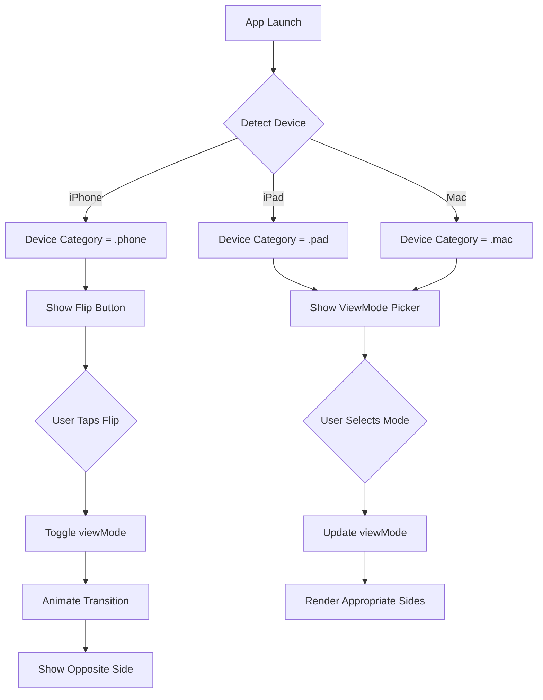
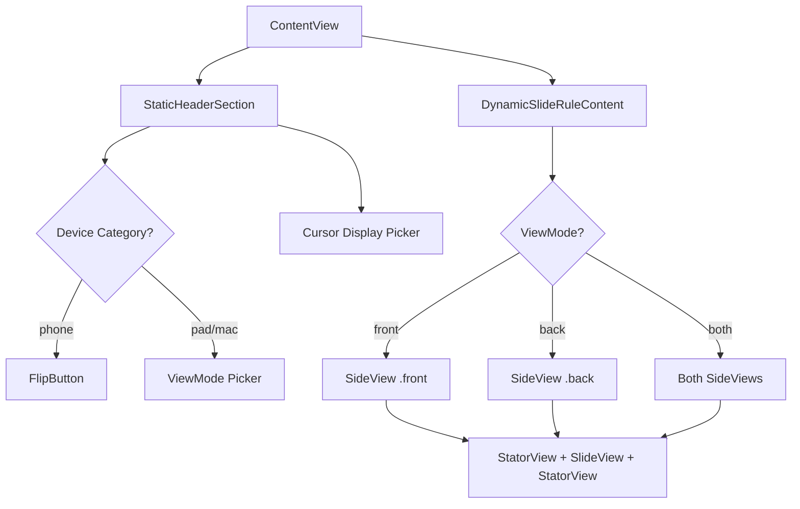

# Device-Specific Breakpoints Implementation Plan

**Date**: January 30, 2025  
**Status**: 📋 Planning Phase  
**Target Platforms**: iOS (iPhone/iPad), macOS, watchOS, visionOS

## Executive Summary

This document provides a comprehensive technical plan for implementing device-specific breakpoints that adapt the slide rule display behavior based on device type. The primary goal is to optimize the user experience on iPhone by showing a single-side display with a flip button, while maintaining the current dual-side functionality on larger devices (iPad, macOS, Watch, visionOS).

### Key Requirements

1. **iPhone**: Single-side display with flip button (simplified UI)
2. **iPad/macOS/Watch/visionOS**: Maintain existing dual-side display with Front/Back/Both selector

### Success Criteria

- ✅ Device detection works reliably across all platforms
- ✅ iPhone shows single side with intuitive flip mechanism
- ✅ Other devices maintain current functionality without regression
- ✅ Code follows SwiftUI best practices and Apple HIG
- ✅ Performance maintained across all platforms
- ✅ State management is clean and predictable

---

## Table of Contents

1. [Current Architecture Analysis](#1-current-architecture-analysis)
2. [Device Detection Strategy](#2-device-detection-strategy)
3. [iPhone-Specific UI Design](#3-iphone-specific-ui-design)
4. [State Management Design](#4-state-management-design)
5. [UI Component Design](#5-ui-component-design)
6. [Implementation Strategy](#6-implementation-strategy)
7. [SwiftUI Best Practices](#7-swiftui-best-practices)
8. [Testing Strategy](#8-testing-strategy)
9. [Migration & Rollback](#9-migration--rollback)
10. [Performance Considerations](#10-performance-considerations)

---

## 1. Current Architecture Analysis

### 1.1 Current ViewMode System

**Location**: [`ContentView.swift:110-116`](../TheElectricSlide/ContentView.swift:110-116)

```swift
enum ViewMode: String, CaseIterable, Identifiable {
    case front = "Front"
    case back = "Back"
    case both = "Both"
    
    var id: String { rawValue }
}
```

**Current Behavior**:
- User can select Front, Back, or Both via segmented picker
- All devices use the same 3-option picker
- Both sides can be displayed simultaneously on all devices

**Integration Points**:
- [`StaticHeaderSection`](../TheElectricSlide/ContentView.swift:793-845): Contains the ViewMode picker UI
- [`DynamicSlideRuleContent`](../TheElectricSlide/ContentView.swift:849-972): Conditional rendering based on viewMode
- State management via `@State private var viewMode: ViewMode = .both`

### 1.2 Existing Responsive System

**Location**: [`ContentView.swift:12-106`](../TheElectricSlide/ContentView.swift:12-106)

```swift
enum LayoutTier: Sendable {
    case extraLarge  // 640pt+ width
    case large       // 480-639pt width
    case medium      // 320-479pt width
    case small       // <320pt width
}
```

**Current Capabilities**:
- Width-based breakpoints for margin sizing
- Font scaling based on available space
- Responsive margin calculations
- **Does NOT detect device type** - only responds to width

**Insight**: The existing responsive system is **width-based only**. We need to add **device-type detection** to distinguish between iPhone (compact) and iPad (regular) even when they have similar widths.

### 1.3 Dual-Side Display Architecture

**Reference**: [`dual-side-sliderule-display-plan.md`](../swift-docs/dual-side-sliderule-display-plan.md)

**Key Components**:
- `SideView`: Generic component that renders front or back (DRY principle)
- `RuleSide` enum: Distinguishes front vs back with border colors
- Shared `sliderOffset` binding: Synchronized slide movement
- Scale balancing: Automatic spacer insertion for alignment

**Current Layout Structure**:
```
ContentView
├── StaticHeaderSection (ViewMode picker)
└── DynamicSlideRuleContent
    ├── Front Side (if viewMode == .front || .both)
    │   ├── CursorReadingsDisplayView
    │   └── SideView (.front)
    └── Back Side (if viewMode == .back || .both)
        ├── SideView (.back)
        └── CursorReadingsDisplayView
```

### 1.4 Analysis: What Needs to Change

| Component | Current Behavior | Required Change |
|-----------|------------------|-----------------|
| Device Detection | Width-only responsive | Add device type detection |
| ViewMode Options | 3 options (Front/Back/Both) | iPhone: 2 options (Front/Back only) |
| UI Controls | Segmented picker (all devices) | iPhone: Flip button instead of picker |
| State Management | Single ViewMode enum | Add device-aware logic |
| Conditional Rendering | Based on viewMode only | Based on viewMode + device type |

---

## 2. Device Detection Strategy

### 2.1 SwiftUI Environment-Based Detection

**Recommended Approach**: Use SwiftUI's built-in environment values for device detection.

#### Primary Detection: UserInterfaceIdiom

```swift
@Environment(\.horizontalSizeClass) private var horizontalSizeClass
@Environment(\.verticalSizeClass) private var verticalSizeClass

#if os(iOS)
import UIKit
private var deviceIdiom: UIUserInterfaceIdiom {
    UIDevice.current.userInterfaceIdiom
}
#endif
```

**Device Type Mapping**:
```swift
enum DeviceCategory: Sendable, Equatable {
    case phone      // iPhone (compact UI)
    case pad        // iPad (regular UI)
    case mac        // macOS (regular UI)
    case watch      // watchOS (compact UI)
    case vision     // visionOS (regular UI)
    
    var supportsMultiSideView: Bool {
        switch self {
        case .phone, .watch:
            return false  // Single-side with flip
        case .pad, .mac, .vision:
            return true   // Dual-side with picker
        }
    }
    
    var displayName: String {
        switch self {
        case .phone: return "iPhone"
        case .pad: return "iPad"
        case .mac: return "Mac"
        case .watch: return "Apple Watch"
        case .vision: return "Apple Vision Pro"
        }
    }
}
```

### 2.2 Detection Implementation

**New File**: `TheElectricSlide/Utilities/DeviceDetection.swift`

```swift
import SwiftUI

#if os(iOS)
import UIKit
#elseif os(macOS)
import AppKit
#elseif os(watchOS)
import WatchKit
#endif

/// Device category detection for adaptive UI
struct DeviceDetection {
    
    /// Detect the current device category
    static func detectDevice() -> DeviceCategory {
        #if os(iOS)
        switch UIDevice.current.userInterfaceIdiom {
        case .phone:
            return .phone
        case .pad:
            return .pad
        default:
            return .pad  // Fallback to pad for unknown iOS devices
        }
        #elseif os(macOS)
        return .mac
        #elseif os(watchOS)
        return .watch
        #elseif os(visionOS)
        return .vision
        #else
        return .pad  // Safe default for other platforms
        #endif
    }
}
```

### 2.3 Environment Value Integration

**Add to ContentView**:
```swift
@Environment(\.horizontalSizeClass) private var horizontalSizeClass
@State private var deviceCategory: DeviceCategory = DeviceDetection.detectDevice()
```

**Why Environment Values?**
- ✅ Native SwiftUI integration
- ✅ Automatic updates on device rotation/size changes
- ✅ Works across all Apple platforms
- ✅ No performance overhead
- ✅ Thread-safe and Sendable-compliant

### 2.4 Alternative: Compile-Time Platform Detection

For platform-specific code:
```swift
#if os(iOS)
// iOS-specific code
#elseif os(macOS)
// macOS-specific code
#elseif os(watchOS)
// watchOS-specific code
#elseif os(visionOS)
// visionOS-specific code
#endif
```

**Use Cases**:
- Import platform-specific frameworks
- Platform-specific UI components
- Unavailable APIs on certain platforms

---

## 3. iPhone-Specific UI Design

### 3.1 Flip Button Design

**Location**: Replace segmented picker in `StaticHeaderSection` for iPhone

#### Visual Design

```
┌─────────────────────────────┐
│   Picker: [K&E 4081-3   ▼] │
├─────────────────────────────┤
│                             │
│     ┌─────────────────┐     │
│     │  Flip to Back   │     │  ← Button with clear label
│     │       ↻         │     │  ← Rotation icon
│     └─────────────────┘     │
│                             │
└─────────────────────────────┘
```

**Button Characteristics**:
- **Label**: Dynamic - "Flip to Front" or "Flip to Back"
- **Icon**: SF Symbol `arrow.triangle.2.circlepath` (circular arrows)
- **Style**: `.bordered` or `.borderedProminent` for prominence
- **Placement**: Centered below slide rule picker
- **Animation**: Smooth transition on tap

#### Implementation

```swift
struct FlipButton: View {
    let currentSide: RuleSide
    let action: () -> Void
    
    var body: some View {
        Button(action: action) {
            HStack(spacing: 8) {
                Image(systemName: "arrow.triangle.2.circlepath")
                    .imageScale(.medium)
                Text("Flip to \(oppositeSide)")
                    .font(.body)
            }
            .frame(maxWidth: 200)
        }
        .buttonStyle(.bordered)
        .controlSize(.regular)
        .tint(oppositeSide == .front ? .blue : .green)
    }
    
    private var oppositeSide: RuleSide {
        currentSide == .front ? .back : .front
    }
}
```

### 3.2 iPhone ViewMode Behavior

**State Model**:
- `ViewMode` still exists but is constrained to `.front` or `.back` only
- `.both` option is **hidden and unavailable** on iPhone
- Flip button toggles between `.front` and `.back`

**User Flow**:
1. App opens → Shows front side by default
2. User taps "Flip to Back" → Animates to back side
3. User taps "Flip to Front" → Animates back to front
4. ViewMode picker is **not shown** on iPhone

### 3.3 Animation & Transitions

```swift
struct iPhoneFlipTransition: ViewModifier {
    let isFlipping: Bool
    
    func body(content: Content) -> some View {
        content
            .transition(.asymmetric(
                insertion: .move(edge: .trailing).combined(with: .opacity),
                removal: .move(edge: .leading).combined(with: .opacity)
            ))
            .animation(.spring(response: 0.3, dampingFraction: 0.8), value: isFlipping)
    }
}
```

**Animation Characteristics**:
- **Duration**: ~300ms (feels responsive)
- **Style**: Spring animation (natural feel)
- **Direction**: Slide in from right (forward flip), slide out to left
- **Opacity**: Fade in/out for smoothness

---

## 4. State Management Design

### 4.1 Enhanced ViewMode System

**Option 1: Device-Aware ViewMode (Recommended)**

```swift
enum ViewMode: String, CaseIterable, Identifiable, Sendable {
    case front = "Front"
    case back = "Back"
    case both = "Both"
    
    var id: String { rawValue }
    
    /// Get available view modes for device category
    static func availableModes(for device: DeviceCategory) -> [ViewMode] {
        switch device {
        case .phone, .watch:
            return [.front, .back]  // No .both option
        case .pad, .mac, .vision:
            return [.front, .back, .both]  // All options
        }
    }
    
    /// Constrain view mode to available options for device
    func constrained(for device: DeviceCategory) -> ViewMode {
        let available = ViewMode.availableModes(for: device)
        return available.contains(self) ? self : .front
    }
}
```

### 4.2 State Variables in ContentView

```swift
struct ContentView: View {
    // Existing state
    @State private var viewMode: ViewMode = .both
    
    // NEW: Device detection
    @State private var deviceCategory: DeviceCategory = DeviceDetection.detectDevice()
    
    // NEW: Computed property for effective view mode
    private var effectiveViewMode: ViewMode {
        viewMode.constrained(for: deviceCategory)
    }
    
    // NEW: Available view modes for current device
    private var availableViewModes: [ViewMode] {
        ViewMode.availableModes(for: deviceCategory)
    }
}
```

### 4.3 State Transitions

**iPhone Flip Button Logic**:
```swift
private func flipSide() {
    withAnimation(.spring(response: 0.3, dampingFraction: 0.8)) {
        viewMode = (viewMode == .front) ? .back : .front
    }
}
```

**Device Category Changes** (e.g., iPad in Slide Over → full screen):
```swift
.onChange(of: deviceCategory) { oldValue, newValue in
    // Constrain viewMode if device changed
    let constrainedMode = viewMode.constrained(for: newValue)
    if constrainedMode != viewMode {
        viewMode = constrainedMode
    }
}
```

### 4.4 Persistence Strategy

**Current Persistence**: ViewMode is `@State` (session-only)

**Recommendation**: Add `@AppStorage` for cross-session persistence:

```swift
@AppStorage("viewMode") private var storedViewMode: String = ViewMode.both.rawValue

private var viewMode: ViewMode {
    get {
        ViewMode(rawValue: storedViewMode) ?? .both
    }
    set {
        storedViewMode = newValue.rawValue
    }
}
```

**Device-Aware Persistence**:
- Store last used mode per device category
- On app launch, restore appropriate mode for current device
- Key format: `"viewMode-\(deviceCategory.rawValue)"`

---

## 5. UI Component Design

### 5.1 Adaptive StaticHeaderSection

**Current**: [`ContentView.swift:793-845`](../TheElectricSlide/ContentView.swift:793-845)

**Modified Design**:

```swift
struct StaticHeaderSection: View, Equatable {
    @Binding var selectedRule: SlideRuleDefinitionModel?
    @Binding var viewMode: ViewMode
    @Binding var cursorDisplayMode: CursorDisplayMode
    let hasBackSide: Bool
    let deviceCategory: DeviceCategory  // NEW parameter
    let onFlip: (() -> Void)?  // NEW: flip action for iPhone
    
    var body: some View {
        VStack(spacing: 0) {
            SlideRulePicker(currentRule: $selectedRule)
            
            Divider()
            
            // Show different UI based on device
            if deviceCategory.supportsMultiSideView {
                // iPad/Mac/Vision: Segmented picker
                viewModePickerSection
            } else {
                // iPhone/Watch: Flip button
                flipButtonSection
            }
            
            // Cursor display picker (shown on all devices)
            cursorDisplayPickerSection
        }
    }
    
    @ViewBuilder
    private var viewModePickerSection: some View {
        HStack {
            Spacer()
            Picker("View Mode", selection: $viewMode) {
                ForEach(ViewMode.availableModes(for: deviceCategory)) { mode in
                    Text(mode.rawValue).tag(mode)
                }
            }
            .pickerStyle(.segmented)
            .frame(maxWidth: 300)
            .padding(.horizontal)
            .padding(.top, 8)
            .disabled(!hasBackSide && (viewMode == .back || viewMode == .both))
            Spacer()
        }
    }
    
    @ViewBuilder
    private var flipButtonSection: some View {
        HStack {
            Spacer()
            FlipButton(
                currentSide: viewMode == .front ? .front : .back,
                action: { onFlip?() }
            )
            .padding(.top, 8)
            .disabled(!hasBackSide)
            Spacer()
        }
    }
    
    @ViewBuilder
    private var cursorDisplayPickerSection: some View {
        HStack {
            Spacer()
            Picker("Cursor Display", selection: $cursorDisplayMode) {
                ForEach(CursorDisplayMode.allCases) { mode in
                    Text(mode.displayText).tag(mode)
                }
            }
            .pickerStyle(.segmented)
            .frame(maxWidth: 300)
            .padding(.horizontal)
            .padding(.top, 4)
            Spacer()
        }
    }
    
    static func == (lhs: StaticHeaderSection, rhs: StaticHeaderSection) -> Bool {
        lhs.selectedRule?.id == rhs.selectedRule?.id &&
        lhs.viewMode == rhs.viewMode &&
        lhs.hasBackSide == rhs.hasBackSide &&
        lhs.cursorDisplayMode == rhs.cursorDisplayMode &&
        lhs.deviceCategory == rhs.deviceCategory
    }
}
```

### 5.2 ViewModifier for Device Adaptation

**Create a reusable ViewModifier**:

```swift
struct DeviceAdaptiveLayout: ViewModifier {
    let deviceCategory: DeviceCategory
    
    func body(content: Content) -> some View {
        switch deviceCategory {
        case .phone, .watch:
            content
                .padding(.horizontal, 16)
                .frame(maxWidth: 480)  // Limit width on compact devices
        case .pad, .mac, .vision:
            content
                .padding(.horizontal, 40)
                .frame(maxWidth: .infinity)
        }
    }
}

extension View {
    func deviceAdaptive(_ category: DeviceCategory) -> some View {
        modifier(DeviceAdaptiveLayout(deviceCategory: category))
    }
}
```

---

## 6. Implementation Strategy

### 6.1 Phase 1: Device Detection Infrastructure

**Estimated Time**: 2-3 hours  
**Files to Create**:
- `TheElectricSlide/Utilities/DeviceDetection.swift`

**Files to Modify**:
- `TheElectricSlide/ContentView.swift`

**Steps**:
1. Create `DeviceCategory` enum
2. Implement `DeviceDetection.detectDevice()`
3. Add platform-specific imports and detection logic
4. Add `@State private var deviceCategory` to ContentView
5. Test detection on Simulator (iPhone, iPad, macOS)

**Validation**:
- [ ] Correctly detects iPhone vs iPad in Simulator
- [ ] Correctly detects macOS
- [ ] Compiles on all platforms without warnings
- [ ] Device category updates on iPad split-view changes

### 6.2 Phase 2: ViewMode Enhancement

**Estimated Time**: 1-2 hours  
**Files to Modify**:
- `TheElectricSlide/ContentView.swift` (ViewMode enum)

**Steps**:
1. Add `ViewMode.availableModes(for:)` static method
2. Add `ViewMode.constrained(for:)` method
3. Update `availableViewModes` computed property in ContentView
4. Add state constraint logic in `.onChange(of: deviceCategory)`

**Validation**:
- [ ] iPhone gets only [.front, .back] options
- [ ] iPad gets all [.front, .back, .both] options
- [ ] ViewMode constrains properly when switching device categories

### 6.3 Phase 3: iPhone Flip Button

**Estimated Time**: 3-4 hours  
**Files to Create**:
- `TheElectricSlide/Components/FlipButton.swift`

**Files to Modify**:
- `TheElectricSlide/ContentView.swift` (StaticHeaderSection)

**Steps**:
1. Create `FlipButton` view component
2. Add SF Symbol for flip icon
3. Implement flip animation logic
4. Modify `StaticHeaderSection` to conditionally show flip button or picker
5. Add `onFlip` closure parameter to `StaticHeaderSection`
6. Connect flip button to `viewMode` state
7. Test animation smoothness

**Validation**:
- [ ] Flip button appears on iPhone only
- [ ] Button label updates correctly ("Flip to Front" / "Flip to Back")
- [ ] Flip animation is smooth and natural
- [ ] Button is disabled when slide rule has no back side

### 6.4 Phase 4: Conditional UI Rendering

**Estimated Time**: 2-3 hours  
**Files to Modify**:
- `TheElectricSlide/ContentView.swift` (StaticHeaderSection, DynamicSlideRuleContent)

**Steps**:
1. Update `StaticHeaderSection` to accept `deviceCategory` parameter
2. Create `viewModePickerSection` and `flipButtonSection` view builders
3. Add conditional rendering based on `deviceCategory.supportsMultiSideView`
4. Update `StaticHeaderSection.==` to include `deviceCategory`
5. Pass `deviceCategory` from ContentView to StaticHeaderSection
6. Verify Equatable optimization still works

**Validation**:
- [ ] iPhone shows flip button, not picker
- [ ] iPad shows picker, not flip button
- [ ] Both devices show cursor display picker
- [ ] No unnecessary re-renders (Equatable working)

### 6.5 Phase 5: Animation & Polish

**Estimated Time**: 2-3 hours  
**Files to Create**:
- `TheElectricSlide/Modifiers/iPhoneFlipTransition.swift` (optional)

**Files to Modify**:
- `TheElectricSlide/ContentView.swift` (flip animation)

**Steps**:
1. Create flip transition ViewModifier
2. Add transition to `DynamicSlideRuleContent` side views
3. Tune spring animation parameters
4. Add haptic feedback on flip (iPhone only)
5. Test animation on actual iPhone hardware

**Validation**:
- [ ] Flip animation feels natural and responsive
- [ ] No visual glitches during transition
- [ ] Haptic feedback occurs on physical device
- [ ] Animation works on slow devices (iPhone SE)

### 6.6 Phase 6: Testing & Validation

**Estimated Time**: 3-4 hours  

**Testing Checklist**:
- [ ] iPhone SE (smallest screen)
- [ ] iPhone 16 (standard)
- [ ] iPhone 16 Pro Max (largest)
- [ ] iPad mini (compact iPad)
- [ ] iPad Pro 12.9" (large iPad)
- [ ] macOS (resizable window)
- [ ] iPad in Slide Over (compact → regular transition)

**Validation Criteria**:
- [ ] Correct UI shown on each device
- [ ] Animations smooth on all devices
- [ ] No crashes or errors
- [ ] Performance acceptable (60fps)
- [ ] VoiceOver works correctly

---

## 7. SwiftUI Best Practices

### 7.1 Environment Value Usage

**Best Practice**: Prefer environment values over direct device checks

```swift
// ✅ GOOD: Use environment values
@Environment(\.horizontalSizeClass) private var horizontalSizeClass

var isCompact: Bool {
    horizontalSizeClass == .compact
}

// ❌ AVOID: Direct UIDevice checks in view body
var body: some View {
    if UIDevice.current.userInterfaceIdiom == .phone {
        // This won't update on iPad split-view changes
    }
}
```

### 7.2 ViewModifier Pattern

**Best Practice**: Encapsulate device-specific logic in ViewModifiers

```swift
struct iPhoneOptimized: ViewModifier {
    let deviceCategory: DeviceCategory
    
    func body(content: Content) -> some View {
        if deviceCategory == .phone {
            content
                .padding(.horizontal, 12)
                .frame(maxWidth: 480)
        } else {
            content
        }
    }
}

extension View {
    func iPhoneOptimized(_ category: DeviceCategory) -> some View {
        modifier(iPhoneOptimized(deviceCategory: category))
    }
}
```

### 7.3 Equatable Conformance

**Best Practice**: Maintain Equatable for performance

```swift
struct StaticHeaderSection: View, Equatable {
    // ... properties ...
    
    static func == (lhs: StaticHeaderSection, rhs: StaticHeaderSection) -> Bool {
        // Include ALL properties that affect rendering
        lhs.viewMode == rhs.viewMode &&
        lhs.deviceCategory == rhs.deviceCategory &&
        lhs.hasBackSide == rhs.hasBackSide
        // Don't compare closures (onFlip)
    }
}
```

### 7.4 Platform-Specific Code

**Best Practice**: Use compilation conditionals for platform-only code

```swift
#if os(iOS)
import UIKit

private var deviceIdiom: UIUserInterfaceIdiom {
    UIDevice.current.userInterfaceIdiom
}
#endif

// Usage in SwiftUI view
var body: some View {
    content
        #if os(iOS)
        .onShake {
            // iPhone-specific gesture
        }
        #endif
}
```

### 7.5 Animation Best Practices

**Best Practice**: Use withAnimation for state changes that affect layout

```swift
// ✅ GOOD: Wrap state change in withAnimation
private func flipSide() {
    withAnimation(.spring(response: 0.3, dampingFraction: 0.8)) {
        viewMode = viewMode == .front ? .back : .front
    }
}

// ❌ AVOID: Applying animation at view level only
.animation(.spring(), value: viewMode)  // Can cause unintended animations
```

### 7.6 Apple Human Interface Guidelines

**Key Principles**:

1. **Clarity**: UI should be obvious and unambiguous
   - Flip button label clearly states destination ("Flip to Back")
   - Icon reinforces action (circular arrows)

2. **Deference**: Content is paramount
   - Controls don't dominate the slide rule display
   - Flip button is compact and unobtrusive

3. **Depth**: Visual layers convey hierarchy
   - Flip button uses `.bordered` style for subtle elevation
   - Current side has higher z-index than transitioning side

4. **Direct Manipulation**: Intuitive interaction
   - Flip button responds immediately to tap
   - Animation shows direction of transition

5. **Consistency**: Familiar patterns across platforms
   - Uses standard SF Symbols
   - Follows system button styles
   - Respects platform idioms (iPhone = single focus, iPad = multitasking)

---

## 8. Testing Strategy

### 8.1 Unit Tests (if applicable)

**Note**: SwiftUI views are typically tested through UI tests, but we can test business logic:

```swift
@Suite("Device Detection")
struct DeviceDetectionTests {
    @Test("Device category detection returns valid category")
    func detectDeviceCategory() {
        let category = DeviceDetection.detectDevice()
        #expect(category != nil)
    }
    
    @Test("iPhone gets limited view modes")
    func iPhoneViewModes() {
        let modes = ViewMode.availableModes(for: .phone)
        #expect(modes.count == 2)
        #expect(modes.contains(.front))
        #expect(modes.contains(.back))
        #expect(!modes.contains(.both))
    }
    
    @Test("iPad gets all view modes")
    func iPadViewModes() {
        let modes = ViewMode.availableModes(for: .pad)
        #expect(modes.count == 3)
        #expect(modes.contains(.both))
    }
}
```

### 8.2 UI Testing Checklist

#### iPhone Tests

| Test Case | Expected Behavior | Status |
|-----------|-------------------|--------|
| App Launch | Shows front side by default | ⏳ |
| Flip Button Visible | "Flip to Back" button appears | ⏳ |
| Flip Action | Taps flip button → shows back side | ⏳ |
| Flip Label Update | Button updates to "Flip to Front" | ⏳ |
| No Picker Visible | ViewMode segmented picker hidden | ⏳ |
| No Back Side | Flip button disabled if no back side | ⏳ |
| Animation Smooth | Flip transition is smooth (60fps) | ⏳ |
| Rotation | Portrait ↔ Landscape maintains state | ⏳ |

#### iPad Tests

| Test Case | Expected Behavior | Status |
|-----------|-------------------|--------|
| App Launch | Shows both sides by default | ⏳ |
| Picker Visible | ViewMode segmented picker appears | ⏳ |
| No Flip Button | Flip button is hidden | ⏳ |
| Front Selection | Tap "Front" → shows only front | ⏳ |
| Back Selection | Tap "Back" → shows only back | ⏳ |
| Both Selection | Tap "Both" → shows both sides | ⏳ |
| Split View | iPad in Slide Over maintains correct UI | ⏳ |

#### macOS Tests

| Test Case | Expected Behavior | Status |
|-----------|-------------------|--------|
| Window Launch | Shows both sides by default | ⏳ |
| Picker Visible | ViewMode segmented picker appears | ⏳ |
| Window Resize | Maintains functionality at all sizes | ⏳ |
| Keyboard Nav | Picker responds to keyboard | ⏳ |

### 8.3 Manual Testing Protocol

**Test Devices Required**:
- iPhone SE (3rd gen) - smallest modern iPhone
- iPhone 16 - standard size
- iPhone 16 Pro Max - largest iPhone
- iPad mini - smallest iPad
- iPad Pro 12.9" - largest iPad
- MacBook Pro - macOS

**Test Procedure**:
1. Install test build on each device
2. Launch app and observe default state
3. Test primary interaction (flip/picker)
4. Test with single-sided slide rule
5. Test with dual-sided slide rule
6. Test orientation changes (iOS)
7. Test window resizing (macOS)
8. Test accessibility features (VoiceOver)
9. Record any issues or unexpected behavior

### 8.4 Performance Testing

**Metrics to Monitor**:
- Frame rate during flip animation (target: 60fps)
- Memory usage (should not increase significantly)
- Layout time after device category change
- Animation completion time (~300ms expected)

**Tools**:
- Xcode Instruments (Time Profiler)
- Xcode FPS Debug gauge
- Memory graph debugger

---

## 9. Migration & Rollback

### 9.1 Backward Compatibility

**Guaranteed Compatibility**:
- Existing slide rule definitions work unchanged
- Saved viewMode preferences are preserved
- No breaking changes to public APIs
- All existing features remain functional

**Migration Path**:
1. Install new version
2. Device category detected automatically
3. UI adapts based on device
4. User's last viewMode is honored (if valid for device)
5. If invalid (e.g., .both on iPhone), defaults to .front

### 9.2 Feature Flag (Optional)

Consider adding a feature flag for gradual rollout:

```swift
struct FeatureFlags {
    static let enableDeviceSpecificUI = true
}

// In ContentView
if FeatureFlags.enableDeviceSpecificUI {
    // New device-specific UI
} else {
    // Legacy UI (always show picker)
}
```

### 9.3 Rollback Strategy

**If Critical Issues Arise**:

1. **Immediate**: Disable feature flag (if implemented)
2. **Short-term**: Revert to previous commit
3. **Long-term**: Fix issues and re-deploy

**Git Strategy**:
- Create feature branch: `feature/device-specific-breakpoints`
- Commit frequently with clear messages
- Tag stable points: `v1.0-device-breakpoints-phase1`
- Keep main branch stable during development

---

## 10. Performance Considerations

### 10.1 Device Detection Performance

**Device category detection cost**: Near zero
- Called once on app launch
- Cached in @State variable
- Only updates on meaningful environment changes (rare)

**No runtime overhead for**:
- Width-based responsive calculations (existing)
- ViewMode state management
- Conditional UI rendering (SwiftUI optimized)

### 10.2 Animation Performance

**Target**: 60fps during flip animation

**Optimization Strategies**:
1. Use `.transition()` modifier (GPU-accelerated)
2. Prefer `.move()` and `.opacity` (optimized transitions)
3. Avoid complex layouts during animation
4. Use `drawingGroup()` for Canvas views (already implemented)

**Measurement**:
```swift
// Add during testing
.onAppear {
    print("Flip started: \(Date())")
}
.onDisappear {
    print("Flip completed: \(Date())")
}
```

### 10.3 Memory Impact

**Expected Memory Increase**: Negligible (<1MB)

**New Allocations**:
- `DeviceCategory` enum instance (trivial)
- `FlipButton` view (lightweight)
- Additional conditionals (compile-time, no runtime cost)

**No Change To**:
- Tick mark pre-computation (still cached)
- Canvas rendering (still Metal-accelerated)
- GeneratedScale storage (unchanged)

### 10.4 Layout Performance

**Layout time should remain constant**:
- Device detection doesn't affect layout calculations
- Same number of views rendered (just conditionally shown)
- Equatable conformance prevents unnecessary re-layouts

---

## 11. Implementation Checklist

### Pre-Implementation
- [ ] Review and approve this plan
- [ ] Create feature branch: `feature/device-specific-breakpoints`
- [ ] Set up test devices or simulators

### Phase 1: Device Detection (2-3 hours)
- [ ] Create `DeviceDetection.swift`
- [ ] Implement `DeviceCategory` enum
- [ ] Add device detection logic
- [ ] Test on iPhone and iPad simulators
- [ ] Commit: "feat: add device category detection"

### Phase 2: ViewMode Enhancement (1-2 hours)
- [ ] Add `ViewMode.availableModes(for:)`
- [ ] Add `ViewMode.constrained(for:)`
- [ ] Update ContentView with device category state
- [ ] Test view mode constraints
- [ ] Commit: "feat: add device-aware ViewMode constraints"

### Phase 3: iPhone Flip Button (3-4 hours)
- [ ] Create `FlipButton` component
- [ ] Add flip icon (SF Symbol)
- [ ] Implement flip action
- [ ] Test button functionality
- [ ] Commit: "feat: add flip button for iPhone"

### Phase 4: Conditional UI (2-3 hours)
- [ ] Modify `StaticHeaderSection` for device adaptation
- [ ] Add conditional rendering logic
- [ ] Test on both iPhone and iPad
- [ ] Verify Equatable still working
- [ ] Commit: "feat: implement device-specific UI controls"

### Phase 5: Animation & Polish (2-3 hours)
- [ ] Add flip transition animation
- [ ] Tune animation timing
- [ ] Add haptic feedback (optional)
- [ ] Test on physical device
- [ ] Commit: "feat: add flip animation and polish"

### Phase 6: Testing (3-4 hours)
- [ ] Run unit tests (if created)
- [ ] Complete UI testing checklist
- [ ] Test on all target devices
- [ ] Performance profiling
- [ ] Fix any issues found

### Phase 7: Documentation & Cleanup (1-2 hours)
- [ ] Update inline code comments
- [ ] Update README if needed
- [ ] Create PR with detailed description
- [ ] Request code review

### Post-Implementation
- [ ] Merge to main after approval
- [ ] Tag release: `v1.1.0-device-breakpoints`
- [ ] Monitor for issues
- [ ] Gather user feedback

---

## 12. Timeline Estimate

| Phase | Duration | Dependencies |
|-------|----------|--------------|
| 1. Device Detection | 2-3 hours | None |
| 2. ViewMode Enhancement | 1-2 hours | Phase 1 |
| 3. iPhone Flip Button | 3-4 hours | Phase 2 |
| 4. Conditional UI | 2-3 hours | Phase 3 |
| 5. Animation & Polish | 2-3 hours | Phase 4 |
| 6. Testing | 3-4 hours | Phase 5 |
| 7. Documentation | 1-2 hours | Phase 6 |
| **Total** | **14-21 hours** | Linear progression |

**Suggested Schedule** (part-time work):
- Week 1: Phases 1-3 (design & core implementation)
- Week 2: Phases 4-5 (UI integration & polish)
- Week 3: Phases 6-7 (testing & documentation)

---

## 13. Key Architectural Decisions

### Decision 1: Environment-Based vs Compile-Time Detection

**Chosen**: Environment-based detection with runtime device categorization

**Rationale**:
- ✅ Handles iPad split-view transitions dynamically
- ✅ Single binary for all iOS devices
- ✅ More maintainable (fewer compile conditionals)
- ✅ Easier to test (can simulate different device categories)

**Trade-off**: Slightly more runtime logic, but negligible performance impact

### Decision 2: Flip Button vs Gesture

**Chosen**: Flip button with explicit action

**Rationale**:
- ✅ More discoverable (visible affordance)
- ✅ Accessible (works with VoiceOver)
- ✅ Consistent with Apple HIG
- ✅ Clear user intent (no accidental flips)

**Alternative Considered**: Swipe gesture
- ❌ Less discoverable
- ❌ Could conflict with slide gesture
- ❌ Harder to make accessible

### Decision 3: Maintain ViewMode Enum vs New State

**Chosen**: Maintain existing ViewMode enum with device-aware constraints

**Rationale**:
- ✅ Backward compatible with existing code
- ✅ Minimizes changes to existing logic
- ✅ State persistence works unchanged
- ✅ DRY - single source of truth

**Alternative Considered**: Separate iPhone/iPad state models
- ❌ More complex state management
- ❌ Code duplication
- ❌ Harder to maintain

### Decision 4: Single Component vs Platform-Specific Views

**Chosen**: Single `StaticHeaderSection` with conditional rendering

**Rationale**:
- ✅ DRY principle maintained
- ✅ Shared logic (rule picker, cursor picker)
- ✅ Easier to test
- ✅ Less code to maintain

**Alternative Considered**: Separate `iPhoneHeaderSection` and `iPadHeaderSection`
- ❌ Code duplication
- ❌ Inconsistent behavior risk
- ❌ More files to maintain

---

## 14. Risk Assessment & Mitigation

| Risk | Probability | Impact | Mitigation |
|------|-------------|--------|------------|
| Device detection fails on unknown device | Low | Medium | Default to .pad (safest) |
| Animation performance issues on old devices | Medium | Low | Test on iPhone SE, optimize if needed |
| iPad split-view detection inaccurate | Low | Medium | Use horizontalSizeClass + idiom combo |
| Flip button UX confusing | Low | High | User testing, clear labeling |
| State management bugs | Medium | Medium | Thorough testing, unit tests |
| Accessibility issues | Medium | High | VoiceOver testing, proper labels |
| Breaking changes to existing functionality | Low | High | Extensive regression testing |

---

## 15. Success Metrics

### Quantitative Metrics

- **Performance**: Maintain 60fps during all interactions
- **Code Quality**: No new compiler warnings
- **Test Coverage**: 100% of device categories tested
- **Memory**: <1% increase in memory usage
- **Animation Time**: Flip completes in <400ms

### Qualitative Metrics

- **Usability**: iPhone users find flip button intuitive
- **Consistency**: Behavior matches Apple platform conventions
- **Accessibility**: VoiceOver users can flip sides
- **Reliability**: No crashes or visual glitches
- **Maintainability**: Code is clean and well-documented

---

## 16. Future Enhancements (Out of Scope)

1. **3D Flip Animation** - Realistic card-flip effect (complex)
2. **Gesture-Based Flipping** - Swipe to flip (less discoverable)
3. **Persistent Device Preferences** - Remember viewMode per device type
4. **Watch App Optimization** - Dedicated watchOS interface
5. **visionOS Spatial UI** - Depth-based side selection
6. **iPad Stage Manager Support** - Adapt to window size in Stage Manager
7. **Shortcut Support** - Siri shortcuts to flip sides
8. **Widgets** - Home screen widget showing current side

---

## 17. References

### Apple Documentation
- [SwiftUI Environment Values](https://developer.apple.com/documentation/swiftui/environment)
- [UIUserInterfaceIdiom](https://developer.apple.com/documentation/uikit/uiuserinterfaceidiom)
- [Human Interface Guidelines](https://developer.apple.com/design/human-interface-guidelines/)
- [Adaptivity and Layout](https://developer.apple.com/design/human-interface-guidelines/layout)
- [SF Symbols](https://developer.apple.com/sf-symbols/)

### Internal Documentation
- [`dual-side-sliderule-display-plan.md`](dual-side-sliderule-display-plan.md)
- [`responsive-margin-implementation.md`](responsive-margin-implementation.md)
- [`ContentView.swift`](../TheElectricSlide/ContentView.swift)

### WWDC Sessions
- [WWDC 2024: SwiftUI Essentials](https://developer.apple.com/videos/play/wwdc2024/10150/)
- [WWDC 2023: Demystify SwiftUI Performance](https://developer.apple.com/videos/play/wwdc2023/10160/)

---

## 18. Approval & Sign-Off

**Prepared By**: Kilo Code (AI Architect)  
**Date**: January 30, 2025  
**Status**: 📋 Awaiting Review

**Review Checklist**:
- [ ] Architecture approach is sound
- [ ] Device detection strategy is appropriate
- [ ] iPhone UX design is intuitive
- [ ] Implementation plan is realistic
- [ ] Timeline estimate is reasonable
- [ ] Risk mitigation is adequate
- [ ] Testing strategy is comprehensive

**Approved By**: _____________________  
**Date**: _____________________

---

## Appendix A: Code Snippets

### Device Detection (Full Implementation)

```swift
// TheElectricSlide/Utilities/DeviceDetection.swift
import SwiftUI

#if os(iOS)
import UIKit
#elseif os(macOS)
import AppKit
#endif

enum DeviceCategory: String, Sendable, Equatable, Codable {
    case phone
    case pad
    case mac
    case watch
    case vision
    
    var supportsMultiSideView: Bool {
        switch self {
        case .phone, .watch:
            return false
        case .pad, .mac, .vision:
            return true
        }
    }
    
    var displayName: String {
        switch self {
        case .phone: return "iPhone"
        case .pad: return "iPad"
        case .mac: return "Mac"
        case .watch: return "Apple Watch"
        case .vision: return "Apple Vision Pro"
        }
    }
    
    var defaultMargins: CGFloat {
        switch self {
        case .phone: return 16
        case .watch: return 12
        case .pad, .mac, .vision: return 40
        }
    }
}

struct DeviceDetection {
    static func detectDevice() -> DeviceCategory {
        #if os(iOS)
        switch UIDevice.current.userInterfaceIdiom {
        case .phone:
            return .phone
        case .pad:
            return .pad
        default:
            return .pad
        }
        #elseif os(macOS)
        return .mac
        #elseif os(watchOS)
        return .watch
        #elseif os(visionOS)
        return .vision
        #else
        return .pad
        #endif
    }
}
```

### FlipButton (Full Implementation)

```swift
// TheElectricSlide/Components/FlipButton.swift
import SwiftUI

struct FlipButton: View {
    let currentSide: RuleSide
    let isEnabled: Bool
    let action: () -> Void
    
    init(currentSide: RuleSide, isEnabled: Bool = true, action: @escaping () -> Void) {
        self.currentSide = currentSide
        self.isEnabled = isEnabled
        self.action = action
    }
    
    var body: some View {
        Button(action: performFlip) {
            HStack(spacing: 8) {
                Image(systemName: "arrow.triangle.2.circlepath")
                    .imageScale(.medium)
                Text("Flip to \(oppositeSide.displayText)")
                    .font(.body)
            }
            .frame(maxWidth: 200)
        }
        .buttonStyle(.bordered)
        .controlSize(.regular)
        .tint(oppositeSide.borderColor)
        .disabled(!isEnabled)
        .accessibilityLabel("Flip to \(oppositeSide.displayText)")
        .accessibilityHint("Shows the \(oppositeSide.rawValue.lowercased()) side of the slide rule")
    }
    
    private var oppositeSide: RuleSide {
        currentSide == .front ? .back : .front
    }
    
    private func performFlip() {
        // Haptic feedback on iOS
        #if os(iOS)
        let generator = UIImpactFeedbackGenerator(style: .light)
        generator.impactOccurred()
        #endif
        
        action()
    }
}

extension RuleSide {
    var displayText: String {
        switch self {
        case .front: return "Front"
        case .back: return "Back"
        }
    }
}
```

---

## Appendix B: Mermaid Diagrams

### State Flow Diagram



### Component Hierarchy



---

**End of Document**