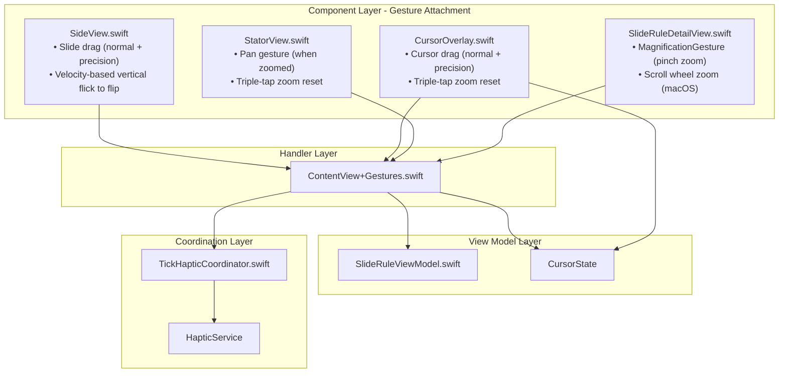
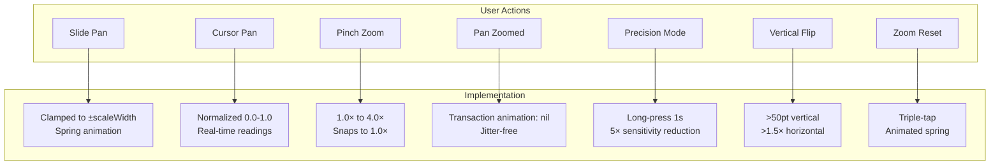
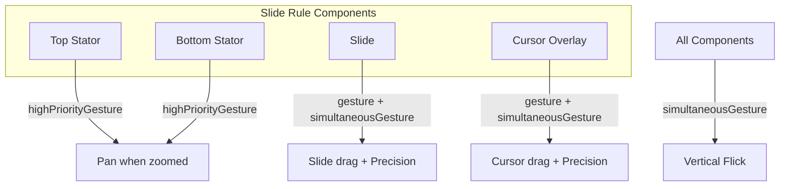
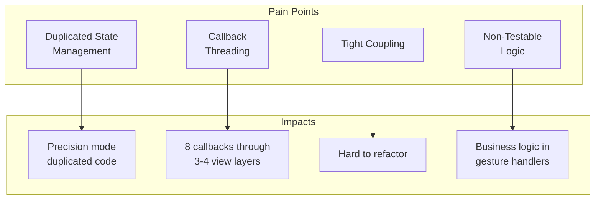
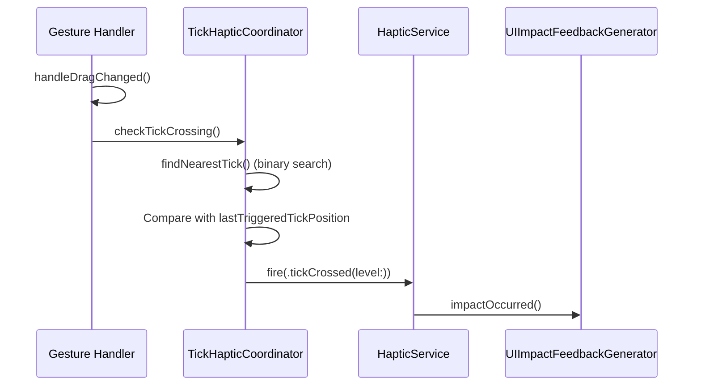
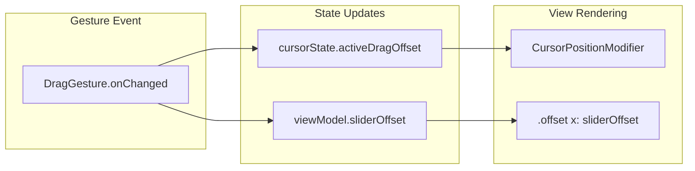
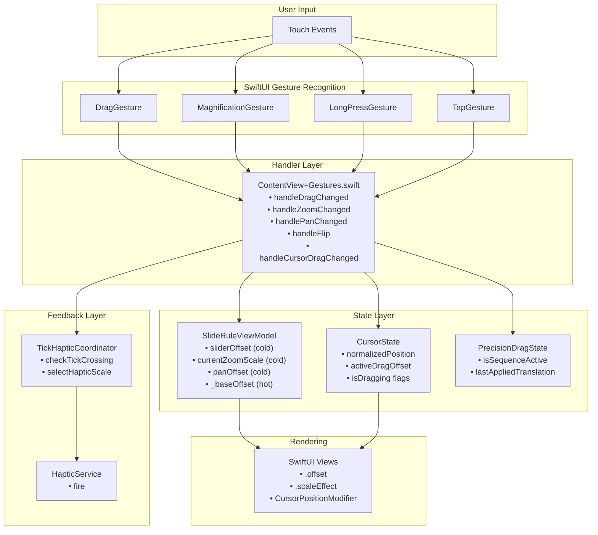

# Current Gesture System Analysis

> **Version:** 1.1.0  
> **Last Updated:** December 26, 2025  
> **Changelog:**
> - v1.1.0 (2025-12-26): Updated flip gesture to velocity-based detection; removed `isFlipping` mutex
> - v1.0.0 (2025-12): Initial analysis document

Analysis of the existing gesture system implementation in "The Electric Slide" app

## 1. Current Architecture

### 1.1 Gesture Hierarchy and File Distribution

The gesture system follows a **layered architecture** with clear separation of concerns:



### 1.2 Gesture Types Used

| Gesture Type | Usage | File Location |
|--------------|-------|---------------|
| `DragGesture` | Slide movement, cursor positioning, pan zoomed content | [`SideView.swift:121`](../../TheElectricSlide/Components/SideView.swift:121), [`CursorOverlay.swift:127`](../../TheElectricSlide/Cursor/CursorOverlay.swift:127), [`StatorView.swift`](../../TheElectricSlide/Components/StatorView.swift) |
| `LongPressGesture.sequenced(before: DragGesture)` | Precision mode activation | [`SideView.swift:146`](../../TheElectricSlide/Components/SideView.swift:146), [`CursorOverlay.swift:183`](../../TheElectricSlide/Cursor/CursorOverlay.swift:183) |
| `MagnificationGesture` | Pinch-to-zoom | [`SlideRuleDetailView.swift`](../../TheElectricSlide/Components/SlideRuleDetailView.swift) |
| `TapGesture(count: 3)` | Triple-tap zoom reset | [`SideView.swift:115`](../../TheElectricSlide/Components/SideView.swift:115), [`CursorOverlay.swift:121`](../../TheElectricSlide/Cursor/CursorOverlay.swift:121) |
| `DragGesture` (velocity-based) | Flip between front/back | [`SideView.swift`](../../TheElectricSlide/Components/SideView.swift) - v2.1 uses `gesture.velocity` for detection |

### 1.3 State Management Pattern

The codebase uses a sophisticated **hot/cold property pattern** for performance:

```swift
// SlideRuleViewModel.swift - Hot/Cold Pattern
@Observable
final class SlideRuleViewModel {
    // COLD: Observed, triggers view updates
    var sliderOffset: CGFloat = 0
    var currentZoomScale: CGFloat = 1.0
    var panOffset: CGSize = .zero
    
    // HOT: @ObservationIgnored, internal tracking only
    @ObservationIgnored private var _sliderBaseOffset: CGFloat = 0
    @ObservationIgnored private var _baseZoomScale: CGFloat = 1.0
    @ObservationIgnored private var _basePanOffset: CGSize = .zero
}
```

**State Types Used:**

| State Type | Usage | Purpose |
|------------|-------|---------|
| `@State` | [`ContentView:44`](../../TheElectricSlide/ContentView.swift:44) `viewModel`, [`ContentView:52`](../../TheElectricSlide/ContentView.swift:52) `viewMode` | View-local state |
| `@GestureState` | [`CursorOverlay.swift:76`](../../TheElectricSlide/Cursor/CursorOverlay.swift:76) `isPrecisionDragging` | Auto-reset on gesture end |
| `@ObservationIgnored` | [`SlideRuleViewModel.swift:54`](../../TheElectricSlide/Models/SlideRuleViewModel.swift:54) base offsets | Prevent redundant view updates |
| `@Observable` | [`SlideRuleViewModel`](../../TheElectricSlide/Models/SlideRuleViewModel.swift:42), [`TickHapticCoordinator`](../../TheElectricSlide/Utilities/TickHapticCoordinator.swift:17) | Modern observation pattern |

---

## 2. Current Capabilities

### 2.1 Supported Movements



| Movement | Trigger | Implementation Details |
|----------|---------|------------------------|
| **Slide Pan** | Drag on SlideView | Clamped to ±scaleWidth, spring animation on release |
| **Cursor Pan** | Drag on CursorOverlay | Normalized 0.0-1.0, real-time reading updates |
| **Pinch Zoom** | Two-finger pinch | 1.0× to 4.0×, snaps to 1.0× if zoomed out |
| **Pan Zoomed Content** | Drag on stators when zoomed | Uses `withTransaction(animation: nil)` for jitter-free |
| **Precision Mode** | Long-press (1s) + drag | 5× sensitivity reduction, haptic confirmation |
| **Vertical Flick** | Quick vertical swipe (≥600 pt/sec velocity, >30pt distance, slide stationary) | Toggles front/back on iPhone. v2.1 velocity-based detection prevents slide sticking. |
| **Zoom Reset** | Triple-tap anywhere | Animated spring return to 1.0× |

### 2.2 Region-Based Gesture Discrimination

The system uses **different gesture attachment points** for clean separation:



**Priority Resolution:**
- `.highPriorityGesture()` on stators for pan
- `.gesture()` for primary interactions
- `.simultaneousGesture()` for vertical flick and precision mode
- Explicit `guard !isPrecisionSequenceActive` checks block normal gestures during precision mode
- **Mutual exclusion via `isSlideDragActive`**: Flip gesture requires slide to be stationary

### 2.3 Momentum/Velocity Usage

**Currently:** The system does **NOT** use momentum/velocity-based scrolling.

- Slide movement uses `.interactiveSpring()` animation on release
- Pan offset commits immediately with `withTransaction(animation: nil)`
- No inertial scrolling or deceleration curves

---

## 3. Current Limitations and Pain Points

### 3.1 Code Quality Issues



| Issue | Location | Description |
|-------|----------|-------------|
| **Duplicated State Management** | [`CursorOverlay.swift:76-89`](../../TheElectricSlide/Cursor/CursorOverlay.swift:76) vs [`SideView.swift:49-52`](../../TheElectricSlide/Components/SideView.swift:49) | Precision mode state duplicated; cursor uses inline `@State`, slide uses `PrecisionDragState` class |
| **Callback Threading Complexity** | [`ContentView.swift:137-147`](../../TheElectricSlide/ContentView.swift:137) | 8 gesture callbacks passed through 3-4 view layers |
| **Tight Coupling to View Hierarchy** | [`SlideRuleDetailView`](../../TheElectricSlide/Components/SlideRuleDetailView.swift) | Gesture handlers defined in ContentView extension but called through prop drilling |
| **Non-Testable Gesture Logic** | [`CursorOverlay.swift:302-334`](../../TheElectricSlide/Cursor/CursorOverlay.swift:302) | `handleDrag()` contains business logic mixed with gesture handling |

### 3.2 Missing Features vs Best Practices

| Feature | Status | Impact |
|---------|--------|--------|
| **Momentum Scrolling** | ❌ Not implemented | Unnatural feel for zoomed content panning |
| **Gesture Cancellation Handling** | ⚠️ Partial | Cooldown period handles some edge cases |
| **Boundary Bounce** | ❌ Not implemented | Abrupt stop at scale edges |
| **Haptic on Boundary Hit** | ❌ Not implemented | No feedback when hitting limits |
| **Accessibility Gestures** | ❓ Unknown | No VoiceOver gesture alternatives visible |
| **Unit Tests for Gesture Logic** | ⚠️ Partial | HapticService testable, but gesture handlers not |

### 3.3 Specific Pain Points

1. **Finger-Lift Jitter Solution is Complex**
   - Requires tracking `lastAppliedPrecisionTranslation` manually ([`CursorOverlay.swift:89`](../../TheElectricSlide/Cursor/CursorOverlay.swift:89))
   - Two separate `handleDragEnd` and `handlePrecisionDragEnd` methods

2. **Pan Offset Not Bounded**
   - [`SlideRuleViewModel.swift:162-165`](../../TheElectricSlide/Models/SlideRuleViewModel.swift:162) allows unbounded pan
   - Could pan content completely off-screen

3. **Hardcoded Constants**
   - Flip minimum velocity: `600` pt/sec ([`SideView.swift`](../../TheElectricSlide/Components/SideView.swift))
   - Flip minimum distance: `30` points ([`SideView.swift`](../../TheElectricSlide/Components/SideView.swift))
   - Precision factor: `5.0` ([`PrecisionDragConstants`](../../TheElectricSlide/Utilities/TickHapticCoordinator.swift))
   - Not configurable per user preference

---

## 4. Integration Points

### 4.1 Gestures → HapticService Integration



**Key Integration Files:**
- [`ContentView+Gestures.swift:38-55`](../../TheElectricSlide/Extensions/ContentView+Gestures.swift:38) - Tick haptic invocation during slide drag
- [`ContentView+Gestures.swift:157-178`](../../TheElectricSlide/Extensions/ContentView+Gestures.swift:157) - Tick haptic invocation during cursor drag
- [`TickHapticCoordinator.swift:69-137`](../../TheElectricSlide/Utilities/TickHapticCoordinator.swift:69) - Tick detection algorithm
- [`HapticService.swift`](../../TheElectricSlide/Utilities/HapticService.swift) - Protocol-based haptic feedback

**HapticEvent Types:**
```swift
enum HapticEvent {
    case flip                    // Vertical swipe
    case longBuzz                // Precision mode activation
    case tickCrossed(level:)     // Tick mark crossing (.major/.secondary/.tertiary)
    case buttonTap(style:)       // UI button feedback
}
```

### 4.2 Gesture State → View Communication



**Communication Patterns:**
1. **Direct State Mutation**: `cursorState.setSlideDragging(true)` ([`ContentView+Gestures.swift:27`](../../TheElectricSlide/Extensions/ContentView+Gestures.swift:27))
2. **ViewModel Methods**: `viewModel.handleSliderDragChanged()` ([`ContentView+Gestures.swift:34`](../../TheElectricSlide/Extensions/ContentView+Gestures.swift:34))
3. **Callback Closures**: `onCursorDragChanged?(clampedPosition)` ([`CursorOverlay.swift:333`](../../TheElectricSlide/Cursor/CursorOverlay.swift:333))
4. **Transaction Suppression**: `withTransaction(Transaction(animation: nil))` for jitter prevention

---

## 5. Summary Architecture Diagram



---

## 6. Key Findings Summary

### Strengths
- **Layered architecture** provides good separation between gesture handling, state, and rendering
- **Hot/cold property pattern** optimizes performance by preventing unnecessary view updates
- **Region-based discrimination** cleanly separates slide, cursor, and stator gestures
- **HapticService integration** provides good tactile feedback

### Weaknesses
- **Duplicated precision mode state** between CursorOverlay and SideView
- **Callback prop drilling** creates tight coupling across view hierarchy
- **Business logic in gesture handlers** makes testing difficult
- **No momentum/velocity** support makes interactions feel less natural
- **Unbounded pan offset** allows content to go off-screen when zoomed
- **Hardcoded constants** reduce flexibility

### Opportunities
- Extract gesture calculations into pure, testable functions
- Create protocol-based GestureService (mirroring HapticService pattern)
- Consolidate precision mode state into single coordinator
- Add momentum scrolling using velocity or predictedEndTranslation
- Implement boundary detection and haptic feedback
- Use Environment for gesture service distribution
