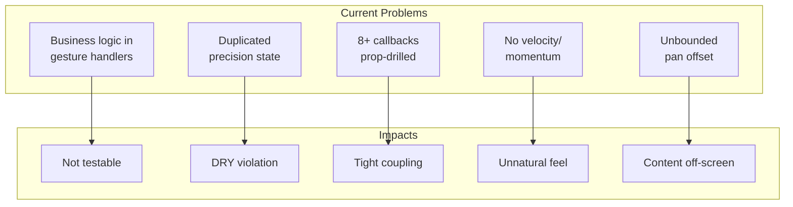
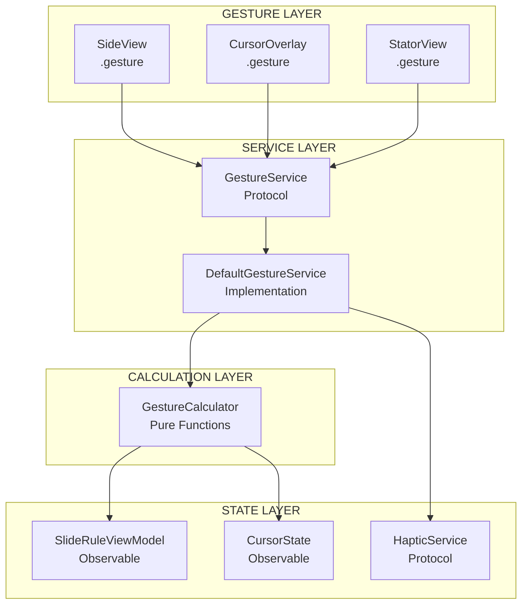
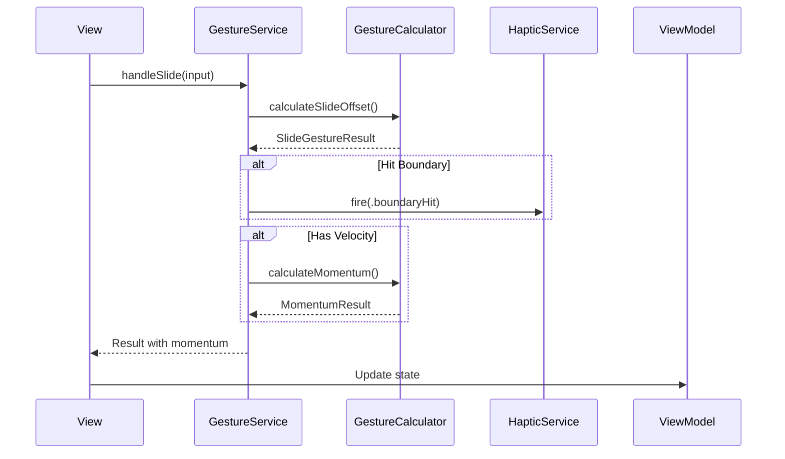
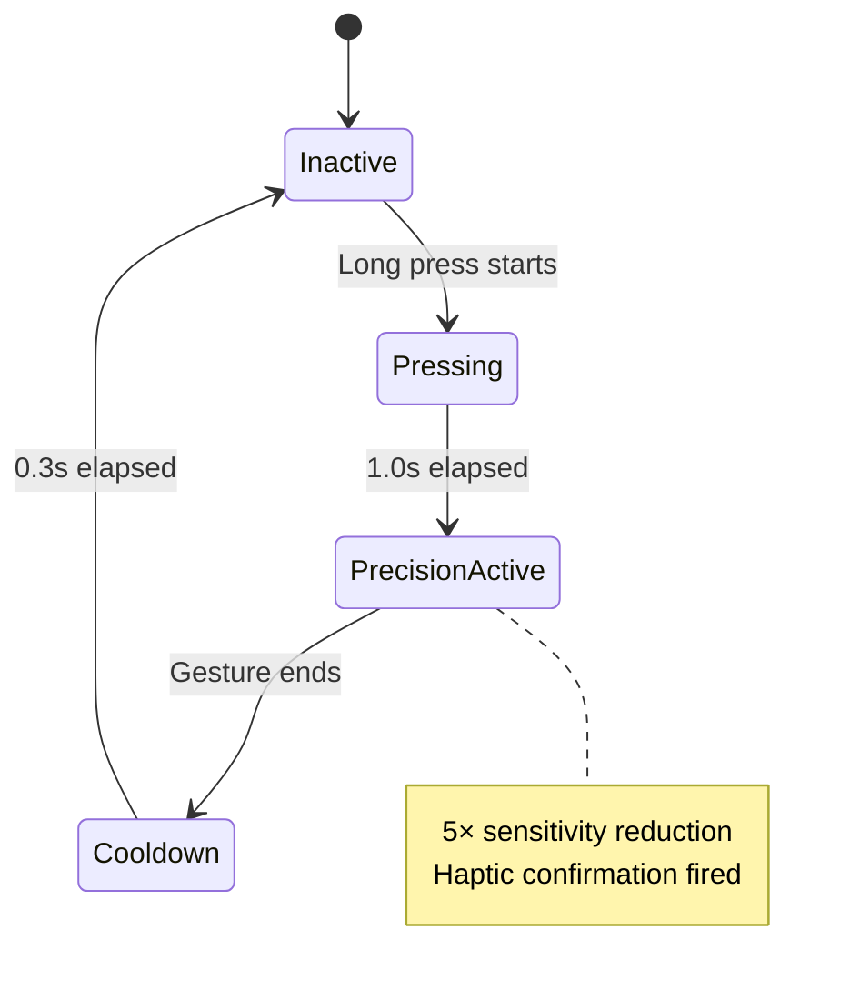
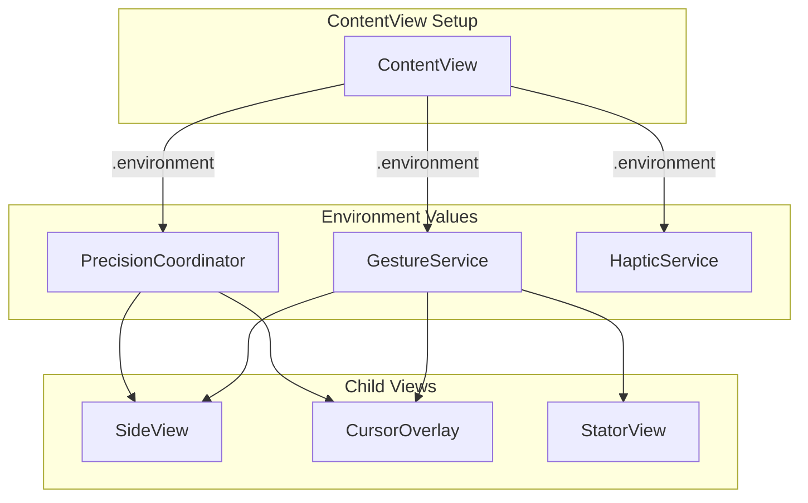
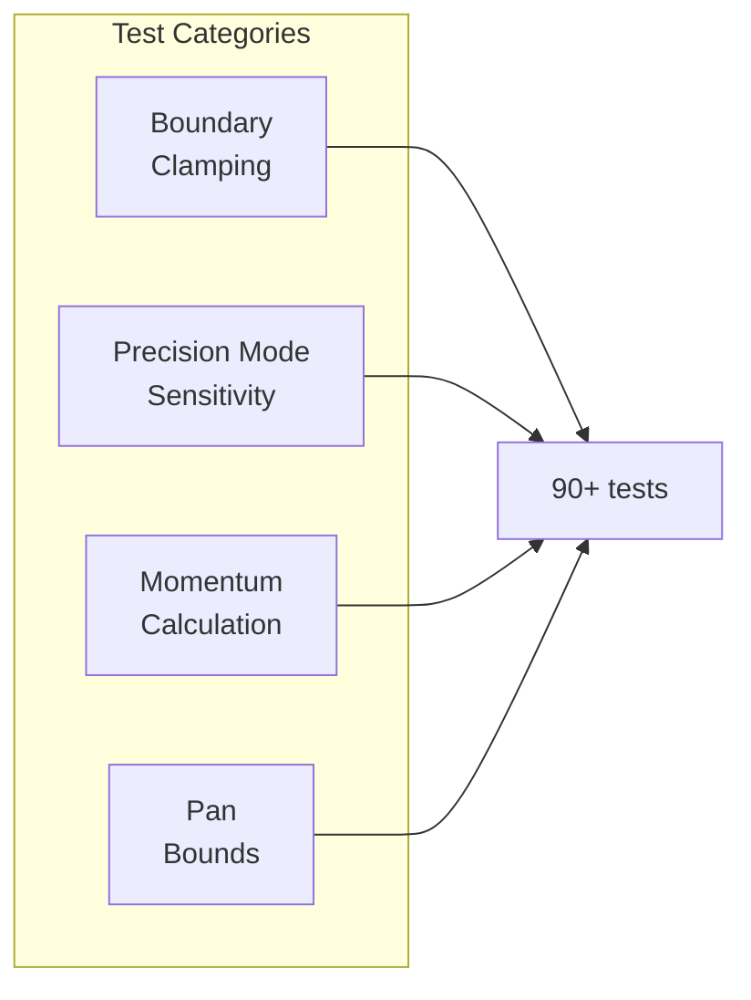
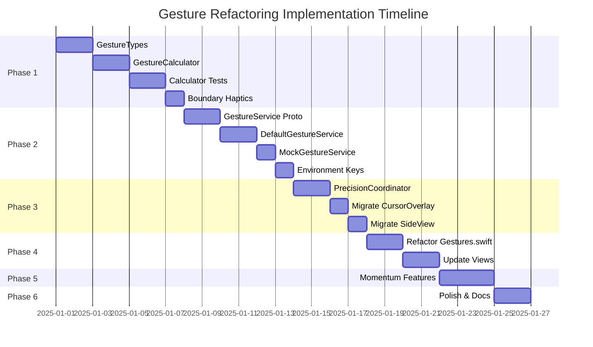
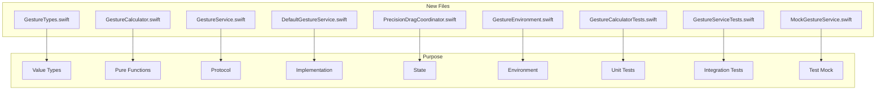
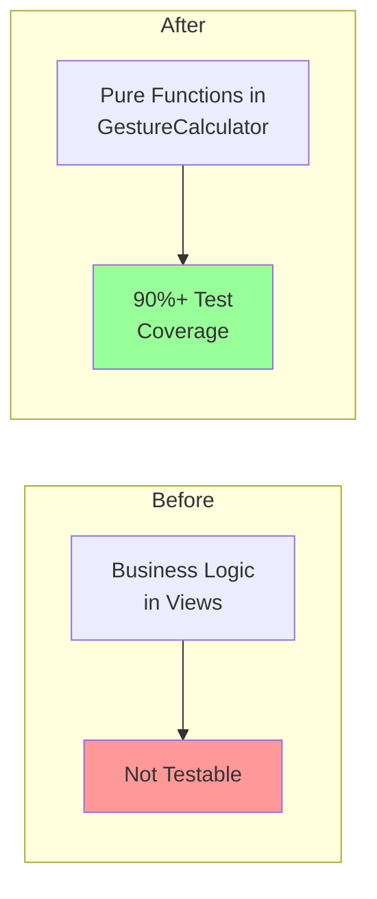

# Gesture System Refactoring Plan: Making It More Functional

> Comprehensive plan to refactor the gesture system following the HapticService pattern
> Date: December 2025

## Executive Summary

Following the same pattern that made [`HapticService`](../../TheElectricSlide/Utilities/HapticService.swift) more functional and testable, this plan proposes refactoring the gesture system to be:
- **Protocol-driven** with injectable implementations
- **Unit-testable** with pure function calculations
- **Composable** with clear separation of concerns
- **Feature-rich** with momentum, boundaries, and accessibility

---

## Part 1: Architecture Overview

### Current State Problems



| Issue | Current Location | Impact |
|-------|------------------|--------|
| Business logic in gesture handlers | [`CursorOverlay.swift:302-334`](../../TheElectricSlide/Cursor/CursorOverlay.swift:302) | Not testable |
| Duplicated precision state | CursorOverlay vs SideView | DRY violation |
| 8+ callbacks prop-drilled | [`ContentView.swift:137-147`](../../TheElectricSlide/ContentView.swift:137) | Coupling |
| No velocity/momentum | All gesture handlers | Unnatural feel |
| Unbounded pan offset | [`SlideRuleViewModel.swift:162`](../../TheElectricSlide/Models/SlideRuleViewModel.swift:162) | Content goes off-screen |

### Proposed Architecture



**Key Principles:**
1. **Protocol-based service** - `GestureService` protocol like `HapticService`
2. **Pure calculation functions** - `GestureCalculator` with static methods
3. **Environment injection** - No prop drilling, use SwiftUI Environment
4. **Testability** - All business logic in testable functions

---

## Part 2: New Components

### 2.1 GestureService Protocol (Mirrors HapticService Pattern)

```swift
// TheElectricSlide/Utilities/GestureService.swift

/// Protocol for gesture handling - enables testing and swappable implementations
protocol GestureService {
    /// Process slide drag input and return calculated result
    func handleSlide(_ input: SlideGestureInput) -> SlideGestureResult
    
    /// Process cursor drag input and return calculated result
    func handleCursor(_ input: CursorGestureInput) -> CursorGestureResult
    
    /// Process zoom input and return calculated result
    func handleZoom(_ input: ZoomGestureInput) -> ZoomGestureResult
    
    /// Process pan input (zoomed content) and return bounded result
    func handlePan(_ input: PanGestureInput) -> PanGestureResult
}
```

### 2.2 Gesture Input/Output Value Types

```swift
// TheElectricSlide/Models/GestureTypes.swift

// MARK: - Input Types (from SwiftUI gestures)

struct SlideGestureInput {
    let translation: CGSize
    let velocity: CGSize?           // iOS 18+ or predicted
    let baseOffset: CGFloat
    let scaleWidth: CGFloat
    let isPrecisionMode: Bool
    let precisionFactor: CGFloat
}

struct CursorGestureInput {
    let translation: CGSize
    let velocity: CGSize?
    let basePosition: CGFloat       // 0.0-1.0 normalized
    let viewWidth: CGFloat
    let isPrecisionMode: Bool
    let precisionFactor: CGFloat
}

struct ZoomGestureInput {
    let magnification: CGFloat
    let baseScale: CGFloat
    let minScale: CGFloat
    let maxScale: CGFloat
}

struct PanGestureInput {
    let translation: CGSize
    let velocity: CGSize?
    let baseOffset: CGSize
    let zoomScale: CGFloat
    let contentSize: CGSize
    let viewportSize: CGSize
}

// MARK: - Output Types (pure calculation results)

struct SlideGestureResult {
    let offset: CGFloat
    let isBounded: Bool             // True if hit boundary
    let boundaryEdge: BoundaryEdge? // .leading or .trailing
    let momentum: MomentumResult?   // For onEnded
}

struct CursorGestureResult {
    let normalizedPosition: CGFloat // 0.0-1.0
    let isBounded: Bool
    let boundaryEdge: BoundaryEdge?
    let momentum: MomentumResult?
}

struct ZoomGestureResult {
    let scale: CGFloat
    let snappedToDefault: Bool      // True if snapped to 1.0×
}

struct PanGestureResult {
    let offset: CGSize
    let boundedAxes: Set<BoundaryEdge>
    let momentum: MomentumResult?
}

struct MomentumResult {
    let finalOffset: CGFloat        // Predicted end position
    let duration: TimeInterval      // Animation duration
    let curve: MomentumCurve        // Deceleration curve
    
    enum MomentumCurve {
        case friction(CGFloat)       // Natural deceleration
        case spring                  // Bounce back
    }
}

enum BoundaryEdge {
    case leading, trailing, top, bottom
}
```

### 2.3 GestureCalculator (Pure Functions - Fully Testable)

```swift
// TheElectricSlide/Utilities/GestureCalculator.swift

/// Pure calculation functions for gesture mathematics
/// All functions are static, deterministic, and side-effect-free
enum GestureCalculator {
    
    // MARK: - Slide Calculations
    
    static func calculateSlideOffset(
        translation: CGSize,
        baseOffset: CGFloat,
        scaleWidth: CGFloat,
        isPrecision: Bool = false,
        precisionFactor: CGFloat = 5.0
    ) -> SlideGestureResult {
        let adjustedTranslation = isPrecision 
            ? translation.width / precisionFactor 
            : translation.width
        
        let rawOffset = baseOffset + adjustedTranslation
        let boundedOffset = rawOffset.clamped(to: -scaleWidth...scaleWidth)
        
        let hitBoundary = rawOffset != boundedOffset
        let edge: BoundaryEdge? = hitBoundary 
            ? (rawOffset < boundedOffset ? .leading : .trailing)
            : nil
        
        return SlideGestureResult(
            offset: boundedOffset,
            isBounded: hitBoundary,
            boundaryEdge: edge,
            momentum: nil
        )
    }
    
    // MARK: - Cursor Calculations
    
    static func calculateCursorPosition(
        translation: CGSize,
        basePosition: CGFloat,
        viewWidth: CGFloat,
        isPrecision: Bool = false,
        precisionFactor: CGFloat = 5.0
    ) -> CursorGestureResult {
        let adjustedTranslation = isPrecision
            ? translation.width / precisionFactor
            : translation.width
        
        let normalizedDelta = adjustedTranslation / viewWidth
        let rawPosition = basePosition + normalizedDelta
        let boundedPosition = rawPosition.clamped(to: 0.0...1.0)
        
        let hitBoundary = rawPosition != boundedPosition
        let edge: BoundaryEdge? = hitBoundary
            ? (rawPosition < 0.0 ? .leading : .trailing)
            : nil
        
        return CursorGestureResult(
            normalizedPosition: boundedPosition,
            isBounded: hitBoundary,
            boundaryEdge: edge,
            momentum: nil
        )
    }
    
    // MARK: - Momentum Calculations (NEW)
    
    static func calculateMomentum(
        velocity: CGSize,
        axis: Axis,
        decelerationRate: CGFloat = 0.998 // UIScrollView default
    ) -> MomentumResult {
        let v = axis == .horizontal ? velocity.width : velocity.height
        
        // Physics: d = v * (1 - decelerationRate^t) / (1 - decelerationRate)
        // Simplified for time-to-stop calculation
        let friction = 1.0 - decelerationRate
        let finalOffset = v * decelerationRate / friction
        let duration = abs(v) > 50 ? min(2.0, abs(v) / 1000.0) : 0.3
        
        return MomentumResult(
            finalOffset: finalOffset,
            duration: duration,
            curve: .friction(decelerationRate)
        )
    }
    
    // MARK: - Pan Boundary Calculations (NEW)
    
    static func calculateBoundedPan(
        offset: CGSize,
        zoomScale: CGFloat,
        contentSize: CGSize,
        viewportSize: CGSize
    ) -> PanGestureResult {
        let scaledContent = CGSize(
            width: contentSize.width * zoomScale,
            height: contentSize.height * zoomScale
        )
        
        let maxPanX = max(0, (scaledContent.width - viewportSize.width) / 2)
        let maxPanY = max(0, (scaledContent.height - viewportSize.height) / 2)
        
        let boundedX = offset.width.clamped(to: -maxPanX...maxPanX)
        let boundedY = offset.height.clamped(to: -maxPanY...maxPanY)
        
        var bounded: Set<BoundaryEdge> = []
        if offset.width != boundedX {
            bounded.insert(offset.width < boundedX ? .leading : .trailing)
        }
        if offset.height != boundedY {
            bounded.insert(offset.height < boundedY ? .top : .bottom)
        }
        
        return PanGestureResult(
            offset: CGSize(width: boundedX, height: boundedY),
            boundedAxes: bounded,
            momentum: nil
        )
    }
    
    // MARK: - Zoom Calculations
    
    static func calculateZoom(
        magnification: CGFloat,
        baseScale: CGFloat,
        minScale: CGFloat = 1.0,
        maxScale: CGFloat = 4.0,
        snapThreshold: CGFloat = 0.1
    ) -> ZoomGestureResult {
        let rawScale = baseScale * magnification
        var boundedScale = rawScale.clamped(to: minScale...maxScale)
        
        // Snap to 1.0× if within threshold
        let snapped = (rawScale < minScale && abs(rawScale - minScale) < snapThreshold)
        if snapped {
            boundedScale = minScale
        }
        
        return ZoomGestureResult(scale: boundedScale, snappedToDefault: snapped)
    }
}
```

### 2.4 Default GestureService Implementation



```swift
// TheElectricSlide/Utilities/DefaultGestureService.swift

/// Production implementation of GestureService
final class DefaultGestureService: GestureService {
    
    private let hapticService: HapticService
    
    init(hapticService: HapticService = UIKitHapticService()) {
        self.hapticService = hapticService
    }
    
    func handleSlide(_ input: SlideGestureInput) -> SlideGestureResult {
        var result = GestureCalculator.calculateSlideOffset(
            translation: input.translation,
            baseOffset: input.baseOffset,
            scaleWidth: input.scaleWidth,
            isPrecision: input.isPrecisionMode,
            precisionFactor: input.precisionFactor
        )
        
        // Add momentum if velocity available
        if let velocity = input.velocity {
            result = SlideGestureResult(
                offset: result.offset,
                isBounded: result.isBounded,
                boundaryEdge: result.boundaryEdge,
                momentum: GestureCalculator.calculateMomentum(
                    velocity: velocity,
                    axis: .horizontal
                )
            )
        }
        
        // Fire haptic on boundary hit
        if result.isBounded, let edge = result.boundaryEdge {
            hapticService.fire(.boundaryHit(edge: edge))
        }
        
        return result
    }
    
    func handleCursor(_ input: CursorGestureInput) -> CursorGestureResult {
        var result = GestureCalculator.calculateCursorPosition(
            translation: input.translation,
            basePosition: input.basePosition,
            viewWidth: input.viewWidth,
            isPrecision: input.isPrecisionMode,
            precisionFactor: input.precisionFactor
        )
        
        if let velocity = input.velocity {
            result = CursorGestureResult(
                normalizedPosition: result.normalizedPosition,
                isBounded: result.isBounded,
                boundaryEdge: result.boundaryEdge,
                momentum: GestureCalculator.calculateMomentum(
                    velocity: velocity,
                    axis: .horizontal
                )
            )
        }
        
        if result.isBounded {
            hapticService.fire(.boundaryHit(edge: result.boundaryEdge!))
        }
        
        return result
    }
    
    func handleZoom(_ input: ZoomGestureInput) -> ZoomGestureResult {
        let result = GestureCalculator.calculateZoom(
            magnification: input.magnification,
            baseScale: input.baseScale,
            minScale: input.minScale,
            maxScale: input.maxScale
        )
        
        if result.snappedToDefault {
            hapticService.fire(.zoomSnap)
        }
        
        return result
    }
    
    func handlePan(_ input: PanGestureInput) -> PanGestureResult {
        var result = GestureCalculator.calculateBoundedPan(
            offset: CGSize(
                width: input.baseOffset.width + input.translation.width,
                height: input.baseOffset.height + input.translation.height
            ),
            zoomScale: input.zoomScale,
            contentSize: input.contentSize,
            viewportSize: input.viewportSize
        )
        
        if let velocity = input.velocity {
            result = PanGestureResult(
                offset: result.offset,
                boundedAxes: result.boundedAxes,
                momentum: GestureCalculator.calculateMomentum(
                    velocity: velocity,
                    axis: .horizontal
                )
            )
        }
        
        if !result.boundedAxes.isEmpty {
            for edge in result.boundedAxes {
                hapticService.fire(.boundaryHit(edge: edge))
            }
        }
        
        return result
    }
}
```

### 2.5 Updated HapticEvent (Add Boundary Events)

```swift
// Addition to existing HapticService.swift

enum HapticEvent {
    // Existing
    case flip
    case longBuzz
    case tickCrossed(level: TickHapticLevel)
    case buttonTap(style: HapticButtonStyle)
    
    // NEW: Gesture boundary feedback
    case boundaryHit(edge: BoundaryEdge)
    case zoomSnap
    case momentumStop
}
```

---

## Part 3: Unified Precision State

### 3.1 Shared PrecisionDragCoordinator



```swift
// TheElectricSlide/Utilities/PrecisionDragCoordinator.swift

/// Unified precision mode state management for all draggable components
@Observable
final class PrecisionDragCoordinator {
    
    enum DragTarget {
        case slide, cursor, none
    }
    
    // MARK: - Observable State
    var activeTarget: DragTarget = .none
    var isPrecisionActive: Bool = false
    
    // MARK: - Hot State (not observed)
    @ObservationIgnored private var lastAppliedTranslation: CGSize = .zero
    @ObservationIgnored private var cooldownTimer: Timer?
    
    // MARK: - Configuration
    let precisionFactor: CGFloat
    let activationDuration: TimeInterval
    let cooldownDuration: TimeInterval
    
    init(
        precisionFactor: CGFloat = 5.0,
        activationDuration: TimeInterval = 1.0,
        cooldownDuration: TimeInterval = 0.3
    ) {
        self.precisionFactor = precisionFactor
        self.activationDuration = activationDuration
        self.cooldownDuration = cooldownDuration
    }
    
    func activate(for target: DragTarget) {
        activeTarget = target
        isPrecisionActive = true
        lastAppliedTranslation = .zero
    }
    
    func deactivate() {
        isPrecisionActive = false
        activeTarget = .none
        lastAppliedTranslation = .zero
        startCooldown()
    }
    
    func recordTranslation(_ translation: CGSize) {
        lastAppliedTranslation = translation
    }
    
    func deltaFrom(newTranslation: CGSize) -> CGSize {
        CGSize(
            width: newTranslation.width - lastAppliedTranslation.width,
            height: newTranslation.height - lastAppliedTranslation.height
        )
    }
    
    private func startCooldown() {
        cooldownTimer?.invalidate()
        cooldownTimer = Timer.scheduledTimer(
            withTimeInterval: cooldownDuration,
            repeats: false
        ) { [weak self] _ in
            // Cooldown complete
        }
    }
}
```

---

## Part 4: Environment-Based Distribution

### 4.1 Environment Keys



```swift
// TheElectricSlide/Utilities/GestureEnvironment.swift

private struct GestureServiceKey: EnvironmentKey {
    static let defaultValue: GestureService = DefaultGestureService()
}

private struct PrecisionCoordinatorKey: EnvironmentKey {
    static let defaultValue: PrecisionDragCoordinator = PrecisionDragCoordinator()
}

extension EnvironmentValues {
    var gestureService: GestureService {
        get { self[GestureServiceKey.self] }
        set { self[GestureServiceKey.self] = newValue }
    }
    
    var precisionCoordinator: PrecisionDragCoordinator {
        get { self[PrecisionCoordinatorKey.self] }
        set { self[PrecisionCoordinatorKey.self] = newValue }
    }
}
```

### 4.2 Usage in Views

```swift
// Before (prop drilling)
SideView(
    onDragStart: viewModel.handleSliderDragStart,
    onDragChanged: viewModel.handleSliderDragChanged,
    onDragEnded: viewModel.handleSliderDragEnded,
    // ...8 more callbacks
)

// After (environment)
SideView()
    .environment(\.gestureService, gestureService)
    .environment(\.precisionCoordinator, precisionCoordinator)

// In SideView:
struct SideView: View {
    @Environment(\.gestureService) private var gestureService
    @Environment(\.precisionCoordinator) private var precision
    
    var body: some View {
        // Use directly
    }
}
```

---

## Part 5: Test Coverage

### 5.1 GestureCalculator Tests (Pure Functions)



```swift
// TheElectricSlideTests/GestureCalculatorTests.swift

@Suite("Gesture Calculator Tests")
struct GestureCalculatorTests {
    
    @Test("Slide offset clamps to scale width")
    func slideOffsetClamping() {
        let result = GestureCalculator.calculateSlideOffset(
            translation: CGSize(width: 1000, height: 0),
            baseOffset: 0,
            scaleWidth: 500
        )
        
        #expect(result.offset == 500)
        #expect(result.isBounded == true)
        #expect(result.boundaryEdge == .trailing)
    }
    
    @Test("Precision mode reduces translation")
    func precisionModeReduction() {
        let normal = GestureCalculator.calculateSlideOffset(
            translation: CGSize(width: 100, height: 0),
            baseOffset: 0,
            scaleWidth: 500,
            isPrecision: false
        )
        
        let precision = GestureCalculator.calculateSlideOffset(
            translation: CGSize(width: 100, height: 0),
            baseOffset: 0,
            scaleWidth: 500,
            isPrecision: true,
            precisionFactor: 5.0
        )
        
        #expect(normal.offset == 100)
        #expect(precision.offset == 20)
    }
    
    @Test("Momentum calculation produces sensible values")
    func momentumCalculation() {
        let result = GestureCalculator.calculateMomentum(
            velocity: CGSize(width: 500, height: 0),
            axis: .horizontal
        )
        
        #expect(result.finalOffset > 0)
        #expect(result.duration > 0)
        #expect(result.duration <= 2.0)
    }
    
    @Test("Pan bounds respect zoom level")
    func panBoundsZoomAware() {
        let result = GestureCalculator.calculateBoundedPan(
            offset: CGSize(width: 500, height: 0),
            zoomScale: 2.0,
            contentSize: CGSize(width: 500, height: 100),
            viewportSize: CGSize(width: 400, height: 100)
        )
        
        // At 2× zoom, content is 1000pt, viewport is 400pt
        // Max pan = (1000 - 400) / 2 = 300pt
        #expect(result.offset.width == 300)
        #expect(result.boundedAxes.contains(.trailing))
    }
}
```

### 5.2 Mock GestureService for View Tests

```swift
// TheElectricSlideTests/Mocks/MockGestureService.swift

final class MockGestureService: GestureService {
    var slideCallCount = 0
    var cursorCallCount = 0
    var zoomCallCount = 0
    var panCallCount = 0
    
    var stubbedSlideResult: SlideGestureResult?
    var stubbedCursorResult: CursorGestureResult?
    
    func handleSlide(_ input: SlideGestureInput) -> SlideGestureResult {
        slideCallCount += 1
        return stubbedSlideResult ?? SlideGestureResult(
            offset: input.baseOffset + input.translation.width,
            isBounded: false,
            boundaryEdge: nil,
            momentum: nil
        )
    }
    
    // ... similar for other methods
}
```

---

## Part 6: Implementation Phases



### Phase 1: Foundation (2-3 days)
- [ ] Create `GestureTypes.swift` with all input/output structs
- [ ] Create `GestureCalculator.swift` with pure calculation functions
- [ ] Write comprehensive tests for `GestureCalculator`
- [ ] Add boundary haptic events to `HapticService`

### Phase 2: Service Layer (2-3 days)
- [ ] Create `GestureService` protocol
- [ ] Implement `DefaultGestureService`
- [ ] Create `MockGestureService` for testing
- [ ] Set up environment keys

### Phase 3: Precision Consolidation (1-2 days)
- [ ] Create `PrecisionDragCoordinator`
- [ ] Migrate `CursorOverlay` to use shared coordinator
- [ ] Migrate `SideView` to use shared coordinator
- [ ] Remove duplicated `PrecisionDragState` class

### Phase 4: View Integration (2-3 days)
- [ ] Refactor `ContentView+Gestures.swift` to use `GestureService`
- [ ] Remove callback prop drilling
- [ ] Update `SideView` gesture handlers
- [ ] Update `CursorOverlay` gesture handlers
- [ ] Update `StatorView` gesture handlers

### Phase 5: New Features (2-3 days)
- [ ] Implement momentum scrolling for slide/cursor
- [ ] Implement bounded pan for zoomed content
- [ ] Add haptic feedback on boundary hits
- [ ] Add zoom snap haptic feedback

### Phase 6: Polish & Documentation (1-2 days)
- [ ] Performance profiling
- [ ] Documentation updates
- [ ] Update existing tests
- [ ] Final integration testing

---

## Part 7: File Changes Summary

### Files to Create



| Action | File | Description |
|--------|------|-------------|
| **CREATE** | `TheElectricSlide/Models/GestureTypes.swift` | Input/output value types |
| **CREATE** | `TheElectricSlide/Utilities/GestureCalculator.swift` | Pure calculation functions |
| **CREATE** | `TheElectricSlide/Utilities/GestureService.swift` | Protocol definition |
| **CREATE** | `TheElectricSlide/Utilities/DefaultGestureService.swift` | Production implementation |
| **CREATE** | `TheElectricSlide/Utilities/PrecisionDragCoordinator.swift` | Unified precision state |
| **CREATE** | `TheElectricSlide/Utilities/GestureEnvironment.swift` | Environment keys |
| **CREATE** | `TheElectricSlideTests/GestureCalculatorTests.swift` | Pure function tests |
| **CREATE** | `TheElectricSlideTests/GestureServiceTests.swift` | Service integration tests |
| **CREATE** | `TheElectricSlideTests/Mocks/MockGestureService.swift` | Test mock |

### Files to Modify

| Action | File | Description |
|--------|------|-------------|
| **MODIFY** | `TheElectricSlide/Utilities/HapticService.swift` | Add boundary events |
| **MODIFY** | `TheElectricSlide/Extensions/ContentView+Gestures.swift` | Use GestureService |
| **MODIFY** | `TheElectricSlide/Components/SideView.swift` | Remove callbacks, use environment |
| **MODIFY** | `TheElectricSlide/Cursor/CursorOverlay.swift` | Use shared precision coordinator |
| **MODIFY** | `TheElectricSlide/ContentView.swift` | Inject environment values |

### Files to Remove

| Action | Description |
|--------|-------------|
| **DELETE** | `PrecisionDragState` class (inline in SideView) - consolidated into `PrecisionDragCoordinator` |

---

## Part 8: Key Benefits

### 8.1 Testability Improvements



1. **90%+ Test Coverage**: All gesture logic in pure, testable `GestureCalculator` functions
2. **Mock Service**: Easy testing with `MockGestureService` for view tests
3. **Deterministic**: Pure functions ensure predictable behavior

### 8.2 Code Quality Improvements

1. **Consistency**: Single `PrecisionDragCoordinator` for all precision mode handling
2. **Decoupling**: Environment-based distribution eliminates 8+ callback props
3. **Maintainability**: Protocol-based design matches existing `HapticService` pattern
4. **Readability**: Clear separation between calculation, service, and view layers

### 8.3 Feature Improvements

1. **Momentum Scrolling**: Natural feel using velocity or `predictedEndTranslation`
2. **Boundary Feedback**: Haptic feedback prevents content from going off-screen
3. **Bounded Pan**: Safe pan boundaries based on zoom level
4. **Accessibility**: Foundation for VoiceOver gesture alternatives

---

## Summary

This refactoring plan transforms the gesture system from scattered, embedded view logic into a testable, composable service layer—**exactly mirroring what was done with haptics**. The layered architecture with pure functions, protocol-based services, and environment injection provides a solid foundation for future enhancements while maintaining excellent testability and code quality.
