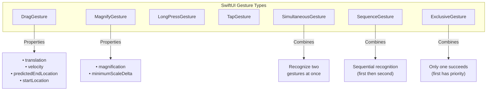
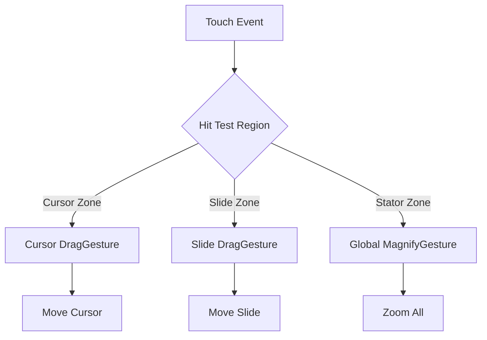
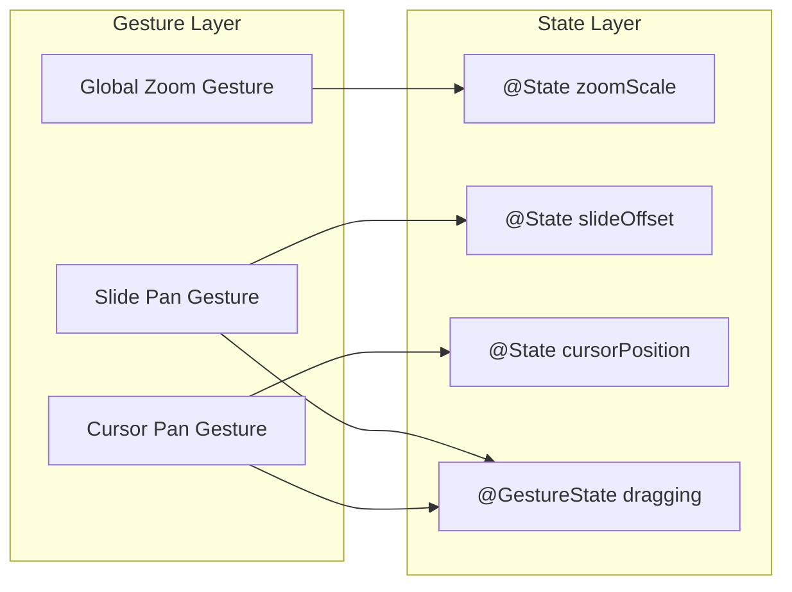

# SwiftUI Gesture System Research Summary

> Research findings for "The Electric Slide" slide rule app gesture system improvements
> Date: December 2025

## 1. Key APIs and Their Capabilities

### Core Gesture Types



| Gesture | Purpose | Key Properties | Min iOS |
|---------|---------|----------------|---------|
| [`DragGesture`](https://developer.apple.com/documentation/swiftui/draggesture) | Tracks dragging motion | `translation`, `velocity`, `predictedEndLocation`, `predictedEndTranslation`, `startLocation`, `location` | iOS 13+ |
| [`MagnifyGesture`](https://developer.apple.com/documentation/swiftui/magnifygesture) | Pinch-to-zoom | `magnification`, `minimumScaleDelta` | iOS 17+ |
| [`MagnificationGesture`](https://developer.apple.com/documentation/swiftui/magnificationgesture) | Legacy pinch (pre-iOS 17) | Similar to MagnifyGesture | iOS 13+ |
| [`SimultaneousGesture`](https://developer.apple.com/documentation/swiftui/simultaneousgesture) | Recognize two gestures at once | Combines `first` and `second` gestures | iOS 13+ |
| [`SequenceGesture`](https://developer.apple.com/documentation/swiftui/sequencegesture) | Sequential gesture recognition | First must complete before second starts | iOS 13+ |
| [`ExclusiveGesture`](https://developer.apple.com/documentation/swiftui/exclusivegesture) | Only one gesture succeeds | First gesture has precedence | iOS 13+ |

### DragGesture.Value Properties (Critical for Slide Rule)

```swift
struct DragGesture.Value {
    var startLocation: CGPoint      // Where drag began
    var location: CGPoint           // Current finger position
    var translation: CGSize         // Total distance moved
    var velocity: CGSize            // Speed in points/second (iOS 18+)
    var predictedEndLocation: CGPoint    // Predicted final position
    var predictedEndTranslation: CGSize  // Predicted final translation
    var time: Date                  // Timestamp
}
```

### State Management APIs

```mermaid
graph LR
    subgraph "State Types"
        GS[@GestureState]
        ST[@State]
        UP[.updating]
        OC[.onChanged]
        OE[.onEnded]
    end
    
    GS -->|Auto-reset| GSUSE[Transient gesture<br/>tracking]
    ST -->|Manual| STUSE[Persistent<br/>position state]
    UP -->|Updates| GS
    OC -->|Called on| ST
    OE -->|Called on| GSEND[Gesture<br/>completion]
```

| API | Purpose | Auto-Reset | Usage |
|-----|---------|------------|-------|
| [`@GestureState`](https://developer.apple.com/documentation/swiftui/gesturestate) | Transient gesture tracking | Yes, on gesture end | Drag offset during gesture |
| `@State` | Persistent position state | No | Final position after gesture |
| `.updating(_:body:)` | Updates GestureState during gesture | N/A | Continuous feedback |
| `.onChanged(_:)` | Called on every gesture update | N/A | Update UI |
| `.onEnded(_:)` | Called when gesture completes | N/A | Finalize state |

---

## 2. Best Practices for Gesture Handling in Precision Apps

### Human Interface Guidelines Key Points

1. **Respond responsively** - Provide immediate visual feedback during gestures
2. **Indicate unavailable gestures** - Clearly show when a gesture won't work
3. **Support multiple input methods** - Don't require specific gestures exclusively
4. **Consider simultaneous gestures** - For tools like slide rules, allow pinch+drag
5. **Provide haptic feedback** - Confirm actions with tactile response

### Precision App Recommendations

```swift
// For precision control, use coordinate spaces wisely
DragGesture(minimumDistance: 0, coordinateSpace: .local)
    .onChanged { value in
        // Use .local for relative movement within component
        // Use .global for screen-absolute positioning
    }
```

**Key considerations for slide rule app:**
- Use `.local` coordinate space for slide/cursor movement relative to stator
- Track initial touch position to distinguish stator vs slide vs cursor touches
- Consider `minimumDistance: 0` for immediate response in precision mode

---

## 3. Patterns for Gesture Composition

### Simultaneous Drag + Magnify (Pinch-to-zoom while dragging)

```swift
var body: some View {
    slideRuleView
        .gesture(
            SimultaneousGesture(
                DragGesture()
                    .onChanged { handleDrag($0) }
                    .onEnded { endDrag($0) },
                MagnifyGesture()
                    .onChanged { handleZoom($0) }
                    .onEnded { endZoom($0) }
            )
        )
}
```

### Priority-Based Gesture Selection

```swift
// High priority gesture takes precedence over child gestures
containerView
    .highPriorityGesture(
        DragGesture()
            .onChanged { /* handles first */ }
    )

// Simultaneous gesture allows both to fire
containerView
    .simultaneousGesture(
        TapGesture()
            .onEnded { /* fires alongside other gestures */ }
    )
```

### Region-Based Gesture Discrimination



**Implementation pattern for slide rule regions:**

```swift
struct SlideRuleGestureHandler: View {
    @State private var activeElement: SlideRuleElement?
    
    var body: some View {
        ZStack {
            StatorView()
            SlideView()
                .gesture(slideDragGesture)
            CursorView()
                .gesture(cursorDragGesture)
        }
        .simultaneousGesture(zoomGesture)
    }
    
    var slideDragGesture: some Gesture {
        DragGesture(coordinateSpace: .local)
            .updating($isDragging) { value, state, _ in
                state = true
            }
            .onChanged { value in
                slideOffset += value.translation.width
            }
    }
}
```

---

## 4. Velocity/Momentum Handling Techniques

### Using Built-in Velocity (iOS 18+)

```swift
DragGesture()
    .onEnded { value in
        let velocity = value.velocity  // CGSize in points/second
        
        // Apply momentum-based animation
        withAnimation(.spring(
            response: 0.5,
            dampingFraction: 0.7,
            blendDuration: 0
        )) {
            // Calculate final position based on velocity
            offset += velocity.width * 0.3  // Adjust multiplier for feel
        }
    }
```

### Using predictedEndTranslation (Pre-iOS 18)

```swift
DragGesture()
    .onEnded { value in
        // predictedEndTranslation accounts for current velocity
        if abs(value.predictedEndTranslation.width) > 200 {
            // High velocity - continue in direction
            withAnimation(.easeOut(duration: 0.3)) {
                offset += value.predictedEndTranslation.width
            }
        } else {
            // Low velocity - snap to position
            withAnimation(.spring()) {
                offset = snapToNearestPosition(offset)
            }
        }
    }
```

### Spring Animation with Velocity Preservation (WWDC24 Pattern)

```swift
// From WWDC24 "Enhance your UI animations and transitions"
DragGesture()
    .onChanged { value in
        // Use interactiveSpring during drag for smooth tracking
        withAnimation(.interactiveSpring) {
            position = value.location
        }
    }
    .onEnded { value in
        // SwiftUI automatically preserves velocity from interactiveSpring
        withAnimation(.spring) {
            position = finalPosition
        }
    }
```

---

## 5. State Management Approaches

### Pattern 1: GestureState for Transient + State for Persistent

```swift
struct SlideRuleView: View {
    // Persistent - survives gesture end
    @State private var slideOffset: CGFloat = 0
    @State private var cursorPosition: CGFloat = 0
    @State private var zoomScale: CGFloat = 1.0
    
    // Transient - auto-resets when gesture ends
    @GestureState private var dragOffset: CGFloat = 0
    @GestureState private var isDragging: Bool = false
    
    var body: some View {
        SlideView()
            .offset(x: slideOffset + dragOffset)  // Combine both
            .gesture(
                DragGesture()
                    .updating($dragOffset) { value, state, _ in
                        state = value.translation.width
                    }
                    .onEnded { value in
                        slideOffset += value.translation.width
                    }
            )
    }
}
```

### Pattern 2: Enum-Based State Machine (Complex Interactions)

```swift
enum DragState {
    case inactive
    case pressing
    case dragging(translation: CGSize)
    
    var translation: CGSize {
        switch self {
        case .inactive, .pressing: return .zero
        case .dragging(let translation): return translation
        }
    }
    
    var isActive: Bool {
        switch self {
        case .inactive: return false
        case .pressing, .dragging: return true
        }
    }
}

struct PrecisionDragView: View {
    @GestureState private var dragState = DragState.inactive
    @State private var viewState = CGSize.zero
    
    var body: some View {
        let longPressDrag = LongPressGesture(minimumDuration: 0.5)
            .sequenced(before: DragGesture())
            .updating($dragState) { value, state, _ in
                switch value {
                case .first(true):
                    state = .pressing
                case .second(true, let drag):
                    state = .dragging(translation: drag?.translation ?? .zero)
                default:
                    state = .inactive
                }
            }
        // ... rest of implementation
    }
}
```

---

## 6. Relevant WWDC Sessions and Official Guides

### Essential WWDC Sessions

| Year | Session | Key Topics | Link |
|------|---------|------------|------|
| **WWDC24** | Enhance your UI animations and transitions (10145) | Velocity preservation, gesture-driven animations, spring animations | [Watch](https://developer.apple.com/videos/play/wwdc2024/10145/) |
| **WWDC24** | What's new in SwiftUI (10144) | `UIGestureRecognizerRepresentable`, gesture improvements | [Watch](https://developer.apple.com/videos/play/wwdc2024/10144/) |
| **WWDC24** | Create custom visual effects (10151) | KeyframeAnimator with gestures | [Watch](https://developer.apple.com/videos/play/wwdc2024/10151/) |
| **WWDC23** | Wind your way through advanced animations (10157) | Keyframe animations, velocity continuity | [Watch](https://developer.apple.com/videos/play/wwdc2023/10157/) |

### Official Documentation

- [Composing SwiftUI Gestures](https://developer.apple.com/documentation/swiftui/composing-swiftui-gestures) - Apple's guide to gesture composition
- [Human Interface Guidelines: Gestures](https://developer.apple.com/design/human-interface-guidelines/gestures) - Design principles
- [Recognizing Gestures Tutorial](https://developer.apple.com/tutorials/sample-apps/recognizinggestures) - Sample code

---

## 7. Community Patterns and Advanced Techniques

### UIGestureRecognizerRepresentable (iOS 18+)

For complex gestures not available in pure SwiftUI:

```swift
struct InstantPanGesture: UIGestureRecognizerRepresentable {
    @Binding var offset: CGSize
    var onChanged: (CGSize) -> Void
    var onEnded: (CGSize) -> Void
    
    func makeUIGestureRecognizer(context: Context) -> UIPanGestureRecognizer {
        let recognizer = UIPanGestureRecognizer(
            target: context.coordinator,
            action: #selector(Coordinator.handlePan(_:))
        )
        recognizer.minimumNumberOfTouches = 1
        recognizer.maximumNumberOfTouches = 1
        return recognizer
    }
    
    func makeCoordinator() -> Coordinator {
        Coordinator(self)
    }
    
    class Coordinator: NSObject {
        var parent: InstantPanGesture
        
        init(_ parent: InstantPanGesture) {
            self.parent = parent
        }
        
        @objc func handlePan(_ recognizer: UIPanGestureRecognizer) {
            let translation = recognizer.translation(in: recognizer.view)
            let size = CGSize(width: translation.x, height: translation.y)
            
            switch recognizer.state {
            case .changed:
                parent.onChanged(size)
            case .ended:
                parent.onEnded(size)
            default:
                break
            }
        }
    }
}
```

### Third-Party Library: swiftui-gesture-velocity

For pre-iOS 18 velocity support:
- GitHub: [FluidGroup/swiftui-gesture-velocity](https://github.com/FluidGroup/swiftui-gesture-velocity)
- Provides `@GestureVelocity` property wrapper

### SwiftUI Introspect for Complex Cases

For accessing underlying UIKit when pure SwiftUI insufficient:
- Use for complex gesture delegate configurations
- Access `UIScrollView` underlying SwiftUI `ScrollView`
- Configure `shouldRecognizeSimultaneouslyWith`

---

## 8. Recommendations for The Electric Slide

### Gesture Architecture



### Recommended Implementation Strategy

1. **Use `MagnifyGesture`** for zoom (iOS 17+) with `.simultaneousGesture()`
2. **Separate `DragGesture`** instances for slide and cursor
3. **Hit-test based discrimination** using `.local` coordinate space
4. **Combine `@GestureState`** (for drag feedback) with `@State` (for final position)
5. **Leverage `predictedEndTranslation`** for momentum scrolling feel
6. **Consider `UIGestureRecognizerRepresentable`** if SwiftUI gestures conflict with precision requirements

### Performance Tips

- Avoid heavy computation in `.onChanged` - defer to `.onEnded` when possible
- Use `@GestureState` over `@State` for transient values (automatic cleanup)
- Consider `.highPriorityGesture()` for cursor interaction priority
- Test on device for accurate haptic and gesture timing
