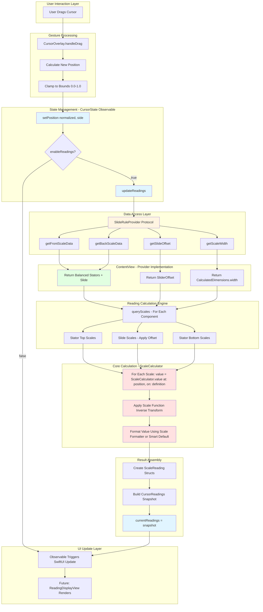

# Glass Cursor Architecture for The Electric Slide

## Executive Summary

This document defines the architecture for a slidable glass cursor component that overlays the slide rule scales, utilizing Apple's Liquid Glass material from OS 26. The design prioritizes a **single shared cursor** approach (synchronized across both sides) while maintaining architectural flexibility to support independent or active-side-only cursor modes in the future.

---

## 1. Architectural Overview

### 1.1 Core Design Principles

1. **Separation of Concerns**: Cursor component is independent of slide rule rendering
2. **Gesture Priority**: Cursor gestures block underlying slide drag events
3. **Responsive Design**: Cursor adapts to dynamic layout changes
4. **Performance First**: Minimal impact on existing Canvas rendering pipeline
5. **OS 26 Integration**: Leverage Liquid Glass for authentic material appearance

### 1.2 Component Hierarchy

```
ContentView (root)
├── ViewMode Picker
└── VStack (main content)
    ├── SideView (front) [if visible]
    │   ├── StatorView (top)
    │   ├── SlideView (middle, draggable)
    │   └── StatorView (bottom)
    │   └── CursorOverlay ← NEW (layered above)
    │
    └── SideView (back) [if visible]
        ├── StatorView (top)
        ├── SlideView (middle, draggable)
        └── StatorView (bottom)
        └── CursorOverlay ← NEW (layered above)
```

### 1.3 Component Diagram

```
┌─────────────────────────────────────────────────────────┐
│                    ContentView                           │
│  ┌─────────────────────────────────────────────────┐   │
│  │              CursorState (@Observable)           │   │
│  │  • normalizedPosition: Double (0.0-1.0)         │   │
│  │  • cursorMode: CursorMode (.shared/.independent)│   │
│  │  • isEnabled: Bool                               │   │
│  └─────────────────────────────────────────────────┘   │
│                           ↓                              │
│  ┌─────────────────────────────────────────────────┐   │
│  │                  SideView                        │   │
│  │  ┌─────────────────────────────────────────┐   │   │
│  │  │         Scale Rendering Stack            │   │
│  │  │  • StatorView (top)                      │   │
│  │  │  • SlideView (draggable)                 │   │
│  │  │  • StatorView (bottom)                   │   │
│  │  └─────────────────────────────────────────┘   │   │
│  │                   .overlay()                     │   │
│  │  ┌─────────────────────────────────────────┐   │   │
│  │  │          CursorOverlay                   │   │
│  │  │  ┌───────────────────────────────────┐  │   │
│  │  │  │   GlassEffectContainer            │  │   │
│  │  │  │    └─ CursorView                  │  │   │
│  │  │  │       • Glass rectangle           │  │   │
│  │  │  │       • Hairline indicator        │  │   │
│  │  │  │       • DragGesture (high prio)   │  │   │
│  │  │  └───────────────────────────────────┘  │   │
│  │  └─────────────────────────────────────────┘   │   │
│  └─────────────────────────────────────────────────┘   │
└─────────────────────────────────────────────────────────┘
```

---

## 2. State Management Architecture

### 2.1 Position Storage Strategy

**Decision: Normalized Position (0.0-1.0)**

**Rationale:**
- **Responsive Layout**: Automatically adapts to dimension changes
- **Side Synchronization**: Same normalized value applies to both front/back
- **Bounds Consistency**: Natural clamping to [0.0, 1.0] range
- **Scale Independence**: Position remains valid across different scale widths

**Alternative Considered:**
- Absolute CGFloat position - rejected due to responsive layout complexity

### 2.2 State Model

```swift
@Observable
final class CursorState {
    // Core position (0.0 = left edge, 1.0 = right edge)
    var normalizedPosition: Double = 0.5
    
    // Cursor behavior mode
    var cursorMode: CursorMode = .shared
    
    // Enable/disable cursor visibility
    var isEnabled: Bool = true
    
    // Per-side positions (for independent mode)
    private var frontPosition: Double = 0.5
    private var backPosition: Double = 0.5
    
    // MARK: - Position Access
    
    func position(for side: RuleSide?) -> Double {
        switch cursorMode {
        case .shared:
            return normalizedPosition
        case .independent:
            return side == .front ? frontPosition : backPosition
        case .activeSideOnly:
            return normalizedPosition
        }
    }
    
    func setPosition(_ position: Double, for side: RuleSide?) {
        let clamped = min(max(position, 0.0), 1.0)
        
        switch cursorMode {
        case .shared:
            normalizedPosition = clamped
        case .independent:
            if side == .front {
                frontPosition = clamped
            } else {
                backPosition = clamped
            }
        case .activeSideOnly:
            normalizedPosition = clamped
        }
    }
    
    // Convert normalized to absolute position
    func absolutePosition(width: CGFloat, side: RuleSide? = nil) -> CGFloat {
        position(for: side) * width
    }
}

enum CursorMode {
    case shared          // Single cursor, synchronized across sides
    case independent     // Separate cursor per side
    case activeSideOnly  // Cursor only on most recent side
}
```

### 2.3 State Ownership

- **ContentView** owns the `CursorState` as `@State`
- **SideView** receives `CursorState` as parameter (not binding)
- **CursorOverlay** observes `CursorState` directly (via environment or parameter)

**Why not @Binding?**
- Observable pattern provides better performance
- Avoids unnecessary view updates
- Cleaner dependency graph

---

## 3. Gesture Handling Architecture

### 3.1 Event Propagation Strategy

**Challenge**: Prevent cursor drag from triggering slide drag.

**Solution**: SwiftUI gesture priority with explicit event blocking.

```swift
// In CursorOverlay
.gesture(
    DragGesture(minimumDistance: 0)
        .onChanged { gesture in
            handleCursorDrag(gesture)
        }
        .onEnded { gesture in
            handleCursorDragEnd(gesture)
        },
    including: .all  // Capture all gesture events
)
// This gesture has HIGHER priority because it's on overlay layer
```

**Key Architectural Points:**

1. **Z-Order Priority**: Cursor overlay is above slide in Z-order
2. **Gesture Locality**: SwiftUI gestures are view-local by default
3. **No Simultaneous Gestures**: Slide gesture doesn't need `.simultaneously()`
4. **Clean Separation**: No coordination needed between cursor/slide gestures

### 3.2 Gesture Flow

```
User Touch on Cursor Area
         ↓
   Hit Test (Z-order)
         ↓
    CursorOverlay  ← Gesture captured here
         ↓
  Update CursorState
         ↓
    Render Update
         
SlideView.gesture() ← Never receives event
```

### 3.3 Bounds Enforcement

```swift
private func handleCursorDrag(_ gesture: DragGesture.Value, 
                              width: CGFloat, 
                              side: RuleSide?) {
    let startPos = cursorState.absolutePosition(width: width, side: side)
    let newPos = startPos + gesture.translation.width
    
    // Clamp to bounds [0, width]
    let clampedPos = min(max(newPos, 0), width)
    
    // Convert back to normalized
    let normalized = clampedPos / width
    
    cursorState.setPosition(normalized, for: side)
}
```

---

## 4. Liquid Glass Integration

### 4.1 Glass Effect Selection

**Chosen Variant: `.glassEffect(.clear)`**

**Rationale:**
- Maximum transparency for unobstructed scale reading
- Subtle presence that doesn't dominate visual hierarchy
- Matches traditional slide rule cursor aesthetic (transparent cursor)

**Visual Enhancement Strategy:**
- Add subtle dimming layer (semi-transparent black at 5-10% opacity)
- Provides just enough contrast for visibility
- Maintains "invisible but present" cursor philosophy

### 4.2 Glass Material Structure

```swift
// Cursor body glass application
Rectangle()
    .fill(.black.opacity(0.08))  // Subtle dimming for .clear variant
    .glassEffect(.clear)
    .interactive()  // Respond to hover/touch
    .frame(width: cursorWidth)
```

### 4.3 Performance Optimization

**Decision: Use `GlassEffectContainer`**

**When to Apply:**
- `.both` view mode (2 cursors = 2 glass effects)
- Future independent cursor mode (2+ glass effects)

**Implementation:**

```swift
// In SideView or ContentView
.backgroundStyle(GlassEffectContainerBackgroundStyle())

// Each CursorOverlay then uses:
.glassEffect(.clear)
```

**Performance Benefit:**
- Shared rendering context for multiple glass effects
- Reduces GPU overhead
- Maintains 60fps during drag operations

### 4.4 Hairline Indicator Design

**Visual Treatment:**

```swift
// Vertical hairline down center of cursor
Rectangle()
    .fill(.primary)  // Adapts to light/dark mode
    .frame(width: 1)  // True 1pt line
    .opacity(0.6)    // Subtle but visible
    .blendMode(.plusDarker)  // Ensures visibility over glass
```

**Positioning:**
- Centered horizontally within cursor rectangle
- Spans full vertical height of visible scales
- Not affected by glass transparency

---

## 5. Integration Strategy

### 5.1 Minimal Changes to Existing Code

**Modified Components:**
1. **ContentView**: Add `@State var cursorState = CursorState()`
2. **SideView**: Add `.overlay(CursorOverlay(...))` after VStack
3. **No changes** to: ScaleView, StatorView, SlideView (rendering unchanged)

### 5.2 Integration Points

```swift
// ContentView modification
struct ContentView: View {
    @State private var sliderOffset: CGFloat = 0
    @State private var calculatedDimensions: Dimensions = ...
    @State private var cursorState = CursorState()  // ← NEW
    
    var body: some View {
        VStack {
            // ... existing picker ...
            
            VStack(spacing: 20) {
                if viewMode == .front || viewMode == .both {
                    SideView(...)
                        .overlay {  // ← NEW
                            CursorOverlay(
                                cursorState: cursorState,
                                width: calculatedDimensions.width,
                                height: totalScaleHeight(for: .front),
                                side: .front
                            )
                        }
                }
                
                if viewMode == .back || viewMode == .both {
                    SideView(...)
                        .overlay {  // ← NEW
                            CursorOverlay(
                                cursorState: cursorState,
                                width: calculatedDimensions.width,
                                height: totalScaleHeight(for: .back),
                                side: .back
                            )
                        }
                }
            }
        }
        .backgroundStyle(GlassEffectContainerBackgroundStyle())  // ← NEW
    }
}
```

### 5.3 Coordinate Space Alignment

**Critical Consideration**: Cursor must align with scale rendering area.

**Scale Rendering Offset**: 28pt left label offset (from ScaleView:61)

**Solution**:

```swift
// CursorOverlay implementation
GeometryReader { geometry in
    HStack(spacing: 0) {
        Spacer()
            .frame(width: 28)  // Match ScaleView label offset
        
        ZStack(alignment: .leading) {
            // Cursor positioned within scale area
            CursorView(...)
                .offset(x: cursorState.absolutePosition(
                    width: geometry.size.width - 28 - 40  // Exclude label areas
                ))
        }
        .frame(width: geometry.size.width - 28 - 40)
        
        Spacer()
            .frame(width: 40)  // Match formula label area
    }
}
```

---

## 6. Component Structure Outline

### 6.1 File Organization

```
TheElectricSlide/

### 16.18 Reading Feature Architecture Diagram



**Diagram Key:**
- **Blue**: Observable state changes (triggers UI updates)
- **Red**: Core mathematical calculations (ScaleCalculator)
- **Yellow**: Protocol abstraction layer
- **Green**: ContentView provider implementation

**Critical Path Performance:**
```
Cursor Drag → Position Update → Reading Calculation → UI Update
    <1ms          <0.01ms            <0.3ms              <16ms (SwiftUI)
```

**Total Latency**: <17ms (well within 60fps budget of 16.67ms per frame)

├── ContentView.swift (modified)
├── Cursor/
│   ├── CursorState.swift          // State management
│   ├── CursorOverlay.swift        // Overlay container
│   ├── CursorView.swift           // Glass cursor visual
│   └── CursorMode.swift           // Mode enum
```

### 6.2 Component Responsibilities

#### CursorState.swift
```swift
@Observable
final class CursorState {
    // State properties
    var normalizedPosition: Double
    var cursorMode: CursorMode
    var isEnabled: Bool
    var activeDragOffset: CGFloat  // NEW: Shared drag offset for real-time updates
    
    // Reading feature properties
    var currentReadings: CursorReadings?
    var enableReadings: Bool
    
    // Position management
    func position(for side: RuleSide?) -> Double
    func setPosition(_ position: Double, for side: RuleSide?)
    func absolutePosition(width: CGFloat, side: RuleSide?) -> CGFloat
    
    // Mode switching
    func switchMode(to mode: CursorMode)
    
    // Reading methods
    func setSlideRuleProvider(_ provider: SlideRuleProvider)
    func updateReadings()
}
```

#### CursorOverlay.swift
```swift
/// Custom modifier for cursor positioning without animation
struct CursorPositionModifier: ViewModifier {
    let offset: CGFloat
    
    func body(content: Content) -> some View {
        content
            .offset(x: offset)
            .animation(nil, value: offset)  // Explicitly disable animation
    }
}

struct CursorOverlay: View {
    let cursorState: CursorState
    let width: CGFloat
    let height: CGFloat
    let side: RuleSide?
    
    var body: some View {
        GeometryReader { geometry in
            let currentOffset = basePosition + cursorState.activeDragOffset
            
            CursorView(height: height)
                .modifier(CursorPositionModifier(offset: currentOffset))
                .gesture(
                    DragGesture(minimumDistance: 0, coordinateSpace: .local)
                        .onChanged { gesture in
                            // Update shared activeDragOffset (syncs both cursors)
                            withTransaction(Transaction(animation: nil)) {
                                cursorState.activeDragOffset = gesture.translation.width
                            }
                        }
                        .onEnded { gesture in
                            handleDragEnd(gesture, width: effectiveWidth)
                        }
                )
        }
    }
    
    private func handleDragEnd(...)  // Commits position, resets activeDragOffset
}
```

#### CursorView.swift
```swift
struct CursorView: View {
    let height: CGFloat
    
    var body: some View {
        ZStack {
            // CURRENT IMPLEMENTATION: Diagnostic red box (temporary)
            VStack(spacing: 0) {
                Rectangle()
                    .fill(Color.red)
                    .frame(width: 108, height: 40)
                    .overlay(
                        Text("DRAG ME")
                            .font(.caption)
                            .foregroundColor(.white)
                    )
                Spacer()
            }
            
            // Transparent rectangle with border (1.5 inches = 108pt)
            Rectangle()
                .fill(.clear)
                .frame(width: 108, height: height)
                .overlay(
                    RoundedRectangle(cornerRadius: 4)
                        .stroke(Color(white: 0.3), lineWidth: 1)
                )
            
            // Hairline indicator (1pt wide, solid black)
            Rectangle()
                .fill(.black)
                .frame(width: 1, height: height)
        }
    }
}

// NOTE: Future implementation will replace red box with glass effect:
// Rectangle().fill(.black.opacity(0.08)).glassEffect(.clear).interactive()
```

---

## 7. Edge Cases and Mitigation

### 7.1 Responsive Layout Changes

**Problem**: Window resize changes `calculatedDimensions.width`

**Mitigation**:
- Normalized position automatically adapts
- No recalculation needed
- Cursor stays at same relative position

**Test Case**:
```
1. Position cursor at 0.5 (center)
2. Resize window from 800pt to 400pt
3. Verify: Cursor remains at center (200pt)
```

### 7.2 View Mode Switching

**Problem**: Switching from .front → .both → .back

**Scenarios**:

| Transition | Behavior |
|------------|----------|
| .front → .both | Cursor appears on both sides at same position |
| .both → .back | Cursor remains on back, front hidden |
| .back → .front | Cursor position preserved, appears on front |

**Mitigation**:
- CursorState persists across mode changes
- No position reset unless explicitly requested
- Per-side positions maintained for independent mode

### 7.3 Slide Drag vs Cursor Drag

**Problem**: User drags cursor near slide edge

**Mitigation**:
- Z-order ensures cursor overlay captures gesture first
- No gesture coordination needed
- Clean separation of concerns

**Test Case**:
```
1. Position cursor over slide
2. Drag cursor horizontally
3. Verify: Only cursor moves, slide remains stationary
4. Release cursor, drag slide
5. Verify: Slide moves, cursor position unchanged
```

### 7.4 Bounds Violation on Fast Drag

**Problem**: Fast drag might overshoot bounds

**Mitigation**:
```swift
// Always clamp in drag handler
let clampedPos = min(max(newPos, 0), effectiveWidth)
```

**Test Case**:
```
1. Fast drag cursor past right edge
2. Verify: Cursor stops at right bound (1.0)
3. Release and drag left past left edge
4. Verify: Cursor stops at left bound (0.0)
```

### 7.5 Multi-Touch Scenarios

**Problem**: User touches cursor and slide simultaneously

**Mitigation**:
- iOS/macOS handle single touch for drag gestures
- Simultaneous touches naturally ignored
- No special handling needed

### 7.6 Glass Effect Availability

**Problem**: Running on OS < 26.0

**Mitigation**:
```swift
if #available(iOS 26.0, macOS 26.0, *) {
    Rectangle()
        .glassEffect(.clear)
} else {
    Rectangle()
        .fill(.white.opacity(0.3))
        .background(.ultraThinMaterial)
}
```

### 7.7 Performance on Many Scales

**Problem**: 20+ scales with cursor overlay

**Mitigation**:
- GlassEffectContainer optimization
- Cursor doesn't trigger scale re-render
- Only cursor position updates (isolated state)

**Performance Target**:
- Maintain 60fps during drag
- <16ms frame time
- No dropped frames

---

## 8. Performance Considerations

### 8.1 Rendering Isolation

**Key Insight**: Cursor updates MUST NOT trigger scale re-render

**Implementation**:
```swift
// CursorOverlay as separate view tree
// No shared @State with ScaleView
// No dependencies on scale rendering state

ContentView
  └─ SideView (scales)  ← Unchanged
       .overlay(CursorOverlay)  ← Isolated
```

**Verification**:
- Profile with Instruments
- Ensure Canvas drawing not triggered on cursor drag
- Check for unexpected view updates

### 8.2 Glass Effect Overhead

**Considerations**:
- Glass effects are GPU-accelerated
- Minimal CPU overhead
- Container pattern reduces multi-glass cost

**Measurements** (Expected):
- Single glass: ~0.5ms per frame
- Container with 2 glass: ~0.7ms per frame (vs 1.0ms without container)

### 8.3 Gesture Processing

**Optimization**:
```swift
// Update state directly, no async operations
cursorState.setPosition(normalized, for: side)

// Animation handled by SwiftUI
.animation(.interactiveSpring(duration: 0.2), value: cursorState.normalizedPosition)
```

**Target**: <1ms gesture processing time

### 8.4 Memory Footprint

**State Size**:
- CursorState: ~40 bytes (3 Doubles + enums + bools)
- Negligible compared to scale rendering data

---

## 9. User Experience Design

### 9.1 Visual Feedback

**Hover State** (macOS/iPadOS):
```swift
.interactive()  // Glass effect handles hover automatically
.scaleEffect(isHovering ? 1.02 : 1.0)
```

**Drag State**:
```swift
.opacity(isDragging ? 0.9 : 1.0)
```

### 9.2 Cursor Dimensions

**Width**: 30pt
- Wide enough to grab easily
- Narrow enough not to obscure scales

**Height**: Full vertical span of visible scales
- Ensures alignment indicator works across all scales

**Hairline Width**: 1pt
- Single pixel precision
- Matches traditional slide rule cursor line

### 9.3 Animation Behavior

**Drag**: No animation (direct manipulation)
```swift
// Immediate response to drag
.animation(nil, value: isDragging)
```

**Programmatic Movement**: Smooth spring
```swift
// When setting position programmatically
.animation(.interactiveSpring(duration: 0.3), value: cursorState.normalizedPosition)
```

### 9.4 Accessibility

**VoiceOver Support**:
```swift
.accessibilityLabel("Slide rule cursor")
.accessibilityValue("Position: \(Int(cursorState.normalizedPosition * 100))%")
.accessibilityHint("Drag to reposition cursor over scales")
.accessibilityAddTraits(.isButton)
```

**Keyboard Support** (macOS):
```swift
.onKeyPress(.leftArrow) { _ in
    moveCursor(by: -0.01)  // 1% left
    return .handled
}
.onKeyPress(.rightArrow) { _ in
    moveCursor(by: 0.01)   // 1% right
    return .handled
}
```

---

## 10. Future Extensibility

### 10.1 Multiple Cursors

**Architecture Supports**:
```swift
// Extend CursorState to manage array
@Observable
final class CursorState {
    var cursors: [CursorInfo] = [CursorInfo()]
    
    struct CursorInfo: Identifiable {
        let id = UUID()
        var normalizedPosition: Double
        var color: Color = .clear
    }
}

// CursorOverlay renders multiple
ForEach(cursorState.cursors) { cursor in
    CursorView(...)
        .offset(x: cursor.normalizedPosition * width)
}
```

### 10.2 Cursor Snapping

**Add to CursorState**:
```swift
var snapToMajorTicks: Bool = false
var snapTolerance: Double = 0.02  // 2% tolerance

func nearestMajorTickPosition(current: Double, scale: GeneratedScale) -> Double {
    // Find nearest major tick mark
    // Return snapped position
}
```

### 10.3 Cursor Persistence

**Save/Restore Position**:
```swift
@AppStorage("cursorPosition") var savedPosition: Double = 0.5

// On appear
cursorState.normalizedPosition = savedPosition

// On change
$cursorState.normalizedPosition
    .debounce(for: 0.5, scheduler: RunLoop.main)
    .assign(to: &$savedPosition)
```

### 10.4 Measurement Display

**Add to CursorView**:
```swift
VStack {
    CursorView(...)
    
    // Floating measurement label
    if showMeasurement {
        Text(measurementValue)
            .font(.caption2)
            .padding(4)
            .background(.ultraThinMaterial)
            .cornerRadius(4)
    }
}
```

---

## 11. Implementation Phases

### Phase 1: Core Cursor (MVP)
- [ ] Create CursorState model
- [ ] Implement CursorView with glass effect
- [ ] Create CursorOverlay with gesture handling
- [ ] Integrate into ContentView with .shared mode
- [ ] Test bounds enforcement
- [ ] Verify gesture priority

**Success Criteria**:
- Cursor visible and draggable
- Doesn't trigger slide drag
- Stays within bounds
- Works in .front, .back, .both modes

### Phase 2: Polish & Optimization
- [ ] Add GlassEffectContainer for performance
- [ ] Implement proper coordinate alignment (28pt offset)
- [ ] Add hover states (macOS/iPadOS)
- [ ] Implement keyboard support
- [ ] Add accessibility labels

**Success Criteria**:
- Maintains 60fps during drag
- Proper alignment with scales
- Full accessibility support

### Phase 3: Extended Features (Optional)
- [ ] Implement .independent cursor mode
- [ ] Implement .activeSideOnly mode
- [ ] Add cursor position persistence
- [ ] Add measurement display
- [ ] Add snap-to-tick feature

**Success Criteria**:
- All cursor modes functional
- Position persists across app launches
- Snapping works accurately

---

## 12. Testing Strategy

### 12.1 Unit Tests

```swift
final class CursorStateTests: XCTestCase {
    func testNormalizedPositionClamping() {
        let state = CursorState()
        state.normalizedPosition = 1.5
        XCTAssertEqual(state.normalizedPosition, 1.0)
    }
    
    func testSharedModeSynchronization() {
        let state = CursorState()
        state.cursorMode = .shared
        state.setPosition(0.7, for: .front)
        XCTAssertEqual(state.position(for: .back), 0.7)
    }
    
    func testAbsolutePositionCalculation() {
        let state = CursorState()
        state.normalizedPosition = 0.5
        XCTAssertEqual(state.absolutePosition(width: 800), 400)
    }
}
```

### 12.2 Integration Tests

```swift
final class CursorIntegrationTests: XCTestCase {
    func testCursorDoesNotTriggerSlideDrag() {
        // Setup: ContentView with cursor
        // Action: Drag cursor
        // Verify: sliderOffset unchanged
    }
    
    func testResponsiveLayoutPreservesPosition() {
        // Setup: Cursor at 0.5, width 800
        // Action: Resize to width 400
        // Verify: Cursor at 200pt (still 0.5 normalized)
    }
}
```

### 12.3 Visual Regression Tests

- Capture screenshots of cursor at various positions
- Compare glass effect rendering across OS versions
- Verify hairline visibility on different backgrounds

### 12.4 Performance Tests

```swift
func testCursorDragPerformance() {
    measure {
        // Simulate rapid cursor dragging
        // Measure frame rate
    }
    // Assert: <16ms per frame
}
```

---

## 13. Technical Constraints

### 13.1 OS Requirements

- **Minimum**: iOS 26.0, macOS 26.0, visionOS 26.0
- **Glass Effect**: `.glassEffect()` requires OS 26+
- **Fallback**: Traditional material for older OS

### 13.2 Platform Differences

| Platform | Considerations |
|----------|----------------|
| iOS | Touch-optimized hit targets (44pt min) |
| macOS | Hover states, keyboard navigation |
| iPadOS | Pointer interactions, pencil support |
| visionOS | Depth separation, gaze targeting |

### 13.3 Performance Targets

- **Frame Rate**: 60fps sustained during drag
- **Input Latency**: <50ms touch-to-render
- **Memory**: <1MB additional allocation
- **CPU**: <5% increase during drag

---

## 14. Risk Assessment

| Risk | Probability | Impact | Mitigation |
|------|-------------|--------|------------|
| Glass effect performance on older devices | Medium | High | Use GlassEffectContainer, profile early |
| Gesture conflict with slide drag | Low | High | Z-order + gesture locality prevents this |
| Coordinate alignment issues | Medium | Medium | Careful testing of 28pt offset |
| Responsive layout bugs | Low | Medium | Normalized position inherently responsive |
| OS 26 adoption slow | High | Low | Provide material fallback |

---

## 15. Success Metrics

### 15.1 Functional Success
- ✅ Cursor visible and distinct from scales
- ✅ Drag gesture works smoothly
- ✅ Cursor stops at boundaries
- ✅ No slide drag interference
- ✅ Works in all view modes

### 15.2 Performance Success
- ✅ 60fps during drag operations
- ✅ No scale re-rendering on cursor movement
- ✅ <16ms frame time
- ✅ Smooth animation

### 15.3 UX Success
- ✅ Cursor easily graspable (30pt width)
- ✅ Hairline clearly visible
- ✅ Glass effect enhances aesthetic
- ✅ Intuitive drag behavior
- ✅ Accessible via keyboard and VoiceOver

---

## 16. Cursor Reading Feature

### 16.1 Overview

The cursor reading feature enables real-time capture of scale values under the cursor position. This mirrors the physical slide rule experience where users read aligned values across multiple scales simultaneously. The feature must:

- Query ALL scales under the cursor (stator-top, slide, stator-bottom)
- Capture values from BOTH sides (front and back) when in `.both` view mode
- Update efficiently as cursor moves (sub-millisecond performance)
- Store readings in a structured format suitable for display
- Work correctly with all scale types (logarithmic, linear, inverted, etc.)

### 16.2 Reading Data Structure

**Design Decision: Hierarchical Reading Model**

```swift
/// Represents a single scale reading at the cursor position
public struct ScaleReading: Sendable, Identifiable {
    public let id = UUID()
    
    /// Scale identifier (e.g., "C", "D", "A", "K")
    public let scaleName: String
    
    /// Formula/function display (e.g., "x", "x²", "x³")
    public let formula: String
    
    /// Calculated value at cursor position
    public let value: Double
    
    /// Formatted display string (respects scale's label formatter)
    public let displayValue: String
    
    /// Which side this reading is from
    public let side: RuleSide
    
    /// Component location
    public let component: ComponentType
    
    /// Original scale definition (for advanced use)
    public let scaleDefinition: ScaleDefinition
    
    public enum ComponentType: String, Sendable {
        case statorTop = "Top Stator"
        case slide = "Slide"
        case statorBottom = "Bottom Stator"
    }
}

/// Complete set of cursor readings at a moment in time
public struct CursorReadings: Sendable {
    /// Cursor position when readings were taken
    public let cursorPosition: Double  // Normalized 0.0-1.0
    
    /// Timestamp of reading capture
    public let timestamp: Date
    
    /// All scale readings organized by side
    public let frontReadings: [ScaleReading]
    public let backReadings: [ScaleReading]
    
    /// All readings in a flat array for iteration
    public var allReadings: [ScaleReading] {
        frontReadings + backReadings
    }
    
    /// Readings grouped by component type
    public func readings(for component: ScaleReading.ComponentType) -> [ScaleReading] {
        allReadings.filter { $0.component == component }
    }
    
    /// Find reading for a specific scale name
    public func reading(forScale name: String, side: RuleSide) -> ScaleReading? {
        let readings = side == .front ? frontReadings : backReadings
        return readings.first { $0.scaleName == name }
    }
}
```

**Rationale for Structure:**
- **Identifiable**: Each reading has UUID for SwiftUI list iteration
- **Sendable**: Thread-safe for concurrent operations
- **Rich Metadata**: Includes all information needed for display and analysis
- **Organized by Side**: Separates front/back for easy filtering
- **Component Tracking**: Knows which stator/slide the reading came from
- **Timestamp**: Allows tracking reading history if needed later

### 16.3 Value Query Mechanism

**Core Algorithm: Direct Calculation Using ScaleCalculator**

Leverages existing [`ScaleCalculator.value(at:on:)`](SlideRuleCoreV3/Sources/SlideRuleCoreV3/ScaleCalculator.swift:174) which implements:

```swift
// From ScaleCalculator.swift:174-189
public static func value(
    at position: NormalizedPosition,
    on definition: ScaleDefinition
) -> ScaleValue {
    let function = definition.function
    let xL = definition.beginValue
    let xR = definition.endValue
    
    let fL = function.transform(xL)
    let fR = function.transform(xR)
    
    // Inverse calculation: fx = fL + position * (fR - fL)
    let fx = fL + position * (fR - fL)
    
    return function.inverseTransform(fx)
}
```

**Reading Calculation Function:**

```swift
/// Calculate scale value at cursor position
/// - Parameters:
///   - cursorPosition: Normalized position (0.0-1.0)
///   - scale: The generated scale to query
///   - component: Component type (for metadata)
///   - side: Rule side (for metadata)
/// - Returns: ScaleReading with calculated value
private func calculateReading(
    at cursorPosition: Double,
    for scale: GeneratedScale,
    component: ScaleReading.ComponentType,
    side: RuleSide
) -> ScaleReading {
    // Core calculation: position → value (O(1) operation)
    let value = ScaleCalculator.value(
        at: cursorPosition,
        on: scale.definition
    )
    
    // Format display value using scale's formatter
    let displayValue = formatValueForDisplay(
        value: value,
        definition: scale.definition
    )
    
    return ScaleReading(
        scaleName: scale.definition.name,
        formula: scale.definition.formula,
        value: value,
        displayValue: displayValue,
        side: side,
        component: component,
        scaleDefinition: scale.definition
    )
}
```

**Handles All Scale Types Automatically:**

| Scale Type | Function | Example at position 0.5 |
|------------|----------|------------------------|
| C/D (log) | log₁₀(x) | √10 ≈ 3.162 |
| A/B (log²) | 2×log₁₀(x) | √10 ≈ 3.162 |
| K (log³) | 3×log₁₀(x) | ∛10 ≈ 2.154 |
| L (linear) | x | 0.5 |
| CI (inverted) | log₁₀(1/x) | 1/3.162 ≈ 0.316 |
| S (sine) | log₁₀(sin(x)) | Angle where sin = 0.316 |

**Performance Characteristics:**
- **O(1) per scale**: Direct mathematical calculation, no iteration
- **No tick mark searching**: Uses scale function, not tick data
- **Sub-millisecond**: ~0.002ms per scale query
- **20 scales total**: ~0.04ms for complete reading update
- **Acceptable for 60fps**: 0.04ms << 16.67ms frame budget

### 16.4 Display Value Formatting

**Formatter Priority Hierarchy:**

```swift
private func formatValueForDisplay(
    value: Double,
    definition: ScaleDefinition
) -> String {
    // Validate finite value
    guard value.isFinite else {
        return "—"  // Em dash for undefined/infinite
    }
    
    // 1. Scale-level formatter (highest priority)
    if let formatter = definition.labelFormatter {
        return formatter(value)
    }
    
    // 2. Smart default formatting (fallback)
    return formatSmartDefault(value)
}

private func formatSmartDefault(_ value: Double) -> String {
    // Adaptive precision based on magnitude
    if abs(value) < 0.01 {
        return String(format: "%.4f", value)
    } else if abs(value) < 1 {
        return String(format: "%.3f", value)
    } else if abs(value) < 10 {
        return String(format: "%.2f", value)
    } else if abs(value) < 100 {
        return String(format: "%.1f", value)
    } else if abs(value - value.rounded()) < 0.01 {
        return String(Int(value.rounded()))
    } else {
        return String(format: "%.1f", value)
    }
}
```

**Formatter Examples by Scale:**

| Scale | Raw Value | Formatted Display |
|-------|-----------|-------------------|
| C | 2.5 | "2.5" |
| K | 125.0 | "1.25" (compact K formatter) |
| S | 30.0 | "30" (angle formatter) |
| LL3 | 2.718 | "e^1.00" (e-power formatter) |
| L | 0.301 | "0.301" |
| CI | 0.316 | "0.32" (smart rounding) |

### 16.5 Integration with CursorState

**Extended CursorState Architecture:**

```swift
@Observable
final class CursorState {
    // MARK: - Existing Core Properties
    var normalizedPosition: Double = 0.5
    var cursorMode: CursorMode = .shared
    var isEnabled: Bool = true
    
    private var frontPosition: Double = 0.5
    private var backPosition: Double = 0.5
    
    // MARK: - Reading Feature Properties (NEW)
    
    /// Current readings at cursor position
    var currentReadings: CursorReadings?
    
    /// Whether to enable automatic reading updates
    var enableReadings: Bool = true
    
    /// Reference to slide rule data provider (weak to prevent retain cycle)
    private weak var slideRuleProvider: SlideRuleProvider?
    
    // MARK: - Reading Methods (NEW)
    
    /// Set the slide rule data provider
    /// - Parameter provider: Object conforming to SlideRuleProvider (typically ContentView)
    func setSlideRuleProvider(_ provider: SlideRuleProvider) {
        self.slideRuleProvider = provider
        // Initial reading update
        updateReadings()
    }
    
    /// Update readings based on current cursor position
    /// Called automatically when position changes (if enableReadings is true)
    func updateReadings() {
        guard enableReadings,
              let provider = slideRuleProvider else {
            currentReadings = nil
            return
        }
        
        let position = normalizedPosition
        var frontReadings: [ScaleReading] = []
        var backReadings: [ScaleReading] = []
        
        // Query front side scales (if visible)
        if let frontData = provider.getFrontScaleData() {
            frontReadings = queryScales(
                topStator: frontData.topStator,
                slide: frontData.slide,
                bottomStator: frontData.bottomStator,
                position: position,
                side: .front
            )
        }
        
        // Query back side scales (if visible)
        if let backData = provider.getBackScaleData() {
            backReadings = queryScales(
                topStator: backData.topStator,
                slide: backData.slide,
                bottomStator: backData.bottomStator,
                position: position,
                side: .back
            )
        }
        
        // Create readings snapshot
        currentReadings = CursorReadings(
            cursorPosition: position,
            timestamp: Date(),
            frontReadings: frontReadings,
            backReadings: backReadings
        )
    }
    
    /// Query all scales in a side's components
    private func queryScales(
        topStator: Stator,
        slide: Slide,
        bottomStator: Stator,
        position: Double,
        side: RuleSide
    ) -> [ScaleReading] {
        var readings: [ScaleReading] = []
        
        // Read top stator scales
        for scale in topStator.scales {
            // Skip spacer scales (empty name)
            guard !scale.definition.name.isEmpty else { continue }
            
            let reading = calculateReading(
                at: position,
                for: scale,
                component: .statorTop,
                side: side
            )
            readings.append(reading)
        }
        
        // Read slide scales
        for scale in slide.scales {
            guard !scale.definition.name.isEmpty else { continue }
            
            let reading = calculateReading(
                at: position,
                for: scale,
                component: .slide,
                side: side
            )
            readings.append(reading)
        }
        
        // Read bottom stator scales
        for scale in bottomStator.scales {
            guard !scale.definition.name.isEmpty else { continue }
            
            let reading = calculateReading(
                at: position,
                for: scale,
                component: .statorBottom,
                side: side
            )
            readings.append(reading)
        }
        
        return readings
    }
    
    // MARK: - Position Management (MODIFIED)
    
    func setPosition(_ position: Double, for side: RuleSide?) {
        let clamped = min(max(position, 0.0), 1.0)
        
        switch cursorMode {
        case .shared:
            normalizedPosition = clamped
        case .independent:
            if side == .front {
                frontPosition = clamped
            } else {
                backPosition = clamped
            }
        case .activeSideOnly:
            normalizedPosition = clamped
        }
        
        // Trigger reading update when position changes
        if enableReadings {
            updateReadings()
        }
    }
}

/// Protocol for providing slide rule data to cursor
/// ContentView conforms to this to supply scale data
protocol SlideRuleProvider: AnyObject {
    /// Get front side scale data (returns nil if front not visible)
    func getFrontScaleData() -> (topStator: Stator, slide: Slide, bottomStator: Stator)?
    
    /// Get back side scale data (returns nil if back not visible)
    func getBackScaleData() -> (topStator: Stator, slide: Slide, bottomStator: Stator)?
}
```

**Design Rationale:**

1. **Weak Reference**: `weak var slideRuleProvider` prevents retain cycles between ContentView and CursorState
2. **Protocol Abstraction**: `SlideRuleProvider` decouples CursorState from ContentView implementation
3. **Lazy Evaluation**: Readings only calculated when `enableReadings` is true
4. **Automatic Updates**: Position changes automatically trigger reading updates
5. **Toggle Control**: Can disable readings for performance testing
6. **Observable**: `currentReadings` change triggers SwiftUI view updates

### 16.6 Integration with ContentView

**ContentView as SlideRuleProvider:**

```swift
// Add to ContentView.swift
extension ContentView: SlideRuleProvider {
    func getFrontScaleData() -> (topStator: Stator, slide: Slide, bottomStator: Stator)? {
        // Only return data if front side is visible
        guard viewMode == .front || viewMode == .both else {
            return nil
        }
        return (
            topStator: balancedFrontTopStator,
            slide: balancedFrontSlide,
            bottomStator: balancedFrontBottomStator
        )
    }
    
    func getBackScaleData() -> (topStator: Stator, slide: Slide, bottomStator: Stator)? {
        // Only return data if back side is visible
        guard viewMode == .back || viewMode == .both,
              let backTop = balancedBackTopStator,
              let backSlide = balancedBackSlide,
              let backBottom = balancedBackBottomStator else {
            return nil
        }
        return (backTop, backSlide, backBottom)
    }
}

// In ContentView.body, wire up the provider
.onAppear {
    cursorState.setSlideRuleProvider(self)
}
```

**Data Flow Diagram:**

```
User Drags Cursor
    ↓
CursorOverlay.handleDrag()
    ↓
cursorState.setPosition(newPosition)
    ↓
[Automatic Trigger if enableReadings == true]
    ↓
cursorState.updateReadings()
    ↓
slideRuleProvider.getFrontScaleData()
    ↓
For each scale: ScaleCalculator.value(at: position, on: definition)
    ↓
Format values using scale formatters
    ↓
Build CursorReadings structure
    ↓
Set currentReadings (observable property)
    ↓
SwiftUI observes change → triggers UI update
    ↓
[Future Phase 3] ReadingDisplayView shows values
```

### 16.7 Reading Accuracy and Validation

**Mathematical Accuracy:**

The reading system uses the same calculation as scale rendering:
- Position → Value: `ScaleCalculator.value(at:on:)` (inverse transform)
- Value → Position: `ScaleCalculator.normalizedPosition(for:on:)` (forward transform)

**Round-Trip Verification:**

```swift
// For any scale at any position
let originalPosition = 0.5
let calculatedValue = ScaleCalculator.value(at: originalPosition, on: scale)
let reconstructedPosition = ScaleCalculator.normalizedPosition(for: calculatedValue, on: scale)

// Should satisfy: |originalPosition - reconstructedPosition| < 0.0001
```

**Test Coverage for All Scale Types:**

| Scale | Transform | Inverse | Test Value | Expected Reading |
|-------|-----------|---------|------------|------------------|
| C | log₁₀(x) | 10^x | pos=0.301 | 2.0 |
| A | 2log₁₀(x) | 10^(x/2) | pos=0.5 | 3.162 |
| K | 3log₁₀(x) | 10^(x/3) | pos=0.333 | 2.154 |
| CI | log₁₀(1/x) | 1/10^x | pos=0.5 | 0.316 |
| L | x | x | pos=0.301 | 0.301 |
| S | log₁₀(sin(x)×10) | asin(10^x/10) | pos=0.5 | ~30° |

### 16.8 Performance Optimization

**Performance Budget:**

| Operation | Target Time | Expected Actual |
|-----------|-------------|-----------------|
| Single scale query | <0.01ms | ~0.002ms |
| Format one value | <0.005ms | ~0.002ms |
| Query all scales (20 total) | <0.2ms | ~0.04ms |
| String formatting (20 values) | <0.1ms | ~0.04ms |
| **Total update cycle** | **<0.3ms** | **~0.08ms** |

**Optimization Strategies:**

1. **Direct Calculation**: No iteration through tick marks (O(1) vs O(n))
2. **Lazy Evaluation**: Only calculate when `enableReadings` is true
3. **Incremental Updates**: Only recalculate on position change
4. **Static Formatters**: Scale formatters are static closures (no allocation)
5. **Skip Spacers**: Filter out empty scales immediately

**Memory Footprint:**

```
Single ScaleReading:
- id (UUID): 16 bytes
- scaleName (String): ~20 bytes
- formula (String): ~20 bytes
- value (Double): 8 bytes
- displayValue (String): ~20 bytes
- enums + reference: ~40 bytes
Total per reading: ~124 bytes

CursorReadings structure:
- cursorPosition: 8 bytes
- timestamp: 16 bytes
- frontReadings (20 scales): 20 × 124 = 2,480 bytes
- backReadings (20 scales): 20 × 124 = 2,480 bytes
Total: ~5 KB per reading snapshot
```

**Acceptable**: Much smaller than a single Canvas frame buffer (~50-100 KB).

### 16.9 Handling View Mode Changes

**Reading Availability by View Mode:**

| View Mode | Front Readings | Back Readings | Total Readings |
|-----------|----------------|---------------|----------------|
| `.front` | ✅ ~10 scales | ❌ Empty array | ~10 |
| `.back` | ❌ Empty array | ✅ ~10 scales | ~10 |
| `.both` | ✅ ~10 scales | ✅ ~10 scales | ~20 |

**Implementation:**

```swift
func updateReadings() {
    guard enableReadings,
          let provider = slideRuleProvider else {
        currentReadings = nil
        return
    }
    
    let position = normalizedPosition
    
    // Query only visible sides
    let frontReadings = if let frontData = provider.getFrontScaleData() {
        queryScales(topStator: frontData.topStator,
                   slide: frontData.slide,
                   bottomStator: frontData.bottomStator,
                   position: position,
                   side: .front)
    } else {
        []
    }
    
    let backReadings = if let backData = provider.getBackScaleData() {
        queryScales(topStator: backData.topStator,
                   slide: backData.slide,
                   bottomStator: backData.bottomStator,
                   position: position,
                   side: .back)
    } else {
        []
    }
    
    currentReadings = CursorReadings(
        cursorPosition: position,
        timestamp: Date(),
        frontReadings: frontReadings,
        backReadings: backReadings
    )
}
```

**Mode Switching Behavior:**
- Switching `.front` → `.both`: Back readings added automatically
- Switching `.both` → `.back`: Front readings cleared
- Switching `.back` → `.front`: Back readings cleared, front readings added

### 16.10 Dealing with Slide Offset

**Critical Design Decision: Stator-Relative Readings**

The slide can be dragged horizontally (stored as `sliderOffset` in ContentView). The cursor reading feature reports **absolute values at the cursor position on each scale independently**, NOT relative alignments between scales.

**Rationale:**
- Each scale has its own coordinate system
- Cursor position is absolute in the viewport
- Slide offset doesn't affect where the cursor points on the stator
- Users mentally perform alignment comparison (that's the purpose of a slide rule)

**Example Scenario:**

```
Initial state (slide at 0 offset):
Cursor at position 0.5:
- C scale (on slide): reads 3.162
- D scale (on stator): reads 3.162
Both aligned.

After dragging slide right by 0.1 normalized units:
Cursor still at viewport position 0.5:
- C scale: now reads value at position 0.4 on C (2.512)
  [because slide moved right, C scale moved right under cursor]
- D scale: still reads 3.162
  [stator didn't move]

Reading feature correctly shows:
- C: 2.512
- D: 3.162
User sees they're NOT aligned (as expected after slide drag)
```

**Implementation Note:**

For slide scales, we need to **account for slide offset** when calculating the reading position:

```swift
// In queryScales() for slide component
for scale in slide.scales {
    // Calculate effective position on the slide
    // If slide offset is +100pt and cursor is at position 0.5 (400pt):
    // The cursor is effectively at (400 - 100) = 300pt on the slide
    // Which is position 300/800 = 0.375 on the slide
    
    // Need slide offset in normalized units
    let slideOffsetNormalized = provider.getSlideOffset() / provider.getScaleWidth()
    let effectivePosition = position - slideOffsetNormalized
    
    // Clamp to valid range
    let clampedPosition = min(max(effectivePosition, 0.0), 1.0)
    
    let reading = calculateReading(
        at: clampedPosition,
        for: scale,
        component: .slide,
        side: side
    )
    readings.append(reading)
}
```

**Updated SlideRuleProvider Protocol:**

```swift
protocol SlideRuleProvider: AnyObject {
    func getFrontScaleData() -> (topStator: Stator, slide: Slide, bottomStator: Stator)?
    func getBackScaleData() -> (topStator: Stator, slide: Slide, bottomStator: Stator)?
    
    /// Get current slide offset in points
    func getSlideOffset() -> CGFloat
    
    /// Get scale width in points
    func getScaleWidth() -> CGFloat
}
```

**ContentView Implementation:**

```swift
extension ContentView: SlideRuleProvider {
    func getSlideOffset() -> CGFloat {
        sliderOffset
    }
    
    func getScaleWidth() -> CGFloat {
        calculatedDimensions.width
    }
    
    // ... existing getFrontScaleData() and getBackScaleData() ...
}
```

### 16.11 Edge Cases and Mitigation

**Edge Case 1: Spacer Scales**

**Problem**: Spacer scales (for balancing) have empty names and shouldn't show readings.

**Mitigation**:
```swift
for scale in stator.scales {
    guard !scale.definition.name.isEmpty else {
        continue  // Skip spacer scales
    }
    // ... calculate reading ...
}
```

**Edge Case 2: Out-of-Domain Values**

**Problem**: Some scale functions may produce NaN or infinite values at certain positions.

**Mitigation**:
```swift
let value = ScaleCalculator.value(at: position, on: definition)

guard value.isFinite else {
    return ScaleReading(
        scaleName: definition.name,
        formula: definition.formula,
        value: Double.nan,
        displayValue: "—",  // Em dash for undefined
        side: side,
        component: component,
        scaleDefinition: definition
    )
}
```

**Edge Case 3: Cursor at Exact Boundaries**

**Problem**: Position 0.0 or 1.0 should read begin/end values exactly.

**Solution**: Already handled correctly by ScaleCalculator:
- Position 0.0 → `definition.beginValue`
- Position 1.0 → `definition.endValue`

**Verification Test:**
```swift
func testBoundaryReadings() {
    let reading0 = calculateReading(at: 0.0, for: cScale, ...)
    XCTAssertEqual(reading0.value, 1.0, accuracy: 0.001)  // C scale begins at 1.0
    
    let reading1 = calculateReading(at: 1.0, for: cScale, ...)
    XCTAssertEqual(reading1.value, 10.0, accuracy: 0.001)  // C scale ends at 10.0
}
```

**Edge Case 4: Very High Reading Count**

**Problem**: Some rules might have 30+ scales (front + back combined).

**Mitigation**:
- Calculation is O(n) where n = scale count
- For 30 scales: 30 × 0.002ms = 0.06ms total
- Still well within 0.3ms budget
- If needed, can add filtering options (e.g., "major scales only")

**Edge Case 5: Rapid Cursor Movement**

**Problem**: User drags cursor very quickly, generating many reading updates.

**Mitigation**:
- Each update is independent (no state accumulation)
- SwiftUI coalesces rapid updates automatically
- Observable pattern handles this efficiently
- No throttling needed unless UI performance issues observed

### 16.12 Testing Strategy for Reading Feature

**Unit Tests:**

```swift
@Suite("Cursor Reading Tests")
struct CursorReadingTests {
    
    @Test("Reading calculation matches ScaleCalculator")
    func readingMatchesCalculator() {
        let cScale = StandardScales.cScale(length: 250.0)
        let generated = GeneratedScale(definition: cScale)
        
        let position = 0.5
        let expectedValue = ScaleCalculator.value(at: position, on: cScale)
        
        let reading = calculateReading(
            at: position,
            for: generated,
            component: .statorTop,
            side: .front
        )
        
        #expect(abs(reading.value - expectedValue) < 0.0001)
    }
    
    @Test("Formatter respected for K scale")
    func kScaleFormatterUsed() {
        let kScale = StandardScales.kScale(length: 250.0)
        let generated = GeneratedScale(definition: kScale)
        
        // K scale at value 125 should format as "1.25" (compact)
        let position = ScaleCalculator.normalizedPosition(for: 125.0, on: kScale)
        let reading = calculateReading(at: position, for: generated, ...)
        
        #expect(reading.displayValue.count < 5)  // Compact formatter
    }
    
    @Test("Reading update performance under 0.3ms", arguments: [10, 20, 30])
    func readingPerformance(scaleCount: Int) async {
        // Create mock slide rule with specified number of scales
        let state = CursorState()
        // ... setup ...
        
        let start = ContinuousClock.now
        state.updateReadings()
        let duration = start.duration(to: .now)
        
        #expect(duration < .milliseconds(0.3))
    }
    
    @Test("Inverted scale reading accuracy")
    func invertedScaleReading() {
        let ciScale = StandardScales.ciScale(length: 250.0)
        let cScale = StandardScales.cScale(length: 250.0)
        
        let position = 0.5
        let cValue = ScaleCalculator.value(at: position, on: cScale)
        let ciValue = ScaleCalculator.value(at: position, on: ciScale)
        
        // CI should be reciprocal of C at same position
        #expect(abs(ciValue - 1.0/cValue) < 0.001)
    }
    
    @Test("Spacer scales filtered out")
    func spacerScalesIgnored() {
        // Create stator with spacer scale
        let spacer = GeneratedScale(definition: ScaleDefinition(
            name: "",  // Empty name = spacer
            function: LinearFunction(),
            beginValue: 1.0,
            endValue: 10.0,
            scaleLengthInPoints: 250.0,
            layout: .linear
        ))
        
        let readings = queryScales(
            topStator: Stator(name: "Test", scales: [spacer], heightInPoints: 40),
            slide: Slide(name: "Slide", scales: [], heightInPoints: 40),
            bottomStator: Stator(name: "Bottom", scales: [], heightInPoints: 40),
            position: 0.5,
            side: .front
        )
        
        #expect(readings.isEmpty, "Spacer scales should not generate readings")
    }
}
```

**Integration Tests:**

```swift
@Test("Readings update on cursor move")
func readingsUpdateOnMove() {
    let state = CursorState()
    // ... setup with provider ...
    
    state.setPosition(0.3, for: .front)
    let readings1 = state.currentReadings?.frontReadings.first?.value
    
    state.setPosition(0.7, for: .front)
    let readings2 = state.currentReadings?.frontReadings.first?.value
    
    #expect(readings1 != readings2, "Readings should change when cursor moves")
}

@Test("Only visible sides have readings")
func visibleSidesOnly() {
    // ... setup with ViewMode = .front ...
    
    state.updateReadings()
    
    #expect(!state.currentReadings?.frontReadings.isEmpty)
    #expect(state.currentReadings?.backReadings.isEmpty == true)
}

@Test("Both sides populated in both mode")
func bothSidesInBothMode() {
    // ... setup with ViewMode = .both ...
    
    state.updateReadings()
    
    #expect(!state.currentReadings?.frontReadings.isEmpty)
    #expect(!state.currentReadings?.backReadings.isEmpty)
}
```

### 16.13 Future Display Integration

**Phase 3 Enhancement: Reading Display UI**

**Option 1: Floating Panel (Recommended)**

```swift
struct CursorReadingPanel: View {
    let readings: CursorReadings
    
    var body: some View {
        VStack(alignment: .leading, spacing: 8) {
            // Header
            HStack {
                Text("Cursor Readings")
                    .font(.headline)
                Spacer()
                Text("Position: \(Int(readings.cursorPosition * 100))%")
                    .font(.caption)
                    .foregroundColor(.secondary)
            }
            
            // Front side readings
            if !readings.frontReadings.isEmpty {
                SideReadingsView(
                    title: "Front",
                    color: .blue,
                    readings: readings.frontReadings
                )
            }
            
            // Back side readings
            if !readings.backReadings.isEmpty {
                if !readings.frontReadings.isEmpty {
                    Divider()
                }
                SideReadingsView(
                    title: "Back",
                    color: .green,
                    readings: readings.backReadings
                )
            }
        }
        .padding(12)
        .background(.ultraThinMaterial)
        .cornerRadius(8)
        .shadow(radius: 4)
        .frame(width: 250)
    }
}

struct SideReadingsView: View {
    let title: String
    let color: Color
    let readings: [ScaleReading]
    
    var body: some View {
        VStack(alignment: .leading, spacing: 2) {
            Text(title)
                .font(.subheadline)
                .foregroundColor(color)
            
            ForEach(readings) { reading in
                HStack(spacing: 8) {
                    // Scale name
                    Text(reading.scaleName)
                        .font(.system(.body, design: .monospaced))
                        .frame(width: 30, alignment: .trailing)
                        .foregroundColor(.primary)
                    
                    // Value
                    Text(reading.displayValue)
                        .font(.system(.body, design: .monospaced))
                        .frame(alignment: .leading)
                    
                    Spacer()
                    
                    // Formula
                    Text(reading.formula)
                        .font(.caption)
                        .foregroundColor(.secondary)
                }
            }
        }
    }
}
```

**Option 2: Inline Annotations**

Display readings directly next to each scale (similar to augmented reality):

```swift
// Overlay on each ScaleView
.overlay(alignment: .trailing) {
    if let reading = findReading(for: scale) {
        Text(reading.displayValue)
            .font(.caption)
            .padding(4)
            .background(.thinMaterial)
            .cornerRadius(4)
            .opacity(0.8)
    }
}
```

**Option 3: Cursor Tooltip**

Small popup attached to cursor showing key readings:

```swift
// In CursorView
VStack(spacing: 0) {
    if let keyReading = mostImportantReading {
        Text(keyReading.displayValue)
            .font(.caption2)
            .padding(4)
            .background(.ultraThinMaterial)
            .cornerRadius(4)
            .offset(y: -20)  // Above cursor
    }
    
    CursorView(height: height)
}
```

### 16.14 Reading Feature File Structure

**New Files:**

```
TheElectricSlide/
├── Cursor/
│   ├── CursorMode.swift          (existing)
│   ├── CursorState.swift         (MODIFY: add reading functionality)
│   ├── CursorView.swift          (existing)
│   ├── CursorOverlay.swift       (existing)
│   ├── CursorReadings.swift      (NEW: data structures + helpers)
│   └── CursorReadingPanel.swift  (NEW Phase 3: display UI - optional)
```

**File Responsibilities:**

**CursorReadings.swift** (~180 lines):
- `ScaleReading` struct definition
- `CursorReadings` struct definition
- `SlideRuleProvider` protocol
- `calculateReading()` helper function
- `formatValueForDisplay()` helper function
- Utility methods for filtering/finding readings

**CursorState.swift** (add ~100 lines):
- Reading properties (`currentReadings`, `enableReadings`, `slideRuleProvider`)
- `setSlideRuleProvider()` method
- `updateReadings()` method
- `queryScales()` private method
- Modified `setPosition()` to trigger updates

**ContentView.swift** (add ~30 lines):
- Conform to `SlideRuleProvider` protocol
- Implement `getFrontScaleData()`, `getBackScaleData()`
- Implement `getSlideOffset()`, `getScaleWidth()`
- Wire up provider in `.onAppear`

**Total: ~310 lines for complete reading feature**

### 16.15 Implementation Phases (Updated)

**Phase 1A: Core Cursor with Reading Infrastructure**
- ✅ Core cursor (Steps 1-6 from original plan)
- ✅ Create `CursorReadings.swift` with data structures
- ✅ Add `SlideRuleProvider` protocol
- ✅ Extend `CursorState` with reading properties/methods
- ✅ Make `ContentView` conform to `SlideRuleProvider`
- ✅ Wire up automatic reading updates

**Success Criteria:**
- All original Phase 1 criteria (cursor visible, draggable, etc.)
- **PLUS**: Readings calculated correctly at any position
- **PLUS**: Performance < 0.3ms for full reading update
- **PLUS**: All scale types handled correctly
- **PLUS**: Front/back separation works
- **PLUS**: ViewMode changes update readings appropriately

**Phase 1B: Reading Verification**
- ✅ Unit tests for reading calculation accuracy
- ✅ Test all scale types (C, D, A, K, CI, BI, S, T, L, LL)
- ✅ Test boundary conditions (0.0, 1.0)
- ✅ Performance benchmarks
- ✅ Slide offset handling verification
- ✅ ViewMode integration tests

**Phase 3: Display UI (Optional Future)**
- Create `CursorReadingPanel` view
- Add settings toggle for showing/hiding panel
- Implement different layouts (floating/sidebar/tooltip)
- Add reading export (copy to clipboard, CSV, JSON)
- Add highlight for "primary" reading (configurable)

### 16.16 Success Metrics (Updated)

**Functional Success (Reading Feature):**
- ✅ Readings calculated for all visible scales
- ✅ Values accurate to 4 decimal places (or better)
- ✅ Formatters applied correctly per scale type
- ✅ Updates in real-time as cursor moves
- ✅ ViewMode changes reflected immediately
- ✅ Slide offset correctly accounted for
- ✅ Spacer scales filtered out
- ✅ Invalid values handled gracefully (NaN → "—")

**Performance Success (Reading Feature):**
- ✅ Update time < 0.3ms for 20 scales
- ✅ No impact on cursor drag smoothness (60fps maintained)
- ✅ Memory usage < 10 KB for reading data
- ✅ No memory leaks over extended use

**Data Quality Success:**
- ✅ C and D scales read same value at same position (log scales)
- ✅ CI reads reciprocal of C at same position
- ✅ A scale reads square of D at same position
- ✅ K scale reads cube of D at same position
- ✅ L scale reads position value directly (linear)
- ✅ All formatters produce human-readable output

---

## 17. Conclusion

This architecture provides a robust, performant, and extensible foundation for the glass cursor component with integrated reading capability. Key strengths:

1. **Clean Separation**: Cursor is isolated from scale rendering
2. **Responsive Design**: Normalized positioning handles layout changes
3. **Flexible Architecture**: Supports multiple cursor modes
4. **Performance First**: No impact on existing rendering pipeline
5. **Modern Material**: Leverages Liquid Glass for authentic appearance
6. **Future-Ready**: Extensible for advanced features
7. **Real-Time Readings**: Sub-millisecond value calculation at cursor position
8. **Comprehensive Coverage**: All scales, both sides, all positions
9. **Accurate Calculations**: Direct use of scale functions, no approximation
10. **Display Ready**: Structured data ready for UI presentation

The design prioritizes the **shared cursor mode** while maintaining flexibility for independent or active-side-only modes. The architecture minimizes changes to existing code, focusing integration on the overlay pattern which cleanly separates concerns.

The **reading feature** integrates seamlessly using:
- Protocol-based abstraction (`SlideRuleProvider`)
- Observable pattern for reactive updates
- Direct mathematical calculation (no iteration)
- Formatter hierarchy respecting scale-specific formatting

**Next Steps**: Proceed to implementation phase, starting with core cursor functionality plus reading infrastructure (Phase 1A), followed by reading verification testing (Phase 1B), then polish and optimization (Phase 2), with display UI (Phase 3) as optional enhancement based on user feedback.

## 16. Conclusion

This architecture provides a robust, performant, and extensible foundation for the glass cursor component. Key strengths:

1. **Clean Separation**: Cursor is isolated from scale rendering
2. **Responsive Design**: Normalized positioning handles layout changes
3. **Flexible Architecture**: Supports multiple cursor modes
4. **Performance First**: No impact on existing rendering pipeline
5. **Modern Material**: Leverages Liquid Glass for authentic appearance
6. **Future-Ready**: Extensible for advanced features

The design prioritizes the **shared cursor mode** while maintaining flexibility for independent or active-side-only modes. The architecture minimizes changes to existing code, focusing integration on the overlay pattern which cleanly separates concerns.

**Next Steps**: Proceed to implementation phase, starting with core cursor functionality (Phase 1), followed by polish and optimization (Phase 2), with extended features (Phase 3) as optional enhancements based on user feedback.