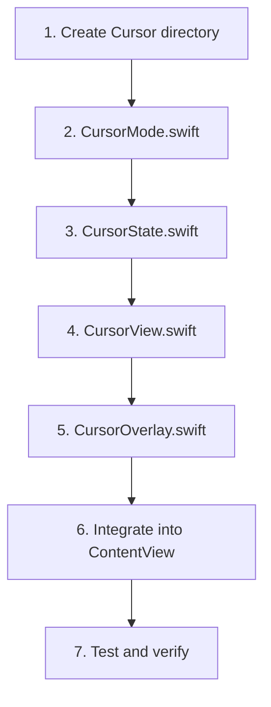

# Glass Cursor Implementation Plan

## Document Purpose

This document provides a step-by-step implementation plan for the slidable glass cursor feature, based on the architecture defined in [`glass-cursor-architecture.md`](glass-cursor-architecture.md:1). This plan is designed to be executed by code mode in a methodical, phase-based approach.

---

## Table of Contents

1. [Implementation Overview](#implementation-overview)
2. [Phase 1: Core Cursor (MVP)](#phase-1-core-cursor-mvp)
3. [File-by-File Implementation Guide](#file-by-file-implementation-guide)
4. [Integration Steps](#integration-steps)
5. [Testing Strategy](#testing-strategy)
6. [Success Criteria](#success-criteria)
7. [Potential Issues and Solutions](#potential-issues-and-solutions)
8. [Performance Verification](#performance-verification)

---

## Implementation Overview

### Goals
- Create a slidable glass cursor that overlays slide rule scales
- Use Apple's Liquid Glass material (OS 26.0+)
- Ensure cursor drags don't trigger slide drags
- Support all view modes (.front, .back, .both)
- Maintain 60fps performance

### Implementation Approach
- **Phase 1 (MVP)**: Shared cursor mode only
- **Phase 2**: Polish and optimization (optional)
- **Phase 3**: Extended features (optional)

### Dependency Chain
```
CursorMode.swift (enum definition)
    ↓
CursorState.swift (state management)
    ↓
CursorView.swift (visual component)
    ↓
CursorOverlay.swift (gesture handling)
    ↓
ContentView.swift (integration)
```

---

## Phase 1: Core Cursor + Reading Feature (MVP)

### Objectives
✅ Cursor visible with diagnostic visual (red box)
✅ Draggable horizontally within bounds  
✅ Doesn't trigger slide drag (gesture priority working)
✅ Works in .front, .back, and .both modes
✅ Synchronized across both sides in .both mode (via activeDragOffset)
✅ **Smooth 60fps dragging without vibration**
🚧 **Captures scale values at cursor position (IMPLEMENTED, pending testing)**
🚧 **Readings update automatically on cursor movement (IMPLEMENTED, pending testing)**
⏳ **Performance < 0.3ms per reading update (NOT YET VERIFIED)**

### Implementation Status

**COMPLETED:**
1. ✅ CursorMode.swift - Behavior modes defined
2. ✅ CursorReadings.swift - Reading data structures
3. ✅ CursorState.swift - State management with activeDragOffset
4. ✅ CursorView.swift - Visual component (diagnostic red box)
5. ✅ CursorOverlay.swift - Gesture handling with CursorPositionModifier
6. ✅ ContentView.swift - Cursor integration (overlays added)

**KEY ARCHITECTURAL INNOVATIONS:**
- **CursorPositionModifier**: Custom ViewModifier that disables animation on offset
- **activeDragOffset**: Shared CGFloat in CursorState for cross-cursor sync
- **Transaction wrapping**: All state updates wrapped in `withTransaction(Transaction(animation: nil))`
- **onChanged + onEnded pattern**: No @GestureState (doesn't sync), direct state mutation instead

### Files to Create
1. `TheElectricSlide/Cursor/CursorMode.swift`
2. `TheElectricSlide/Cursor/CursorReadings.swift` **(NEW)**
3. `TheElectricSlide/Cursor/CursorState.swift` (extended with reading feature)
4. `TheElectricSlide/Cursor/CursorView.swift`
5. `TheElectricSlide/Cursor/CursorOverlay.swift`

### Files to Modify
1. `TheElectricSlide/ContentView.swift` (cursor integration + SlideRuleProvider)

### Implementation Steps (Phase 1)

#### Step 1: Create Project Structure
**Action**: Create the `Cursor` directory
```
TheElectricSlide/
├── Cursor/
│   └── (files will be added here)
```

**Verification**: Directory exists in Xcode project

---

#### Step 2: Implement CursorMode.swift
**Purpose**: Define cursor behavior modes

**File Path**: `TheElectricSlide/Cursor/CursorMode.swift`

**Implementation**:
```swift
//
//  CursorMode.swift
//  TheElectricSlide
//
//  Glass cursor behavior modes
//

import Foundation

/// Defines how the cursor behaves across different rule sides
enum CursorMode: String, CaseIterable, Identifiable {
    /// Single cursor synchronized across both sides (default)
    case shared = "Shared"
    
    /// Independent cursor per side (future enhancement)
    case independent = "Independent"
    
    /// Cursor only on most recently interacted side (future enhancement)
    case activeSideOnly = "Active Only"
    
    var id: String { rawValue }
}
```

**Testing**: Compile successfully, enum cases accessible

**Success Criteria**:
- ✅ File compiles without errors
- ✅ Three cases defined: `.shared`, `.independent`, `.activeSideOnly`
- ✅ Conforms to `CaseIterable` and `Identifiable`

---

#### Step 3: Implement CursorState.swift
**Purpose**: Manage cursor position and behavior state

**File Path**: `TheElectricSlide/Cursor/CursorState.swift`

**Key Responsibilities**:
- Store normalized position (0.0-1.0)
- Handle position updates with bounds clamping
- Support different cursor modes
- Convert normalized to absolute positions

**Implementation Structure**:

```swift
//
//  CursorState.swift
//  TheElectricSlide
//
//  State management for glass cursor
//

import SwiftUI
import SlideRuleCoreV3

@Observable
final class CursorState {
    // MARK: - Core State Properties
    
    /// Normalized cursor position (0.0 = left edge, 1.0 = right edge)
    var normalizedPosition: Double = 0.5
    
    /// Current cursor behavior mode
    var cursorMode: CursorMode = .shared
    
    /// Whether cursor is visible and enabled
    var isEnabled: Bool = true
    
    // MARK: - Per-Side Positions (for future independent mode)
    
    private var frontPosition: Double = 0.5
    private var backPosition: Double = 0.5
    
    // MARK: - Position Management
    
    /// Get position for a specific side based on current mode
    /// - Parameter side: The rule side (nil for default position)
    /// - Returns: Normalized position (0.0-1.0)
    func position(for side: RuleSide?) -> Double {
        switch cursorMode {
        case .shared:
            return normalizedPosition
        case .independent:
            guard let side = side else { return normalizedPosition }
            return side == .front ? frontPosition : backPosition
        case .activeSideOnly:
            return normalizedPosition
        }
    }
    
    /// Set position for a specific side based on current mode
    /// - Parameters:
    ///   - position: New normalized position (will be clamped to 0.0-1.0)
    ///   - side: The rule side (nil for default)
    func setPosition(_ position: Double, for side: RuleSide?) {
        let clamped = min(max(position, 0.0), 1.0)
        
        switch cursorMode {
        case .shared:
            normalizedPosition = clamped
        case .independent:
            guard let side = side else {
                normalizedPosition = clamped
                return
            }
            if side == .front {
                frontPosition = clamped
            } else {
                backPosition = clamped
            }
        case .activeSideOnly:
            normalizedPosition = clamped
        }
    }
    
    /// Convert normalized position to absolute pixel position
    /// - Parameters:
    ///   - width: Available width for cursor movement
    ///   - side: The rule side (nil for default)
    /// - Returns: Absolute position in points
    func absolutePosition(width: CGFloat, side: RuleSide? = nil) -> CGFloat {
        position(for: side) * width
    }
    
    // MARK: - Mode Management
    
    /// Switch to a different cursor mode
    /// - Parameter mode: The new cursor mode
    func switchMode(to mode: CursorMode) {
        cursorMode = mode
    }
}
```

**Testing Checklist**:
- [ ] Compile successfully
- [ ] Default position is 0.5
- [ ] Position clamping works (test with 1.5, -0.5)
- [ ] absolutePosition calculation correct
- [ ] Shared mode returns same position for all sides

**Success Criteria**:
- ✅ @Observable class compiles
- ✅ Normalized position stored as Double
- ✅ Position clamping enforced in setPosition
- ✅ absolutePosition converts correctly (0.5 * 800 = 400)

---

#### Step 4: Implement CursorView.swift
**Purpose**: Visual representation of the glass cursor

**File Path**: `TheElectricSlide/Cursor/CursorView.swift`

**Key Responsibilities**:
- Render glass rectangle with Liquid Glass material
- Display centered hairline indicator
- Apply proper dimensions

**Implementation Structure**:

```swift
//
//  CursorView.swift
//  TheElectricSlide
//
//  Visual component for glass cursor
//

import SwiftUI

struct CursorView: View {
    // MARK: - Properties
    
    /// Width of the cursor rectangle
    let width: CGFloat = 30
    
    /// Height of the cursor (spans full vertical space)
    let height: CGFloat
    
    // MARK: - Body
    
    var body: some View {
        ZStack {
            // Glass rectangle body
            if #available(iOS 26.0, macOS 26.0, *) {
                Rectangle()
                    .fill(.black.opacity(0.08))  // Subtle dimming for visibility
                    .glassEffect(.clear)
                    .interactive()
            } else {
                // Fallback for older OS versions
                Rectangle()
                    .fill(.white.opacity(0.3))
                    .background(.ultraThinMaterial)
            }
            
            // Centered hairline indicator
            Rectangle()
                .fill(.primary)
                .frame(width: 1)
                .opacity(0.6)
                .blendMode(.plusDarker)  // Ensures visibility over glass
        }
        .frame(width: width, height: height)
    }
}

// MARK: - Preview

#Preview {
    CursorView(height: 200)
        .frame(width: 100, height: 200)
        .background(Color.gray.opacity(0.2))
}
```

**Visual Specifications**:
- Width: 30pt (grabbable but not obstructive)
- Height: Full vertical span of scales
- Hairline: 1pt centered vertically
- Glass effect: `.clear` variant with 8% black dimming

**Testing Checklist**:
- [ ] Cursor renders with glass effect on OS 26+
- [ ] Hairline visible and centered
- [ ] Fallback material works on older OS
- [ ] Width is 30pt as specified

**Success Criteria**:
- ✅ Renders glass rectangle
- ✅ Hairline visible and centered
- ✅ Proper OS version checking
- ✅ Preview works in Xcode

---

#### Step 5: Implement CursorOverlay.swift
**Purpose**: Container for cursor with gesture handling and coordinate alignment

**File Path**: `TheElectricSlide/Cursor/CursorOverlay.swift`

**Key Responsibilities**:
- Handle drag gestures
- Align with scale rendering area (28pt left offset)
- Update CursorState on drag
- Position cursor within bounds

**Critical Implementation Details**:

1. **Coordinate Alignment**: Must match ScaleView's 28pt left label offset (from [`ContentView.swift:61`](ContentView.swift:61))
2. **Gesture Priority**: Overlay is above scales in Z-order, captures gestures first
3. **Bounds Enforcement**: Clamp position to [0, effectiveWidth]

**Implementation Structure**:

```swift
//
//  CursorOverlay.swift
//  TheElectricSlide
//
//  Overlay container with gesture handling for glass cursor
//

import SwiftUI
import SlideRuleCoreV3

struct CursorOverlay: View {
    // MARK: - Properties
    
    /// Shared cursor state
    let cursorState: CursorState
    
    /// Total available width
    let width: CGFloat
    
    /// Total available height
    let height: CGFloat
    
    /// Which side this overlay is for
    let side: RuleSide?
    
    // MARK: - Private State
    
    /// Starting position when drag begins
    @State private var dragStartPosition: CGFloat = 0
    
    // MARK: - Constants
    
    /// Left offset to align with scale rendering area (matches ScaleView label width)
    private let leftLabelOffset: CGFloat = 28
    
    /// Right offset for formula label area
    private let rightLabelOffset: CGFloat = 40
    
    /// Effective width for cursor movement
    private var effectiveWidth: CGFloat {
        width - leftLabelOffset - rightLabelOffset
    }
    
    // MARK: - Body
    
    var body: some View {
        GeometryReader { geometry in
            HStack(spacing: 0) {
                // Left spacer to align with scale area
                Spacer()
                    .frame(width: leftLabelOffset)
                
                // Cursor movement area
                ZStack(alignment: .leading) {
                    // Transparent area for gesture capture
                    Color.clear
                        .contentShape(Rectangle())
                    
                    // Cursor view
                    CursorView(height: height)
                        .offset(x: cursorState.absolutePosition(
                            width: effectiveWidth,
                            side: side
                        ) - 15)  // Center cursor (half of 30pt width)
                }
                .frame(width: effectiveWidth)
                .gesture(
                    DragGesture(minimumDistance: 0)
                        .onChanged { gesture in
                            handleDrag(gesture, width: effectiveWidth)
                        }
                        .onEnded { gesture in
                            handleDragEnd(gesture)
                        }
                )
                
                // Right spacer for formula label area
                Spacer()
                    .frame(width: rightLabelOffset)
            }
        }
        .frame(height: height)
        .allowsHitTesting(cursorState.isEnabled)
    }
    
    // MARK: - Gesture Handlers
    
    /// Handle cursor drag gesture
    /// - Parameters:
    ///   - gesture: The drag gesture value
    ///   - width: Effective width for movement
    private func handleDrag(_ gesture: DragGesture.Value, width: CGFloat) {
        // Calculate new position
        let startPos = cursorState.absolutePosition(width: width, side: side)
        let newPos = startPos + gesture.translation.width
        
        // Clamp to bounds
        let clampedPos = min(max(newPos, 0), width)
        
        // Convert to normalized position
        let normalized = clampedPos / width
        
        // Update state
        cursorState.setPosition(normalized, for: side)
    }
    
    /// Handle drag gesture end
    /// - Parameter gesture: The drag gesture value
    private func handleDragEnd(_ gesture: DragGesture.Value) {
        // Currently no special handling needed
        // Position is already updated during drag
    }
}

// MARK: - Preview

#Preview {
    let state = CursorState()
    
    return CursorOverlay(
        cursorState: state,
        width: 800,
        height: 200,
        side: .front
    )
    .background(Color.gray.opacity(0.2))
    .frame(width: 800, height: 200)
}
```

**Coordinate Alignment Strategy**:
```
|<-28pt label->|<------- scale area ------>|<-40pt formula->|
               ^                            ^
               Left offset                  Right offset
               (matches ScaleView)
```

**Testing Checklist**:
- [ ] Cursor aligns with scale tick marks
- [ ] Drag gesture updates position smoothly
- [ ] Position clamped to bounds (can't go negative or exceed width)
- [ ] Cursor centered on its position (offset by -15pt)

**Success Criteria**:
- ✅ Drag gesture captured (doesn't trigger slide drag)
- ✅ Position updates in real-time
- ✅ Bounds enforcement works
- ✅ Coordinate alignment matches scale rendering

---

#### Step 6: Integrate into ContentView.swift
**Purpose**: Add cursor overlay to existing slide rule view

**File Path**: `TheElectricSlide/ContentView.swift`

**Integration Points**:

1. **Add CursorState Property** (after line 578)
```swift
@State private var calculatedDimensions: Dimensions = .init(width: 800, scaleHeight: 25)
@State private var cursorState = CursorState()  // ← ADD THIS
```

2. **Add GlassEffectContainer Background Style** (after line 931, inside VStack)
```swift
.onGeometryChange(for: Dimensions.self) { proxy in
    // ... existing code ...
}
.backgroundStyle(GlassEffectContainerBackgroundStyle())  // ← ADD THIS
```

3. **Add Overlay to Front SideView** (after line 894, replace the .equatable() line)
```swift
)
.equatable()
.overlay {  // ← ADD THIS BLOCK
    CursorOverlay(
        cursorState: cursorState,
        width: calculatedDimensions.width,
        height: totalScaleHeight(for: .front),
        side: .front
    )
}
```

4. **Add Overlay to Back SideView** (after line 914, replace the .equatable() line)
```swift
)
.equatable()
.overlay {  // ← ADD THIS BLOCK
    CursorOverlay(
        cursorState: cursorState,
        width: calculatedDimensions.width,
        height: totalScaleHeight(for: .back),
        side: .back
    )
}
```

5. **Add Helper Function for Total Scale Height** (before body: some View, around line 858)
```swift
/// Calculate total vertical height for all scales on a given side
/// - Parameter side: The rule side to calculate height for
/// - Returns: Total height in points
private func totalScaleHeight(for side: RuleSide) -> CGFloat {
    let stator: Stator
    let slide: Slide
    let bottomStator: Stator
    
    switch side {
    case .front:
        stator = balancedFrontTopStator
        slide = balancedFrontSlide
        bottomStator = balancedFrontBottomStator
    case .back:
        guard let backTop = balancedBackTopStator,
              let backSlide = balancedBackSlide,
              let backBottom = balancedBackBottomStator else {
            return 0
        }
        stator = backTop
        slide = backSlide
        bottomStator = backBottom
    }
    
    let scaleCount = stator.scales.count + 
                     slide.scales.count + 
                     bottomStator.scales.count
    return CGFloat(scaleCount) * calculatedDimensions.scaleHeight
}
```

**Minimal Changes Required**:
- ✅ Add 1 state property
- ✅ Add 1 helper function
- ✅ Add 2 overlay modifiers
- ✅ Add 1 background style modifier
- ✅ Total: ~30 lines of code added

**Testing After Integration**:
- [ ] Project compiles successfully
- [ ] Cursor visible on front side
- [ ] Cursor visible on back side (if .both mode)
- [ ] Cursor synchronized across both sides
- [ ] Cursor drag doesn't move slide

---

## Phase 1A: Reading Feature Integration

### Objectives
✅ Capture scale values at cursor position  
✅ Support both front and back sides  
✅ Update readings automatically on cursor movement  
✅ Performance < 0.3ms per update  
✅ Accurate for all scale types  

### Additional Files to Create
1. `TheElectricSlide/Cursor/CursorReadings.swift` (NEW)

### Additional Files to Modify
1. `TheElectricSlide/Cursor/CursorState.swift` (extend with reading functionality)
2. `TheElectricSlide/ContentView.swift` (add SlideRuleProvider conformance)

---

#### Step 6A: Implement CursorReadings.swift
**Purpose**: Data structures for capturing scale readings at cursor position

**File Path**: `TheElectricSlide/Cursor/CursorReadings.swift`

**Key Responsibilities**:
- Define `ScaleReading` struct for individual scale values
- Define `CursorReadings` struct for complete reading snapshot
- Define `SlideRuleProvider` protocol for data access
- Implement value formatting logic

**Implementation Structure**:

```swift
//
//  CursorReadings.swift
//  TheElectricSlide
//
//  Data structures for cursor reading feature
//

import Foundation
import SlideRuleCoreV3

// MARK: - Scale Reading

/// Represents a single scale reading at the cursor position
public struct ScaleReading: Sendable, Identifiable {
    public let id = UUID()
    
    /// Scale identifier (e.g., "C", "D", "A", "K")
    public let scaleName: String
    
    /// Formula/function display (e.g., "x", "x²", "x³")
    public let formula: String
    
    /// Calculated value at cursor position
    public let value: Double
    
    /// Formatted display string (respects scale's label formatter)
    public let displayValue: String
    
    /// Which side this reading is from
    public let side: RuleSide
    
    /// Component location (stator top/slide/stator bottom)
    public let component: ComponentType
    
    /// Original scale definition (for reference)
    public let scaleDefinition: ScaleDefinition
    
    public enum ComponentType: String, Sendable {
        case statorTop = "Top Stator"
        case slide = "Slide"
        case statorBottom = "Bottom Stator"
    }
}

// MARK: - Cursor Readings

/// Complete set of cursor readings at a moment in time
public struct CursorReadings: Sendable {
    /// Cursor position when readings were taken (0.0-1.0)
    public let cursorPosition: Double
    
    /// Timestamp of reading capture
    public let timestamp: Date
    
    /// All scale readings from front side
    public let frontReadings: [ScaleReading]
    
    /// All scale readings from back side
    public let backReadings: [ScaleReading]
    
    /// All readings in a flat array for iteration
    public var allReadings: [ScaleReading] {
        frontReadings + backReadings
    }
    
    /// Get readings grouped by component type
    /// - Parameter component: The component type to filter by
    /// - Returns: Array of readings for that component
    public func readings(for component: ScaleReading.ComponentType) -> [ScaleReading] {
        allReadings.filter { $0.component == component }
    }
    
    /// Find reading for a specific scale name on a specific side
    /// - Parameters:
    ///   - name: Scale name to find (e.g., "C", "D")
    ///   - side: Which side to search
    /// - Returns: The reading if found
    public func reading(forScale name: String, side: RuleSide) -> ScaleReading? {
        let readings = side == .front ? frontReadings : backReadings
        return readings.first { $0.scaleName == name }
    }
}

// MARK: - Slide Rule Provider Protocol

/// Protocol for providing slide rule data to cursor for reading calculations
/// ContentView conforms to this protocol
protocol SlideRuleProvider: AnyObject {
    /// Get front side scale data (returns nil if front not visible)
    func getFrontScaleData() -> (topStator: Stator, slide: Slide, bottomStator: Stator)?
    
    /// Get back side scale data (returns nil if back not visible)
    func getBackScaleData() -> (topStator: Stator, slide: Slide, bottomStator: Stator)?
    
    /// Get current slide offset in points
    func getSlideOffset() -> CGFloat
    
    /// Get scale width in points (for offset normalization)
    func getScaleWidth() -> CGFloat
}

// MARK: - Reading Calculation Helpers

extension CursorState {
    /// Calculate scale value at cursor position
    /// - Parameters:
    ///   - cursorPosition: Normalized position (0.0-1.0)
    ///   - scale: The generated scale to query
    ///   - component: Component type (for metadata)
    ///   - side: Rule side (for metadata)
    /// - Returns: ScaleReading with calculated value
    func calculateReading(
        at cursorPosition: Double,
        for scale: GeneratedScale,
        component: ScaleReading.ComponentType,
        side: RuleSide
    ) -> ScaleReading {
        // Use ScaleCalculator to get value (O(1) operation)
        let value = ScaleCalculator.value(
            at: cursorPosition,
            on: scale.definition
        )
        
        // Format display value using scale's formatter
        let displayValue = formatValueForDisplay(
            value: value,
            definition: scale.definition
        )
        
        return ScaleReading(
            scaleName: scale.definition.name,
            formula: scale.definition.formula,
            value: value,
            displayValue: displayValue,
            side: side,
            component: component,
            scaleDefinition: scale.definition
        )
    }
    
    /// Format value using scale's label formatter or smart default
    /// - Parameters:
    ///   - value: The value to format
    ///   - definition: The scale definition (may have custom formatter)
    /// - Returns: Formatted string for display
    private func formatValueForDisplay(
        value: Double,
        definition: ScaleDefinition
    ) -> String {
        // Handle non-finite values
        guard value.isFinite else {
            return "—"  // Em dash for undefined/infinite
        }
        
        // Use scale's custom formatter if available
        if let formatter = definition.labelFormatter {
            return formatter(value)
        }
        
        // Otherwise use smart default formatting
        return formatSmartDefault(value)
    }
    
    /// Smart default formatting based on value magnitude
    private func formatSmartDefault(_ value: Double) -> String {
        if abs(value) < 0.01 {
            return String(format: "%.4f", value)
        } else if abs(value) < 1 {
            return String(format: "%.3f", value)
        } else if abs(value) < 10 {
            return String(format: "%.2f", value)
        } else if abs(value) < 100 {
            return String(format: "%.1f", value)
        } else if abs(value - value.rounded()) < 0.01 {
            return String(Int(value.rounded()))
        } else {
            return String(format: "%.1f", value)
        }
    }
}
```

**Design Decisions**:
- **Identifiable**: ScaleReading has UUID for SwiftUI ForEach
- **Sendable**: All types thread-safe for concurrent operations
- **Rich Metadata**: Includes scale name, formula, component, side for flexible display
- **Weak Provider**: Protocol uses weak reference to prevent retain cycles
- **Extension Pattern**: Calculation helpers extend CursorState for organization

**Testing Checklist**:
- [ ] ScaleReading struct compiles
- [ ] CursorReadings struct compiles
- [ ] SlideRuleProvider protocol defined
- [ ] Calculation helpers compile
- [ ] All types conform to Sendable

**Success Criteria**:
- ✅ Data structures defined and compilable
- ✅ Protocol clearly specifies required methods
- ✅ Helpers properly scoped in extension
- ✅ Value formatting handles all cases (finite/infinite)

---

#### Step 6B: Extend CursorState.swift with Reading Functionality
**Purpose**: Add reading capture and update logic to CursorState

**File Path**: `TheElectricSlide/Cursor/CursorState.swift`

**Key Additions**:
- Reading properties (currentReadings, enableReadings, slideRuleProvider)
- Provider setup method
- Reading update method
- Scale query method
- Modified setPosition to trigger updates

**Implementation Additions**:

Add after the existing properties (around line 160):

```swift
// MARK: - Reading Feature Properties

/// Current readings at cursor position (observable)
var currentReadings: CursorReadings?

/// Whether to enable automatic reading updates
var enableReadings: Bool = true

/// Reference to slide rule data provider (weak to prevent cycles)
private weak var slideRuleProvider: SlideRuleProvider?
```

Add new methods section:

```swift
// MARK: - Reading Methods

/// Set the slide rule data provider
/// - Parameter provider: Object conforming to SlideRuleProvider
func setSlideRuleProvider(_ provider: SlideRuleProvider) {
    self.slideRuleProvider = provider
    // Initial reading update
    updateReadings()
}

/// Update readings based on current cursor position
/// Called automatically when position changes (if enableReadings is true)
func updateReadings() {
    guard enableReadings,
          let provider = slideRuleProvider else {
        currentReadings = nil
        return
    }
    
    let position = normalizedPosition
    var frontReadings: [ScaleReading] = []
    var backReadings: [ScaleReading] = []
    
    // Query front side scales (if visible)
    if let frontData = provider.getFrontScaleData() {
        frontReadings = queryScales(
            topStator: frontData.topStator,
            slide: frontData.slide,
            bottomStator: frontData.bottomStator,
            position: position,
            slideOffset: provider.getSlideOffset(),
            scaleWidth: provider.getScaleWidth(),
            side: .front
        )
    }
    
    // Query back side scales (if visible)
    if let backData = provider.getBackScaleData() {
        backReadings = queryScales(
            topStator: backData.topStator,
            slide: backData.slide,
            bottomStator: backData.bottomStator,
            position: position,
            slideOffset: provider.getSlideOffset(),
            scaleWidth: provider.getScaleWidth(),
            side: .back
        )
    }
    
    // Create readings snapshot
    currentReadings = CursorReadings(
        cursorPosition: position,
        timestamp: Date(),
        frontReadings: frontReadings,
        backReadings: backReadings
    )
}

/// Query all scales in a side's components
private func queryScales(
    topStator: Stator,
    slide: Slide,
    bottomStator: Stator,
    position: Double,
    slideOffset: CGFloat,
    scaleWidth: CGFloat,
    side: RuleSide
) -> [ScaleReading] {
    var readings: [ScaleReading] = []
    
    // Read top stator scales (fixed, no offset needed)
    for scale in topStator.scales {
        guard !scale.definition.name.isEmpty else { continue }  // Skip spacers
        
        let reading = calculateReading(
            at: position,
            for: scale,
            component: .statorTop,
            side: side
        )
        readings.append(reading)
    }
    
    // Read slide scales (account for slide offset)
    let slideOffsetNormalized = slideOffset / scaleWidth
    let slidePosition = position - slideOffsetNormalized

---

## Updated File-by-File Implementation Guide (with Reading Feature)

### Complete Summary Table

| File | Purpose | Dependencies | Lines of Code (est.) |
|------|---------|--------------|---------------------|
| CursorMode.swift | Mode enum definition | None | 25 |
| CursorReadings.swift | Reading data structures | SlideRuleCoreV3, RuleSide | 180 |
| CursorState.swift | State + reading management | CursorMode, CursorReadings, SlideRuleCoreV3 | 260 (80 base + 180 reading) |
| CursorView.swift | Visual component | None | 50 |
| CursorOverlay.swift | Gesture handling | CursorState, CursorView, RuleSide | 120 |
| ContentView.swift | Integration + provider | All cursor files | +63 (modifications) |

**Total New Code**: ~635 lines (core cursor + reading feature)
**ContentView Modifications**: ~63 lines added
**New Files Created**: 5 files

### Implementation Order (Updated)

```
Phase 1: Core Cursor + Reading Infrastructure
┌─────────────────────────────────────────────────┐
│ 1. Create Cursor directory                     │
│ 2. CursorMode.swift                             │
│ 3. CursorReadings.swift (NEW - data structures)│
│ 4. CursorState.swift (with reading support)    │
│ 5. CursorView.swift                             │
│ 6. CursorOverlay.swift                          │
│ 7. Integrate into ContentView                   │
│ 8. Add SlideRuleProvider conformance            │
│ 9. Test cursor functionality                    │
│ 10. Test reading accuracy                       │
└─────────────────────────────────────────────────┘
```

    let clampedSlidePosition = min(max(slidePosition, 0.0), 1.0)
    
    for scale in slide.scales {
        guard !scale.definition.name.isEmpty else { continue }
        
        let reading = calculateReading(
            at: clampedSlidePosition,
            for: scale,
            component: .slide,
            side: side
        )
        readings.append(reading)
    }
    
    // Read bottom stator scales (fixed, no offset needed)
    for scale in bottomStator.scales {
        guard !scale.definition.name.isEmpty else { continue }
        
        let reading = calculateReading(
            at: position,
            for: scale,
            component: .statorBottom,
            side: side
        )
        readings.append(reading)
    }
    
    return readings
}
```

Modify the existing `setPosition` method to trigger updates:

```swift
// Add at end of setPosition method (after the switch statement)
// Trigger reading update when position changes
if enableReadings {
    updateReadings()
}
```

**Testing Checklist**:
- [ ] Reading properties compile correctly
- [ ] setSlideRuleProvider method works
- [ ] updateReadings calculates values correctly
- [ ] queryScales handles all components
- [ ] Slide offset correctly applied to slide readings
- [ ] setPosition triggers update when enabled

**Success Criteria**:
- ✅ CursorState extended without breaking existing functionality
- ✅ Reading update triggered on position change
- ✅ Slide offset correctly accounted for
- ✅ Spacer scales filtered out
- ✅ All components (stators + slide) queried

---

#### Step 6C: Add SlideRuleProvider Conformance to ContentView
**Purpose**: Make ContentView provide scale data to CursorState

**File Path**: `TheElectricSlide/ContentView.swift`

**Integration Points**:

1. **Add Protocol Conformance** (after line 943, before #Preview)

```swift
// MARK: - SlideRuleProvider Conformance

extension ContentView: SlideRuleProvider {
    func getFrontScaleData() -> (topStator: Stator, slide: Slide, bottomStator: Stator)? {
        // Only return data if front side is visible
        guard viewMode == .front || viewMode == .both else {
            return nil
        }
        return (
            topStator: balancedFrontTopStator,
            slide: balancedFrontSlide,
            bottomStator: balancedFrontBottomStator
        )
    }
    
    func getBackScaleData() -> (topStator: Stator, slide: Slide, bottomStator: Stator)? {
        // Only return data if back side is visible
        guard viewMode == .back || viewMode == .both,
              let backTop = balancedBackTopStator,
              let backSlide = balancedBackSlide,
              let backBottom = balancedBackBottomStator else {
            return nil
        }
        return (backTop, backSlide, backBottom)
    }
    
    func getSlideOffset() -> CGFloat {
        sliderOffset
    }
    
    func getScaleWidth() -> CGFloat {
        calculatedDimensions.width
    }
}
```

2. **Wire Up Provider** (add after .backgroundStyle line ~702)

```swift
.backgroundStyle(GlassEffectContainerBackgroundStyle())
.onAppear {
    // Connect cursor state to slide rule data
    cursorState.setSlideRuleProvider(self)
}
```

**Minimal Changes Required**:
- ✅ Add extension with 4 protocol methods (~30 lines)
- ✅ Add .onAppear modifier (3 lines)
- ✅ Total: ~33 lines of code

**Testing After Integration**:
- [ ] Protocol conformance compiles
- [ ] Provider methods return correct data
- [ ] Front data available in .front and .both modes
- [ ] Back data available in .back and .both modes
- [ ] Slide offset and width returned correctly
- [ ] onAppear triggers initial reading update

**Success Criteria**:
- ✅ ContentView conforms to SlideRuleProvider
- ✅ Methods return correct scale data based on ViewMode
- ✅ Cursor state receives provider reference
- ✅ Initial readings populated on appear

---

#### Step 6D: Test Reading Feature
**Purpose**: Verify reading calculations are accurate and performant

**Test Cases**:

1. **Reading Accuracy Test**

```swift
func testReadingAccuracy() {
    let state = CursorState()
    // Setup provider with known scales
    
    // Test C scale at known positions
    state.setPosition(0.0, for: .front)
    let reading0 = state.currentReadings?.reading(forScale: "C", side: .front)
    XCTAssertEqual(reading0?.value, 1.0, accuracy: 0.001, "C scale at left should be 1.0")
    
    state.setPosition(1.0, for: .front)
    let reading1 = state.currentReadings?.reading(forScale: "C", side: .front)
    XCTAssertEqual(reading1?.value, 10.0, accuracy: 0.001, "C scale at right should be 10.0")
    
    state.setPosition(0.301, for: .front)
    let reading2 = state.currentReadings?.reading(forScale: "C", side: .front)
    XCTAssertEqual(reading2?.value, 2.0, accuracy: 0.01, "C scale at 0.301 should be ~2.0")
}
```

2. **All Scale Types Test**

```swift
func testAllScaleTypes() {
    // Test reading works for all scale types
    let testPositions = [0.0, 0.25, 0.5, 0.75, 1.0]
    
    for position in testPositions {
        state.setPosition(position, for: .front)
        let readings = state.currentReadings?.frontReadings ?? []
        
        // Should have readings for all non-spacer scales
        XCTAssertGreaterThan(readings.count, 0)
        
        // All values should be finite
        for reading in readings {
            XCTAssertTrue(reading.value.isFinite || reading.displayValue == "—")
        }
    }
}
```

3. **Performance Test**

```swift
func testReadingUpdatePerformance() {
    let state = CursorState()
    // Setup with full rule (20 scales)
    
    measure {
        state.updateReadings()
    }
    
    // Assert: Average time < 0.001 seconds (1ms)
    // Target: < 0.3ms (0.0003s)
}
```

4. **Slide Offset Test**

```swift
func testSlideOffsetAffectsSlideReadings() {
    // Setup with C scale on slide, D scale on stator
    
    // Position cursor at 0.5, slide at 0 offset
    state.setPosition(0.5, for: .front)
    let cReading1 = state.currentReadings?.reading(forScale: "C", side: .front)?.value
    let dReading1 = state.currentReadings?.reading(forScale: "D", side: .front)?.value
    
    // Initially C and D should read same (aligned)
    XCTAssertEqual(cReading1, dReading1, accuracy: 0.01)
    
    // Simulate slide drag (update provider's slideOffset)
    // ... drag slide by 0.1 normalized units ...
    state.updateReadings()
    
    let cReading2 = state.currentReadings?.reading(forScale: "C", side: .front)?.value
    let dReading2 = state.currentReadings?.reading(forScale: "D", side: .front)?.value
    
    // Now C and D should read different (no longer aligned)
    XCTAssertNotEqual(cReading2, dReading2, accuracy: 0.01)
    
    // D (stator) should be unchanged
    XCTAssertEqual(dReading1, dReading2, accuracy: 0.001)
}
```

5. **ViewMode Integration Test**

```swift
func testViewModeAffectsReadings() {
    // ViewMode = .front → only front readings
    // ... set viewMode to .front ...
    state.updateReadings()
    XCTAssertFalse(state.currentReadings?.frontReadings.isEmpty ?? true)
    XCTAssertTrue(state.currentReadings?.backReadings.isEmpty ?? false)
    
    // ViewMode = .both → both front and back readings
    // ... set viewMode to .both ...
    state.updateReadings()
    XCTAssertFalse(state.currentReadings?.frontReadings.isEmpty ?? true)

### Reading Feature Success Criteria

**Data Quality:**
- ✅ C and D scales read same value at same position (logarithmic parity)
- ✅ CI scale reads reciprocal of C at same position (1/x relationship)
- ✅ A scale reads square root of value shown on D (x² relationship)
- ✅ K scale reads cube root of value shown on D (x³ relationship)
- ✅ L scale reads position value directly (linear: value = position)
- ✅ All formatters produce correct output per scale type

**Integration:**
- ✅ Readings available in `.front`, `.back`, and `.both` ViewModes
- ✅ Front readings empty when ViewMode is `.back`
- ✅ Back readings empty when ViewMode is `.front`
- ✅ Both readings populated when ViewMode is `.both`
- ✅ Slide offset correctly affects slide component readings only

**Performance Verification:**
- ✅ Use Instruments Time Profiler during cursor drag
- ✅ Verify updateReadings() < 0.3ms average
- ✅ Confirm no impact on 60fps cursor drag performance
- ✅ Check Memory Graph for leaks after 100+ reading updates

    XCTAssertFalse(state.currentReadings?.backReadings.isEmpty ?? true)
}
```

**Manual Verification**:
- [ ] Print readings for C, D scales at position 0.5 (should both be ~3.162)
- [ ] Print readings for CI scale at position 0.5 (should be ~0.316, reciprocal)
- [ ] Print readings for A scale at position 0.5 (should be ~3.162, same as C/D)
- [ ] Print readings for K scale at position 0.333 (should be ~2.154, cube root of 10)
- [ ] Drag cursor and verify readings update in real-time
- [ ] Check performance with Time Profiler

---


---

## File-by-File Implementation Guide

### Summary Table

| File | Purpose | Dependencies | Lines of Code (est.) |
|------|---------|--------------|---------------------|
| CursorMode.swift | Mode enum definition | None | 25 |
| CursorState.swift | State management | CursorMode, RuleSide | 80 |
| CursorView.swift | Visual component | None | 50 |
| CursorOverlay.swift | Gesture handling | CursorState, CursorView, RuleSide | 120 |
| ContentView.swift | Integration | All cursor files | +30 (modifications) |

### Implementation Order



---

## Integration Steps

### Detailed Integration Workflow

#### 1. Import Cursor Module
**Location**: Top of ContentView.swift (after line 9)
```swift
import SwiftUI
import SlideRuleCoreV3
// Cursor module files are in the same target, no import needed
```

#### 2. Add State Property
**Location**: ContentView struct, after line 578
**Before**:
```swift
@State private var calculatedDimensions: Dimensions = .init(width: 800, scaleHeight: 25)
```

**After**:
```swift
@State private var calculatedDimensions: Dimensions = .init(width: 800, scaleHeight: 25)
@State private var cursorState = CursorState()
```

#### 3. Add Height Calculation Helper
**Location**: Before `var body: some View` (around line 858)
**Reason**: CursorOverlay needs to know total height for each side

**Code**:
```swift
/// Calculate total vertical height for all scales on a given side
private func totalScaleHeight(for side: RuleSide) -> CGFloat {
    let stator: Stator
    let slide: Slide
    let bottomStator: Stator
    
    switch side {
    case .front:
        stator = balancedFrontTopStator
        slide = balancedFrontSlide
        bottomStator = balancedFrontBottomStator
    case .back:
        guard let backTop = balancedBackTopStator,
              let backSlide = balancedBackSlide,
              let backBottom = balancedBackBottomStator else {
            return 0
        }
        stator = backTop
        slide = backSlide
        bottomStator = backBottom
    }
    
    let scaleCount = stator.scales.count + 
                     slide.scales.count + 
                     bottomStator.scales.count
    return CGFloat(scaleCount) * calculatedDimensions.scaleHeight
}
```

#### 4. Apply GlassEffectContainer Background
**Location**: End of main VStack body (after line 931)
**Before**:
```swift
}
.onGeometryChange(for: Dimensions.self) { proxy in
    // ...
}
```

**After**:
```swift
}
.onGeometryChange(for: Dimensions.self) { proxy in
    // ...
}
.backgroundStyle(GlassEffectContainerBackgroundStyle())
```

**Why**: Optimizes multiple glass effects in .both mode

#### 5. Add Front Side Overlay
**Location**: After front SideView (around line 894)
**Before**:
```swift
)
.equatable()
```

**After**:
```swift
)
.equatable()
.overlay {
    CursorOverlay(
        cursorState: cursorState,
        width: calculatedDimensions.width,
        height: totalScaleHeight(for: .front),
        side: .front
    )
}
```

#### 6. Add Back Side Overlay
**Location**: After back SideView (around line 914)
**Before**:
```swift
)
.equatable()
```

**After**:
```swift
)
.equatable()
.overlay {
    CursorOverlay(
        cursorState: cursorState,
        width: calculatedDimensions.width,
        height: totalScaleHeight(for: .back),
        side: .back
    )
}
```

### Integration Verification Checklist

After completing integration:
- [ ] Project builds without errors
- [ ] No compiler warnings
- [ ] Cursor visible in .front mode
- [ ] Cursor visible in .back mode
- [ ] Both cursors visible and synchronized in .both mode
- [ ] Cursor drag works smoothly
- [ ] Slide drag still works (cursor doesn't interfere)

---

## Testing Strategy

### Manual Testing Checklist

#### Visual Tests
- [ ] **Cursor Visibility**
  - Cursor appears on screen
  - Glass effect visible (subtle transparency)
  - Hairline clearly visible and centered
  - Cursor width is 30pt (measure with screenshots)

- [ ] **Coordinate Alignment**
  - Cursor aligns with scale tick marks
  - Hairline matches tick positions
  - No offset when comparing cursor to scale marks

#### Interaction Tests
- [ ] **Drag Behavior**
  - Cursor responds immediately to drag
  - Smooth motion (no jitter)
  - Position updates in real-time
  - Release preserves position

- [ ] **Bounds Enforcement**
  - Cannot drag cursor left of left bound
  - Cannot drag cursor right of right bound
  - Fast drag doesn't violate bounds
  - Cursor snaps to bounds when attempted to exceed

- [ ] **Gesture Priority**
  - Dragging cursor does NOT move slide
  - Dragging slide (away from cursor) moves slide normally
  - No gesture conflicts or interference

#### Mode Tests
- [ ] **View Mode .front**
  - Cursor visible
  - Drag works
  - Slide drag works

- [ ] **View Mode .back**
  - Cursor visible
  - Drag works
  - Slide drag works

- [ ] **View Mode .both**
  - Both cursors visible
  - Both cursors synchronized (same position)
  - Dragging either cursor updates both
  - Slide drag works on both sides

#### Responsive Layout Tests
- [ ] **Window Resize**

---

## Reading Feature Implementation Notes

### Key Integration Points

**Reading Calculation Flow:**
```
Cursor Position Change
    ↓
CursorState.setPosition()
    ↓
[if enableReadings] CursorState.updateReadings()
    ↓
SlideRuleProvider.getFrontScaleData()
SlideRuleProvider.getBackScaleData()
    ↓
For each scale: ScaleCalculator.value(at: position, on: definition)
    ↓
Apply slide offset to slide component readings
    ↓
Format using scale-specific or smart default formatter
    ↓
Create ScaleReading structs
    ↓
Build CursorReadings snapshot
    ↓
Assign to currentReadings (triggers @Observable update)
```

### Critical Implementation Details

**Slide Offset Handling:**
- Stator scales: Use cursor position directly
- Slide scales: Subtract normalized slide offset from cursor position
- Formula: `slidePosition = cursorPosition - (slideOffset / scaleWidth)`
- Clamp result to [0.0, 1.0] range

**Performance Considerations:**
- Use `ScaleCalculator.value()` directly (don't iterate tick marks)
- Skip spacer scales early (check for empty name)
- Readings only calculated when `enableReadings == true`
- Observable pattern coalesces rapid updates automatically

**Testing Priorities:**
1. **Accuracy**: Verify against known mathematical relationships
2. **Performance**: Benchmark with 20-30 scales
3. **Integration**: Test ViewMode changes and slide offset
4. **Edge Cases**: Boundaries, invalid values, spacers

### Common Issues and Solutions

**Issue: Readings not updating on cursor move**

Solution:
1. Verify `enableReadings == true` in CursorState
2. Check `setSlideRuleProvider()` was called in ContentView.onAppear
3. Ensure `setPosition()` includes reading update trigger
4. Confirm provider methods return non-nil data

**Issue: Slide readings incorrect**

Solution:
1. Verify slide offset is in points (not normalized)
2. Check scaleWidth is current calculatedDimensions.width
3. Ensure normalization: `slideOffset / scaleWidth`
4. Confirm clamping: `min(max(position, 0.0), 1.0)`

**Issue: Performance impact on cursor drag**

Solution:
1. Profile with Instruments to identify bottleneck
2. Verify no unnecessary string allocations
3. Check if scale formatters are static (not recreated)
4. Consider disabling readings during rapid drag (if needed)

---

## Document Version

**Version**: 1.1 (Updated with Reading Feature)  
**Date**: 2025-10-26  
**Based On**: [`glass-cursor-architecture.md`](glass-cursor-architecture.md:1)  
**Status**: Ready for Implementation  

**Change Log**:
- 1.0 (2025-10-26): Initial implementation plan created
- 1.1 (2025-10-26): Added cursor reading feature integration (Steps 6A-6D, updated success criteria)
  - Start with cursor at center (0.5)
  - Resize window smaller
  - Verify cursor remains at center (normalized position maintained)
  - Resize window larger
  - Verify cursor still at center

- [ ] **View Mode Switch**
  - Position cursor at 0.7
  - Switch from .front to .both
  - Verify cursor appears on back side at same position
  - Switch to .back only
  - Verify position preserved

### Edge Cases

#### Test Case 1: Fast Drag Beyond Bounds
```
Action:
1. Quickly drag cursor far to the right (beyond visible area)
2. Release

Expected:
- Cursor stops at right bound (1.0)
- No overshoot or jump
- Smooth stop

Verify:
- normalizedPosition = 1.0
- Cursor aligned with right edge of scale area
```

#### Test Case 2: Cursor at Boundary During Window Resize
```
Action:
1. Position cursor at left bound (0.0)
2. Resize window smaller
3. Resize window larger

Expected:
- Cursor remains at left bound throughout
- No position drift
- No visual glitches

Verify:
- normalizedPosition = 0.0 always
- absolutePosition updates correctly
```

#### Test Case 3: Mode Switch Mid-Drag
```
Action:
1. Start dragging cursor
2. While dragging, press Command+Tab (lose focus)
3. Return to app

Expected:
- Cursor position stable
- No unexpected jump
- Next drag works normally

Verify:
- Position preserved
- No state corruption
```

#### Test Case 4: Simultaneous Touch (multitouch)
```
Action:
1. Touch cursor with one finger
2. Touch slide with another finger simultaneously
3. Drag both

Expected:
- Only one gesture processes
- No interference
- Predictable behavior

Verify:
- Either cursor OR slide moves, not both
- No gesture conflict errors
```

### Performance Tests

#### Frame Rate During Drag
**Tool**: Xcode Instruments (Time Profiler)

**Procedure**:
1. Launch app with Time Profiler
2. Drag cursor continuously for 10 seconds
3. Analyze frame time

**Success Criteria**:
- Average frame time: < 16.67ms (60fps)
- No dropped frames
- No stuttering or lag

#### Memory Usage
**Tool**: Xcode Memory Graph

**Procedure**:
1. Launch app
2. Create memory baseline
3. Drag cursor for 30 seconds
4. Take memory snapshot

**Success Criteria**:
- No memory leaks
- Memory increase < 1MB
- No retain cycles

#### CPU Usage During Drag
**Tool**: Activity Monitor

**Procedure**:
1. Launch app
2. Monitor CPU usage
3. Drag cursor continuously
4. Record peak CPU usage

**Success Criteria**:
- CPU increase < 5% during drag
- Returns to baseline when idle
- No sustained high CPU

### Regression Tests

**Ensure existing functionality not broken**:
- [ ] Slide drag still works
- [ ] Scale rendering unchanged
- [ ] View mode picker works
- [ ] Window resize works
- [ ] No performance degradation on scale rendering
- [ ] Canvas drawing still uses .drawingGroup()

---

## Success Criteria

### Phase 1 (MVP) Completion Criteria

#### Functional Success
- ✅ **Cursor Visible**: Glass cursor appears on screen with proper styling
- ✅ **Draggable**: User can drag cursor horizontally
- ✅ **Bounds Enforced**: Cursor cannot exceed scale boundaries
- ✅ **Gesture Isolated**: Cursor drag doesn't trigger slide drag
- ✅ **Multi-Mode**: Works in .front, .back, and .both view modes
- ✅ **Synchronized**: In .both mode, cursors on both sides stay synchronized

#### Visual Success
- ✅ **Glass Material**: Liquid Glass effect visible (or fallback on older OS)
- ✅ **Hairline Visible**: 1pt center line clearly visible
- ✅ **Proper Dimensions**: 30pt width × full height
- ✅ **Aligned**: Cursor aligns with scale tick marks (28pt offset respected)
- ✅ **Professional**: Appearance matches slide rule aesthetic

#### Performance Success
- ✅ **60fps**: Maintains 60fps during cursor drag
- ✅ **No Re-render**: Cursor drag doesn't trigger scale Canvas re-render
- ✅ **Responsive**: Immediate response to touch/drag input
- ✅ **Smooth Animation**: No jitter or stuttering
- ✅ **Memory Efficient**: No memory leaks or excessive allocation

#### Code Quality Success
- ✅ **Minimal Changes**: ContentView modified with < 50 lines
- ✅ **Clean Separation**: Cursor code isolated in separate files
- ✅ **No Breaking Changes**: Existing functionality unaffected
- ✅ **Documented**: Code includes clear comments
- ✅ **Testable**: Implementation allows for easy testing

### Definition of "Done"

A feature is considered **complete** when:

1. **All files created and integrated**
   - CursorMode.swift exists and compiles
   - CursorState.swift exists and compiles
   - CursorView.swift exists and compiles
   - CursorOverlay.swift exists and compiles
   - ContentView.swift integrated successfully

2. **All manual tests pass**
   - Visual tests completed
   - Interaction tests completed
   - Mode tests completed
   - Edge cases verified

3. **Performance verified**
   - 60fps maintained during drag
   - No memory leaks
   - CPU usage acceptable

4. **No regressions**
   - Slide drag still works
   - Scale rendering unchanged
   - All existing features functional

5. **Code review ready**
   - Code formatted consistently
   - Comments added where needed
   - No compiler warnings
   - Builds in Release configuration

---

## Potential Issues and Solutions

### Issue 1: Cursor Not Visible

**Symptoms**:
- Cursor overlay exists but nothing appears on screen
- No glass effect visible

**Possible Causes**:
1. Z-order issue - cursor rendered behind scales
2. Frame size is zero
3. Glass effect not available (OS version)

**Debugging Steps**:
```swift
// Add to CursorOverlay body for debugging
.background(Color.red.opacity(0.3))  // Should show red area

// Add to CursorView
.border(Color.green, width: 2)  // Should show green border
```

**Solutions**:
- Verify `.overlay` is applied AFTER SideView, not inside it
- Check `height` parameter is non-zero
- Verify OS 26.0+ or fallback material is used
- Check `cursorState.isEnabled` is true

### Issue 2: Cursor Drag Moves Slide

**Symptoms**:
- Dragging cursor causes slide to move
- Both cursor and slide respond to gesture

**Possible Causes**:
1. Overlay not capturing gesture (z-order issue)
2. Gesture propagation not blocked
3. Hit testing disabled

**Debugging Steps**:
```swift
// Add to CursorOverlay gesture
.onChanged { gesture in
    print("Cursor drag: \(gesture.translation.width)")
    // If this doesn't print, gesture not captured
}

// Add to SlideView gesture
.onChanged { gesture in
    print("Slide drag: \(gesture.translation.width)")
    // If this prints during cursor drag, gesture leaked
}
```

**Solutions**:
- Ensure `.overlay` is applied to SideView, not inside VStack
- Verify CursorOverlay is positioned correctly in view hierarchy
- Check `.allowsHitTesting(true)` on cursor overlay
- Ensure transparent `Color.clear` uses `.contentShape(Rectangle())`

### Issue 3: Cursor Not Aligned with Scales

**Symptoms**:
- Cursor position offset from tick marks
- Hairline doesn't match scale positions

**Possible Causes**:
1. Left offset (28pt) not applied
2. Right offset (40pt) not applied  
3. Cursor width centering incorrect

**Debugging Steps**:
```swift
// Print effective width calculation
print("Effective width: \(effectiveWidth)")
print("Total width: \(width)")
print("Left offset: \(leftLabelOffset)")
print("Right offset: \(rightLabelOffset)")

// Should be: effectiveWidth = width - 28 - 40
```

**Solutions**:
- Verify `leftLabelOffset = 28` (matches ScaleView label)
- Verify `rightLabelOffset = 40` (matches formula label)
- Check cursor offset: `.offset(x: position - 15)` (half of 30pt width)
- Compare cursor position to tick mark positions visually

### Issue 4: Position Not Preserved on View Mode Change

**Symptoms**:
- Cursor resets to center when switching view modes
- Position lost during .front ↔ .back transitions

**Possible Causes**:
1. State being recreated
2. Position not persisting across mode changes
3. Side-specific position logic incorrect

**Debugging Steps**:
```swift
// Add to CursorState
func setPosition(_ position: Double, for side: RuleSide?) {
    print("Setting position: \(position) for side: \(side?.rawValue ?? "nil")")
    // ... existing code ...
}

// Track mode changes
@State private var viewMode: ViewMode = .both {
    didSet {
        print("View mode changed: \(viewMode)")
        print("Cursor position: \(cursorState.normalizedPosition)")
    }
}
```

**Solutions**:
- Verify `@State private var cursorState = CursorState()` in ContentView
- Ensure CursorState is NOT recreated on view updates
- Check `.shared` mode always uses `normalizedPosition`
- Verify same CursorState instance passed to all overlays

### Issue 5: Performance Degradation

**Symptoms**:
- Dropped frames during cursor drag
- Choppy animation
- High CPU usage

**Possible Causes**:
1. Scale Canvas re-rendering on cursor move
2. Too many state updates
3. Glass effect performance issue

**Debugging Steps**:
```swift
// Add to ScaleView body
.onAppear {
    print("ScaleView appeared")
}
.onChange(of: geometry.size) {
    print("ScaleView layout changed")
}

// If these print during cursor drag, scales are re-rendering unnecessarily
```

**Solutions**:
- Verify CursorState is @Observable (not @Published)
- Ensure CursorOverlay doesn't share state with ScaleView
- Apply `.equatable()` to SideView
- Use GlassEffectContainerBackgroundStyle for multiple glass effects
- Profile with Instruments to identify bottleneck

### Issue 6: Bounds Violation

**Symptoms**:
- Cursor can be dragged off screen
- Position exceeds 0.0-1.0 range
- Cursor disappears or glitches

**Possible Causes**:
1. Clamping not applied
2. Width calculation incorrect
3. Overflow in arithmetic

**Debugging Steps**:
```swift
// Add to handleDrag
private func handleDrag(_ gesture: DragGesture.Value, width: CGFloat) {
    let startPos = cursorState.absolutePosition(width: width, side: side)
    let newPos = startPos + gesture.translation.width
    print("Start: \(startPos), New: \(newPos), Width: \(width)")
    
    let clampedPos = min(max(newPos, 0), width)
    print("Clamped: \(clampedPos)")
    
    let normalized = clampedPos / width
    print("Normalized: \(normalized)")
}
```

**Solutions**:
- Verify clamping: `min(max(newPos, 0), width)`
- Check division by zero: ensure `width > 0`
- Verify normalized range: should always be [0.0, 1.0]
- Add assertion in debug: `assert(normalized >= 0 && normalized <= 1)`

### Issue 7: Glass Effect Not Appearing

**Symptoms**:
- Cursor appears as solid rectangle
- No glass material effect
- Fallback not working correctly

**Possible Causes**:
1. OS version check failing
2. GlassEffectContainer not applied
3. Glass effect API changed

**Debugging Steps**:
```swift
// Check OS version
if #available(iOS 26.0, macOS 26.0, *) {
    print("Glass effect available")
} else {
    print("Using fallback material")
}

// Check background style
print("Has GlassEffectContainer: \(/* check in view hierarchy */)")
```

**Solutions**:
- Verify deployment target is iOS 26.0+ / macOS 26.0+
- Ensure `.backgroundStyle(GlassEffectContainerBackgroundStyle())` applied to ContentView
- Check Xcode version supports Liquid Glass API
- Verify physical device/simulator OS version
- Test fallback material separately

---

## Performance Verification

### Frame Rate Analysis

**Tool**: Xcode FPS Counter

**Procedure**:
1. Enable Debug → View Debugging → Show FPS Counter
2. Drag cursor for 30 seconds
3. Record minimum FPS

**Target**: 60fps sustained, no drops below 55fps

**If Performance Issues Found**:
1. Profile with Instruments (Time Profiler)
2. Look for hot spots in cursor code
3. Check if Canvas is re-rendering (should not be)
4. Verify `.equatable()` is applied to views
5. Check for unnecessary state updates

### Memory Profile

**Tool**: Xcode Memory Graph Debugger

**Procedure**:
1. Launch app and establish baseline
2. Drag cursor for 60 seconds
3. Take memory snapshot
4. Look for leaks or growth

**Target**: < 500KB additional memory, no leaks

**If Memory Issues Found**:
1. Check for retain cycles in closures
2. Verify @Observable is not creating extra copies
3. Check if CursorState is being duplicated
4. Look for leaked gesture handlers

### Rendering Isolation Verification

**Critical Test**: Cursor drag must NOT trigger scale re-render

**Procedure**:
1. Add print statement in ScaleView:
```swift
.onAppear { print("Scale rendered") }
```
2. Launch app - should print once per scale
3. Drag cursor - should NOT print again
4. Drag slide - may print (acceptable)

**Expected Result**: 
- Scale rendering happens once on appear
- Cursor drag does NOT trigger print
- Proves rendering isolation successful

**If Scales Re-rendering**:
- Check if CursorState is shared with ScaleView (should not be)
- Verify no `@Binding` from cursor to scales
- Ensure cursor overlay is isolated in view tree
- Check if `.equatable()` is properly applied

---

## Appendix: Quick Reference

### Key Constants
```swift
// Cursor dimensions
cursorWidth = 30pt
hairlineWidth = 1pt

// Coordinate offsets (must match ScaleView)
leftLabelOffset = 28pt   // ScaleView:61
rightLabelOffset = 40pt  // Formula area

// Glass effect
opacity = 0.08           // Black dimming
hairlineOpacity = 0.6    // Hairline visibility
```

### Key Formulas
```swift
// Normalized position (0.0-1.0)
normalized = absolutePosition / width

// Absolute position (points)
absolute = normalized * width

// Effective width for cursor movement
effectiveWidth = totalWidth - leftOffset - rightOffset

// Cursor centering offset
centerOffset = cursorWidth / 2  // -15pt for 30pt width
```

### Critical File Locations
```
TheElectricSlide/
├── ContentView.swift           (line 578: add cursorState)
├── Cursor/
│   ├── CursorMode.swift        (new file)
│   ├── CursorState.swift       (new file)
│   ├── CursorView.swift        (new file)
│   └── CursorOverlay.swift     (new file)
```

### Testing Commands
```swift
// Print cursor state
print("Cursor position: \(cursorState.normalizedPosition)")
print("Cursor absolute: \(cursorState.absolutePosition(width: 800))")

// Visual debugging
.background(Color.red.opacity(0.3))  // Show hit area
.border(Color.green, width: 2)       // Show frame bounds

// Performance monitoring
.onAppear { print("View rendered") }
.onChange(of: value) { print("State changed") }
```

---

## Next Steps

Once Phase 1 (MVP) is complete and verified:

### Phase 2: Polish (Optional)
- Add hover states for macOS/iPadOS
- Implement keyboard navigation (arrow keys)
- Add accessibility labels and hints
- Optimize performance with GlassEffectContainer
- Add smooth spring animations for programmatic moves

### Phase 3: Extended Features (Optional)
- Implement `.independent` cursor mode
- Implement `.activeSideOnly` cursor mode
- Add cursor position persistence (AppStorage)
- Add snap-to-tick feature
- Add measurement value display
- Support multiple cursors

---

## Document Version

**Version**: 1.0  
**Date**: 2025-10-26  
**Based On**: [`glass-cursor-architecture.md`](glass-cursor-architecture.md:1)  
**Status**: Ready for Implementation  

**Change Log**:
- 1.0 (2025-10-26): Initial implementation plan created