# Navigation Gestures & Haptics Implementation

## Overview

This document covers the complete gesture and haptic feedback systems in The Electric Slide app. It documents all gesture types including zoom, pan, slide drag, cursor drag, precision mode, and navigation gestures.

**GitHub Issue:** #61 - "Need better slide rule navigation, especially when zoomed in"

---

## Complete Gesture System Overview

The app uses a layered gesture system that allows multiple simultaneous interactions with the slide rule components.

### Gesture Hierarchy Diagram

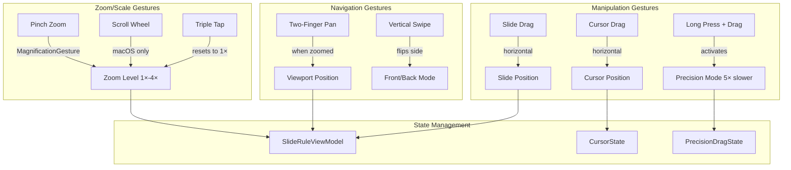

### Gesture Priority Resolution

Multiple gestures can be active simultaneously. The system resolves conflicts through:

| Gesture | Priority | Resolution |
|---------|----------|------------|
| Precision Mode | Highest | Blocks normal drag during cooldown period |
| Pan (when zoomed) | High | `.highPriorityGesture` on stators |
| Slide Drag | Medium | Standard `.gesture` on SlideView |
| Cursor Drag | Medium | Standard `.gesture` on CursorOverlay |
| Vertical Swipe | Low | `.simultaneousGesture` allows coexistence |
| Pinch Zoom | Low | `.simultaneousGesture` on detail view |

### Gesture Files Quick Reference

| File | Gestures Handled |
|------|------------------|
| [`SlideRuleDetailView.swift`](../TheElectricSlide/Components/SlideRuleDetailView.swift) | Pinch zoom, scroll wheel zoom |
| [`StatorView.swift`](../TheElectricSlide/Components/StatorView.swift) | Pan gesture (when zoomed), triple-tap reset |
| [`SideView.swift`](../TheElectricSlide/Components/SideView.swift) | Slide drag, precision slide drag, vertical swipe |
| [`CursorOverlay.swift`](../TheElectricSlide/Cursor/CursorOverlay.swift) | Cursor drag, precision cursor drag |
| [`ContentView+Gestures.swift`](../TheElectricSlide/Extensions/ContentView+Gestures.swift) | Handler implementations for all gestures |
| [`SlideRuleViewModel.swift`](../TheElectricSlide/Models/SlideRuleViewModel.swift) | Zoom/pan/slide state management |

---

## Pinch Zoom Gesture

### Purpose
Allow users to zoom in on the slide rule for detailed reading and precise positioning.

### Implementation: `SlideRuleDetailView.swift`

```swift
// In SlideRuleDetailView body
DynamicSlideRuleContent(...)
    .modifier(PanPositionModifier(offset: panOffset))
    .scaleEffect(currentZoomScale, anchor: .top)  // Scale from top
    .simultaneousGesture(
        MagnificationGesture()
            .onChanged { scale in
                handleZoomChanged(scale)
            }
            .onEnded { scale in
                handleZoomEnded(scale)
            }
    )
    .onScrollWheelZoom(  // macOS trackpad/scroll wheel
        speed: 1,
        onZoomChanged: handleZoomChanged,
        onZoomEnded: handleZoomEnded
    )
    .animation(.interactiveSpring(response: 0.3, dampingFraction: 0.8), value: currentZoomScale)
```

### Zoom Limits and Constants

```swift
enum ZoomConstants {
    static let minZoomScale: CGFloat = 1.0   // No zoom out below 1×
    static let maxZoomScale: CGFloat = 4.0   // Maximum 400% zoom
}
```

### Zoom State Management: `SlideRuleViewModel.swift`

```swift
/// Handle pinch zoom gesture change
func handleZoomChanged(scale: CGFloat) {
    let newScale = _baseZoomScale * scale
    // Clamp to valid range (no zoom out below 1.0×)
    currentZoomScale = min(max(newScale, ZoomConstants.minZoomScale), ZoomConstants.maxZoomScale)
}

/// Handle pinch zoom gesture end
func handleZoomEnded(scale: CGFloat) {
    let newScale = _baseZoomScale * scale
    
    // Snap to 1.0× if gesture reaches or goes below default scale
    if newScale <= ZoomConstants.minZoomScale {
        _baseZoomScale = ZoomConstants.minZoomScale
        currentZoomScale = ZoomConstants.minZoomScale
        // Reset pan offset when zooming back to 1.0×
        panOffset = .zero
        _basePanOffset = .zero
    } else {
        _baseZoomScale = min(newScale, ZoomConstants.maxZoomScale)
        currentZoomScale = _baseZoomScale
    }
}
```

### Zoom Flow Diagram

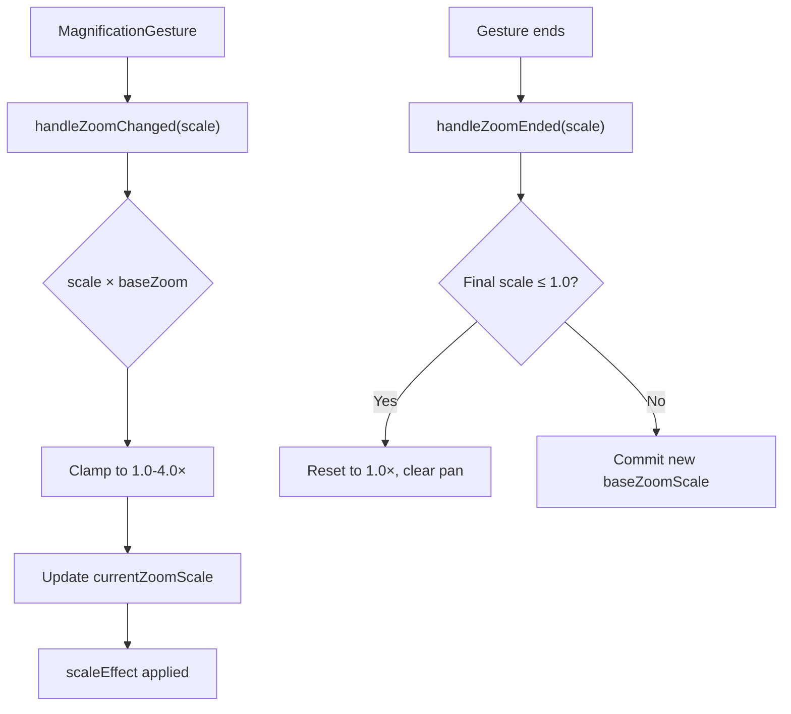

### Zoom Anchor Point

The zoom uses `.anchor: .top` to scale from the top of the view, preventing vertical shift during zoom operations. This was a deliberate design decision to maintain visual stability.

### macOS Scroll Wheel Zoom

For macOS, trackpad and scroll wheel zoom is provided via `ScrollWheelZoomModifier`:

```swift
// Speed 1-20 (exponential curve for natural feel)
// Speed 1 = 0.001 sensitivity (very fine)
// Speed 10 = 0.01 sensitivity (default)
// Speed 20 = 0.1 sensitivity (very fast)
func onScrollWheelZoom(
    speed: Int = 10,
    onZoomChanged: @escaping (CGFloat) -> Void,
    onZoomEnded: @escaping (CGFloat) -> Void
) -> some View
```

---

## Pan/Scroll Gesture

### Purpose
Allow panning the viewport when zoomed in beyond 1.0× to navigate to different parts of the slide rule.

### Implementation: `StatorView.swift`

```swift
.highPriorityGesture(
    // Pan gesture only enabled when zoomed in (>1.0x)
    (currentZoomScale > 1.0 && onPanChanged != nil && onPanEnded != nil) ?
        DragGesture(minimumDistance: 0)
            .onChanged { gesture in onPanChanged?(gesture) }
            .onEnded { gesture in onPanEnded?(gesture) }
        : nil
)
```

### Pan Handler: `ContentView+Gestures.swift`

```swift
/// Handles pan gesture changes during drag to pan zoomed content
/// Uses withTransaction to suppress animations for smooth, jitter-free tracking
func handlePanChanged(_ gesture: DragGesture.Value) {
    withTransaction(Transaction(animation: nil)) {
        viewModel.handlePanChanged(translation: gesture.translation)
    }
}

/// Handles pan gesture end and commits the new base offset
func handlePanEnded(_ gesture: DragGesture.Value) {
    withTransaction(Transaction(animation: nil)) {
        viewModel.handlePanEnded()
    }
}
```

### Pan State Management: `SlideRuleViewModel.swift`

```swift
/// Handle pan gesture change for zoomed content
func handlePanChanged(translation: CGSize) {
    panOffset = CGSize(
        width: _basePanOffset.width + translation.width,
        height: _basePanOffset.height + translation.height
    )
}

/// Handle pan gesture end - commits current offset as new base
func handlePanEnded() {
    _basePanOffset = panOffset
}

/// Whether panning is currently enabled (only when zoomed in)
var isPanEnabled: Bool {
    currentZoomScale > ZoomConstants.minZoomScale
}
```

### Pan Position Modifier

Uses a custom `PanPositionModifier` for jitter-free positioning:

```swift
struct PanPositionModifier: ViewModifier {
    let offset: CGSize
    
    func body(content: Content) -> some View {
        content
            .offset(x: offset.width, y: offset.height)
            .animation(nil, value: offset)  // Disable animation for immediate response
    }
}
```

### Zoom-Pan Relationship

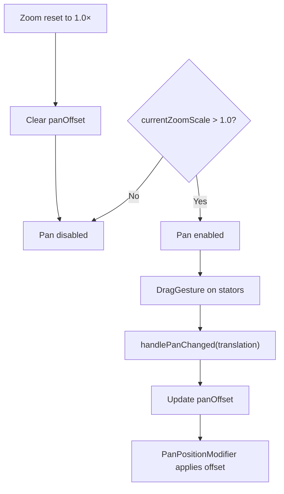

---

## Slide Drag Gesture

### Purpose
Move the slide (middle section) of the slide rule horizontally for calculations.

### Implementation: `SideView.swift`

The slide supports two drag modes: normal and precision.

#### Normal Drag

```swift
SlideView(...)
    .offset(x: sliderOffset)
    .gesture(
        DragGesture()
            .onChanged { gesture in
                // Block if precision sequence is active
                guard !slidePrecisionState.isSequenceActive else { return }
                onDragChanged(gesture, false)  // false = not precision
            }
            .onEnded { gesture in
                guard !slidePrecisionState.isSequenceActive else { return }
                onDragEnded(gesture, false)
            }
    )
    .animation(.interactiveSpring(), value: sliderOffset)
```

#### Precision Drag (Long Press + Drag)

```swift
.simultaneousGesture(
    LongPressGesture(minimumDuration: PrecisionDragConstants.longPressMinimumDuration)
        .onEnded { _ in
            slidePrecisionState.beginSession()
            haptics.fire(.longBuzz)
        }
        .sequenced(before: DragGesture())
        .updating($isSlidePrecisionDragging) { value, state, _ in
            if case .second(true, _) = value { state = true }
        }
        .onChanged { value in
            if case .second(true, let drag) = value, let drag = drag {
                slidePrecisionState.trackTranslation(drag.translation.width)
                onDragChanged(drag, true)  // true = precision mode
            }
        }
        .onEnded { value in
            if case .second(true, let drag) = value, let drag = drag {
                onDragEnded(drag, true)
            }
            slidePrecisionState.endSession()
        }
)
```

### Slide Drag Handler: `ContentView+Gestures.swift`

```swift
func handleDragChanged(_ gesture: DragGesture.Value, isPrecision: Bool) {
    cursorState.setSlideDragging(true)
    
    // Apply precision factor if in precision mode
    let translationWidth = isPrecision
        ? gesture.translation.width / PrecisionDragConstants.precisionFactor
        : gesture.translation.width
    
    viewModel.handleSliderDragChanged(translation: translationWidth)
    
    // Trigger tick haptics when crossing tick marks
    let hapticScale = TickHapticCoordinator.selectHapticScale(
        viewMode: viewMode,
        currentSlideRule: currentSlideRule
    )
    
    if let scale = hapticScale {
        let hairlinePosition = cursorState.normalizedPosition + halfCursorWidthNormalized
        tickHapticCoordinator.checkTickCrossing(
            cursorNormalizedPosition: hairlinePosition,
            slideOffset: viewModel.sliderOffset,
            scaleWidth: scaleWidth,
            cScale: scale
        )
    }
}

func handleDragEnded(_ gesture: DragGesture.Value, isPrecision: Bool) {
    viewModel.handleSliderDragEnded()
    cursorState.setSlideDragging(false)
    tickHapticCoordinator.reset()
}
```

### Slide State Management: `SlideRuleViewModel.swift`

```swift
/// Handle slider drag gesture change
func handleSliderDragChanged(translation: CGFloat) {
    let newOffset = _sliderBaseOffset + translation
    // Clamp to valid range (-scaleWidth to +scaleWidth)
    sliderOffset = min(max(newOffset, -_scaleWidth), _scaleWidth)
}

/// Handle slider drag gesture end - commits current offset
func handleSliderDragEnded() {
    _sliderBaseOffset = sliderOffset
}

/// Reset slider to center position
func resetSlider() {
    sliderOffset = 0
    _sliderBaseOffset = 0
}
```

### Slide Drag Flow

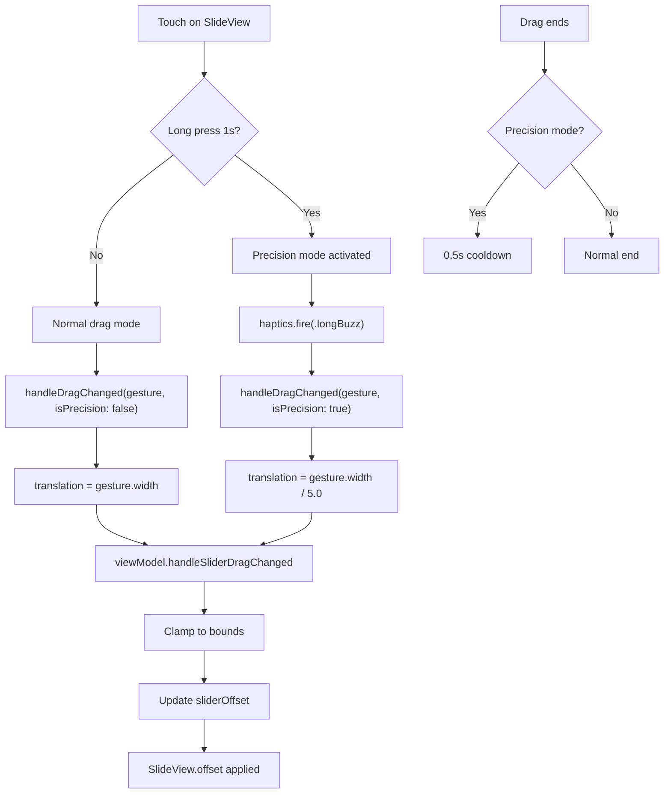

---

## Cursor Drag Gesture

### Purpose
Move the glass cursor (with hairline) horizontally across the slide rule to read values.

### Implementation: `CursorOverlay.swift`

The cursor also supports normal and precision drag modes.

#### Normal Cursor Drag

```swift
.gesture(
    DragGesture(minimumDistance: 0, coordinateSpace: .local)
        .onChanged { gesture in
            // Block if precision sequence is active
            guard !isPrecisionSequenceActive else { return }
            
            // Check minimum movement threshold to prevent micro-jitter
            let proposedNormalizedDelta = abs(gesture.translation.width) / effectiveWidth
            if proposedNormalizedDelta < PrecisionDragConstants.minimumMovementThreshold {
                return  // Ignore micro-movements
            }
            
            handleDrag(gesture, effectiveWidth: effectiveWidth, isPrecision: false)
        }
        .onEnded { gesture in
            guard !isPrecisionSequenceActive else { return }
            handleDragEnd(gesture, width: effectiveWidth, isPrecision: false)
            cursorState.setCursorDragging(false)
            withTransaction(Transaction(animation: nil)) {
                cursorState.activeDragOffset = 0
            }
        }
)
```

#### Precision Cursor Drag

```swift
.simultaneousGesture(
    LongPressGesture(minimumDuration: PrecisionDragConstants.longPressMinimumDuration)
        .onEnded { _ in
            precisionSessionID = UUID()
            isPrecisionSequenceActive = true
            positionAtPrecisionStart = cursorState.position(for: side)
            haptics.fire(.longBuzz)
        }
        .sequenced(before: DragGesture(minimumDistance: 0, coordinateSpace: .local))
        .updating($isPrecisionDragging) { value, state, _ in
            if case .second(true, _) = value { state = true }
        }
        .onChanged { value in
            if case .second(true, let drag) = value, let drag = drag {
                lastAppliedPrecisionTranslation = drag.translation.width
                handleDrag(drag, effectiveWidth: effectiveWidth, isPrecision: true)
            }
        }
        .onEnded { value in
            if case .second(true, _) = value {
                handlePrecisionDragEnd(lastAppliedTranslation: lastAppliedPrecisionTranslation, width: effectiveWidth)
            }
            cursorState.setCursorDragging(false)
            // 0.5s cooldown before re-enabling normal gestures
            DispatchQueue.main.asyncAfter(deadline: .now() + PrecisionDragConstants.cooldownDuration) {
                isPrecisionSequenceActive = false
            }
        }
)
```

### Cursor Drag Handler: `CursorOverlay.swift`

```swift
private func handleDrag(_ gesture: DragGesture.Value, effectiveWidth: CGFloat, isPrecision: Bool) {
    cursorState.setCursorDragging(true)
    
    // Apply precision factor if in precision mode
    let translationWidth = isPrecision
        ? gesture.translation.width / PrecisionDragConstants.precisionFactor
        : gesture.translation.width
    
    // Calculate clamped new position
    let currentPosition = cursorState.position(for: side)
    let currentPixelPosition = currentPosition * effectiveWidth
    let proposedNewPosition = currentPixelPosition + translationWidth
    let clampedNewPosition = min(max(proposedNewPosition, 0), effectiveWidth)
    let clampedTranslation = clampedNewPosition - currentPixelPosition
    
    // Update drag offset for visual feedback
    withTransaction(Transaction(animation: nil)) {
        cursorState.activeDragOffset = clampedTranslation
    }
    
    // Update readings in realtime
    let normalizedPosition = clampedNewPosition / effectiveWidth
    let clampedPosition = min(max(normalizedPosition, 0.0), 1.0)
    cursorState.updateReadings(at: clampedPosition)
    
    // Trigger tick haptics
    onCursorDragChanged?(clampedPosition)
}
```

### Cursor Position Normalization

The cursor position is stored as a **normalized value** (0.0 to 1.0):
- `0.0` = cursor at left edge of scale
- `1.0` = cursor at right edge of scale

The position represents the **left edge** of the cursor. To get the hairline position for reading calculations:

```swift
let hairlinePosition = cursorState.normalizedPosition + (CursorView.cursorWidth / 2.0) / scaleWidth
```

### Cursor Drag Flow

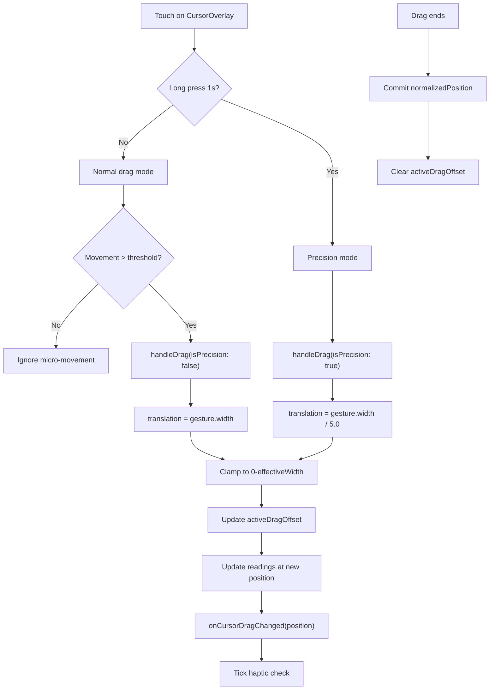

---

## Precision Mode

### Purpose
Enable fine-grained positioning of cursor and slide for precise calculations. Reduces drag sensitivity by 5× for accurate alignment.

### Shared Constants: `PrecisionDragConstants`

```swift
enum PrecisionDragConstants {
    /// Long press duration to activate (seconds)
    static let longPressMinimumDuration: TimeInterval = 1.0
    
    /// Drag sensitivity reduction factor
    static let precisionFactor: CGFloat = 5.0
    
    /// Cooldown duration after precision mode (seconds)
    static let cooldownDuration: TimeInterval = 0.5
    
    /// Minimum normalized movement to accept (prevents micro-jitter)
    static let minimumMovementThreshold: CGFloat = 0.0005
}
```

### Precision Mode State Flow

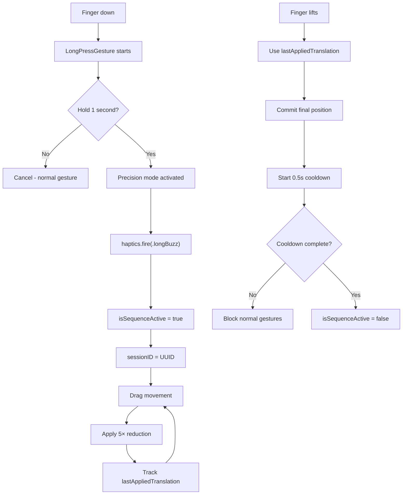

### Finger-Lift Jitter Prevention

The precision mode stores `lastAppliedTranslation` during drag and uses it in `onEnded` instead of the gesture's final translation. This prevents "finger-lift jitter" where the final translation differs from the last `onChanged` value:

```swift
// During drag - track what we're applying
lastAppliedPrecisionTranslation = drag.translation.width

// In onEnded - use tracked value, not gesture's final value
handlePrecisionDragEnd(lastAppliedTranslation: lastAppliedPrecisionTranslation, width: effectiveWidth)
```

### Three-Layer Gesture Blocking

1. **Session Active Check**: `isPrecisionSequenceActive` flag blocks normal gesture handlers
2. **Minimum Movement Threshold**: Ignores micro-movements below 0.0005 normalized
3. **Cooldown Period**: 0.5s after precision end before re-enabling normal gestures

---

## Haptic System Architecture

The app uses a centralized haptic feedback system based on the **HapticService** protocol, providing dependency injection for testability and a declarative event-based API.

### Architecture Diagram

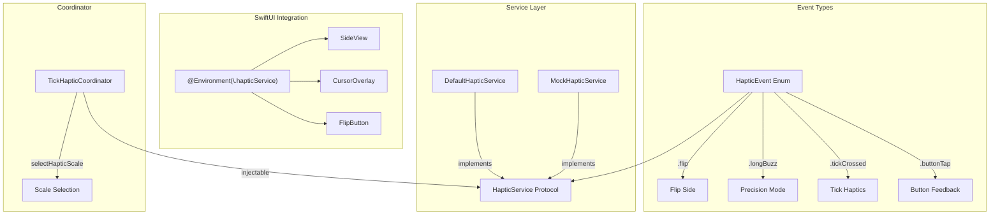

### Key Components

| Component | Purpose |
|-----------|---------|
| `HapticEvent` | Enum defining all haptic events (`.flip`, `.longBuzz`, `.tickCrossed(level:)`, `.buttonTap(style:)`) |
| `HapticService` | Protocol with `fire(_:)` and `prepare()` methods |
| `DefaultHapticService` | Production implementation using `UIImpactFeedbackGenerator` |
| `MockHapticService` | Testing implementation that records fired events |
| `TickHapticCoordinator` | Stateful coordinator for tick crossing detection with injectable service |

### Usage Pattern

```swift
// In SwiftUI views
@Environment(\.hapticService) private var haptics

// Fire events declaratively
haptics.fire(.flip)
haptics.fire(.longBuzz)
haptics.fire(.tickCrossed(level: .major))
haptics.fire(.buttonTap(style: .medium))
```

---

## Features Implemented

### 1. Vertical Swipe to Flip Sides

Swipe up or down across the slide rule body to flip between front and back sides on devices that show one side at a time (iPhone).

### 2. Long-Press Precision Mode

Press and hold for 1 second on either the cursor or slide to activate precision mode, which reduces drag sensitivity by 5× for fine-grained positioning.

### 3. Slide Tick Haptics

Feel haptic feedback when the slide moves and crosses tick marks under the cursor hairline. Uses the C scale when available, otherwise the first scale on the current slide.

### 4. Cursor Tick Haptics

Feel haptic feedback when dragging the cursor (glass indicator) across the slide rule. Triggers when the cursor hairline crosses tick marks on the stationary scales.

---

## 1. Vertical Swipe to Flip Sides

### Purpose
On compact devices (iPhone) where only one side is shown at a time, users can flip between front and back sides with a natural vertical swipe gesture instead of tapping the flip button.

### Implementation: `SideView.swift`

```swift
// Constants
private static let verticalSwipeThreshold: CGFloat = 50

// State
@State private var hasTriggeredFlip: Bool = false
@Environment(\.hapticService) private var haptics

// Gesture
.simultaneousGesture(
    DragGesture(minimumDistance: 30, coordinateSpace: .local)
        .onChanged { gesture in
            guard !hasTriggeredFlip, onFlip != nil else { return }
            
            let verticalDistance = abs(gesture.translation.height)
            let horizontalDistance = abs(gesture.translation.width)
            
            // Require vertical motion to dominate horizontal
            if verticalDistance > Self.verticalSwipeThreshold &&
               verticalDistance > horizontalDistance * 1.5 {
                hasTriggeredFlip = true
                haptics.fire(.flip)
                onFlip?()
            }
        }
        .onEnded { _ in
            hasTriggeredFlip = false
        }
)
```

### Key Design Decisions

| Decision | Rationale |
|----------|-----------|
| 50pt threshold | Prevents accidental triggers from slight finger movements |
| 1.5× vertical ratio | Ensures intentional vertical motion, not diagonal slide drags |
| `hasTriggeredFlip` flag | Prevents multiple flips during a single gesture |
| `simultaneousGesture` | Allows coexistence with slide drag gesture |

### Callback Chain

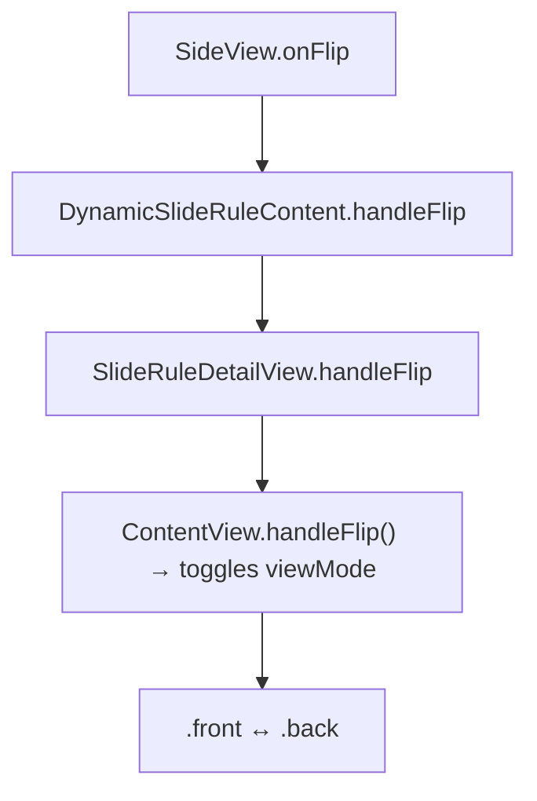

---

## 2. Long-Press Precision Mode

### Purpose
Enable fine-grained positioning of cursor and slide for precise calculations. After holding for 1 second, subsequent drag movements are reduced by 5×.

### Activation Flow

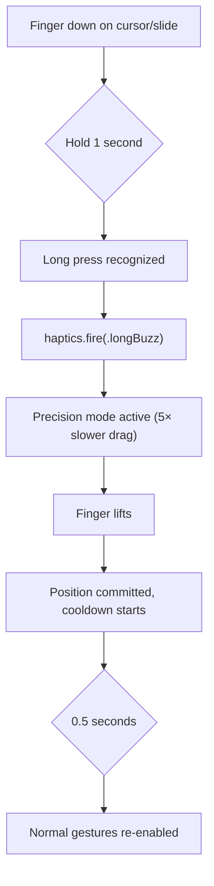

### Implementation Details

See [precision-mode-implementation.md](precision-mode-implementation.md) for complete technical documentation including:
- Finger-lift jitter prevention
- Three-layer gesture blocking strategy
- Shared constants and state management
- Tuning guide

### Quick Reference

| Parameter | Value | Location |
|-----------|-------|----------|
| Long press duration | 1.0s | `PrecisionDragConstants.longPressMinimumDuration` |
| Sensitivity factor | 5.0× | `PrecisionDragConstants.precisionFactor` |
| Cooldown duration | 0.5s | `PrecisionDragConstants.cooldownDuration` |

---

## 3. Slide Tick Haptics

### Purpose
Provide tactile feedback as the slide moves, helping users "feel" when crossing major tick marks. Different intensity haptics for different tick levels.

---

## 4. Cursor Tick Haptics

### Purpose
Provide tactile feedback as the cursor moves across the slide rule, helping users "feel" when the hairline crosses tick marks. Uses the same tick level haptic intensity as slide haptics.

### Callback Architecture

Cursor haptics use a callback pattern to propagate drag events back to ContentView+Gestures.swift, where the tick crossing logic is centralized (DRY principle with slide haptics):

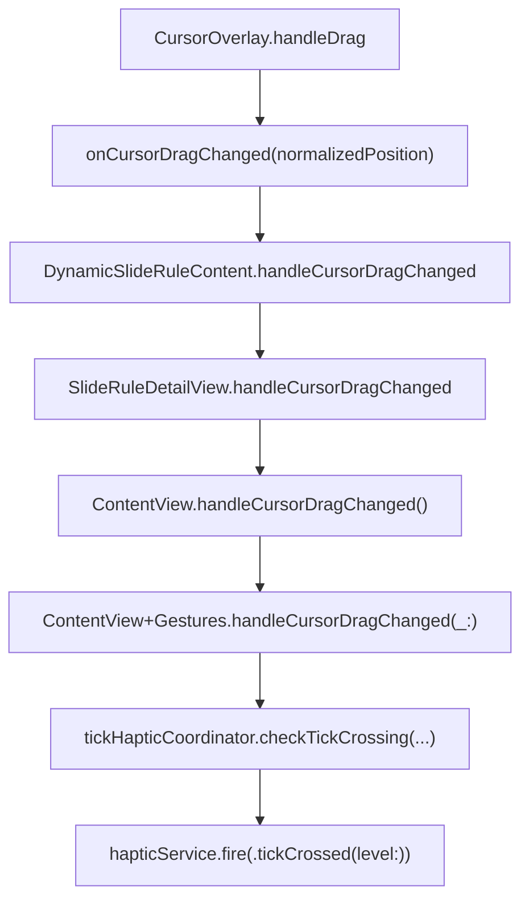

### Implementation: `CursorOverlay.swift`

```swift
/// Callback for tick haptics during cursor drag (passes normalized cursor position)
var onCursorDragChanged: ((CGFloat) -> Void)? = nil

/// Callback when cursor drag ends (for resetting tick haptic coordinator)
var onCursorDragEnded: (() -> Void)? = nil

private func handleDrag(_ value: DragGesture.Value) {
    // ... cursor position calculation ...
    
    // Notify parent for tick haptics
    onCursorDragChanged?(clampedPosition)
}

private func handleDragEnd(_ value: DragGesture.Value) {
    // ... finalize cursor position ...
    
    // Reset tick haptic coordinator for next drag
    onCursorDragEnded?()
}
```

### Integration: `ContentView+Gestures.swift`

```swift
func handleCursorDragChanged(_ cursorNormalizedPosition: CGFloat) {
    // Use centralized scale selection from TickHapticCoordinator
    let hapticScale = TickHapticCoordinator.selectHapticScale(
        viewMode: viewMode,
        currentSlideRule: currentSlideRule
    )
    
    if let scale = hapticScale {
        let hairlinePosition = cursorNormalizedPosition + halfCursorWidthNormalized
        
        tickHapticCoordinator.checkTickCrossing(
            cursorNormalizedPosition: hairlinePosition,
            slideOffset: viewModel.sliderOffset,
            scaleWidth: scaleWidth,
            cScale: scale
        )
    }
}

func handleCursorDragEnded() {
    tickHapticCoordinator.reset()
}
```

### Key Design Decisions

| Decision | Rationale |
|----------|----------|
| Callback closure pattern | Allows CursorOverlay to remain decoupled from tick haptic logic |
| Centralized scale selection | DRY - `TickHapticCoordinator.selectHapticScale()` is shared |
| Injectable HapticService | TickHapticCoordinator accepts service in init for testability |
| Reset on drag end | Ensures fresh state for next cursor gesture |

---

## Shared Tick Haptics Infrastructure

### Scale Selection

The tick haptic system uses centralized selection logic in `TickHapticCoordinator.selectHapticScale()`:

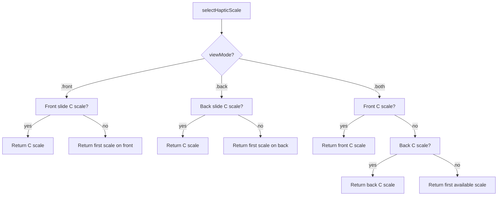

| View Mode | Device | Scale Selection Priority |
|-----------|--------|-------------------------|
| `.front` | iPhone/iPad | C scale on front slide → first scale on front slide |
| `.back` | iPhone/iPad | C scale on back slide → first scale on back slide |
| `.both` | iPad only | C scale on front slide → C scale on back slide → first scale on front slide → first scale on back slide |

In `.both` mode (iPad showing both sides), the **C scale takes precedence** regardless of which slide it's on. The front slide is checked first.

This ensures tick haptics work on all sides of the slide rule, even those without a C scale.

### Tick Levels

The `HapticEvent.TickLevel` enum classifies tick marks by their relative length:

```swift
enum TickLevel: Equatable {
    case major      // relativeLength >= 0.9
    case secondary  // relativeLength >= 0.65
    case tertiary   // relativeLength >= 0.4
    case ignored    // below threshold
    
    init(relativeLength: Double) {
        switch relativeLength {
        case 0.9...: self = .major
        case 0.65...: self = .secondary
        case 0.4...: self = .tertiary
        default: self = .ignored
        }
    }
}
```

| Tick Level | Relative Length | Haptic Intensity |
|------------|-----------------|------------------|
| `.major` | 0.9+ | Heavy (strong pop) |
| `.secondary` | 0.65+ | Medium (normal pop) |
| `.tertiary` | 0.4+ | Light (short pop) |
| `.ignored` | < 0.4 | None (ignored) |

### Implementation: `TickHapticCoordinator.swift`

```swift
@Observable
final class TickHapticCoordinator {
    /// Injectable haptic service for testability
    @ObservationIgnored private let hapticService: HapticService
    
    /// The last tick position that triggered a haptic
    @ObservationIgnored private var lastTriggeredTickPosition: Double?
    
    init(hapticService: HapticService = DefaultHapticService()) {
        self.hapticService = hapticService
    }
    
    func checkTickCrossing(
        cursorNormalizedPosition: Double,
        slideOffset: CGFloat,
        scaleWidth: CGFloat,
        cScale: GeneratedScale
    ) {
        // Calculate effective tick position under cursor
        let slideOffsetNormalized = Double(slideOffset / scaleWidth)
        let effectiveCursorPosition = cursorNormalizedPosition - slideOffsetNormalized
        let clampedPosition = min(max(effectiveCursorPosition, 0.0), 1.0)
        
        // Find nearest tick using binary search
        guard let nearestTick = findNearestTick(at: clampedPosition, in: cScale.tickMarks) else {
            return
        }
        
        // Only trigger if above minimum level
        guard nearestTick.style.relativeLength >= 0.4 else { return }
        
        // Only trigger if we crossed to a new tick
        let tickPosition = nearestTick.normalizedPosition
        if let lastPosition = lastTriggeredTickPosition {
            if abs(tickPosition - lastPosition) < 0.0001 { return }
        }
        
        // Fire haptic with appropriate level
        lastTriggeredTickPosition = tickPosition
        let tickLevel = HapticEvent.TickLevel(relativeLength: nearestTick.style.relativeLength)
        hapticService.fire(.tickCrossed(level: tickLevel))
    }
    
    /// Centralized scale selection for haptic feedback
    static func selectHapticScale(
        viewMode: ViewMode,
        currentSlideRule: SlideRule
    ) -> GeneratedScale? {
        switch viewMode {
        case .front:
            return currentSlideRule.frontSlide.scales.first(where: { $0.definition.name == "C" })
                ?? currentSlideRule.frontSlide.scales.first
        case .back:
            return currentSlideRule.backSlide?.scales.first(where: { $0.definition.name == "C" })
                ?? currentSlideRule.backSlide?.scales.first
        case .both:
            if let cScale = currentSlideRule.frontSlide.scales.first(where: { $0.definition.name == "C" }) {
                return cScale
            }
            if let cScale = currentSlideRule.backSlide?.scales.first(where: { $0.definition.name == "C" }) {
                return cScale
            }
            return currentSlideRule.frontSlide.scales.first
                ?? currentSlideRule.backSlide?.scales.first
        }
    }
    
    func reset() {
        lastTriggeredTickPosition = nil
    }
}
```

### Integration: `ContentView+Gestures.swift`

```swift
func handleDragChanged(_ gesture: DragGesture.Value, isPrecision: Bool) {
    // ... slide movement code ...
    
    // Use centralized scale selection
    let hapticScale = TickHapticCoordinator.selectHapticScale(
        viewMode: viewMode,
        currentSlideRule: currentSlideRule
    )
    
    if let scale = hapticScale {
        let hairlinePosition = cursorState.normalizedPosition + halfCursorWidthNormalized
        
        tickHapticCoordinator.checkTickCrossing(
            cursorNormalizedPosition: hairlinePosition,
            slideOffset: viewModel.sliderOffset,
            scaleWidth: scaleWidth,
            cScale: scale
        )
    }
}

func handleDragEnded(_ gesture: DragGesture.Value, isPrecision: Bool) {
    // ... commit position ...
    tickHapticCoordinator.reset()  // Reset for next drag
}
```

### Performance Considerations

- **Binary search** for finding nearest tick (O(log n) vs O(n) linear scan)
- **Throttling** via `lastTriggeredTickPosition` - only triggers once per tick crossing
- **Minimum tick level filter** (0.4) - ignores minor ticks to reduce haptic spam
- **Reset on drag end** - ensures fresh state for next gesture

---

## Haptic Feedback: `HapticService`

Centralized haptic feedback service using protocol-based dependency injection:

### HapticEvent Enum

```swift
enum HapticEvent: Equatable {
    // Discrete events
    case flip
    case precisionModeEntered
    case precisionModeExited
    case buttonTap(style: HapticStyle)
    
    // Tick-based events with context
    case tickCrossed(level: TickLevel)
    
    // Compound events
    case longBuzz
    
    enum TickLevel: Equatable {
        case major, secondary, tertiary, ignored
    }
    
    enum HapticStyle: Equatable {
        case light, medium, heavy, rigid, soft
    }
}
```

### HapticService Protocol

```swift
protocol HapticService {
    func fire(_ event: HapticEvent)
    func prepare()
}
```

### SwiftUI Environment Integration

```swift
// Environment key declaration
struct HapticServiceKey: EnvironmentKey {
    static let defaultValue: HapticService = DefaultHapticService()
}

extension EnvironmentValues {
    var hapticService: HapticService {
        get { self[HapticServiceKey.self] }
        set { self[HapticServiceKey.self] = newValue }
    }
}

// Usage in views
@Environment(\.hapticService) private var haptics

// Fire events
haptics.fire(.flip)
haptics.fire(.tickCrossed(level: .major))
```

### Platform Handling

```swift
#if os(iOS)
import UIKit

final class DefaultHapticService: HapticService {
    private let heavyGenerator = UIImpactFeedbackGenerator(style: .heavy)
    private let mediumGenerator = UIImpactFeedbackGenerator(style: .medium)
    private let lightGenerator = UIImpactFeedbackGenerator(style: .light)
    private let rigidGenerator = UIImpactFeedbackGenerator(style: .rigid)
    private let softGenerator = UIImpactFeedbackGenerator(style: .soft)
    
    func fire(_ event: HapticEvent) {
        switch event {
        case .flip:
            lightGenerator.impactOccurred()
        case .longBuzz, .precisionModeEntered:
            rigidGenerator.impactOccurred(intensity: 1.0)
            // Double-tap pattern...
        case .tickCrossed(let level):
            switch level {
            case .major: heavyGenerator.impactOccurred()
            case .secondary: mediumGenerator.impactOccurred()
            case .tertiary: lightGenerator.impactOccurred()
            case .ignored: break
            }
        case .buttonTap(let style):
            generator(for: style).impactOccurred()
        case .precisionModeExited:
            softGenerator.impactOccurred()
        }
    }
    
    func prepare() {
        // Prepare all generators for low-latency feedback
    }
}
#else
// macOS: no-op implementations
final class DefaultHapticService: HapticService {
    func fire(_ event: HapticEvent) {}
    func prepare() {}
}
#endif
```

### MockHapticService for Testing

```swift
final class MockHapticService: HapticService {
    private(set) var firedEvents: [HapticEvent] = []
    private(set) var prepareCallCount = 0
    
    func fire(_ event: HapticEvent) {
        firedEvents.append(event)
    }
    
    func prepare() {
        prepareCallCount += 1
    }
    
    func reset() {
        firedEvents.removeAll()
        prepareCallCount = 0
    }
}
```

### Migration Note

> **⚠️ Deprecation:** `HapticManager` is deprecated. Use `HapticService` via environment injection instead.
>
> | Old API | New API |
> |---------|---------|
> | `HapticManager.flipFeedback()` | `haptics.fire(.flip)` |
> | `HapticManager.longBuzz()` | `haptics.fire(.longBuzz)` |
> | `HapticManager.tickHaptic(forLevel: 1)` | `haptics.fire(.tickCrossed(level: .major))` |
> | `HapticManager.tickHaptic(forLevel: 2)` | `haptics.fire(.tickCrossed(level: .secondary))` |
> | `HapticManager.tickHaptic(forLevel: 3)` | `haptics.fire(.tickCrossed(level: .tertiary))` |

---

## Triple-Tap Zoom Reset

### Purpose
Quickly reset zoom to 1.0× and clear pan offset without using pinch gesture.

### Implementation

Triple-tap is available on stators, slide, and cursor overlay:

```swift
// StatorView.swift
.simultaneousGesture(
    TapGesture(count: 3)
        .onEnded {
            onResetZoom?()
        }
)

// SideView.swift - on SlideView
.onTapGesture(count: 3) {
    onResetZoom?()
}

// CursorOverlay.swift
.onTapGesture(count: 3) {
    onResetZoom?()
}
```

### Handler: `ContentView+Gestures.swift`

```swift
func handleResetZoom() {
    withAnimation(.interactiveSpring(response: 0.3, dampingFraction: 0.8)) {
        viewModel.resetZoom()
    }
}
```

### ViewModel: `SlideRuleViewModel.swift`

```swift
func resetZoom() {
    currentZoomScale = ZoomConstants.minZoomScale
    _baseZoomScale = ZoomConstants.minZoomScale
    panOffset = .zero
    _basePanOffset = .zero
}
```

---

## Files Overview

| File | Purpose |
|------|---------|
| [`Utilities/HapticService.swift`](../TheElectricSlide/Utilities/HapticService.swift) | **HapticEvent enum, HapticService protocol, DefaultHapticService, MockHapticService** |
| [`Utilities/TickHapticCoordinator.swift`](../TheElectricSlide/Utilities/TickHapticCoordinator.swift) | Tick crossing detection with injectable HapticService, centralized scale selection |
| [`Utilities/PrecisionDragState.swift`](../TheElectricSlide/Utilities/PrecisionDragState.swift) | Shared precision mode constants (`PrecisionDragConstants`) and state |
| [`Utilities/ScrollWheelZoomModifier.swift`](../TheElectricSlide/Utilities/ScrollWheelZoomModifier.swift) | macOS scroll wheel/trackpad zoom support |
| [`Utilities/HapticManager.swift`](../TheElectricSlide/Utilities/HapticManager.swift) | **⚠️ DEPRECATED** - Legacy haptic feedback |
| [`Models/SlideRuleViewModel.swift`](../TheElectricSlide/Models/SlideRuleViewModel.swift) | **Zoom, pan, and slide state management** with hot/cold property pattern |
| [`Components/SlideRuleDetailView.swift`](../TheElectricSlide/Components/SlideRuleDetailView.swift) | **Pinch zoom gesture** via `MagnificationGesture`, scroll wheel zoom |
| [`Components/StatorView.swift`](../TheElectricSlide/Components/StatorView.swift) | **Pan gesture** (when zoomed), triple-tap reset |
| [`Components/SideView.swift`](../TheElectricSlide/Components/SideView.swift) | **Vertical swipe**, **slide drag** (normal + precision) |
| [`Components/SlideView.swift`](../TheElectricSlide/Components/SlideView.swift) | Slide rendering (gestures are on SideView container) |
| [`Cursor/CursorOverlay.swift`](../TheElectricSlide/Cursor/CursorOverlay.swift) | **Cursor drag** (normal + precision), tick haptic callbacks |
| [`Cursor/CursorState.swift`](../TheElectricSlide/Cursor/CursorState.swift) | Cursor position normalization, drag offset tracking |
| [`Extensions/ContentView+Gestures.swift`](../TheElectricSlide/Extensions/ContentView+Gestures.swift) | **All gesture handler implementations** |
| [`Components/FlipButton.swift`](../TheElectricSlide/Components/FlipButton.swift) | Flip button with haptic feedback |
| [`ContentView.swift`](../TheElectricSlide/ContentView.swift) | Main view, gesture handler wiring |

---

## Related Documentation

- [precision-mode-implementation.md](precision-mode-implementation.md) - Deep dive on precision mode
- [glass-cursor-master-plan.md](glass-cursor-master-plan.md) - Overall cursor architecture
- [pan-gesture.md](pan-gesture.md) - Related zoomed content panning
- [zoom-label-shift-fix.md](zoom-label-shift-fix.md) - Fix for zoom rendering issues
