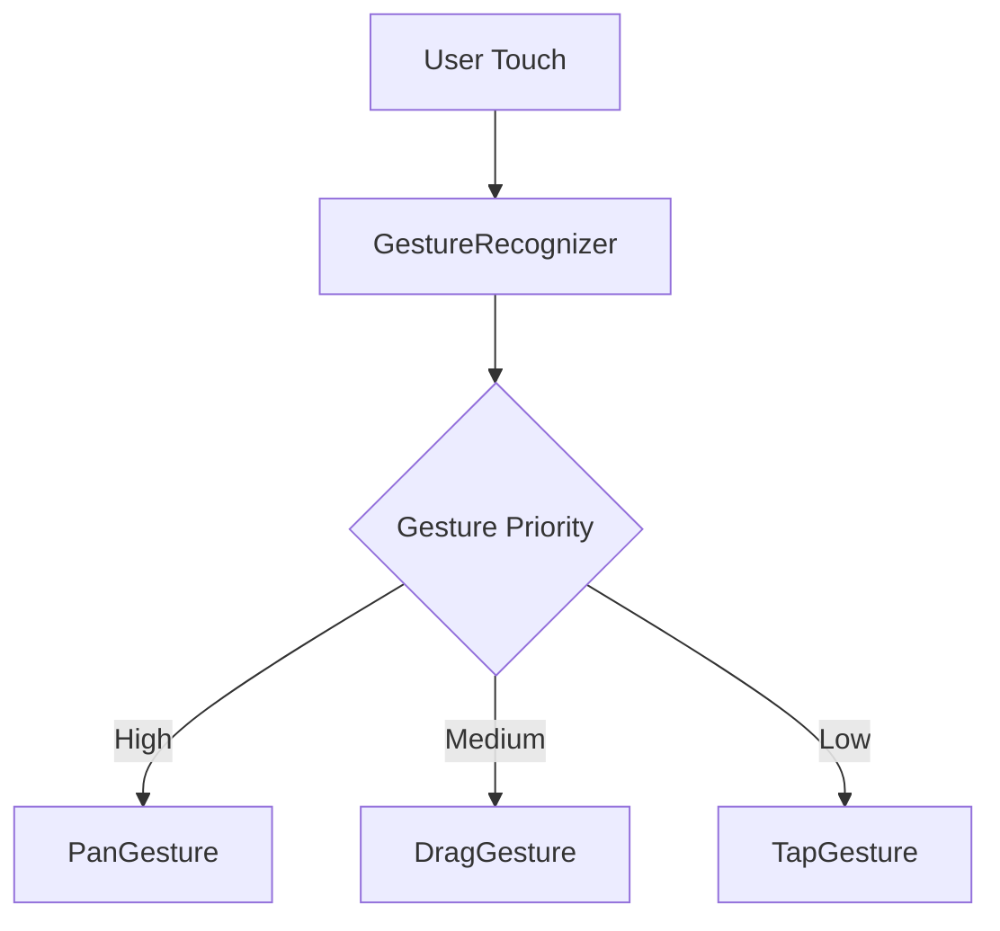

# Next Steps: After Pinch Zoom Gesture Improvements

This document outlines high-impact features to implement after completing the pinch zoom gesture conflict resolution work. Each section provides enough detail to start a new task.

---

## 1. Precision Mode Visual Polish ⭐ **TOP PRIORITY**

### Overview
Add visual feedback when precision mode is active to help users understand when fine-grained cursor control is enabled.

### Current State
- Precision mode implemented via long-press gesture (see [`swift-docs/cursor-precision-api-design.md`](../cursor-precision-api-design.md))
- Precision mode modifies drag sensitivity for fine control
- No visual indicator when precision mode is active

### Implementation Goals

#### A. Precision Mode Indicator
Add a visual indicator showing precision mode is active:
- **Location**: Near the cursor or in a non-intrusive overlay
- **Style Options**:
  - Magnifying glass icon with glow effect
  - Cursor border color change (e.g., blue → gold)
  - Small badge with "PRECISION" or "×0.2" speed multiplier
  - Pulsing animation on activation
- **Material**: Use iOS 26 Liquid Glass `.ultraThinMaterial` for translucent background

#### B. Speed Multiplier Display
Show the current drag speed reduction factor:
- Display "×0.2" or "20% speed" near cursor
- Fade in smoothly when precision mode activates
- Fade out when long-press ends

#### C. Entry/Exit Animations
- Smooth scale animation when entering precision mode (cursor grows slightly)
- Gentle spring animation when exiting
- Haptic feedback on mode transitions (light impact)

### Technical Approach

**Files to Modify:**
- [`TheElectricSlide/Cursor/CursorOverlay.swift`](../../TheElectricSlide/Cursor/CursorOverlay.swift) - Add precision indicator view
- [`TheElectricSlide/Models/SlideRuleViewModel.swift`](../../TheElectricSlide/Models/SlideRuleViewModel.swift) - Track precision mode state if not already tracked

**Key Implementation Steps:**
1. Add `@State private var isPrecisionModeActive: Bool = false` to track mode
2. Create `PrecisionModeIndicator` view component with Liquid Glass styling
3. Update long-press gesture to set `isPrecisionModeActive = true/false`
4. Add `.overlay()` to cursor with conditional `PrecisionModeIndicator`
5. Use `.transition(.scale.combined(with: .opacity))` for smooth animations
6. Add haptic feedback via `UIImpactFeedbackGenerator(style: .light).impactOccurred()`

**Design Considerations:**
- Indicator should not obscure cursor or scale readings
- Animation should feel responsive but not jarring
- Material should match the Liquid Glass aesthetic established in sidebar/navigation

### Success Criteria
- [ ] Visual indicator appears when precision mode activates
- [ ] Indicator disappears when precision mode ends
- [ ] Smooth entry/exit animations (no jank)
- [ ] Haptic feedback on transition
- [ ] Works on iOS, iPadOS, and macOS (adjust for platform UX)
- [ ] Does not interfere with cursor readings or scale visibility

### Estimated Effort
~4-6 hours for basic implementation, testing, and polish

---

## 2. Enhanced Haptic Feedback System

### Overview
Expand haptic feedback beyond basic interactions to create a more tactile, responsive experience across all gestures.

### Current State
- Basic haptic feedback implemented (see [`swift-docs/navigation-gestures-haptics-implementation.md`](../navigation-gestures-haptics-implementation.md))
- Haptics for some gestures but not comprehensive

### Implementation Goals

#### A. Gesture-Blocked Feedback
When pinch-zoom blocks slide/cursor drag gestures:
- Add subtle haptic when user attempts blocked gesture
- Use `UINotificationFeedbackGenerator(type: .warning)` for "can't do that right now" feel
- Prevents confusion when drag doesn't respond during zoom

#### B. Cursor Snap Feedback
When cursor snaps to scale tick marks:
- Light haptic (`UIImpactFeedbackGenerator(style: .rigid)`) on snap
- Different intensity based on tick mark level (major vs. minor)
- Can be toggled in settings for user preference

#### C. Gesture Hierarchy Feedback
Different haptic patterns for different gesture types:
- **Light impact**: Single tap, cursor snap
- **Medium impact**: Drag start, precision mode start
- **Heavy impact**: Zoom reset (triple-tap)
- **Rigid impact**: Scale alignment, major tick snap
- **Soft impact**: UI element interactions

#### D. Zoom Level Feedback
Haptic feedback at zoom level milestones:
- Light tap at 1.0× (neutral zoom)
- Medium tap at 2.0×, 3.0×, etc.
- Helps user know exactly when they reach common zoom levels

### Technical Approach

**Files to Modify:**
- [`TheElectricSlide/Utilities/GestureHandler.swift`](../../TheElectricSlide/Utilities/GestureHandler.swift) - Centralize haptic logic
- [`TheElectricSlide/Components/SideView.swift`](../../TheElectricSlide/Components/SideView.swift) - Add blocked gesture feedback
- [`TheElectricSlide/Cursor/CursorOverlay.swift`](../../TheElectricSlide/Cursor/CursorOverlay.swift) - Add snap feedback

**Create Haptic Utility:**
```swift
// TheElectricSlide/Utilities/HapticFeedback.swift
enum HapticFeedback {
    case light, medium, heavy, rigid, soft
    case warning, success, error
    
    func play() {
        #if os(iOS)
        // Implementation
        #endif
    }
}
```

**Key Implementation Steps:**
1. Create centralized `HapticFeedback` utility
2. Add haptic calls at gesture interaction points
3. Make blocked gesture detection trigger warning haptic
4. Add snap detection and haptic in cursor logic
5. Add settings toggle for haptics (optional)

### Success Criteria
- [ ] Distinct haptic patterns for different interactions
- [ ] Blocked gesture haptic prevents user confusion
- [ ] Cursor snap feedback is subtle but noticeable
- [ ] All haptics work only on iOS/iPadOS (macOS has no haptics)
- [ ] Performance impact is negligible

### Estimated Effort
~6-8 hours for comprehensive haptic system

---

## 3. Glass Cursor with Liquid Glass Materials

### Overview
Implement a translucent "glass" cursor using iOS 26 Liquid Glass materials that adapts to the content beneath it.

### Current State
- Cursor rendered as solid colored line (see cursor implementation)
- No translucency or material effects
- [`swift-docs/glass-cursor-master-plan.md`](../glass-cursor-master-plan.md) has comprehensive planning

### Implementation Goals

#### A. Translucent Material
Replace solid cursor with translucent glass:
- Use `.ultraThinMaterial` or `.thinMaterial` from iOS 26
- Blur and diffuse content beneath cursor
- Maintain high contrast for readability

#### B. Adaptive Shadow/Glow
Add subtle shadow or glow for visibility:
- Light shadow when over dark scale backgrounds
- Subtle glow when over light backgrounds
- Auto-adjust based on average luminance beneath cursor

#### C. Smooth Animations
Animate cursor appearance/movement:
- Fade in/out when showing/hiding cursor
- Spring animation when dragging
- Smooth color transitions when adapting to background

### Technical Approach

**Files to Modify:**
- [`TheElectricSlide/Cursor/CursorOverlay.swift`](../../TheElectricSlide/Cursor/CursorOverlay.swift) - Main cursor rendering
- Create new `GlassCursor.swift` component

**Key Implementation Steps:**
1. Replace solid `Rectangle()` with `RoundedRectangle()` + `.background(.ultraThinMaterial)`
2. Add `.shadow()` modifier with adaptive radius/color
3. Implement background luminance detection (sample colors beneath cursor)
4. Add conditional glow based on luminance (`.glow()` or layered shadows)
5. Use `.animation(.spring(response: 0.3), value: cursorPosition)` for smooth movement

**Design Reference:**
- Study iOS 26 Control Center for glass material usage
- Match translucency level to sidebar Liquid Glass implementation
- Ensure cursor remains visible across all slide rule color schemes

### Success Criteria
- [ ] Cursor is translucent with visible content beneath
- [ ] High contrast maintained for readability
- [ ] Adaptive shadow/glow enhances visibility
- [ ] Smooth animations on all cursor movements
- [ ] Consistent with Liquid Glass aesthetic in app
- [ ] Works across light/dark modes

### Estimated Effort
~8-12 hours for implementation, testing, and cross-platform polish

---

## 4. iOS/iPad/Mac Platform Consistency Audit

### Overview
Comprehensive audit of platform-specific code to ensure intentional differences are documented and inconsistencies are resolved.

### Current Problem
- Multiple `#if os(iOS)` and `#if os(macOS)` conditionals scattered across codebase
- Some differences are intentional (e.g., no haptics on macOS)
- Other differences may be accidental or undocumented

### Implementation Goals

#### A. Code Audit
Review all platform-specific code blocks:
- Search for all `#if os(iOS)`, `#if os(macOS)`, `#if os(iPadOS)` conditionals
- Document the reason for each platform difference
- Identify accidental inconsistencies

#### B. Documentation
Create platform differences reference doc:
- List all intentional platform-specific behaviors
- Explain rationale for each difference
- Mark items that should be unified in future

#### C. Gesture Behavior Parity
Ensure gestures feel native on each platform:
- **iOS/iPadOS**: Touch-optimized (pinch zoom, swipe, tap)
- **macOS**: Trackpad/mouse-optimized (scroll zoom, modifier keys, right-click)
- Verify each gesture works as expected on its platform

### Technical Approach

**Search Commands:**
```bash
# Find all platform conditionals
grep -rn "#if os(" TheElectricSlide/

# Count platform-specific code
grep -r "#if os(iOS)" TheElectricSlide/ | wc -l
grep -r "#if os(macOS)" TheElectricSlide/ | wc -l
```

**Files to Review:**
- [`TheElectricSlide/Components/SideView.swift`](../../TheElectricSlide/Components/SideView.swift) - Vertical flip iOS-only
- [`TheElectricSlide/Components/DynamicSlideRuleContent.swift`](../../TheElectricSlide/Components/DynamicSlideRuleContent.swift) - Dimension handling
- All gesture handlers
- All view components

**Create Documentation:**
- `swift-docs/platform-differences-reference.md` - Comprehensive platform behavior guide

### Success Criteria
- [ ] All platform conditionals documented with rationale
- [ ] Accidental inconsistencies identified and fixed
- [ ] Gestures feel native on each platform
- [ ] Reference documentation created
- [ ] Future platform differences have clear justification

### Estimated Effort
~4-6 hours for audit and documentation

---

## 5. NavigationSplitView Advanced Interactions

### Overview
Add advanced navigation features to the NavigationSplitView sidebar, building on the Liquid Glass implementation.

### Current State
- Basic NavigationSplitView with Liquid Glass translucency
- Manual sidebar toggle button
- No keyboard shortcuts or gesture-based controls

### Implementation Goals

#### A. Keyboard Shortcuts (macOS)
Add standard macOS shortcuts:
- `⌘B` or `⌘⌥S` to toggle sidebar
- `⌘1`, `⌘2`, `⌘3` to select slide rules by index
- Arrow keys to navigate sidebar list items

#### B. Swipe Gesture (iOS/iPadOS)
Implement edge swipe to show sidebar:
- Swipe from left edge reveals sidebar
- Swipe right on sidebar hides it
- Standard iOS navigation pattern

#### C. Haptic Feedback
Add haptics for sidebar interactions:
- Light impact when sidebar appears
- Light impact when sidebar disappears
- Medium impact when selecting slide rule

### Technical Approach

**Files to Modify:**
- [`TheElectricSlide/ContentView.swift`](../../TheElectricSlide/ContentView.swift) - Add keyboard shortcuts
- [`TheElectricSlide/Components/SlideRuleSidebarView.swift`](../../TheElectricSlide/Components/SlideRuleSidebarView.swift) - Add swipe gesture

**Keyboard Shortcuts (macOS):**
```swift
.keyboardShortcut("b", modifiers: [.command])
.onCommand(#selector(toggleSidebar)) { toggleSidebar() }
```

**Edge Swipe (iOS):**
```swift
.gesture(
    DragGesture(minimumDistance: 0, coordinateSpace: .global)
        .onEnded { value in
            if value.startLocation.x < 20 && value.translation.width > 50 {
                // Show sidebar
            }
        }
)
```

### Success Criteria
- [ ] Keyboard shortcuts work on macOS
- [ ] Edge swipe works on iOS/iPadOS
- [ ] Haptic feedback on sidebar state changes
- [ ] Standard platform behaviors respected
- [ ] No conflicts with existing gestures

### Estimated Effort
~3-5 hours for keyboard + swipe + haptics

---

## 6. Hot/Cold Property Performance Optimization

### Overview
Audit and optimize view model properties to minimize unnecessary view updates and improve gesture performance.

### Current State
- Many `@Published` properties in SlideRuleViewModel
- Some properties may trigger unnecessary view refreshes
- See [`swift-docs/refactoring-contentview.md`](../refactoring-contentview.md) for context

### Implementation Goals

#### A. Property Audit
Review all `@Published` properties:
- Identify which properties truly need to trigger view updates (cold)
- Identify which properties can be computed or non-published (hot)
- Document decision rationale

#### B. Computed Properties
Convert appropriate properties to computed:
- Properties derived from other state
- Properties that don't need observation
- Properties read more than written

#### C. Performance Testing
Add performance tests:
- Measure gesture frame rate (should stay at 120Hz on ProMotion displays)
- Measure view update frequency
- Profile with Instruments to find bottlenecks

### Technical Approach

**Files to Review:**
- [`TheElectricSlide/Models/SlideRuleViewModel.swift`](../../TheElectricSlide/Models/SlideRuleViewModel.swift) - Main view model
- All view components that observe view model

**Performance Test Example:**
```swift
func testGesturePerformance() {
    measure(metrics: [XCTClockMetric()]) {
        // Simulate rapid gesture updates
        viewModel.handlePanChanged(...)
    }
    // Assert frame time < 8.33ms (120fps)
}
```

**Hot/Cold Pattern:**
- **COLD (Published)**: State changes that require view updates
- **HOT (Non-published)**: Derived values, temporary state, frequently-updated values

### Success Criteria
- [ ] All properties classified as hot or cold with rationale
- [ ] Unnecessary `@Published` removed
- [ ] Performance tests show 120fps maintained during gestures
- [ ] Documentation updated with hot/cold pattern

### Estimated Effort
~6-8 hours for audit, optimization, and testing

---

## 7. Gesture System Consolidation

### Overview
Refactor duplicate gesture patterns into reusable modifiers to reduce code duplication and improve maintainability.

### Current State
- Similar gesture patterns in [`SideView.swift`](../../TheElectricSlide/Components/SideView.swift), [`CursorOverlay.swift`](../../TheElectricSlide/Cursor/CursorOverlay.swift), [`StatorView.swift`](../../TheElectricSlide/Components/StatorView.swift)
- Duplicate `isSlideDragEnabled` / `isCursorDragEnabled` pattern
- Gesture priority handling spread across files

### Implementation Goals

#### A. Reusable Gesture Modifiers
Create custom view modifiers for common patterns:
- `ConditionalDragGesture(isEnabled:onChanged:onEnded:)`
- `PrecisionDragGesture(isEnabled:onChanged:onEnded:)`
- `MagnificationBlockingDragGesture(viewModel:onChanged:onEnded:)`

#### B. Centralized Gesture State
Move common gesture state to shared locations:
- `isMagnifying` already in SlideRuleViewModel ✓
- `isPrecisionMode` could be shared
- Gesture priority constants in one place

#### C. Documentation
Document the gesture system architecture:
- Gesture priority hierarchy
- How gestures interact and block each other
- When to use each gesture type

### Technical Approach

**Create Gesture Utilities:**
```swift
// TheElectricSlide/Utilities/GestureModifiers.swift

struct ConditionalDragGesture: ViewModifier {
    let isEnabled: Bool
    let onChanged: (DragGesture.Value) -> Void
    let onEnded: (DragGesture.Value) -> Void
    
    func body(content: Content) -> some View {
        content.gesture(
            DragGesture()
                .onChanged(onChanged)
                .onEnded(onEnded),
            isEnabled: isEnabled
        )
    }
}

extension View {
    func conditionalDrag(
        isEnabled: Bool,
        onChanged: @escaping (DragGesture.Value) -> Void,
        onEnded: @escaping (DragGesture.Value) -> Void
    ) -> some View {
        modifier(ConditionalDragGesture(isEnabled: isEnabled, onChanged: onChanged, onEnded: onEnded))
    }
}
```

**Files to Modify:**
- Create `TheElectricSlide/Utilities/GestureModifiers.swift`
- Refactor SideView, CursorOverlay, StatorView to use modifiers

### Success Criteria
- [ ] Duplicate gesture code eliminated
- [ ] Reusable modifiers created and documented
- [ ] All gesture interactions continue working
- [ ] Code is more maintainable and DRY
- [ ] Architecture documentation updated

### Estimated Effort
~8-10 hours for refactoring and testing

---

## 8. Gesture Integration Tests

### Overview
Add comprehensive integration tests for the gesture system to prevent regressions and ensure reliable multi-touch behavior.

### Current State
- Some unit tests exist (see `TheElectricSlideTests/`)
- No comprehensive gesture integration tests
- Pinch-zoom conflict resolution not tested

### Implementation Goals

#### A. Pinch-Zoom Conflict Tests
Test that slide/cursor drag is blocked during pinch:
- Simulate pinch gesture + drag attempt
- Assert that `isMagnifying` is true
- Assert that drag gestures are disabled

#### B. Gesture Priority Tests
Test gesture priority hierarchy:
- High-priority pan blocks lower-priority gestures
- Simultaneous gestures work as expected
- Long-press precision mode takes precedence

#### C. Multi-Touch Gesture Tests
Test complex gesture combinations:
- Two-finger pinch + third finger drag
- Long-press + drag (precision mode)
- Triple-tap during active pan

### Technical Approach

**Test Framework:**
- Use XCTest with UI testing
- Simulate touch events programmatically
- Assert on view model state and gesture enablement

**Example Test:**
```swift
func testPinchZoomBlocksSlideDrag() {
    let viewModel = SlideRuleViewModel()
    viewModel.setMagnificationActive(true)
    
    // Assert slide drag should be disabled
    XCTAssertTrue(viewModel.isMagnifying)
    // Assert cursor drag should be disabled
    XCTAssertFalse(shouldEnableDrag(viewModel: viewModel))
}

func testGestureTiming() {
    // Simulate long-press followed by drag
    measure(metrics: [XCTClockMetric()]) {
        simulateLongPress()
        simulateDrag()
    }
    // Assert precision mode activated within timing threshold
}
```

**Files to Create:**
- `TheElectricSlideTests/Integration/GestureConflictTests.swift`
- `TheElectricSlideTests/Integration/MultiTouchTests.swift`
- `TheElectricSlideTests/Integration/GesturePriorityTests.swift`

### Success Criteria
- [ ] Pinch-zoom conflict resolution has test coverage
- [ ] Gesture priority hierarchy is tested
- [ ] Multi-touch combinations are tested
- [ ] All tests pass and prevent future regressions
- [ ] Test suite runs in < 10 seconds

### Estimated Effort
~6-8 hours for comprehensive test suite

---

## 9. Comprehensive Architecture Documentation

### Overview
Create a single, comprehensive architecture document covering the gesture system, view hierarchy, and platform-specific behaviors.

### Current State
- Documentation scattered across multiple files
- Gesture system not fully documented in one place
- Platform differences not centralized

### Implementation Goals

#### A. Gesture System Architecture
Document complete gesture flow:
- Gesture recognition and priority
- How gestures interact (block, allow, simultaneous)
- State management for gestures
- Mermaid diagram showing gesture flow

#### B. View Hierarchy Documentation
Document view structure:
- Parent-child relationships
- Data flow between views
- Environment object usage
- Mermaid diagram of view hierarchy

#### C. Platform-Specific Behavior
Centralize platform differences:
- Why each platform has different behavior
- Rationale for choices made
- Future considerations for unified behavior

### Technical Approach

**Create Architecture Doc:**
- `swift-docs/architecture/gesture-system-architecture.md`
- `swift-docs/architecture/view-hierarchy.md`
- `swift-docs/architecture/platform-behaviors.md`

**Use Mermaid Diagrams:**


**Content Outline:**
1. **Gesture System**
   - Gesture types and priorities
   - Conflict resolution patterns
   - State management
   - Examples and code snippets

2. **View Hierarchy**
   - Root NavigationSplitView
   - Sidebar and Detail views
   - Gesture environment propagation
   - Data flow diagrams

3. **Platform Behaviors**
   - iOS-specific features
   - macOS-specific features
   - Shared behaviors
   - Future unification plans

### Success Criteria
- [ ] Single source of truth for architecture
- [ ] Mermaid diagrams for visual understanding
- [ ] Code examples and references
- [ ] Easy to onboard new developers
- [ ] Kept up-to-date with code changes

### Estimated Effort
~8-12 hours for comprehensive documentation

---

## Priority Ranking

Based on impact, effort, and dependencies:

1. **Precision Mode Visual Polish** - High impact, moderate effort, builds on existing work
2. **Enhanced Haptic Feedback** - High impact, moderate effort, improves UX significantly  
3. **Glass Cursor Implementation** - High impact, higher effort, strong visual payoff
4. **Platform Consistency Audit** - Medium impact, low effort, prevents future issues
5. **NavigationSplitView Interactions** - Medium impact, low effort, standard features
6. **Hot/Cold Property Optimization** - High impact, moderate effort, performance gains
7. **Gesture System Consolidation** - Medium impact, moderate effort, code quality
8. **Gesture Integration Tests** - High impact, moderate effort, prevents regressions
9. **Architecture Documentation** - Medium impact, moderate effort, long-term value

## Getting Started

To begin any of these tasks:
1. Read the relevant existing documentation referenced in each section
2. Review the files listed under "Files to Modify"
3. Create a new task with the goal and success criteria
4. Implement iteratively, testing as you go
5. Update documentation when complete

Happy coding! 🚀
