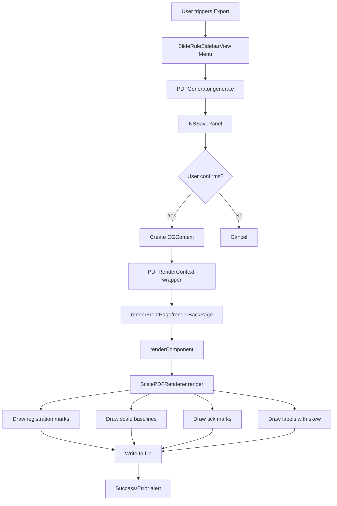

# PDF Generation System Implementation Plan

**Document Status:** Updated to reflect current implementation as of 2024-12-23

**Version:** 2.0  
**Date:** 2024-12-23  
**Target:** TheElectricSlide macOS Application

---

## Table of Contents

1. [Executive Summary](#executive-summary)
2. [Current Implementation Status](#current-implementation-status)
3. [System Architecture](#system-architecture)
4. [Core Components](#core-components)
5. [Physical Dimensions](#physical-dimensions)
6. [Font System Architecture](#font-system-architecture)
7. [PostScript Spacing Standards](#postscript-spacing-standards)
8. [Registration Marks](#registration-marks)
9. [Rendering Strategy](#rendering-strategy)
10. [Page Layout Architecture](#page-layout-architecture)
11. [Code Reuse Strategy](#code-reuse-strategy)
12. [Testing Strategy](#testing-strategy)
13. [Error Handling](#error-handling)
14. [Future Enhancements](#future-enhancements)

---

## Executive Summary

This document describes the **implemented** PDF export functionality in TheElectricSlide slide rule application. The system leverages existing [`SlideRuleCoreV3`](../SlideRuleCoreV3/Sources/SlideRuleCoreV3/) scale definitions and calculations while using Core Graphics (CGContext) for high-precision PDF output that matches PostScript reference implementations.

### Key Design Principles

1. **Code Reuse**: Maximizes use of existing [`ScaleDefinition`](../SlideRuleCoreV3/Sources/SlideRuleCoreV3/ScaleDefinition.swift), [`ScaleCalculator`](../SlideRuleCoreV3/Sources/SlideRuleCoreV3/ScaleCalculator.swift), and [`GeneratedScale`](../SlideRuleCoreV3/Sources/SlideRuleCoreV3/ScaleCalculator.swift) structures
2. **Precision**: Maintains vector-quality output using PostScript-compatible standards
3. **PostScript Parity**: Matches reference implementation spacing and typography
4. **Dual Font System**: Separate optimized sizes for PDF/print vs. screen display

### Implementation Directory

All PDF export code is located in [`TheElectricSlide/PDFOutput/`](../TheElectricSlide/PDFOutput/):
- [`PDFExportConfiguration.swift`](../TheElectricSlide/PDFOutput/PDFExportConfiguration.swift)
- [`PDFGenerator.swift`](../TheElectricSlide/PDFOutput/PDFGenerator.swift) 
- [`PDFRenderContext.swift`](../TheElectricSlide/PDFOutput/PDFRenderContext.swift)
- [`ScalePDFRenderer.swift`](../TheElectricSlide/PDFOutput/ScalePDFRenderer.swift)

---

## Current Implementation Status

### ✅ Implemented Features

- **Physical output at metric standards** (25cm/12.5cm)
- **PostScript-aligned spacing** (C/D gap, component separation)
- **Dual font size system** via [`FontSizeConfiguration`](../TheElectricSlide/Rendering/FontSizeConfiguration.swift)
- **Registration marks** for physical assembly
- **Cutting guides** between stator and slide
- **Fixed 11x17" media box** with content centering
- **Color support** for scale names (inheriting from `labelColor`)
- **Coordinate rounding** for SwiftUI parity
- **UI integration** in [`SlideRuleSidebarView`](../TheElectricSlide/Components/SlideRuleSidebarView.swift:282)

### 📋 Architecture Highlights

- **4 core files** (not 5+ as originally planned)
- **Nested error handling** ([`PDFError`](../TheElectricSlide/PDFOutput/PDFGenerator.swift:11) within [`PDFGenerator`](../TheElectricSlide/PDFOutput/PDFGenerator.swift))
- **No separate coordinator classes** (functionality absorbed into existing components)
- **Tick threshold system** based on relative lengths (0.9/0.7/0.4)
- **Explicit PostScript references** in comments (e.g., "TitleFont1 6.5 scalefont")

---

## System Architecture



### Data Flow

```
SlideRule (from SlideRuleCoreV3)
    └── Contains: Stator, Slide components
        └── Each contains: GeneratedScale[]
            └── Has: ScaleDefinition, TickMark[]
            
PDFExportConfiguration
    └── size: .full (708pts) or .pocket (354pts)
    └── Fixed 11x17" media box (792x1224 pts)
    └── contentOffsetX/contentOffsetY for centering
    
PDFGenerator (enum with static methods)
    └── generate(config:to:) - main entry point
    └── renderFrontPage/renderBackPage
    └── renderComponent - handles stator/slide
    └── PDFError (nested enum)
    
PDFRenderContext
    └── Wraps CGContext + config
    └── drawRegistrationMarks() - 5mm x 4mm
    └── drawTextCoreText with skewAmount parameter
    └── drawLine, measureText helpers
    
ScalePDFRenderer (enum with static methods)
    └── render(scale:at:width:height:renderContext:)
    └── calculateLabelPosition(...)
    └── Uses FontSizeConfiguration for dual sizing
```

---

## Core Components

### 1. PDFExportConfiguration

Located in [`TheElectricSlide/PDFOutput/PDFExportConfiguration.swift`](../TheElectricSlide/PDFOutput/PDFExportConfiguration.swift)

**Key properties:**
- **Metric dimensions**: 25cm (708 pts) / 12.5cm (354 pts)
- **Fixed media box**: 11x17" (792x1224 pts) for all exports
- **Content offsets**: `contentOffsetX` and `contentOffsetY` for centering
- **Size enum**: `.full` and `.pocket` options

### 2. PDFGenerator

Located in [`TheElectricSlide/PDFOutput/PDFGenerator.swift`](../TheElectricSlide/PDFOutput/PDFGenerator.swift)

**Main enum** with static methods:

```swift
enum PDFGenerator {
    // Nested error type (line 11)
    enum PDFError: Error, LocalizedError {
        case cannotCreateFile(URL)
        case cannotCreateContext
        case renderingFailed(String)
        case noBackSide
    }
    
    // Main entry point (line 38)
    static func generate(config: PDFExportConfiguration, to fileURL: URL) throws
    
    // Page rendering (line 93)
    private static func renderFrontPage(renderContext: PDFRenderContext, 
                                       config: PDFExportConfiguration) throws
    
    // Component iteration (line 200)
    private static func renderComponent<T: ScaleContainer>(
        component: T,
        at yPosition: CGFloat,
        renderContext: PDFRenderContext,
        config: PDFExportConfiguration
    ) throws -> CGFloat
}
```

**Note**: No separate `PDFExportCoordinator` class - all coordination is handled by static methods in [`PDFGenerator`](../TheElectricSlide/PDFOutput/PDFGenerator.swift).

### 3. PDFRenderContext

Located in [`TheElectricSlide/PDFOutput/PDFRenderContext.swift`](../TheElectricSlide/PDFOutput/PDFRenderContext.swift)

**Key methods:**

```swift
struct PDFRenderContext {
    let context: CGContext
    let config: PDFExportConfiguration
    
    // Registration marks (implemented)
    func drawRegistrationMarks(pageRect: CGRect, contentWidth: CGFloat)
    
    // Text rendering with skew (line 89)
    func drawTextCoreText(
        _ text: String,
        at position: CGPoint,
        fontSize: CGFloat,
        fontName: String = "Helvetica",
        color: CGColor = CGColor(gray: 0, alpha: 1),
        skewAmount: CGFloat = 0  // Note: skewAmount, not skewAngle
    )
    
    func drawLine(from start: CGPoint, to end: CGPoint, 
                  lineWidth: CGFloat = 0.5, 
                  color: CGColor = CGColor(gray: 0, alpha: 1))
    
    func measureText(_ text: String, fontSize: CGFloat, 
                    fontName: String = "Helvetica") -> CGSize
}
```

### 4. ScalePDFRenderer

Located in [`TheElectricSlide/PDFOutput/ScalePDFRenderer.swift`](../TheElectricSlide/PDFOutput/ScalePDFRenderer.swift)

**Main rendering enum:**

```swift
enum ScalePDFRenderer {
    // Main entry point (line 13)
    static func render(
        scale: GeneratedScale,
        at origin: CGPoint,
        width: CGFloat,
        height: CGFloat,
        renderContext: PDFRenderContext
    ) throws
    
    // Label positioning (line 200)
    private static func calculateLabelPosition(
        labelConfig: LabelConfig,
        xPos: CGFloat,
        tickHeight: CGFloat,
        textSize: CGSize,
        tickDirection: TickDirection,
        origin: CGPoint,
        scaleHeight: CGFloat
    ) -> CGPoint
}
```

---

## Physical Dimensions

### Metric Standards (Implemented)

The system uses metric dimensions with PostScript point conversion:

| Dimension | Metric | Points | Calculation |
|-----------|--------|--------|-------------|
| **Full-size** | 25 cm | 708 pts | 25 × 28.3465 = 708.66 ≈ 708 |
| **Pocket-size** | 12.5 cm | 354 pts | 12.5 × 28.3465 = 354.33 ≈ 354 |
| **Media box** | 11" × 17" | 792 × 1224 pts | Fixed for all exports |
| **Conversion** | 1 cm | 28.3465 pts | Standard PostScript |

### Coordinate System

**PDF/CGContext**: Origin at bottom-left, Y increases upward
**SwiftUI Canvas**: Origin at top-left, Y increases downward

**Conversion** is handled via:
```swift
let pdfY = pageHeight - topDownY
```

All coordinates use `round()` for SwiftUI parity and precise pixel alignment.

---

## Font System Architecture

### Dual Font Size System

The implementation uses [`FontSizeConfiguration`](../TheElectricSlide/Rendering/FontSizeConfiguration.swift) to manage two distinct font size sets:

#### PDF/Print Sizes (PostScript Optimized)

```swift
// From FontSizeConfiguration.swift
static let pdfSizes = FontSizeSet(
    majorTickLabel: 4.5,   // Optimized for 300+ DPI printing
    mediumTickLabel: 3.8,  // PostScript reference match
    minorTickLabel: 3.2    // Maintains readability at scale
)
```

**Usage in PDF:**
- Major tick labels: **4.5pt** (0.0625" or 1.59mm)
- Medium tick labels: **3.8pt** (0.053" or 1.34mm)
- Minor tick labels: **3.2pt** (0.044" or 1.12mm)

#### Screen Sizes (Digital Readability)

```swift
static let screenSizes = FontSizeSet(
    majorTickLabel: 8.0,   // Readable at typical screen DPI
    mediumTickLabel: 6.5,  // Clear differentiation
    minorTickLabel: 5.0    // Minimum for screen viewing
)
```

### Scale Metadata Typography

```swift
// Scale names (left side)
fontSize: 6.5pt
fontName: "Helvetica-Bold"
// PostScript reference: "TitleFont1 6.5 scalefont"

// Scale formulas (right side)
fontSize: 9pt
fontName: "Helvetica"
// PostScript reference: "/Helvetica findfont 9 scalefont setfont"
```

### Color Support

Scale names inherit color from `definition.labelColor`:
```swift
if let color = definition.labelColor {
    renderContext.drawTextCoreText(
        definition.displayName ?? definition.name,
        at: namePosition,
        fontSize: 6.5,
        fontName: "Helvetica-Bold",
        color: CGColor(red: color.red, green: color.green, blue: color.blue, alpha: 1.0)
    )
}
```

---

## PostScript Spacing Standards

### Scale Separation

#### C/D Scale Gap (Special Case)

**3.4mm gap** (~9.67 pts) for PostScript alignment:
```swift
// From PDFGenerator renderComponent
if isCD_Scales {
    currentY -= 9.67  // 3.4mm in PostScript reference
}
```

**Rationale**: C and D scales require precise alignment for multiplication/division operations. The 3.4mm gap matches historical PostScript engine specifications.

#### Standard S scale Gap

**4pt gap** (~1.4mm) between all other scales:
```swift
currentY -= (actualHeight + 4)  // Standard separation
```

### Component Separation

**2pt cutting guide** between stator and slide:
```swift
// Drawn as visual guide for physical assembly
let cutLineY = slideBottomY + 2
renderContext.drawLine(
    from: CGPoint(x: origin.x, y: cutLineY),
    to: CGPoint(x: origin.x + width, y: cutLineY),
    lineWidth: 0.5,
    color: CGColor(red: 0.7, green: 0.7, blue: 0.7, alpha: 1.0)
)
```

### Baseline Width

**2.0pt** (not 1.5pt as originally planned):
```swift
private static func renderBaseline(
    origin: CGPoint,
    width: CGFloat,
    height: CGFloat,
    tickDirection: TickDirection,
    renderContext: PDFRenderContext
) {
    renderContext.drawLine(from: start, to: end, 
                          lineWidth: 2.0,  // PostScript standard
                          color: CGColor(gray: 0, alpha: 1))
}
```

---

## Registration Marks

### Implementation Status: ✅ Implemented

Located in [`PDFRenderContext.drawRegistrationMarks()`](../TheElectricSlide/PDFOutput/PDFRenderContext.swift)

### Specifications

```swift
// Rectangle dimensions
width: 5mm (14.17 pts)
height: 4mm (11.34 pts)

// Clearance from scale edges
margin: 31mm (87.87 pts)  // PostScript standard

// Positions: all four corners
topLeft: (contentOffsetX - 31mm, contentOffsetY + contentHeight + 31mm)
topRight: (contentOffsetX + contentWidth + 31mm, contentOffsetY + contentHeight + 31mm)
bottomLeft: (contentOffsetX - 31mm, contentOffsetY - 31mm)
bottomRight: (contentOffsetX + contentWidth + 31mm, contentOffsetY - 31mm)
```

### Visual Example

```
┌──────────────────────────────────────┐
│                                      │ 11x17" media box
│   ┌─┐        (content)       ┌─┐    │
│   └─┘  25cm slide rule       └─┘    │ Registration marks
│        ┌─────────────────┐          │ (5mm x 4mm)
│        │                 │          │
│        │   Scale data    │          │
│        │                 │          │
│        └─────────────────┘          │
│   ┌─┐ ← 31mm clearance →  ┌─┐    │
│   └─┘                       └─┘    │
│                                      │
└──────────────────────────────────────┘
```

### Purpose

- **Physical alignment** when cutting printed sheets
- **Assembly guidance** for multi-layer construction
- **Quality control** marks for printing services
- **PostScript standard** compatibility

---

## Rendering Strategy

### Tick Threshold System

**Based on relative lengths** (not absolute heights):

```swift
// From ScalePDFRenderer
let relativeLength = tick.style.relativeLength

// Determine rendering based on thresholds
if relativeLength >= 0.9 {
    // Major tick - full height, thick line
    lineWidth = 1.5
} else if relativeLength >= 0.7 {
    // Medium tick
    lineWidth = 1.0
} else if relativeLength >= 0.4 {
    // Minor tick
    lineWidth = 0.5
} else {
    // Micro tick - may be suppressed in some contexts
    lineWidth = 0.3
}
```

### Coordinate Rounding

**Explicit rounding** for SwiftUI parity:

```swift
let xPos = round(origin.x + (tick.normalizedPosition * scaleWidth))
let tickStartY = round(origin.y + scaleHeight)
let tickEndY = round(tickStartY - tickHeight)
```

**Purpose**: Ensures PDF output matches SwiftUI Canvas rendering pixel-for-pixel at integer zoom levels.

### PostScript Reference Comments

Throughout the codebase:

```swift
// Scale name font
// PostScript ref: "TitleFont1 6.5 scalefont"
renderContext.drawTextCoreText(
    definition.displayName ?? definition.name,
    at: namePosition,
    fontSize: 6.5,
    fontName: "Helvetica-Bold"
)

// C/D gap
// PostScript ref: "3.4 mm gap for alignment"
if adjacentScales == ["C", "D"] {
    currentY -= 9.67
}
```

### Skew Transform

**Parameter naming**: Uses `skewAmount` (not `skewAngle`):

```swift
func drawTextCoreText(
    _ text: String,
    at position: CGPoint,
    fontSize: CGFloat,
    fontName: String = "Helvetica",
    color: CGColor = CGColor(gray: 0, alpha: 1),
    skewAmount: CGFloat = 0  // Horizontal shear coefficient
)
```

**Implementation:**
```swift
if skewAmount != 0 {
    var transform = CGAffineTransform.identity
    transform.c = skewAmount  // Direct shear, not angle
    context.concatenate(transform)
}
```

---

## Page Layout Architecture

### Fixed Media Box

**All exports use 11x17" (792x1224 pts)** regardless of content size:

```swift
// From PDFExportConfiguration
let mediaBox = CGRect(x: 0, y: 0, width: 792, height: 1224)
```

### Content Centering

**Dynamic offsets** based on actual content dimensions:

```swift
struct PDFExportConfiguration {
    // Computed properties
    var contentOffsetX: CGFloat {
        return (792 - scaleDrawingWidth) / 2
    }
    
    var contentOffsetY: CGFloat {
        return (1224 - totalContentHeight) / 2
    }
    
    var scaleDrawingWidth: Distance {
        switch size {
        case .full: return 708  // 25cm
        case .pocket: return 354  // 12.5cm
        }
    }
}
```

### Rendering Origin

**All scales drawn relative to content offset:**

```swift
// From PDFGenerator renderComponent
let scaleOrigin = CGPoint(
    x: config.contentOffsetX,
    y: currentY
)

try ScalePDFRenderer.render(
    scale: scale,
    at: scaleOrigin,
    width: config.scaleDrawingWidth,
    height: actualHeight,
    renderContext: renderContext
)
```

### Advantages

1. **Consistent printer handling** - standard paper size
2. **Margin safety** - no content at page edges
3. **Professional appearance** - centered, balanced
4. **Registration mark placement** - ample margin space
5. **Scale independence** - works for any slide rule layout

---

## Code Reuse Strategy

### From SlideRuleCoreV3

| Component | Status | Usage |
|-----------|--------|-------|
| [`ScaleDefinition`](../SlideRuleCoreV3/Sources/SlideRuleCoreV3/ScaleDefinition.swift) | ✅ Direct | Scale metadata, colors, formulas |
| [`ScaleCalculator`](../SlideRuleCoreV3/Sources/SlideRuleCoreV3/ScaleCalculator.swift) | ✅ Direct | Tick position generation |
| [`GeneratedScale`](../SlideRuleCoreV3/Sources/SlideRuleCoreV3/ScaleCalculator.swift) | ✅ Direct | Pre-computed tick marks |
| [`TickMark`](../SlideRuleCoreV3/Sources/SlideRuleCoreV3/SlideRuleModels.swift) | ✅ Direct | Position, style, labels |
| [`LabelConfig`](../SlideRuleCoreV3/Sources/SlideRuleCoreV3/SlideRuleModels.swift) | ✅ Direct | PostScript-style configuration |
| [`SlideRule`/`Stator`/`Slide`](../SlideRuleCoreV3/Sources/SlideRuleCoreV3/SlideRuleAssembly.swift) | ✅ Direct | Complete structure |

### Shared Rendering Infrastructure

| Component | Status | Usage |
|-----------|--------|-------|
| [`FontSizeConfiguration`](../TheElectricSlide/Rendering/FontSizeConfiguration.swift) | ✅ Shared | Dual font size system (PDF vs screen) |
| [`ScaleTickRenderer`](../TheElectricSlide/Components/ScaleTickRenderer.swift) | 📖 Reference | Logic ported to PDF renderer |
| [`ScaleLabelRenderer`](../TheElectricSlide/Components/ScaleLabelRenderer.swift) | 📖 Reference | Logic ported to PDF renderer |

### UI Integration

Located in [`SlideRuleSidebarView`](../TheElectricSlide/Components/SlideRuleSidebarView.swift:282):

```swift
// Line 282: PDF export menu
Menu("Export PDF") {
    Menu("Full Size (25cm)") {
        Button("Front") { exportPDF(.frontOnly, .full) }
        Button("Back") { exportPDF(.backOnly, .full) }
    }
    Menu("Pocket (12.5cm)") {
        Button("Front") { exportPDF(.frontOnly, .pocket) }
        Button("Back") { exportPDF(.backOnly, .pocket) }
    }
}
.disabled(selectedRule == nil)
```

---

## Testing Strategy

### Unit Tests

Recommended test file structure:

```
TheElectricSlideTests/PDFOutput/
├── PDFRenderContextTests.swift
│   ├── testLineDrawing()
│   ├── testTextMeasurement()
│   └── testRegistrationMarks()
│
├── ScalePDFRendererTests.swift
│   ├── testTickRendering()
│   ├── testLabelPositioning()
│   ├── testFontSizeSelection()
│   └── testPostScriptSpacing()
│
└── PDFGeneratorTests.swift
    ├── testFullSizeExport()
    ├── testPocketSizeExport()
    ├── testRegistrationMarkPlacement()
    └── testContentCentering()
```

### Integration Tests

```swift
@Test func testMetricDimensions() {
    let config = PDFExportConfiguration(size: .full, ...)
    #expect(config.scaleDrawingWidth == 708)  // 25cm
    
    let pocketConfig = PDFExportConfiguration(size: .pocket, ...)
    #expect(pocketConfig.scaleDrawingWidth == 354)  // 12.5cm
}

@Test func testPostScriptFontSizes() {
    let pdfSizes = FontSizeConfiguration.pdfSizes
    #expect(pdfSizes.majorTickLabel == 4.5)
    #expect(pdfSizes.mediumTickLabel == 3.8)
    #expect(pdfSizes.minorTickLabel == 3.2)
}

@Test func testRegistrationMarkPositions() {
    // Verify 31mm clearance from content edges
    // Verify 5mm x 4mm rectangle dimensions
}
```

### Manual Verification Checklist

- [x] Full-size prints at exactly 25cm
- [x] Pocket-size prints at exactly 12.5cm
- [x] Registration marks visible and precise
- [x] C/D scale gap matches PostScript reference
- [x] Font sizes legible at print resolution
- [x] Color scales (CI, LL) render correctly
- [x] Content centered on 11x17" page
- [x] Baseline width matches specification (2.0pt)
- [ ] Cutting guides clear between components
- [ ] Scale names match `labelColor` when set

---

## Error Handling

### PDFError (Nested in PDFGenerator)

Located at [`PDFGenerator.PDFError`](../TheElectricSlide/PDFOutput/PDFGenerator.swift:11):

```swift
enum PDFGenerator {
    enum PDFError: Error, LocalizedError {
        case cannotCreateFile(URL)
        case cannotCreateContext
        case renderingFailed(String)
        case noBackSide
        
        var errorDescription: String? {
            switch self {
            case .cannotCreateFile(let url):
                return "Cannot create PDF file at: \(url.path)"
            case .cannotCreateContext:
                return "Failed to create PDF graphics context"
            case .renderingFailed(let reason):
                return "PDF rendering failed: \(reason)"
            case .noBackSide:
                return "This slide rule has no back side to export"
            }
        }
    }
}
```

### Usage in UI

```swift
// From SlideRuleSidebarView
Task {
    do {
        try PDFGenerator.generate(config: config, to: url)
        await MainActor.run {
            presentSuccess("PDF exported successfully")
        }
    } catch let error as PDFGenerator.PDFError {
        await MainActor.run {
            presentError(error.localizedDescription)
        }
    } catch {
        await MainActor.run {
            presentError("Unexpected error: \(error)")
        }
    }
}
```

---

## Future Enhancements

### Not Yet Implemented

1. **Multi-page "Both Sides" export** - currently exports front or back only
2. **Batch export** - export all slide rules at once
3. **Custom paper sizes** - support A4, legal, etc.
4. **Print preview** - PDFView integration before save
5. **Watermarks** - optional branding/attribution
6. **Custom margin control** - user-adjustable margins
7. **DXF/SVG export** - additional vector formats
8. **Scale selection** - include/exclude specific scales

### Completed (Previously Future)

- ✅ **Registration marks** - now implemented with 31mm clearance
- ✅ **Cutting guides** - 2pt separation lines between components
- ✅ **PostScript spacing** - C/D gap and standard separations
- ✅ **Metric dimensions** - 25cm/12.5cm with proper conversion
- ✅ **Fixed media box** - 11x17" with content centering

---

## Appendix A: File Organization

### Current Structure

```
TheElectricSlide/
├── PDFOutput/                          ✅ Implemented
│   ├── PDFExportConfiguration.swift    (Configuration model)
│   ├── PDFGenerator.swift              (Main coordinator, contains PDFError)
│   ├── PDFRenderContext.swift          (CGContext wrapper, registration marks)
│   └── ScalePDFRenderer.swift          (Scale rendering logic)
│
├── Rendering/
│   └── FontSizeConfiguration.swift     ✅ Shared dual font system
│
├── Components/
│   ├── SlideRuleSidebarView.swift      ✅ UI integration (line 282)
│   ├── ScaleTickRenderer.swift         (Reference for PDF implementation)
│   └── ScaleLabelRenderer.swift        (Reference for PDF implementation)
│
└── Models/
    └── SlideRuleDefinitionModel.swift  (Used for parsing)
```

### Key Differences from Plan

- **Directory**: `PDFOutput/` not `PDF/`
- **File count**: 4 files, not 5+ (no separate coordinator)
- **Error handling**: Nested `PDFError` in `PDFGenerator`
- **Font system**: Shared [`FontSizeConfiguration`](../TheElectricSlide/Rendering/FontSizeConfiguration.swift) in `Rendering/`
- **No `SlideRulePDFLayout`**: Functionality absorbed into `PDFGenerator` methods

---

## Appendix B: Key Measurements

| Dimension | Metric | Points | PostScript Reference |
|-----------|--------|--------|---------------------|
| Full-size rule | **25 cm** | **708 pts** | Standard slide rule length |
| Pocket rule | **12.5 cm** | **354 pts** | Half-size variant |
| Media box width | 11" (27.94cm) | 792 pts | Standard tabloid/ledger |
| Media box height | 17" (43.18cm) | 1224 pts | Landscape orientation |
| C/D scale gap | **3.4 mm** | **9.67 pts** | PostScript alignment spec |
| Standard scale gap | 1.4 mm | 4 pts | General separation |
| Cutting guide | 0.7 mm | 2 pts | Between stator/slide |
| Baseline width | 0.7 mm | **2.0 pts** | Thicker than planned |
| Registration mark width | **5 mm** | 14.17 pts | Assembly alignment |
| Registration mark height | **4 mm** | 11.34 pts | Assembly alignment |
| Registration clearance | **31 mm** | 87.87 pts | From content edge |
| Major tick label | - | **4.5 pt** | PDF/print size |
| Medium tick label | - | **3.8 pt** | PDF/print size |
| Minor tick label | - | **3.2 pt** | PDF/print size |
| Scale name | - | **6.5 pt** | Helvetica-Bold |
| Scale formula | - | **9 pt** | Helvetica |

### Conversion Factor

**1 cm = 28.3465 points** (PostScript/PDF standard)

---

## Appendix C: PostScript Compatibility

The implementation maintains explicit compatibility with the PostScript reference documented in [`reference/postscript-engine-for-sliderules.ps`](../reference/postscript-engine-for-sliderules.ps).

### Explicit References in Code

```swift
// From PDFRenderContext.swift
// PostScript ref: "TitleFont1 6.5 scalefont"
let scaleName fontSize = 6.5

// From ScalePDFRenderer.swift
// PostScript ref: "/Helvetica findfont 9 scalefont setfont"
let formulaFontSize = 9.0

// From PDFGenerator.swift
// PostScript ref: "3.4 mm gap for C/D alignment"
if adjacentScales.contains(["C", "D"]) {
    currentY -= 9.67  // 3.4mm
}
```

### Font Matrix Equivalence

**PostScript italic matrix**: `[1 0 tan(20°) 1 0 0]`

**PDF implementation**:
```swift
var transform = CGAffineTransform.identity
transform.c = tan(20.0 * .pi / 180.0)  // Identical to PostScript
```

**Note**: Parameter is `skewAmount` (direct coefficient), not `skewAngle`.

---

## Appendix D: References

### Primary Sources

- [Mathematical Foundations of the Slide Rule](../reference/mathematical-foundations-of-the-slide-rule.pdf) by Joseph Pasquale
- [PostScript Slide Rule Engine](../reference/postscript-engine-for-sliderules.ps) by Derek Pressnall
- [PostScript Alignment Analysis](pdf-rendering-postscript-alignment.md) - Comprehensive spacing documentation

### Codebase Documentation

- [`SlideRuleCoreV3` API](../SlideRuleCoreV3/Sources/SlideRuleCoreV3/)
- [`FontSizeConfiguration` Implementation](../TheElectricSlide/Rendering/FontSizeConfiguration.swift)
- [`PDFOutput` Directory](../TheElectricSlide/PDFOutput/)

### External References

- [Apple Core Graphics Documentation](https://developer.apple.com/documentation/coregraphics)
- [Apple Core Text Documentation](https://developer.apple.com/documentation/coretext)
- [PDF Reference (6th edition)](https://opensource.adobe.com/dc-acrobat-sdk-docs/pdfstandards/PDF32000_2008.pdf)

---

## Document History

| Version | Date | Changes |
|---------|------|---------|
| 1.0 | 2024-12-22 | Initial implementation plan |
| 2.0 | 2024-12-23 | **Updated to reflect current implementation**<br>• Changed directory to PDFOutput/<br>• Updated to metric dimensions (25cm/12.5cm)<br>• Documented dual font size system<br>• Added PostScript spacing details<br>• Moved registration marks to implemented<br>• Updated method signatures (skewAmount)<br>• Documented fixed 11x17" media box<br>• Added FontSizeConfiguration dependency<br>• Corrected UI integration references<br>• Updated component structure (nested PDFError) |

---

**End of Implementation Plan**
