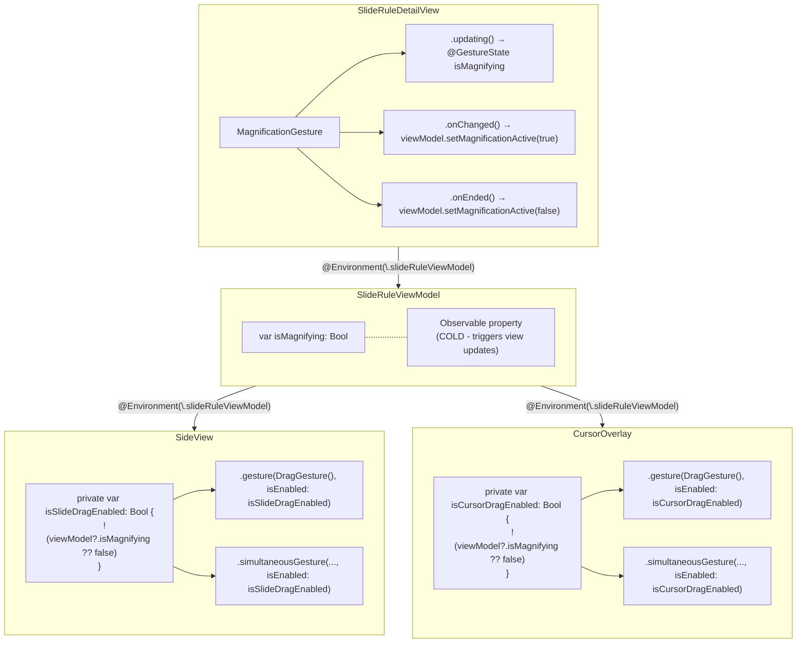

# Pinch Zoom Gesture Conflict Resolution

## Problem Statement

When pinch-zooming in TheElectricSlide app, user's fingers spreading/closing during the magnification gesture would eventually cross the slide component and the cursor overlay, inadvertently triggering their drag gestures. This caused unwanted slide movements and cursor repositioning during zoom operations, resulting in a janky user experience.

**Affected Components:**
- **Slide Component** (`SideView.swift`): Horizontal drag gestures for moving the slide
- **Cursor Overlay** (`CursorOverlay.swift`): Drag gestures for positioning the glass cursor

## Research Summary

### Apple Documentation Sources Consulted

1. **"Composing SwiftUI gestures"** - Article on combining gestures for complex interactions
2. **`gesture(_:isEnabled:)`** - API for conditionally enabling/disabling gestures
3. **`simultaneousGesture(_:isEnabled:)`** - API for gestures running simultaneously with conditional control
4. **`GestureState`** - Property wrapper for tracking transient gesture state
5. **`MagnificationGesture`** - The pinch-to-zoom gesture recognizer
6. **"Adding Interactivity with Gestures"** - General gesture implementation guidance
7. **"Preferring one gesture over another"** (UIKit) - Background on gesture conflict resolution patterns

### Key Findings from Apple Documentation

#### 1. `@GestureState` for Transient State Tracking
From the `GestureState` documentation:
> "A property wrapper type that updates a property while the user performs a gesture and **resets the property back to its initial state when the gesture ends**."

This makes `@GestureState` perfect for tracking whether a gesture is currently active - it automatically resets to `false` when the gesture completes.

#### 2. `gesture(_:isEnabled:)` API
From the `gesture(_:isEnabled:)` documentation:
> "You can also use the `isEnabled` parameter to **conditionally disable the gesture**."

This is Apple's recommended approach for dynamically enabling/disabling gestures based on external state.

#### 3. `.updating(_:body:)` for Continuous State Updates
From the documentation:
> "Use this callback to update transient UI state... The `state` parameter is the previous state of the gesture."

This method on gestures allows us to continuously update the `@GestureState` during gesture activity.

## Solution Architecture

### Design Pattern
Following Apple's documented patterns, the solution uses:
1. **Observable State** in `SlideRuleViewModel` to track magnification activity
2. **`@GestureState`** in `SlideRuleDetailView` for local gesture tracking with auto-reset
3. **`gesture(_:isEnabled:)`** in `SideView` and `CursorOverlay` to conditionally disable drag gestures

### State Flow


## Implementation Details

### 1. SlideRuleViewModel (State Management)
```swift
// MARK: - Magnification Active State
/// Whether a magnification (pinch zoom) gesture is currently active.
/// Used to disable slide drag gestures during pinch-to-zoom.
var isMagnifying: Bool = false

/// Called when magnification gesture starts or ends.
func setMagnificationActive(_ active: Bool) {
    isMagnifying = active
}
```

**Rationale**: This is a "cold" property (observed) because:
- It needs to trigger view updates in SideView and CursorOverlay to enable/disable drag gestures
- Changes are relatively infrequent (only on pinch start/end)
- The performance cost is minimal compared to the UX improvement

### 2. SlideRuleDetailView (Gesture Tracking)
```swift
@GestureState private var isMagnifying: Bool = false

MagnificationGesture()
    .updating($isMagnifying) { _, state, _ in
        state = true
    }
    .onChanged { scale in
        viewModel?.setMagnificationActive(true)
        gestureHandler?.handleZoomChanged(scale)
    }
    .onEnded { scale in
        viewModel?.setMagnificationActive(false)
        gestureHandler?.handleZoomEnded(scale)
    }
```

**Rationale**: 
- `@GestureState` auto-resets on gesture end (safety net)
- `onChanged` sets true early in the gesture
- `onEnded` explicitly clears the state

### 3. SideView (Conditional Gesture Disabling)
```swift
/// Whether slide drag gestures should be enabled.
private var isSlideDragEnabled: Bool {
    !(viewModel?.isMagnifying ?? false)
}

// Normal drag gesture
.gesture(
    DragGesture()
        .onChanged { ... }
        .onEnded { ... },
    isEnabled: isSlideDragEnabled
)

// Precision drag gesture
.simultaneousGesture(
    LongPressGesture(...)
        .sequenced(before: DragGesture())
        ...,
    isEnabled: isSlideDragEnabled
)
)
```

**Rationale**:
- Both normal and precision drag gestures are disabled during magnification
- The `isEnabled` parameter cleanly gates the gesture without complex conditional logic

### 4. CursorOverlay (Conditional Gesture Disabling)
```swift
/// Whether cursor drag gestures should be enabled.
private var isCursorDragEnabled: Bool {
    !(viewModel?.isMagnifying ?? false)
}

// Normal drag gesture
.gesture(
    DragGesture(minimumDistance: 0, coordinateSpace: .local)
        .onChanged { ... }
        .onEnded { ... },
    isEnabled: isCursorDragEnabled
)

// Precision drag gesture (long-press + drag)
.simultaneousGesture(
    LongPressGesture(...)
        .sequenced(before: DragGesture())
        ...,
    isEnabled: isCursorDragEnabled
)
```

**Rationale**:
- Same pattern as SideView for consistency across the codebase
- Cursor drag gestures (both normal and precision) are disabled during pinch-zoom
- Prevents inadvertent cursor repositioning when fingers cross the cursor during zoom

## Platform Compatibility
- **iOS**: Full support via MagnificationGesture
- **iPadOS**: Full support via MagnificationGesture
- **macOS**: Works via scroll wheel zoom (uses same `isMagnifying` state path)

## Testing Verification

1. **Build verification**: ✅ Project compiles successfully
2. **Manual testing scenarios**:
   
   **Slide Component:**
   - Pinch to zoom while fingers cross slide → Slide should not move
   - Single-finger drag on slide → Should move normally
   - Long-press + drag on slide (precision mode) → Should work normally (when not magnifying)
   
   **Cursor Component:**
   - Pinch to zoom while fingers cross cursor → Cursor should not reposition
   - Single-finger drag on cursor → Should move normally
   - Long-press + drag on cursor (precision mode) → Should work normally (when not magnifying)
   
   **General:**
   - Pinch zoom on stator area → No gesture conflicts
   - Triple-tap to reset zoom → Works as expected
   - Rapid pinching near cursor and slide → No unintended movements

## Performance Considerations

The implementation follows the "hot/cold property pattern" established in the codebase:
- `isMagnifying` is a cold property (triggers view updates) but changes infrequently
- No animation during state changes - just immediate enable/disable
- The computed properties `isSlideDragEnabled` and `isCursorDragEnabled` are evaluated on view body calls, which is efficient
- Both SideView and CursorOverlay share the same state source (viewModel.isMagnifying)

## Future Enhancements

1. **Debouncing**: Could add a small delay before re-enabling gestures to prevent accidental drags at the end of a pinch
2. **Haptic feedback**: Could provide subtle feedback when gestures are blocked during magnification
3. **Visual indicator**: Could dim interactive elements slightly during magnification to indicate they're not interactive

## References

- [Apple Documentation: Composing SwiftUI gestures](https://developer.apple.com/documentation/swiftui/composing-swiftui-gestures)
- [Apple Documentation: gesture(_:isEnabled:)](https://developer.apple.com/documentation/swiftui/view/gesture(_:isenabled:))
- [Apple Documentation: GestureState](https://developer.apple.com/documentation/swiftui/gesturestate)
- [Apple Documentation: MagnificationGesture](https://developer.apple.com/documentation/swiftui/magnificationgesture)
