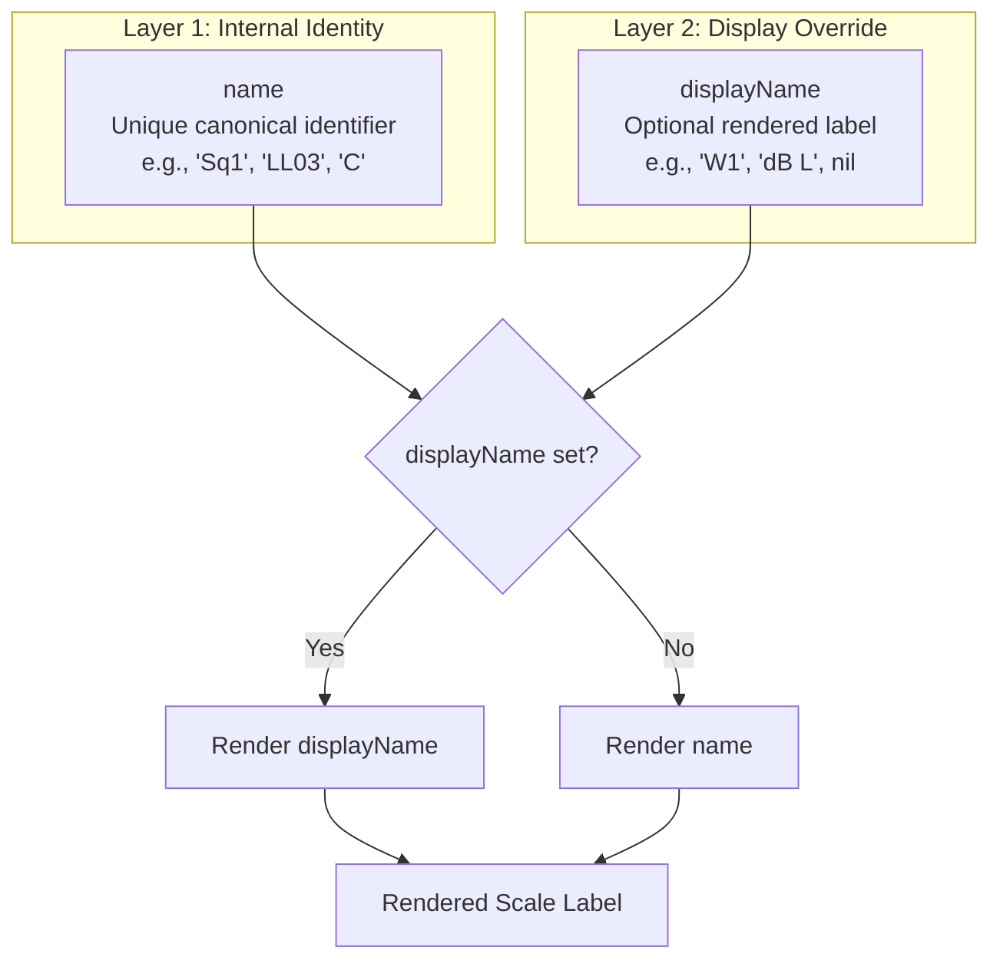
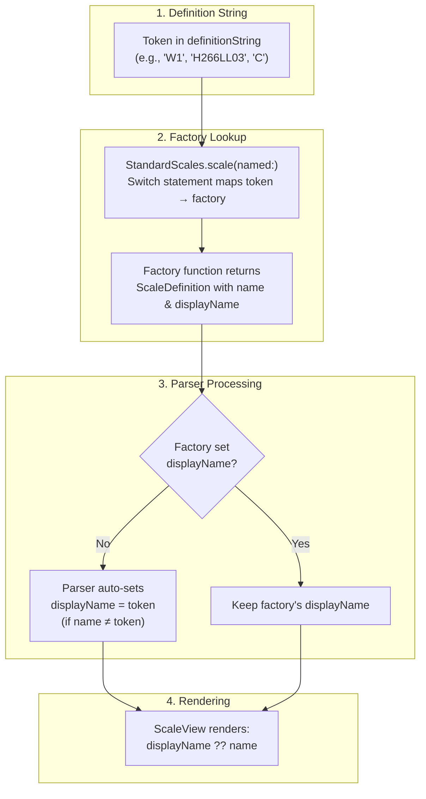
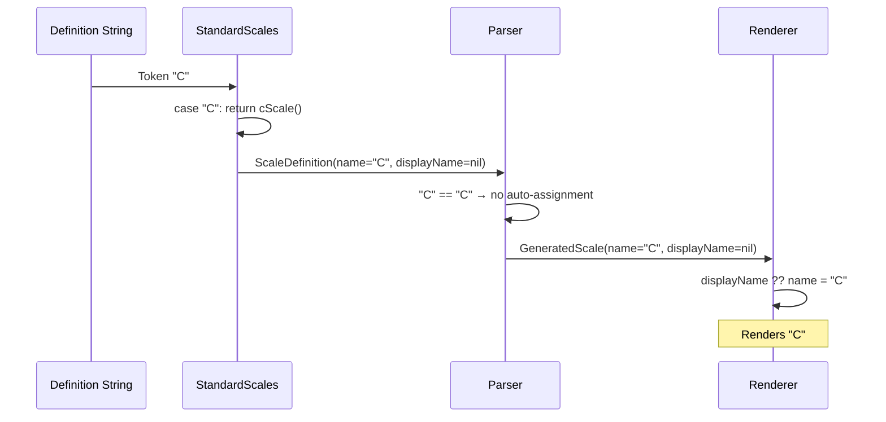
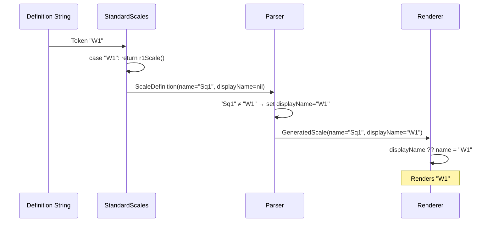
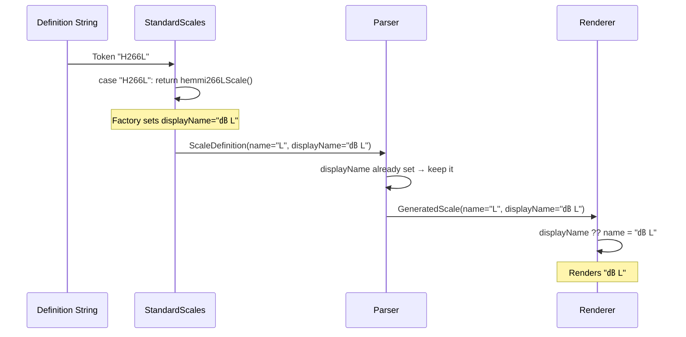
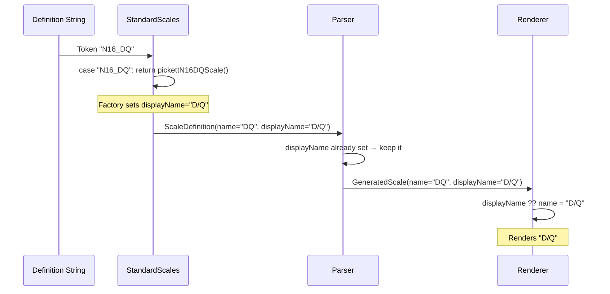
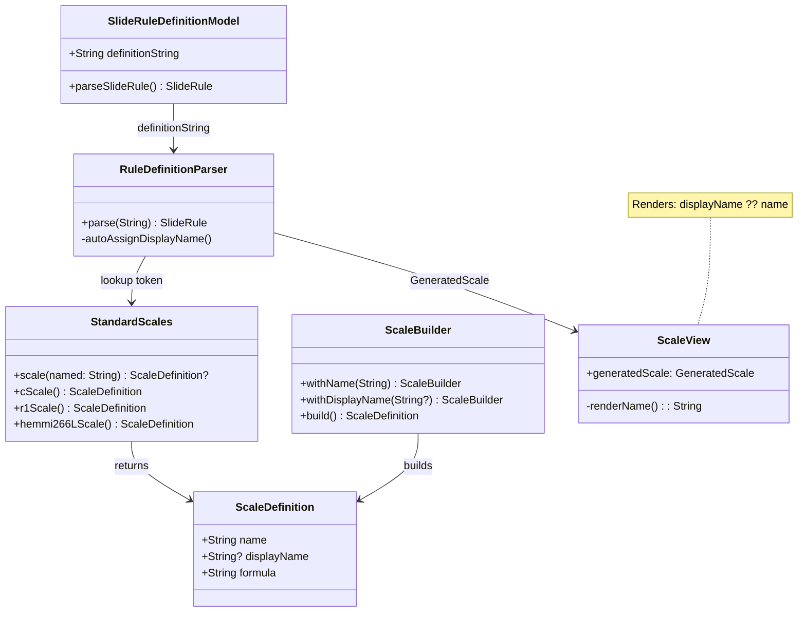

# Scale Naming Architecture

This document explains the complete naming system for scales in The Electric Slide, including the two-layer naming model, how they interact, and the resolution hierarchy.

## Overview: The Two Layers of Scale Names

The naming system is intentionally simple:



### The Two Names

| Property | Purpose | Set By | Example |
|----------|---------|--------|---------|
| **`name`** | Unique internal identifier, accessibility, configuration lookup | `ScaleBuilder.withName()` | `"Sq1"`, `"LL03"`, `"C"` |
| **`displayName`** | Optional override for rendered label | `ScaleBuilder.withDisplayName()` or Parser | `"W1"`, `"㏈ L"`, `nil` |

**Rendering Rule**: `displayName ?? name` — If `displayName` is set, render it; otherwise render `name`.

---

## How Names Flow Through the System

### Complete Resolution Flow



---

## Detailed Layer Explanations

### Layer 1: `name` (Canonical Internal Identifier)

**Location**: `ScaleDefinition.name`

```swift
/// Human-readable name/label for the scale (e.g., "C", "D", "LL03")
public let name: String
```

**Set via**: `ScaleBuilder.withName("...")`

**Purpose**:
1. **Unique identifier** — Each scale type has one canonical name
2. **Accessibility** — Used for `.accessibilityIdentifier("scaleview-\(name)")`
3. **Configuration API** — `ScaleKey` selectors use canonical names
4. **Fallback rendering** — If `displayName` is nil, `name` is rendered
5. **Debugging/logging** — Internal references use `name`

**Examples**:
| Factory Function | `name` Value |
|-----------------|--------------|
| `cScale()` | `"C"` |
| `r1Scale()` | `"Sq1"` |
| `hemmi266LL03Scale()` | `"LL03"` |
| `hemmi266LScale()` | `"L"` |

---

### Layer 2: `displayName` (Rendered Label Override)

**Location**: `ScaleDefinition.displayName`

```swift
/// Optional display name override for rendering
/// Used when the rendered label should differ from the canonical name
public let displayName: String?
```

**Set via**: 
1. `ScaleBuilder.withDisplayName("...")` — Factory explicitly sets it
2. Parser auto-assignment — When definition string token differs from `name`

**Purpose**: 
- Allows a scale to render with a different label than its internal identifier
- Supports manufacturer-specific notation (e.g., "㏈ L" instead of "L")
- Enables aliases (e.g., "W1" renders for canonical "Sq1")

**When to set `displayName` in factory**:
- **Custom manufacturer scales**: `hemmi266LScale()` → `displayName: "㏈ L"`
- **Special notation**: Mathematical symbols, Unicode characters
- **Manufacturer-specific labels**: Historical accuracy

**When parser auto-sets `displayName`**:
- When token in definition string ≠ factory's `name`
- Example: Token "W1" → factory returns `name: "Sq1"` → parser sets `displayName: "W1"`

---

## Practical Examples

### Example 1: Standard Scale (C)

Token matches canonical name — no `displayName` needed.



### Example 2: Alias (W1 → Sq1)

Parser auto-assigns `displayName` because token differs from `name`.



### Example 3: Manufacturer Scale with Custom Display (Hemmi 266 L)

Factory explicitly sets `displayName` for manufacturer-specific notation.



### Example 4: Pickett N-16 ES Dual-Name Scale (D/Q)

Factory sets custom `displayName` showing dual purpose.



---

## Summary Table

| Concept | Location | Set By | Purpose |
|---------|----------|--------|---------|
| **Definition String Token** | `definitionString` | User/Library | Lookup key for factory |
| **Case Statement Key** | `StandardScales.scale(named:)` | Developer | Map tokens to factories |
| **`name`** | `ScaleDefinition.name` | `ScaleBuilder.withName()` | Unique canonical identifier |
| **`displayName`** | `ScaleDefinition.displayName` | Factory or Parser | Rendered label override |

---

## When to Use What

### Creating a Standard Scale (token = name)

```swift
// Token, case key, and name all match
case "C": return cScale()

public static func cScale(length: Distance = 250.0) -> ScaleDefinition {
    ScaleBuilder()
        .withName("C")  // Matches case key and token
        // displayName NOT needed — name renders directly
        .build()
}
```

### Creating an Alias (multiple tokens → same scale)

```swift
// Multiple tokens point to same factory
case "R1", "SQ1", "W1", "W1'", "W1P": return r1Scale()

// Factory returns canonical name; parser auto-sets displayName to match token
public static func r1Scale(length: Distance = 250.0) -> ScaleDefinition {
    ScaleBuilder()
        .withName("Sq1")  // Canonical name (internal)
        // NO displayName — parser will set it to "W1", "R1", etc. based on token
        .build()
}
```

### Creating a Manufacturer-Specific Scale

```swift
// Unique token for manufacturer variant
case "H266L": return hemmi266LScale()

// Factory MUST set displayName for special rendering
public static func hemmi266LScale(length: Distance = 250.0) -> ScaleDefinition {
    ScaleBuilder(from: lScale(length: length))
        .withName("L")             // Canonical name (for config/accessibility)
        .withDisplayName("㏈ L")   // REQUIRED: manufacturer-specific notation
        .build()
}
```

### Creating a Dual-Purpose Scale

```swift
// Pickett N-16 ES: D scale that also serves as Q scale
case "N16_DQ": return pickettN16DQScale()

public static func pickettN16DQScale(length: Distance = 250.0) -> ScaleDefinition {
    ScaleBuilder(from: dScale(length: length))
        .withName("DQ")           // Unique identifier for this dual-purpose scale
        .withDisplayName("D/Q")   // Shows both purposes to user
        .build()
}
```

---

## Architecture Diagram



---

## FAQ

**Q: Why do we need both `name` and `displayName`?**

A: `name` is the stable internal identifier used for configuration selectors, accessibility, and debugging. `displayName` allows the rendered text to differ without breaking internal references. This separation keeps the system predictable while allowing visual customization.

**Q: When should I set `displayName` in the factory vs. let the parser handle it?**

A: 
- **Factory sets it**: When the scale needs special notation (Unicode, manufacturer-specific labels like "㏈ L")
- **Parser handles it**: When it's just an alias (W1 vs Sq1) — the parser auto-assigns `displayName` to match the token

**Q: What happened to `scaleNameOverrides`?**

A: It was removed to simplify the architecture. All custom display names are now set at scale factory time via `ScaleBuilder.withDisplayName()`. This is cleaner because:
1. Names are defined once, in one place (the factory)
2. No post-parse mutation of scale definitions
3. Easier to understand — look at the factory to see what renders

**Q: How do I add a manufacturer-specific label for an existing scale?**

A: Create a new factory function that wraps the base scale:
```swift
case "H266L": return hemmi266LScale()

public static func hemmi266LScale(length: Distance = 250.0) -> ScaleDefinition {
    ScaleBuilder(from: lScale(length: length))
        .withDisplayName("㏈ L")
        .build()
}
```

**Q: What's the difference between an "alias" and a "manufacturer variant"?**

A: 
- **Alias**: Multiple tokens map to the same factory, same scale properties (W1, R1, SQ1 → `r1Scale()`)
- **Manufacturer variant**: New factory with modified properties and/or custom `displayName` (H266L → `hemmi266LScale()`)
